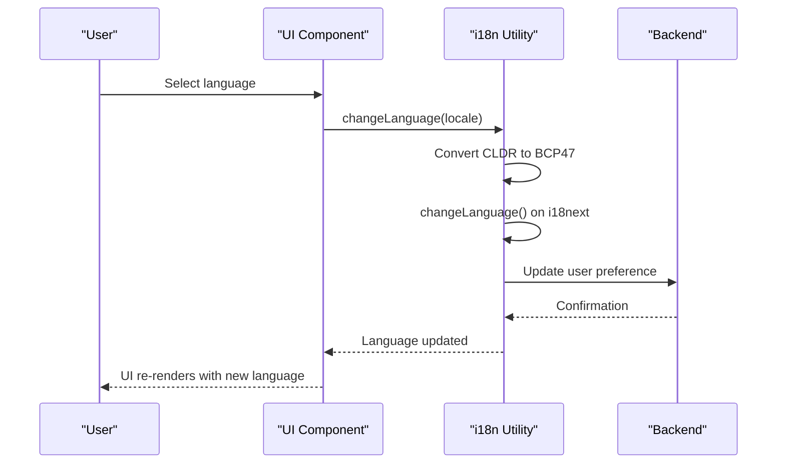

# Internationalization

<cite>
**Referenced Files in This Document**   
- [i18n.ts](file://app/utils/i18n.ts)
- [crowdin.yml](file://crowdin.yml)
- [index.ts](file://shared/i18n/index.ts)
- [translation.json](file://shared/i18n/locales/en_US/translation.json)
- [date.ts](file://shared/utils/date.ts)
- [ChangeLanguage.tsx](file://app/components/ChangeLanguage.tsx)
- [useUserLocale.ts](file://app/hooks/useUserLocale.ts)
- [language.ts](file://app/utils/language.ts)
- [server/utils/i18n.ts](file://server/utils/i18n.ts)
</cite>

## Table of Contents
1. [Introduction](#introduction)
2. [Translation System Architecture](#translation-system-architecture)
3. [Language Files and Locales](#language-files-and-locales)
4. [i18n Utility Implementation](#i18n-utility-implementation)
5. [Crowdin Integration](#crowdin-integration)
6. [Language Detection and User Preferences](#language-detection-and-user-preferences)
7. [Using Translations in Components](#using-translations-in-components)
8. [Adding New Languages](#adding-new-languages)
9. [Pluralization and Context-Specific Translations](#pluralization-and-context-specific-translations)
10. [Performance Optimization](#performance-optimization)
11. [Server-Side Internationalization](#server-side-internationalization)

## Introduction
The baozi application implements a comprehensive internationalization (i18n) system using i18next to support multiple languages across the platform. This system enables the application to serve content in various locales, providing a localized experience for users worldwide. The implementation includes client-side and server-side translation capabilities, integration with Crowdin for collaborative translation management, and support for language detection and user preferences. The system is designed to be extensible, allowing for easy addition of new languages and efficient loading of translation resources.

## Translation System Architecture
The internationalization system in baozi is built on the i18next framework, which provides a robust foundation for managing translations in React applications. The architecture consists of several key components that work together to deliver localized content. The system uses a modular approach with separate configurations for client-side and server-side translation needs. On the client side, translations are loaded dynamically from the API backend, while server-side translations are preloaded from the filesystem for optimal performance. The system supports fallback mechanisms to ensure that content is always available, even when specific translations are missing.

```mermaid
graph TD
A[i18next Core] --> B[Client-Side Implementation]
A --> C[Server-Side Implementation]
B --> D[React Integration]
B --> E[HTTP Backend]
C --> F[Filesystem Backend]
C --> G[Preloaded Translations]
D --> H[Translation Components]
E --> I[API Endpoint /locales/{locale}.json]
F --> J[Filesystem Path /shared/i18n/locales/]
H --> K[UI Components]
K --> L[Localized Content]
```

**Diagram sources**
- [i18n.ts](file://app/utils/i18n.ts#L1-L47)
- [server/utils/i18n.ts](file://server/utils/i18n.ts#L1-L58)

**Section sources**
- [i18n.ts](file://app/utils/i18n.ts#L1-L47)
- [server/utils/i18n.ts](file://server/utils/i18n.ts#L1-L58)

## Language Files and Locales
The baozi application stores translation files in the shared/i18n/locales/ directory, with each supported language having its own subdirectory. The directory structure follows the Unicode Common Locale Data Repository (CLDR) format, using language-region codes such as en_US, fr_FR, and zh_CN. Each language directory contains a translation.json file that holds all the translated strings for that locale. The system currently supports over 30 languages, including major global languages and regional variants. The translation files are structured as JSON objects with translation keys as properties and the localized strings as values.

**Section sources**
- [translation.json](file://shared/i18n/locales/en_US/translation.json#L1-L4)

## i18n Utility Implementation
The i18n utility in app/utils/i18n.ts provides the core functionality for initializing and managing the translation system. The initI18n function configures the i18next instance with the appropriate settings, including the backend configuration for loading translations, interpolation options, and language support. The utility handles the conversion between different locale format standards, specifically between Unicode CLDR format (en_US) used internally and BCP47 format (en-US) expected by i18next. The implementation includes error handling to ensure that translation failures do not disrupt the user experience.

```mermaid
classDiagram
class I18nUtility {
+initI18n(defaultLanguage : string) : i18n
-unicodeCLDRtoBCP47(locale : string) : string
-unicodeBCP47toCLDR(locale : string) : string
}
class I18next {
+use(plugin) : I18next
+init(options) : Promise
+changeLanguage(lng : string) : Promise
+t(key : string, options : object) : string
}
I18nUtility --> I18next : "configures"
I18nUtility --> "i18next-http-backend" : "uses"
I18nUtility --> "react-i18next" : "uses"
```

**Diagram sources**
- [i18n.ts](file://app/utils/i18n.ts#L1-L47)

**Section sources**
- [i18n.ts](file://app/utils/i18n.ts#L1-L47)

## Crowdin Integration
The baozi application integrates with Crowdin for collaborative translation management, as configured in the crowdin.yml file. This integration enables a streamlined workflow for adding and updating translations across multiple languages. The configuration specifies that the source language file is en_US/translation.json, and translations are exported to corresponding language directories using the %locale_with_underscore% placeholder. The commit message template ensures that translation updates from Crowdin are clearly identified in version control. This integration allows translators and contributors to work on translations through the Crowdin platform, with changes automatically synchronized to the codebase.

**Section sources**
- [crowdin.yml](file://crowdin.yml#L1-L6)

## Language Detection and User Preferences
The application implements a multi-layered approach to language detection and user preference management. The system first checks for user-specific language preferences stored in the user profile. If no preference is set, it falls back to detecting the browser's language settings using the detectLanguage function in app/utils/language.ts. The detected language is then normalized to the CLDR format used by the application. User language preferences are persisted in the database and synchronized across devices. The ChangeLanguage component handles dynamic language switching in the UI, updating both the i18next instance and the desktop spellchecker when applicable.



**Diagram sources**
- [language.ts](file://app/utils/language.ts#L39-L51)
- [ChangeLanguage.tsx](file://app/components/ChangeLanguage.tsx#L1-L17)

**Section sources**
- [language.ts](file://app/utils/language.ts#L26-L52)
- [ChangeLanguage.tsx](file://app/components/ChangeLanguage.tsx#L1-L17)
- [useUserLocale.ts](file://app/hooks/useUserLocale.ts#L1-L12)

## Using Translations in Components
Developers can access translations in React components using the useTranslation hook from react-i18next. This hook provides access to the t function, which retrieves the appropriate translation for a given key. The system supports various translation patterns, including simple key-value lookups, interpolation of dynamic values, and rich text formatting. Components automatically re-render when the language changes, ensuring that the UI remains consistent. The implementation avoids React Suspense for translations to prevent potential loading states, instead returning the translation key as a fallback when the translation is not immediately available.

**Section sources**
- [i18n.ts](file://app/utils/i18n.ts#L33-L35)

## Adding New Languages
Adding new languages to the baozi application involves several steps to ensure complete localization support. First, a new directory must be created in shared/i18n/locales/ using the appropriate CLDR language code. The directory should contain a translation.json file with all the necessary translations. The new language must then be added to the languageOptions array in shared/i18n/index.ts to make it available in the language selection interface. Additionally, the language needs to be registered in the date.ts utility to support localized date formatting. Once these steps are completed, the new language will be automatically available through the Crowdin integration for collaborative translation.

**Section sources**
- [index.ts](file://shared/i18n/index.ts#L10-L99)
- [date.ts](file://shared/utils/date.ts#L165-L188)

## Pluralization and Context-Specific Translations
The i18next framework provides built-in support for pluralization and context-specific translations, which are essential for creating natural-sounding localized content. The system can handle different plural forms based on the target language's grammatical rules. For example, languages like Russian have multiple plural forms depending on the number, while English has only two (singular and plural). Context-specific translations allow for different translations of the same word based on its usage context, such as the word "file" which might be translated differently when used as a noun versus a verb. These features are implemented through specific key naming conventions and options passed to the translation function.

**Section sources**
- [i18n.ts](file://app/utils/i18n.ts#L23-L24)

## Performance Optimization
The internationalization system in baozi includes several performance optimizations to ensure fast loading and smooth user experience. On the client side, translations are loaded on demand rather than preloading all languages, reducing initial bundle size. The system implements caching mechanisms to avoid repeated network requests for the same translation files. Server-side translations are preloaded during application startup to minimize latency for server-rendered content. The implementation also includes optimizations for language detection and switching, ensuring that UI updates are performed efficiently. These optimizations collectively contribute to a responsive application that maintains high performance across different locales.

**Section sources**
- [i18n.ts](file://app/utils/i18n.ts#L27-L28)
- [server/utils/i18n.ts](file://server/utils/i18n.ts#L48-L49)

## Server-Side Internationalization
The server-side internationalization implementation in server/utils/i18n.ts provides translation capabilities for backend operations and server-rendered content. Unlike the client-side implementation that loads translations via HTTP requests, the server-side version loads translation files directly from the filesystem for better performance and reliability. The initI18n function on the server preloads all supported languages during application startup, ensuring that translations are immediately available when needed. The server implementation also provides a helper function, opts, that generates appropriate i18next options based on a user's language preference or the default server language. This enables consistent localization across both client and server contexts.

```mermaid
flowchart TD
A[Server Startup] --> B[initI18n()]
B --> C[Load All Locales]
C --> D[Preload Translations]
D --> E[i18n Instance Ready]
E --> F[Handle Requests]
F --> G{User Specific?}
G --> |Yes| H[opts(user)]
G --> |No| I[opts()]
H --> J[Get User Language]
I --> K[Get Default Language]
J --> L[Return i18n Options]
K --> L
L --> M[Render Localized Content]
```

**Diagram sources**
- [server/utils/i18n.ts](file://server/utils/i18n.ts#L28-L57)

**Section sources**
- [server/utils/i18n.ts](file://server/utils/i18n.ts#L1-L58)