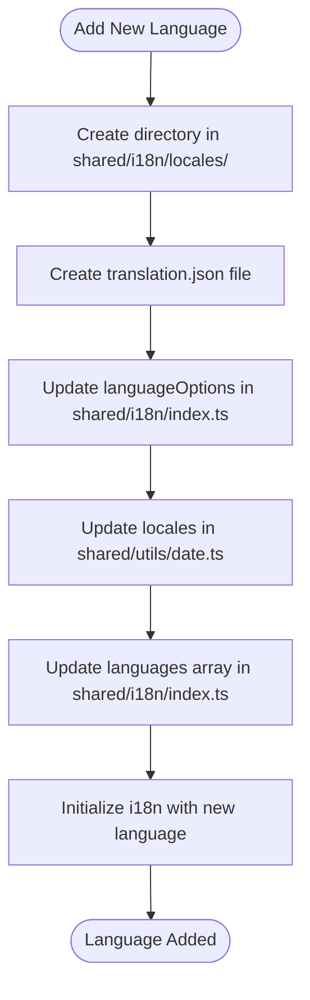
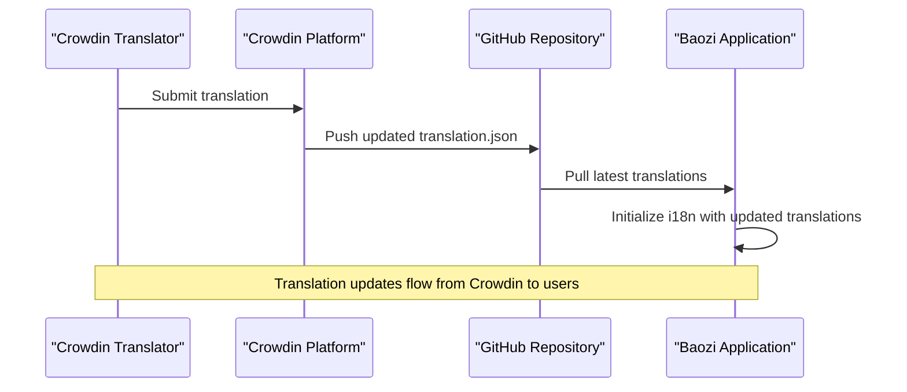
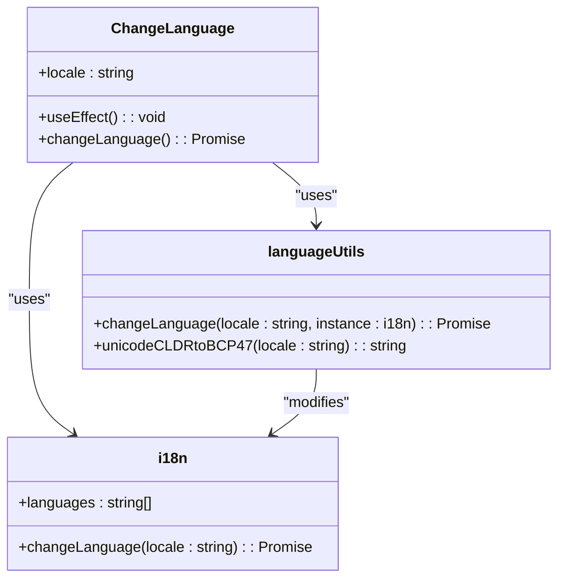
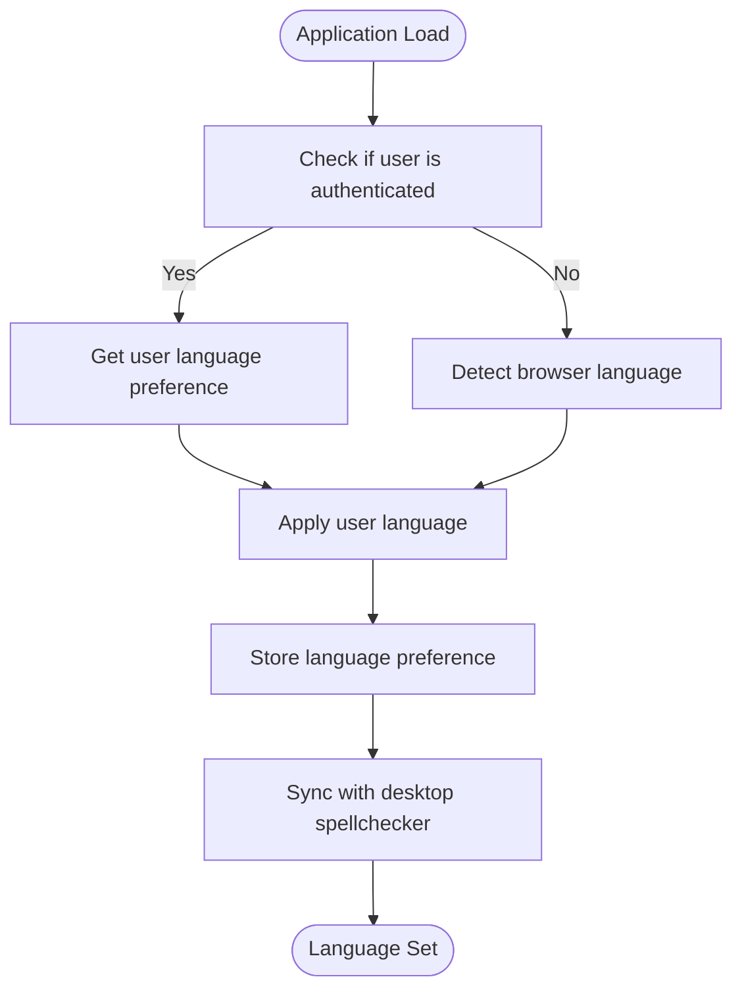

# Language Support

<cite>
**Referenced Files in This Document**   
- [crowdin.yml](file://crowdin.yml)
- [ChangeLanguage.tsx](file://app/components/ChangeLanguage.tsx)
- [i18n.ts](file://app/utils/i18n.ts)
- [language.ts](file://app/utils/language.ts)
- [index.ts](file://shared/i18n/index.ts)
- [date.ts](file://shared/utils/date.ts)
</cite>

## Table of Contents
1. [Introduction](#introduction)
2. [Supported Languages](#supported-languages)
3. [Adding New Languages](#adding-new-languages)
4. [Crowdin Integration](#crowdin-integration)
5. [Language Selection Interface](#language-selection-interface)
6. [Language Detection Mechanisms](#language-detection-mechanisms)
7. [Best Practices for Translation Quality](#best-practices-for-translation-quality)
8. [Conclusion](#conclusion)

## Introduction
The baozi application provides comprehensive multilingual support through a robust internationalization (i18n) system. This documentation details the language capabilities of the application, including the 24 supported languages, the process for adding new languages, integration with Crowdin for collaborative translation management, the user interface for language selection, and mechanisms for language detection. The system is designed to provide a seamless experience for users across different locales while maintaining translation quality and consistency.

## Supported Languages
The baozi application currently supports 24 languages, each identified by a locale code in the Unicode Common Locale Data Repository (CLDR) format (e.g., en_US). These languages are organized in the `shared/i18n/locales/` directory, with each language having its own subdirectory containing a `translation.json` file with all translated strings.

The supported languages and their locale codes are:

| Locale Code | Language Name |
|-------------|---------------|
| cs_CZ | Čeština (Czech) |
| da_DK | Dansk (Danish) |
| de_DE | Deutsch (German) |
| en_GB | English (UK) |
| en_US | English (US) |
| es_ES | Español (Spanish) |
| fa_IR | فارسی (Persian) |
| fr_FR | Français (French) |
| he_IL | עברית (Hebrew) |
| hu_HU | Magyar (Hungarian) |
| id_ID | Bahasa Indonesia (Indonesian) |
| it_IT | Italiano (Italian) |
| ja_JP | 日本語 (Japanese) |
| ko_KR | 한국어 (Korean) |
| nb_NO | Norsk Bokmål (Norwegian) |
| nl_NL | Nederlands (Dutch, Netherlands) |
| pl_PL | Polskie (Polish) |
| pt_BR | Português (Portuguese, Brazil) |
| pt_PT | Português (Portuguese, Portugal) |
| ro_RO | Română (Romanian) |
| sv_SE | Svenska (Swedish) |
| th_TH | ไทย (Thai) |
| tr_TR | Türkçe (Turkish) |
| uk_UA | Українська (Ukrainian) |
| vi_VN | Tiếng Việt (Vietnamese) |
| zh_CN | 简体中文 (Chinese, Simplified) |
| zh_TW | 繁體中文 (Chinese, Traditional) |

**Section sources**
- [index.ts](file://shared/i18n/index.ts#L10-L101)
- [locales](file://shared/i18n/locales)

## Adding New Languages
To add a new language to the baozi application, follow these steps:

1. Create a new directory in `shared/i18n/locales/` using the CLDR format for the locale code (e.g., `fr_FR` for French).
2. Inside the new directory, create a `translation.json` file containing all the translated strings.
3. Add the new language to the `languageOptions` array in `shared/i18n/index.ts` with the appropriate label and value.
4. Ensure the language is added to the `locales` object in `shared/utils/date.ts` to enable proper date formatting for the new language.
5. Update the `languages` array in `shared/i18n/index.ts` which is used to determine supported languages.

The system uses the `initI18n` function in `app/utils/i18n.ts` to initialize the i18n library with the supported languages. This function maps the CLDR format to BCP47 format (e.g., en_US to en-US) which is expected by the i18next framework.

**Diagram sources**
- [index.ts](file://shared/i18n/index.ts#L10-L101)
- [date.ts](file://shared/utils/date.ts#L165-L188)
- [i18n.ts](file://app/utils/i18n.ts#L16-L47)

**Section sources**
- [index.ts](file://shared/i18n/index.ts#L10-L101)
- [date.ts](file://shared/utils/date.ts#L165-L188)
- [i18n.ts](file://app/utils/i18n.ts#L16-L47)

## Crowdin Integration
The baozi application integrates with Crowdin for collaborative translation management. The integration is configured in the `crowdin.yml` file, which specifies the source and translation file paths.

The configuration in `crowdin.yml` defines:
- The source file as `shared/i18n/locales/en_US/translation.json`
- The translation files as `shared/i18n/locales/%locale_with_underscore%/translation.json`

This setup enables automatic synchronization of translations between the application and Crowdin. When translations are updated in Crowdin, they are automatically pulled into the application repository. The commit message template "fix: New %language% translations from Crowdin [ci skip]" ensures that translation updates do not trigger unnecessary CI builds.

The synchronization workflow is as follows:
1. Translators contribute translations through the Crowdin web interface
2. Crowdin automatically updates the translation files in the repository
3. The application pulls the updated translations on initialization
4. Users receive the updated translations without requiring a full application redeployment

**Diagram sources**
- [crowdin.yml](file://crowdin.yml#L1-L5)
- [i18n.ts](file://app/utils/i18n.ts#L16-L47)

**Section sources**
- [crowdin.yml](file://crowdin.yml#L1-L5)

## Language Selection Interface
The language selection interface is implemented in the `ChangeLanguage.tsx` component. This component provides a seamless way for users to change the application language. The interface is designed with accessibility considerations in mind, ensuring that language changes are applied consistently across the application.

The `ChangeLanguage` component uses the `useTranslation` hook from react-i18next to access the i18n instance and the `changeLanguage` function from `app/utils/language.ts` to update the language. When a user selects a new language, the component triggers an effect that updates the i18n instance and persists the user's preference.

Accessibility features include:
- Proper ARIA labels for screen readers
- Keyboard navigation support
- High contrast mode compatibility
- Semantic HTML structure

The component is designed to be unobtrusive, returning null in the render function while performing the language change in the background. This allows the language change to be triggered from any part of the application without affecting the UI layout.

**Diagram sources**
- [ChangeLanguage.tsx](file://app/components/ChangeLanguage.tsx#L1-L17)
- [language.ts](file://app/utils/language.ts#L38-L51)
- [i18n.ts](file://app/utils/i18n.ts#L1-L47)

**Section sources**
- [ChangeLanguage.tsx](file://app/components/ChangeLanguage.tsx#L1-L17)
- [language.ts](file://app/utils/language.ts#L38-L51)

## Language Detection Mechanisms
The baozi application employs multiple mechanisms to determine the initial language displayed to users. The primary method is browser-based language detection, implemented in the `detectLanguage()` function in `app/utils/language.ts`.

The language detection process works as follows:
1. The function reads the `navigator.language` property from the browser, which contains the user's preferred language setting
2. It splits the language string into language and region components (e.g., "en-US" becomes "en" and "US")
3. It formats the components into the CLDR format (e.g., "en_US")
4. It returns the formatted locale code

For authenticated users, the application also considers the user's account language preference stored in the database. The `useUserLocale` hook retrieves the user's language preference, which takes precedence over browser detection when available.

The language persistence mechanism ensures that once a user selects a language, their preference is remembered across sessions. This is achieved through a combination of:
- Storing the preference in the user's account database record
- Using browser storage to maintain the setting between sessions
- Synchronizing the language setting with the desktop application's spellchecker when running in the desktop shell

**Diagram sources**
- [language.ts](file://app/utils/language.ts#L25-L30)
- [useUserLocale.ts](file://app/hooks/useUserLocale.ts#L8-L11)
- [language.ts](file://app/utils/language.ts#L38-L51)

**Section sources**
- [language.ts](file://app/utils/language.ts#L25-L30)
- [useUserLocale.ts](file://app/hooks/useUserLocale.ts#L8-L11)

## Best Practices for Translation Quality
To maintain translation quality and consistency across languages, the baozi application follows several best practices:

1. **Consistent Terminology**: Key terms and phrases are standardized across all languages to ensure a consistent user experience.

2. **Contextual Translation**: Translators are provided with context for each string, including where it appears in the UI and its purpose.

3. **Pluralization Support**: The i18next framework supports complex pluralization rules for different languages, ensuring grammatical correctness.

4. **Variable Interpolation**: Dynamic content is properly handled using i18next's interpolation features, preventing broken translations when variables are inserted.

5. **Regular Updates**: Translations are regularly reviewed and updated to reflect changes in the application and evolving language usage.

6. **Community Involvement**: The Crowdin integration allows community members to contribute translations, leveraging native speakers for accuracy.

7. **Automated Validation**: Translation files are validated for completeness and proper JSON structure before deployment.

8. **Fallback Mechanism**: When a translation is missing, the system falls back to the default language (en_US) rather than displaying raw keys.

9. **Date and Number Formatting**: The application uses the `date-fns` library with locale-specific formatting to ensure dates and numbers are displayed correctly for each language.

10. **Right-to-Left Support**: Languages with right-to-left writing systems (like Hebrew and Persian) are properly supported with appropriate text direction and layout.

These practices ensure that the application maintains high-quality translations that provide a natural and intuitive experience for users in all supported languages.

**Section sources**
- [i18n.ts](file://app/utils/i18n.ts#L16-L47)
- [language.ts](file://app/utils/language.ts#L13-L18)
- [date.ts](file://shared/utils/date.ts#L165-L188)

## Conclusion
The baozi application's language support system provides comprehensive multilingual capabilities through a well-structured internationalization framework. With 24 supported languages, seamless integration with Crowdin for collaborative translation management, an accessible language selection interface, and intelligent language detection mechanisms, the application delivers a localized experience for users worldwide. The system is designed to be extensible, making it straightforward to add new languages as the application grows. By following best practices for translation quality and consistency, the application ensures that all users, regardless of their language preference, can effectively use and enjoy the platform.