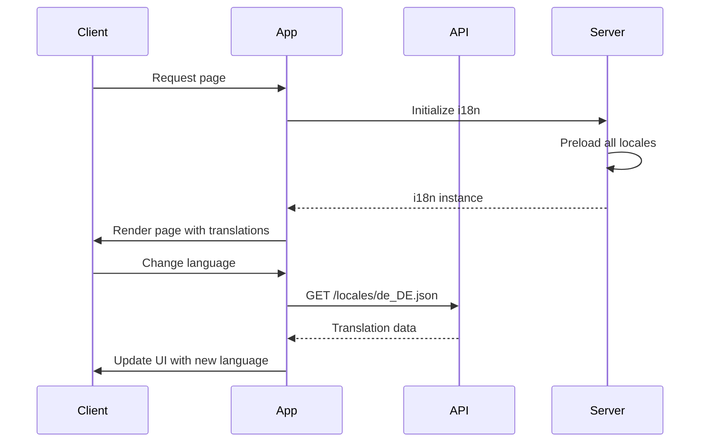
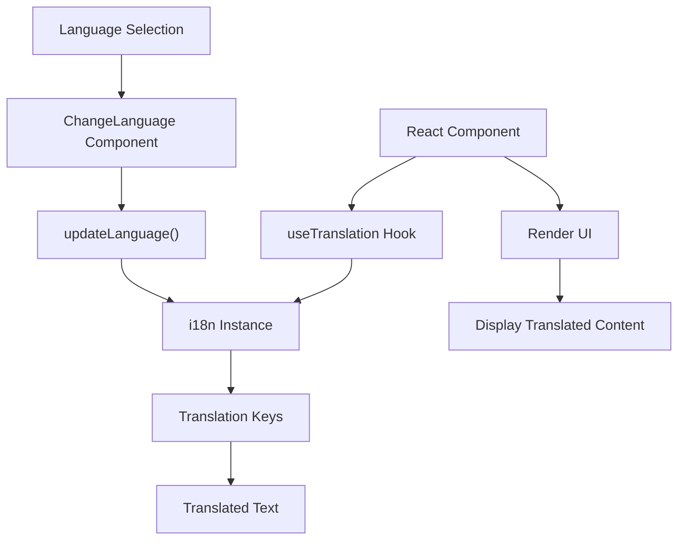

# Translation System

<cite>
**Referenced Files in This Document**   
- [i18n.ts](file://app/utils/i18n.ts)
- [i18n.ts](file://server/utils/i18n.ts)
- [index.ts](file://shared/i18n/index.ts)
- [i18next-parser.config.js](file://i18next-parser.config.js)
- [ChangeLanguage.tsx](file://app/components/ChangeLanguage.tsx)
- [language.ts](file://app/utils/language.ts)
- [app.ts](file://server/routes/app.ts)
</cite>

## Table of Contents
1. [Introduction](#introduction)
2. [Initialization Process](#initialization-process)
3. [Configuration Options](#configuration-options)
4. [Translation Loading Mechanism](#translation-loading-mechanism)
5. [Translation File Structure](#translation-file-structure)
6. [React Integration](#react-integration)
7. [Fallback and Missing Key Handling](#fallback-and-missing-key-handling)
8. [Performance Considerations](#performance-considerations)
9. [Complex Translation Scenarios](#complex-translation-scenarios)
10. [Development and Debugging](#development-and-debugging)

## Introduction
The baozi application implements a comprehensive internationalization system using i18next as the core translation library. This system supports multiple languages through a structured approach that includes both client-side and server-side initialization, dynamic language switching, and integration with React components. The translation system is designed to provide a seamless multilingual experience while maintaining performance and scalability.

**Section sources**
- [i18n.ts](file://app/utils/i18n.ts#L1-L47)
- [i18n.ts](file://server/utils/i18n.ts#L1-L58)

## Initialization Process
The translation system initializes differently on the client and server sides, ensuring proper localization in both environments. On the client side, the `initI18n` function in `app/utils/i18n.ts` sets up the i18next instance with the HTTP backend for dynamic translation loading. The server-side initialization in `server/utils/i18n.ts` uses the filesystem backend to preload all available translations at startup.

The initialization process begins with setting the default language, which is converted from CLDR format (e.g., "en_US") to BCP47 format (e.g., "en-US") using utility functions. The system then configures the i18next instance with appropriate options, including compatibility settings, interpolation rules, and language fallback behavior.

**Section sources**
- [i18n.ts](file://app/utils/i18n.ts#L15-L46)
- [i18n.ts](file://server/utils/i18n.ts#L27-L57)

## Configuration Options
The translation system is configured with several key options that define its behavior. Both client and server implementations use `compatibilityJSON: "v3"` to ensure compatibility with the JSON format used for translations. The `keySeparator: false` setting allows for the use of plain English keys without conflicts from separator characters.

Client-side configuration includes the `react.useSuspense: false` option, which prevents React Suspense from being triggered during translation loading. The `supportedLngs` array is populated with all available languages from the shared configuration, ensuring only supported languages can be used. Error logging is implemented to capture initialization failures for debugging purposes.

**Section sources**
- [i18n.ts](file://app/utils/i18n.ts#L23-L40)
- [i18n.ts](file://server/utils/i18n.ts#L32-L55)

## Translation Loading Mechanism
The system employs different loading strategies for client and server environments. The client uses `i18next-http-backend` to fetch translations on demand from the `/locales/:lng.json` endpoint, enabling lazy loading and code splitting. This approach reduces initial bundle size by loading only the required language files.

The server uses `i18next-fs-backend` to preload all translation files from the filesystem during initialization. This ensures translations are immediately available for server-side rendering. The `preload` option loads all supported languages at startup, optimizing performance for SSR by eliminating network requests for translation data.

**Diagram sources**
- [i18n.ts](file://app/utils/i18n.ts#L24-L28)
- [i18n.ts](file://server/utils/i18n.ts#L34-L47)
- [app.ts](file://server/routes/app.ts#L108-L115)

**Section sources**
- [i18n.ts](file://app/utils/i18n.ts#L24-L28)
- [i18n.ts](file://server/utils/i18n.ts#L34-L47)

## Translation File Structure
Translation files are organized in the `shared/i18n/locales` directory with a consistent structure. Each language has its own subdirectory (e.g., `en_US`, `de_DE`) containing a `translation.json` file. This file contains all translation keys and their corresponding values for that language.

The system uses a single namespace approach with the default namespace set to "translation" in the i18next configuration. This simplifies the translation key structure and avoids complexity from multiple namespaces. The `i18next-parser.config.js` file defines the output path and format for generated translation files, ensuring consistency across the codebase.

**Section sources**
- [index.ts](file://shared/i18n/index.ts#L1-L102)
- [i18next-parser.config.js](file://i18next-parser.config.js#L1-L77)

## React Integration
The translation system integrates with React components through both hooks and higher-order components (HOCs). The `useTranslation` hook is the primary method for accessing translations in functional components, providing access to the `t` function for translating keys.

The `ChangeLanguage` component demonstrates a practical implementation of language switching in React. It uses the `useTranslation` hook to access the i18next instance and updates the language when the `locale` prop changes. This component is typically used in conjunction with user preferences to maintain language selection across sessions.

**Diagram sources**
- [ChangeLanguage.tsx](file://app/components/ChangeLanguage.tsx#L1-L17)
- [language.ts](file://app/utils/language.ts#L1-L51)

**Section sources**
- [ChangeLanguage.tsx](file://app/components/ChangeLanguage.tsx#L1-L17)
- [language.ts](file://app/utils/language.ts#L1-L51)

## Fallback and Missing Key Handling
The system implements robust fallback mechanisms to ensure a consistent user experience when translations are missing. The `fallbackLng` option is set to the default language, ensuring that if a translation key is not found in the current language, it falls back to the default language rather than displaying an empty string.

Missing key handling is configured with `returnNull: false`, which ensures that if a translation key is not found, the key itself is returned as the translation. This serves as a visible indicator of missing translations during development and prevents empty text in the UI. The `defaultValue` function in the parser configuration also returns the key itself as the default value.

**Section sources**
- [i18n.ts](file://app/utils/i18n.ts#L40-L41)
- [i18n.ts](file://server/utils/i18n.ts#L55-L56)
- [i18next-parser.config.js](file://i18next-parser.config.js#L11-L13)

## Performance Considerations
The translation system incorporates several performance optimizations to ensure fast loading and efficient operation. The client-side implementation uses HTTP caching headers with a 7-day max-age for locale files, reducing redundant network requests. The server-side implementation preloads all translations at startup, eliminating the need for runtime file system access.

Bundle size is optimized through code splitting and lazy loading of translation files. Only the default language is loaded initially, with other languages fetched on demand when the user changes the language. The system also minimizes the translation bundle size by using simple key-value pairs without complex nesting or unnecessary metadata.

**Section sources**
- [i18n.ts](file://app/utils/i18n.ts#L24-L28)
- [app.ts](file://server/routes/app.ts#L108-L115)
- [i18n.ts](file://server/utils/i18n.ts#L48-L49)

## Complex Translation Scenarios
The system supports complex translation scenarios including pluralization, interpolation, and context-specific variants. Interpolation is enabled through the `interpolation.escapeValue: false` setting, allowing dynamic values to be inserted into translated strings.

While the current configuration does not explicitly show pluralization rules, the i18next framework supports them through the use of count parameters and plural forms. Context-specific variants can be handled through the use of context keys in translation strings, allowing different translations for the same key based on context.

The system's design allows for future extension to support additional i18next features such as namespaces, multiple pluralization rules, and rich text formatting within translations.

**Section sources**
- [i18n.ts](file://app/utils/i18n.ts#L30-L32)
- [i18n.ts](file://server/utils/i18n.ts#L49-L51)

## Development and Debugging
The translation system includes several features to aid development and debugging. The `i18next-parser.config.js` file configures the parser to generate translation files from source code, automatically extracting translation keys. This ensures that all translation keys are captured during development.

Error handling is implemented to log initialization failures, helping developers identify configuration issues. The system's design of returning the key itself for missing translations provides immediate visual feedback during development, making it easy to identify untranslated content.

The test suite includes comprehensive tests for the translation system, verifying that language switching works correctly and that translations are properly loaded for different locales. These tests help ensure the reliability of the internationalization system as new languages are added.

**Section sources**
- [i18next-parser.config.js](file://i18next-parser.config.js#L1-L77)
- [i18n.test.ts](file://app/utils/i18n.test.ts#L1-L92)
- [i18n.ts](file://app/utils/i18n.ts#L42-L44)