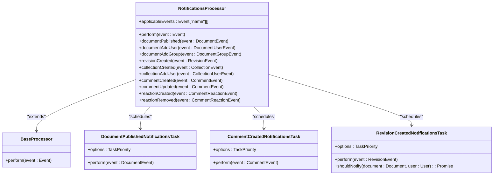
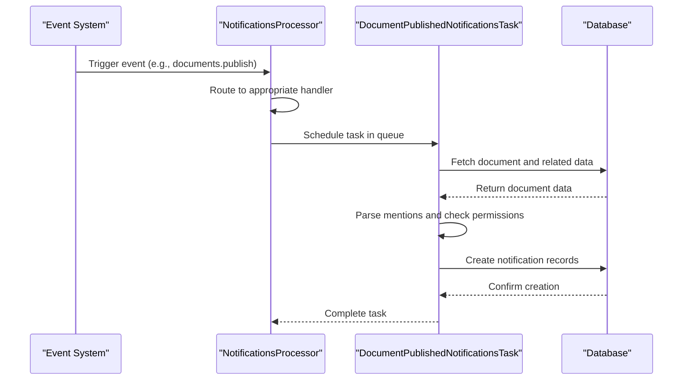
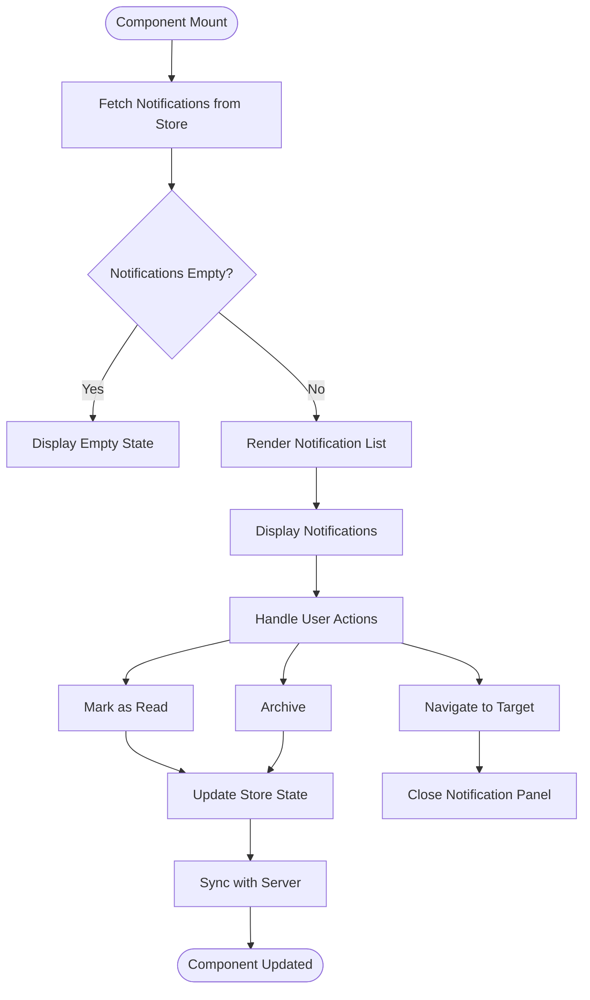
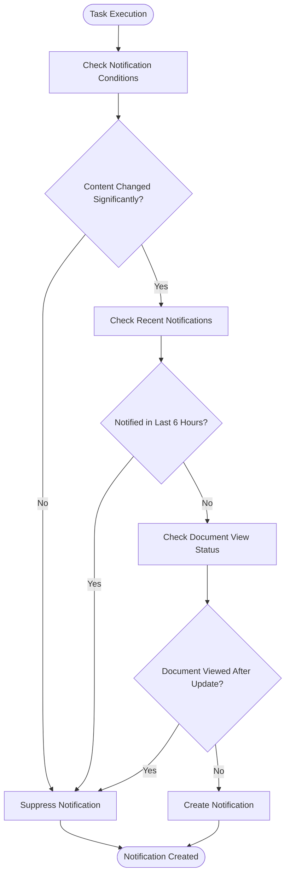
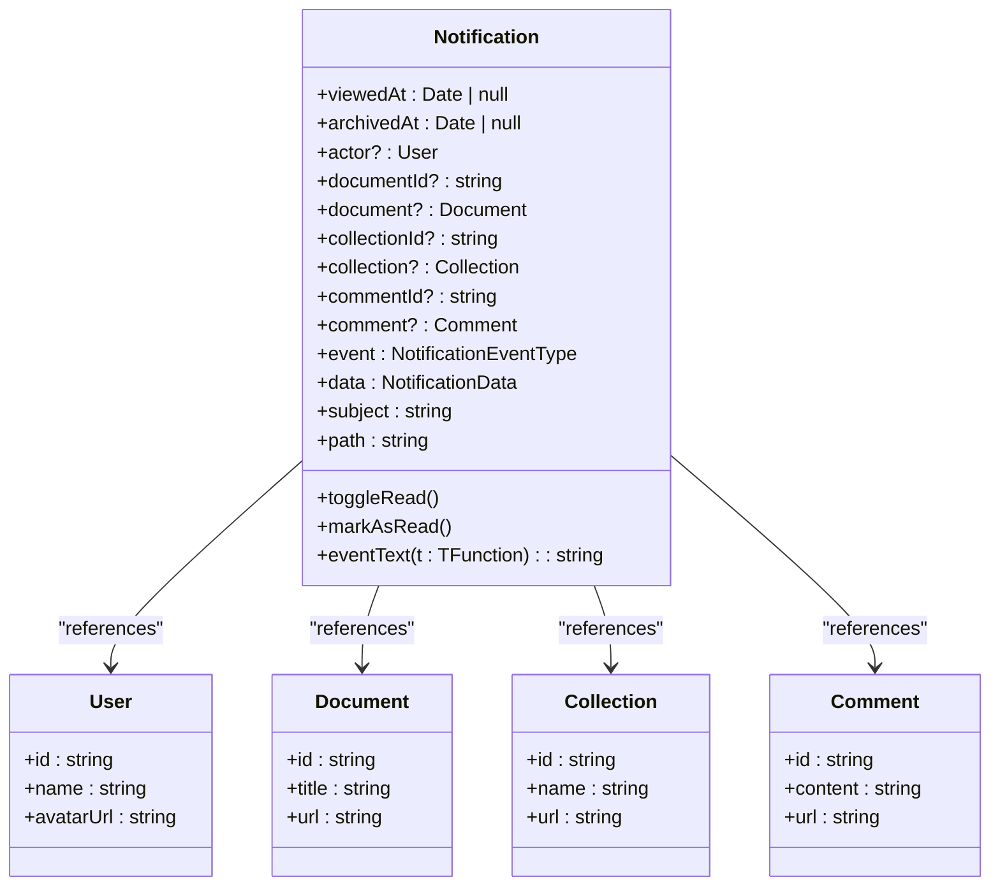
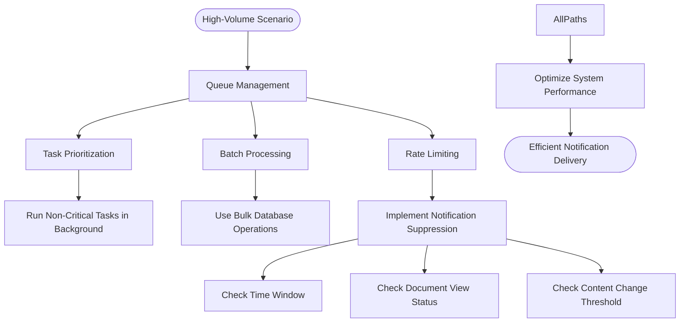

# Delivery Mechanisms

<cite>
**Referenced Files in This Document**   
- [NotificationsProcessor.ts](file://server/queues/processors/NotificationsProcessor.ts)
- [DocumentPublishedNotificationsTask.ts](file://server/queues/tasks/DocumentPublishedNotificationsTask.ts)
- [CommentCreatedNotificationsTask.ts](file://server/queues/tasks/CommentCreatedNotificationsTask.ts)
- [RevisionCreatedNotificationsTask.ts](file://server/queues/tasks/RevisionCreatedNotificationsTask.ts)
- [queue.ts](file://server/queues/queue.ts)
- [NotificationsStore.ts](file://app/stores/NotificationsStore.ts)
- [Notifications.tsx](file://app/components/Notifications/Notifications.tsx)
- [NotificationsPopover.tsx](file://app/components/Notifications/NotificationsPopover.tsx)
- [Notification.ts](file://app/models/Notification.ts)
- [notification.ts](file://server/presenters/notification.ts)
</cite>

## Table of Contents
1. [Introduction](#introduction)
2. [Background Job Processing System](#background-job-processing-system)
3. [Notification Creation Flow](#notification-creation-flow)
4. [Client-Side Polling and Real-Time Updates](#client-side-polling-and-real-time-updates)
5. [Delivery Guarantees and Error Handling](#delivery-guarantees-and-error-handling)
6. [Integration Between Server and Client](#integration-between-server-and-client)
7. [Performance Considerations](#performance-considerations)
8. [Extending Delivery Channels](#extending-delivery-channels)
9. [Conclusion](#conclusion)

## Introduction
The baozi application implements a robust notification delivery system designed to ensure reliable and timely communication between users and the platform. This document details the architecture and implementation of the notification delivery mechanisms, focusing on the integration between server-side background processing and client-side presentation. The system leverages Bull queues for asynchronous job processing, ensuring that notifications are delivered efficiently even under high load conditions. It supports various notification types, including document updates, comments, mentions, and group activities, with mechanisms for read/unread state synchronization and user preference management.

**Section sources**
- [NotificationsProcessor.ts](file://server/queues/processors/NotificationsProcessor.ts#L1-L131)
- [Notifications.tsx](file://app/components/Notifications/Notifications.tsx#L1-L138)

## Background Job Processing System
The notification delivery system in baozi is built on a background job processing architecture using Bull queues. This system ensures that notification-related tasks are handled asynchronously, preventing blocking of the main application flow and improving overall performance. The core of this system is the `NotificationsProcessor` class, which extends `BaseProcessor` and handles various events that trigger notifications.

The processor subscribes to specific events such as document publishing, document revisions, collection creation, comment creation, and reaction events. When an event occurs, the processor routes it to the appropriate handler method based on the event type. Each handler then schedules a corresponding task in the queue for execution. For example, when a document is published, the `documentPublished` method schedules a `DocumentPublishedNotificationsTask`.

**Diagram sources**
- [NotificationsProcessor.ts](file://server/queues/processors/NotificationsProcessor.ts#L24-L131)
- [DocumentPublishedNotificationsTask.ts](file://server/queues/tasks/DocumentPublishedNotificationsTask.ts#L10-L132)
- [CommentCreatedNotificationsTask.ts](file://server/queues/tasks/CommentCreatedNotificationsTask.ts#L23-L177)
- [RevisionCreatedNotificationsTask.ts](file://server/queues/tasks/RevisionCreatedNotificationsTask.ts#L22-L231)

The queue system is configured through the `createQueue` function in `queue.ts`, which sets up Bull queues with specific options for job handling, including automatic removal of completed and failed jobs. The system also integrates with Redis for persistent storage of queue data and monitoring through metrics collection.

**Section sources**
- [NotificationsProcessor.ts](file://server/queues/processors/NotificationsProcessor.ts#L1-L131)
- [queue.ts](file://server/queues/queue.ts#L1-L69)

## Notification Creation Flow
The notification creation process begins when a relevant event occurs in the application, such as a document being published or a comment being created. The event is captured and passed to the `NotificationsProcessor`, which determines the appropriate action based on the event type. The processor then schedules a specific task in the queue to handle the notification creation.

For instance, when a document is published, the `DocumentPublishedNotificationsTask` is scheduled. This task first ensures that subscriptions are created for the document, then parses mentions from the document content to identify users who should receive notifications. It checks user permissions and subscription preferences before creating notification records in the database. The task handles both individual user mentions and group mentions, ensuring that all relevant parties are notified according to their settings.

**Diagram sources**
- [DocumentPublishedNotificationsTask.ts](file://server/queues/tasks/DocumentPublishedNotificationsTask.ts#L10-L132)
- [NotificationsProcessor.ts](file://server/queues/processors/NotificationsProcessor.ts#L64-L75)

Similarly, when a comment is created, the `CommentCreatedNotificationsTask` is scheduled. This task not only creates subscriptions for the commenting user but also processes mentions within the comment content. It distinguishes between user mentions and group mentions, applying appropriate notification logic for each case. The task ensures that users who have disabled mentions for specific groups are not notified, respecting user preferences.

**Section sources**
- [DocumentPublishedNotificationsTask.ts](file://server/queues/tasks/DocumentPublishedNotificationsTask.ts#L10-L132)
- [CommentCreatedNotificationsTask.ts](file://server/queues/tasks/CommentCreatedNotificationsTask.ts#L23-L177)

## Client-Side Polling and Real-Time Updates
The client-side implementation of notifications in baozi is centered around the `Notifications` component and its associated store. The `NotificationsStore` manages the state of notifications, including fetching, updating, and organizing them for display. It provides methods for fetching notification pages, marking notifications as read, and archiving notifications.

The `Notifications` component renders the notification panel, displaying a list of active notifications and providing controls for managing them. It integrates with the `NotificationsStore` to display the approximate unread count and update the UI accordingly. The component also handles desktop and PWA badge updates, ensuring that users are aware of unread notifications even when the application is not in focus.

**Diagram sources**
- [Notifications.tsx](file://app/components/Notifications/Notifications.tsx#L1-L138)
- [NotificationsStore.ts](file://app/stores/NotificationsStore.ts#L1-L98)

The `NotificationsPopover` component provides a wrapper for the notifications interface, handling the popover behavior and lazy loading of the notifications content. It uses React's Suspense feature to load the notifications component asynchronously, improving initial load performance. The popover also manages scroll position and focus, ensuring a smooth user experience when opening and closing the notification panel.

**Section sources**
- [Notifications.tsx](file://app/components/Notifications/Notifications.tsx#L1-L138)
- [NotificationsPopover.tsx](file://app/components/Notifications/NotificationsPopover.tsx#L1-L65)
- [NotificationsStore.ts](file://app/stores/NotificationsStore.ts#L1-L98)

## Delivery Guarantees and Error Handling
The notification system in baozi implements several mechanisms to ensure reliable delivery and handle potential errors. The use of Bull queues provides built-in retry logic for failed jobs, ensuring that transient issues do not result in lost notifications. Each task in the queue has a defined priority, with notification tasks typically running in the background to avoid impacting critical application operations.

The system includes sophisticated logic to prevent duplicate or unnecessary notifications. For example, the `RevisionCreatedNotificationsTask` includes a check to suppress notifications if the content changes are below a certain threshold, avoiding spam from minor edits. It also implements rate limiting by suppressing notifications if a user has already been notified about a document update within the last six hours.

**Diagram sources**
- [RevisionCreatedNotificationsTask.ts](file://server/queues/tasks/RevisionCreatedNotificationsTask.ts#L170-L223)

Error handling is implemented at multiple levels. The queue system monitors job status and increments metrics for stalled, completed, errored, and failed jobs, enabling proactive monitoring and debugging. Tasks are designed to fail gracefully, with proper error handling and logging to ensure that issues can be identified and resolved.

**Section sources**
- [RevisionCreatedNotificationsTask.ts](file://server/queues/tasks/RevisionCreatedNotificationsTask.ts#L170-L223)
- [queue.ts](file://server/queues/queue.ts#L43-L54)

## Integration Between Server and Client
The integration between server-side queuing and client-side presentation is a critical aspect of the notification system. When a notification is created on the server, it is stored in the database with relevant metadata, including the event type, involved users, and target entities. The `presentNotification` function in the server's presenter layer formats this data for transmission to the client, including user, document, and comment information as appropriate.

On the client side, the `Notification` model defines the structure of notification data and provides computed properties for rendering. The `path` property determines the navigation target for each notification type, while the `eventText` method returns localized text describing the notification. The `subject` property extracts the relevant title from associated documents or collections.

**Diagram sources**
- [Notification.ts](file://app/models/Notification.ts#L1-L214)
- [notification.ts](file://server/presenters/notification.ts#L1-L31)

The synchronization of read/unread states is handled through the `markAsRead` and `toggleRead` methods on the `Notification` model, which update the `viewedAt` timestamp and persist the change to the server. The `NotificationsStore` maintains the overall state and provides computed properties like `approximateUnreadCount` to drive UI updates.

**Section sources**
- [Notification.ts](file://app/models/Notification.ts#L1-L214)
- [NotificationsStore.ts](file://app/stores/NotificationsStore.ts#L74-L77)
- [notification.ts](file://server/presenters/notification.ts#L1-L31)

## Performance Considerations
The notification system in baozi incorporates several performance optimizations to handle high-volume scenarios efficiently. The use of background queues allows notification processing to occur asynchronously, preventing blocking of the main application thread. Tasks are prioritized to ensure that critical operations are not delayed by notification processing.

Database queries are optimized through the use of appropriate indexes and batch operations where possible. For example, when processing mentions in a document, the system retrieves all relevant user and group information in bulk rather than making individual queries. The system also implements caching strategies to reduce redundant database access.

Rate limiting is implemented to prevent notification spam, particularly for frequently updated documents. The `RevisionCreatedNotificationsTask` includes logic to suppress notifications if a user has already been notified about a document within a specified time window or if they have viewed the document since the last update.

**Diagram sources**
- [RevisionCreatedNotificationsTask.ts](file://server/queues/tasks/RevisionCreatedNotificationsTask.ts#L170-L223)
- [queue.ts](file://server/queues/queue.ts#L37-L41)

The client-side implementation also includes performance optimizations, such as lazy loading of the notifications component and efficient state management through MobX. The `NotificationsStore` uses computed properties to derive values like the unread count, minimizing unnecessary re-renders.

**Section sources**
- [RevisionCreatedNotificationsTask.ts](file://server/queues/tasks/RevisionCreatedNotificationsTask.ts#L170-L223)
- [queue.ts](file://server/queues/queue.ts#L37-L41)
- [NotificationsStore.ts](file://app/stores/NotificationsStore.ts#L74-L77)

## Extending Delivery Channels
The notification system in baozi is designed to be extensible, allowing for the addition of new delivery channels such as email or mobile push notifications. The current implementation focuses on in-app notifications, but the architecture supports integration with external services through additional tasks and processors.

To extend the system for email delivery, a new task could be created that listens for notification events and sends emails through the existing email service. This task would need to format the notification content appropriately for email and handle delivery status tracking. Similarly, for mobile push notifications, a task could be implemented that communicates with push notification services like Firebase Cloud Messaging.

The `data` field in the notification model provides flexibility for storing additional information needed by different delivery channels. For example, email notifications might require HTML templates, while push notifications might need specific payload formats. The system's use of JSON for the `data` column allows for easy extension without requiring database schema changes.

Customization of delivery channels can be achieved by modifying user preferences and subscription settings. Users could be given options to choose which notification types they receive through each channel, allowing for fine-grained control over their notification experience.

**Section sources**
- [Notification.ts](file://app/models/Notification.ts#L79-L80)
- [DocumentPublishedNotificationsTask.ts](file://server/queues/tasks/DocumentPublishedNotificationsTask.ts#L10-L132)

## Conclusion
The delivery mechanisms in the baozi application provide a comprehensive and reliable system for notifying users of important events. By leveraging Bull queues for background processing, the system ensures that notifications are delivered efficiently without impacting application performance. The integration between server-side processing and client-side presentation enables a seamless user experience, with real-time updates and intuitive management controls.

The system's design emphasizes reliability, with built-in retry logic and error handling to ensure that notifications are not lost. Performance optimizations, including rate limiting and database query optimization, enable the system to scale effectively in high-volume scenarios. The extensible architecture allows for future enhancements, such as additional delivery channels and advanced notification filtering.

Overall, the notification delivery system in baozi demonstrates a thoughtful balance between technical sophistication and user experience, providing a robust foundation for keeping users informed and engaged with the platform.