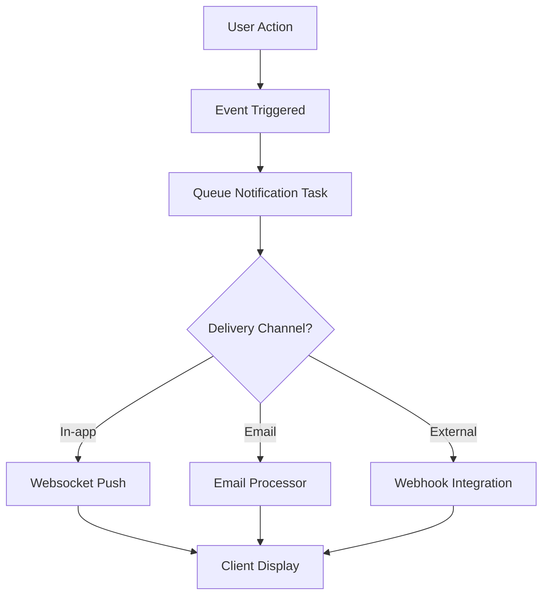
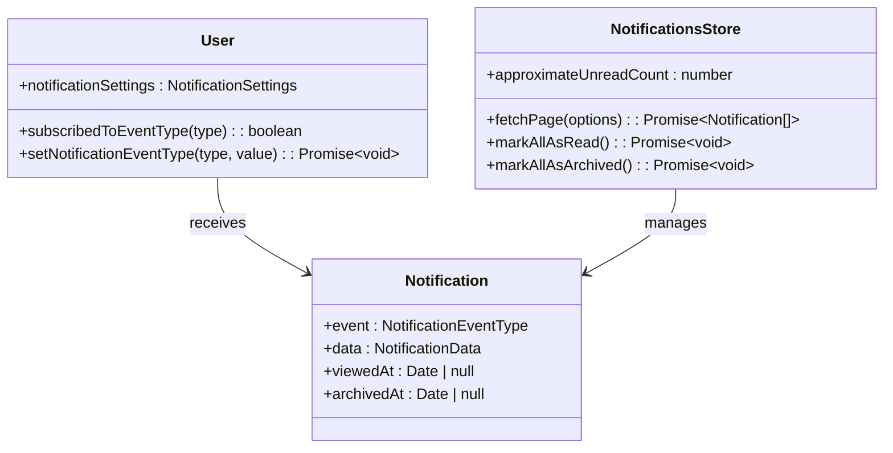

# Notification System

<cite>
**Referenced Files in This Document**   
- [Notification.ts](file://app/models/Notification.ts)
- [User.ts](file://app/models/User.ts)
- [NotificationsStore.ts](file://app/stores/NotificationsStore.ts)
- [Notifications.tsx](file://app/components/Notifications/Notifications.tsx)
- [CommentCreatedNotificationsTask.ts](file://server/queues/tasks/CommentCreatedNotificationsTask.ts)
- [DocumentPublishedNotificationsTask.ts](file://server/queues/tasks/DocumentPublishedNotificationsTask.ts)
- [RevisionCreatedNotificationsTask.ts](file://server/queues/tasks/RevisionCreatedNotificationsTask.ts)
- [CollectionAddUserNotificationsTask.ts](file://server/queues/tasks/CollectionAddUserNotificationsTask.ts)
</cite>

## Table of Contents
1. [Introduction](#introduction)
2. [Notification Types](#notification-types)
3. [Notification Creation Process](#notification-creation-process)
4. [Delivery Mechanisms](#delivery-mechanisms)
5. [Client-Side Implementation](#client-side-implementation)
6. [Notification Preferences System](#notification-preferences-system)
7. [Technical Details](#technical-details)
8. [Integration with External Services](#integration-with-external-services)
9. [Conclusion](#conclusion)

## Introduction
The Notification System in the baozi application enables users to stay informed about important activities within their workspace. This system tracks various events such as document updates, comments, mentions, and system events, delivering timely alerts through multiple channels. The architecture combines server-side event processing with client-side presentation to provide a seamless user experience. Notifications are created based on user actions, processed through background job queues for reliable delivery, and presented in an intuitive interface that allows users to manage their alerts efficiently.

## Notification Types
The baozi application supports several types of notifications that keep users informed about relevant activities:

- **Document Updates**: Notifications for when documents are published or edited, including revision creation events.
- **Comments**: Alerts for new comments, comment resolutions, and replies within documents.
- **Mentions**: Notifications when users are mentioned in documents or comments, either individually or as part of a group.
- **Collaboration Events**: Alerts for when users are added to documents or collections, sharing invitations, and access grants.
- **System Events**: Notifications for onboarding completion, feature announcements, export completions, and other platform-level events.
- **Reactions**: Alerts when users receive reactions to their comments.
- **Collection Events**: Notifications for collection creation and user additions to collections.

These notification types are defined in the `NotificationEventType` enum and are used throughout the system to categorize and process different kinds of user activities.

**Section sources**
- [Notification.ts](file://app/models/Notification.ts#L17-L210)

## Notification Creation Process
The notification creation process begins when user actions trigger specific events within the application. Each notification type has a corresponding task in the server's queue system that handles the creation logic. When an event occurs, such as a document update or comment creation, a background job is queued to process the notification.

The system uses specialized task classes like `DocumentPublishedNotificationsTask`, `CommentCreatedNotificationsTask`, and `RevisionCreatedNotificationsTask` to handle different notification types. These tasks evaluate the context of the event, determine the appropriate recipients based on permissions and subscriptions, and create notification records in the database.

Each notification includes essential metadata such as the triggering user (actor), associated document or collection, event type, and additional data specific to the notification context. The creation process also considers user preferences and notification settings to ensure that only relevant alerts are generated.

**Section sources**
- [DocumentPublishedNotificationsTask.ts](file://server/queues/tasks/DocumentPublishedNotificationsTask.ts)
- [CommentCreatedNotificationsTask.ts](file://server/queues/tasks/CommentCreatedNotificationsTask.ts)
- [RevisionCreatedNotificationsTask.ts](file://server/queues/tasks/RevisionCreatedNotificationsTask.ts)
- [CollectionAddUserNotificationsTask.ts](file://server/queues/tasks/CollectionAddUserNotificationsTask.ts)

## Delivery Mechanisms
The baozi application employs a robust delivery mechanism using background job queues to ensure reliable message delivery. The system leverages the Bull queue processor to manage notification tasks asynchronously, preventing delivery failures during peak usage periods.

When a notification is created, it is placed in a processing queue where it will be handled by the appropriate processor. The system supports multiple delivery channels, including in-app alerts, email notifications, and integrations with external messaging services. Email delivery is handled by the `EmailsProcessor`, which manages the sending of notification emails with proper retry logic for failed deliveries.

The delivery system incorporates several reliability features:
- **Retry mechanisms** for failed deliveries
- **Rate limiting** to prevent notification flooding
- **Delivery guarantees** through persistent queue storage
- **Performance optimization** via batch processing

Notifications are also optimized for mobile devices through push notifications and PWA badging, ensuring users are informed even when not actively using the application.

**Diagram sources**
- [DocumentPublishedNotificationsTask.ts](file://server/queues/tasks/DocumentPublishedNotificationsTask.ts)
- [CommentCreatedNotificationsTask.ts](file://server/queues/tasks/CommentCreatedNotificationsTask.ts)

## Client-Side Implementation
The client-side implementation of the notification system is centered around the `Notifications` component located in `app/components/Notifications/`. This component provides a comprehensive interface for viewing and managing notifications.

The implementation uses MobX for state management, with the `NotificationsStore` handling data retrieval, caching, and state updates. The store provides methods for fetching notification pages, marking notifications as read, and archiving notifications. The `approximateUnreadCount` computed property provides a real-time count of unread notifications, which is used to update badge indicators in the UI and on the application icon.

The `Notifications` component renders a list of active notifications using the `NotificationListItem` component, with infinite scrolling powered by the `PaginatedList` component. Users can mark all notifications as read with a single action, and the interface includes a context menu for additional notification management options.

Desktop and PWA integrations enhance the experience by updating dock icon badges and using the Badging API to display unread counts on the application icon.

**Section sources**
- [Notifications.tsx](file://app/components/Notifications/Notifications.tsx)
- [NotificationsStore.ts](file://app/stores/NotificationsStore.ts)

## Notification Preferences System
The notification preferences system allows users to customize their alert settings according to their individual needs. User preferences are stored in the `notificationSettings` field of the User model and can be updated through the `setNotificationEventType` method.

Users can subscribe or unsubscribe from specific notification event types, enabling fine-grained control over which alerts they receive. The system respects both user-level preferences and team-level defaults, with user settings taking precedence over team defaults. This hierarchical approach allows organizations to establish baseline notification policies while still accommodating individual preferences.

The preferences system is accessible through the user settings interface, where users can toggle different notification types on or off. Changes are immediately synchronized with the server through API calls to `/users.notificationsSubscribe` and `/users.notificationsUnsubscribe` endpoints.

**Diagram sources**
- [User.ts](file://app/models/User.ts)
- [Notification.ts](file://app/models/Notification.ts)
- [NotificationsStore.ts](file://app/stores/NotificationsStore.ts)

## Technical Details
The notification system incorporates several technical features to ensure performance, reliability, and scalability:

- **Database Optimization**: Notifications are stored in a dedicated table with appropriate indexes on frequently queried fields like `userId`, `viewedAt`, and `createdAt`. The system uses soft deletion (archiving) rather than hard deletion to maintain audit trails.

- **Rate Limiting**: The system implements rate limiting to prevent notification flooding, particularly for high-frequency events like document editing. This prevents users from being overwhelmed by excessive alerts.

- **Performance Optimization**: The client-side store implements efficient data structures and computed properties to minimize re-renders and optimize list rendering performance, even with large numbers of notifications.

- **Delivery Guarantees**: The queue-based architecture ensures at-least-once delivery semantics, with failed deliveries automatically retried according to configurable retry policies.

- **Security**: Notification pixels use cryptographic tokens to allow read status updates without requiring authentication, while preventing unauthorized access to notification data.

- **Scalability**: The system is designed to handle high volumes of notifications through asynchronous processing and horizontal scaling of queue processors.

**Section sources**
- [Notification.ts](file://app/models/Notification.ts)
- [NotificationsStore.ts](file://app/stores/NotificationsStore.ts)

## Integration with External Services
The baozi notification system supports integration with various external messaging services through plugins and webhooks. The architecture is designed to be extensible, allowing for the addition of new delivery channels without modifying core notification logic.

Email notifications are implemented through the email plugin, which processes notification events and sends formatted emails to users. The system supports email threading through message IDs and references, ensuring that related notifications appear as conversation threads in email clients.

External integrations like Slack, Discord, and various productivity tools are supported through dedicated plugins that translate notification events into messages compatible with each service's API. Webhook integrations allow organizations to connect the notification system to their internal tools and workflows.

Custom notifications can be created by implementing new task classes that follow the same pattern as existing notification tasks, making it straightforward to extend the system with new event types and delivery mechanisms.

**Section sources**
- [DocumentPublishedNotificationsTask.ts](file://server/queues/tasks/DocumentPublishedNotificationsTask.ts)
- [CommentCreatedNotificationsTask.ts](file://server/queues/tasks/CommentCreatedNotificationsTask.ts)

## Conclusion
The Notification System in the baozi application provides a comprehensive solution for keeping users informed about important activities within their workspace. By combining server-side event processing with a responsive client-side interface, the system delivers timely alerts while respecting user preferences and avoiding notification fatigue. The architecture balances reliability, performance, and extensibility, making it capable of handling diverse notification types and delivery channels. With its support for customization, integration, and scalability, the system effectively serves both individual users and large organizations with complex collaboration needs.