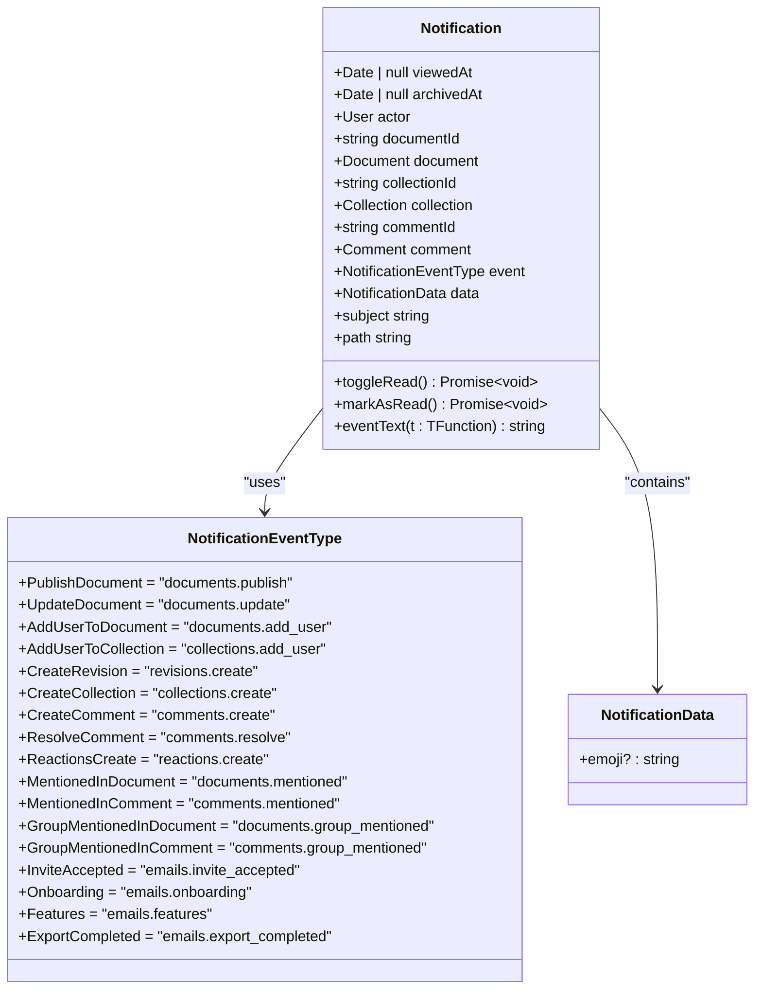
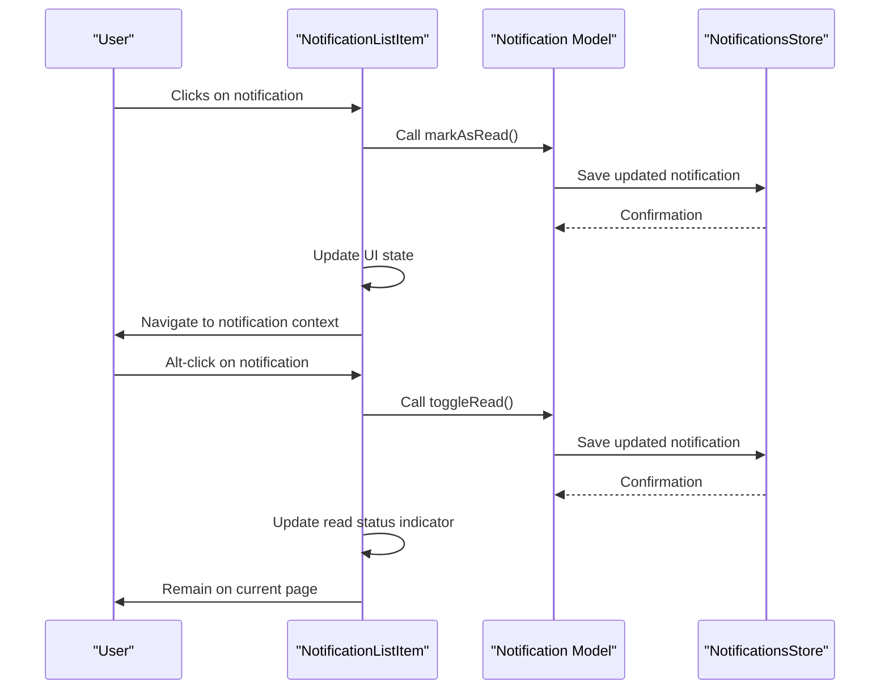
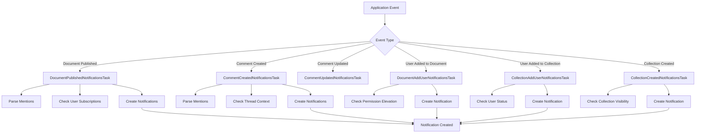

# Notification Types

<cite>
**Referenced Files in This Document**   
- [Notification.ts](file://app/models/Notification.ts)
- [NotificationHelper.ts](file://server/models/helpers/NotificationHelper.ts)
- [NotificationListItem.tsx](file://app/components/Notifications/NotificationListItem.tsx)
- [types.ts](file://shared/types.ts)
</cite>

## Table of Contents
1. [Introduction](#introduction)
2. [Domain Model](#domain-model)
3. [Notification Types and Events](#notification-types-and-events)
4. [Notification Rendering](#notification-rendering)
5. [Event-to-Notification Relationship](#event-to-notification-relationship)
6. [Creating New Notification Types](#creating-new-notification-types)
7. [User Notification Preferences](#user-notification-preferences)
8. [Notification Lifecycle and Cleanup](#notification-lifecycle-and-cleanup)

## Introduction
The baozi application implements a comprehensive notification system that keeps users informed about important activities across documents, collections, comments, and collaborations. This system is designed with type safety, extensibility, and user experience in mind, providing real-time updates for various events while allowing users to customize their notification preferences. The notification architecture spans both frontend and backend components, with a well-defined domain model that supports different notification types, metadata attachment, and contextual information. This document provides a detailed analysis of the notification types implementation, focusing on the domain model, rendering components, event relationships, and extensibility patterns that make the system both robust and maintainable.

## Domain Model

The core of the notification system is defined in the `Notification` model, which encapsulates all the essential attributes and behaviors for notifications. The model extends the base `Model` class and includes key properties such as `viewedAt` for tracking read status, `archivedAt` for archival state, and references to associated entities like documents, collections, comments, and users. The `event` property is typed as `NotificationEventType`, providing type safety for different notification categories, while the `data` property holds additional payload information as `NotificationData`. The model includes computed properties like `subject` and `path` that derive meaningful information from the notification context, such as the title of an associated document or the router path for navigation. Methods like `toggleRead` and `markAsRead` provide the interface for updating notification state, ensuring that user interactions are properly persisted.

**Section sources**
- [Notification.ts](file://app/models/Notification.ts#L18-L213)

## Notification Types and Events

The notification system supports a comprehensive set of event types that cover various user interactions and system events. These types are defined in the `NotificationEventType` enum and include document updates (`PublishDocument`, `UpdateDocument`), comment activities (`CreateComment`, `ResolveComment`), collaboration events (`AddUserToDocument`, `AddUserToCollection`), mentions (`MentionedInDocument`, `MentionedInComment`), and system alerts (`ExportCompleted`, `Onboarding`). Each notification type has specific handling logic that determines recipients, generates appropriate messaging, and sets up navigation paths. For example, comment-related notifications include special handling for thread context and view suppression if the recipient has already viewed the document since the comment was created. The system also supports reaction notifications with emoji data in the payload, demonstrating the extensibility of the notification data structure.

**Diagram sources **
- [Notification.ts](file://app/models/Notification.ts#L18-L213)
- [types.ts](file://shared/types.ts#L371-L389)
- [types.ts](file://shared/types.ts#L397-L399)

**Section sources**
- [Notification.ts](file://app/models/Notification.ts#L18-L213)
- [types.ts](file://shared/types.ts#L371-L389)
- [types.ts](file://shared/types.ts#L397-L399)

## Notification Rendering

The `NotificationListItem` component is responsible for rendering individual notifications in the user interface. It displays the notification actor's avatar, formatted event text, and contextual information such as the associated document or collection. The component uses the `eventText` method from the `Notification` model to generate localized descriptions of events, ensuring consistent messaging across the application. When a notification includes a comment, the component renders a preview of the comment content using a lazy-loaded `CommentEditor` component. The UI also includes visual indicators for unread notifications through the `UnreadBadge` component. Clicking on a notification marks it as read and navigates to the associated context, while holding the Alt key toggles the read status without navigation. The component leverages React's observer pattern from MobX React to efficiently re-render when notification state changes.

**Diagram sources **
- [NotificationListItem.tsx](file://app/components/Notifications/NotificationListItem.tsx#L26-L70)
- [Notification.ts](file://app/models/Notification.ts#L86-L105)

**Section sources**
- [NotificationListItem.tsx](file://app/components/Notifications/NotificationListItem.tsx#L26-L70)

## Event-to-Notification Relationship

The system establishes a clear relationship between application events and corresponding notifications through a series of background tasks that process events and create notifications as needed. For example, when a document is published, the `DocumentPublishedNotificationsTask` processes the event, identifies mentioned users and groups, and creates appropriate notifications. Similarly, comment creation triggers the `CommentCreatedNotificationsTask`, which handles mentions, group mentions, and general comment notifications. The system uses the `NotificationHelper` class to determine notification recipients based on user subscriptions, access permissions, and suspension status. This separation of concerns ensures that event processing is decoupled from notification creation, allowing for flexible configuration and easy extension of notification logic. The system also includes logic to suppress notifications in certain scenarios, such as when a user has already viewed a document since a comment was created.

**Diagram sources **
- [DocumentPublishedNotificationsTask.ts](file://server/queues/tasks/DocumentPublishedNotificationsTask.ts#L9-L130)
- [CommentCreatedNotificationsTask.ts](file://server/queues/tasks/CommentCreatedNotificationsTask.ts#L22-L175)
- [DocumentAddUserNotificationsTask.ts](file://server/queues/tasks/DocumentAddUserNotificationsTask.ts#L7-L69)
- [CollectionAddUserNotificationsTask.ts](file://server/queues/tasks/CollectionAddUserNotificationsTask.ts#L5-L31)
- [CollectionCreatedNotificationsTask.ts](file://server/queues/tasks/CollectionCreatedNotificationsTask.ts#L6-L42)

**Section sources**
- [DocumentPublishedNotificationsTask.ts](file://server/queues/tasks/DocumentPublishedNotificationsTask.ts#L9-L130)
- [CommentCreatedNotificationsTask.ts](file://server/queues/tasks/CommentCreatedNotificationsTask.ts#L22-L175)
- [DocumentAddUserNotificationsTask.ts](file://server/queues/tasks/DocumentAddUserNotificationsTask.ts#L7-L69)
- [CollectionAddUserNotificationsTask.ts](file://server/queues/tasks/CollectionAddUserNotificationsTask.ts#L5-L31)
- [CollectionCreatedNotificationsTask.ts](file://server/queues/tasks/CollectionCreatedNotificationsTask.ts#L6-L42)

## Creating New Notification Types

Adding new notification types to the system follows a consistent pattern that ensures type safety and proper integration with existing components. To create a new notification type, developers first extend the `NotificationEventType` enum with a new value, following the established naming convention of `category.action`. They then update the `eventText` method in the `Notification` model to provide appropriate localized text for the new event type. If the notification requires additional data in the payload, they extend the `NotificationData` type accordingly. The next step involves creating or modifying a background task that processes the relevant application event and creates notifications using the `Notification.create` method with the new event type. Finally, they ensure that the `path` computed property handles the new event type by returning the appropriate router path. This extensibility pattern allows for the addition of new notification types without modifying core notification rendering components.

**Section sources**
- [types.ts](file://shared/types.ts#L371-L389)
- [Notification.ts](file://app/models/Notification.ts#L113-L142)
- [Notification.ts](file://app/models/Notification.ts#L166-L209)

## User Notification Preferences

Users can customize their notification preferences through the `notificationSettings` property on the `User` model. This settings object is a mapping of `NotificationEventType` to boolean values, indicating whether the user wants to receive notifications for each event type. The `subscribedToEventType` method provides a convenient interface for checking a user's preference, falling back to system defaults when a specific setting is not defined. Users can update their preferences through the `setNotificationEventType` method, which updates the local model and sends a request to the server to persist the change. The system respects these preferences when determining notification recipients, ensuring that users only receive notifications they have opted into. This preference system is integrated with the notification creation process, where tasks check user subscriptions before creating notifications.

**Section sources**
- [User.ts](file://app/models/User.ts#L193-L212)
- [User.ts](file://server/models/User.ts#L330-L338)

## Notification Lifecycle and Cleanup

The notification system includes mechanisms for managing the lifecycle of notifications, including automatic cleanup of old notifications. The `CleanupOldNotificationsTask` runs hourly and permanently destroys notifications based on age criteria: notifications older than 12 months are removed regardless of read status, while viewed notifications older than 6 months are also cleaned up. This ensures that the notification database remains performant and doesn't accumulate unnecessary data over time. The system also handles the creation of corresponding events when notifications are created, using the `createEvent` hook in the `Notification` model. This event tracking allows for analytics and auditing of notification activity. The combination of automatic cleanup and event tracking creates a balanced system that maintains user history while preventing database bloat.

**Section sources**
- [CleanupOldNotificationsTask.ts](file://server/queues/tasks/CleanupOldNotificationsTask.ts#L8-L51)
- [Notification.ts](file://server/models/Notification.ts#L225-L237)