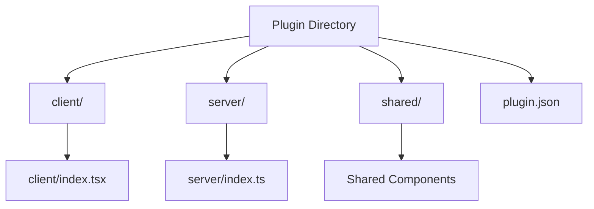
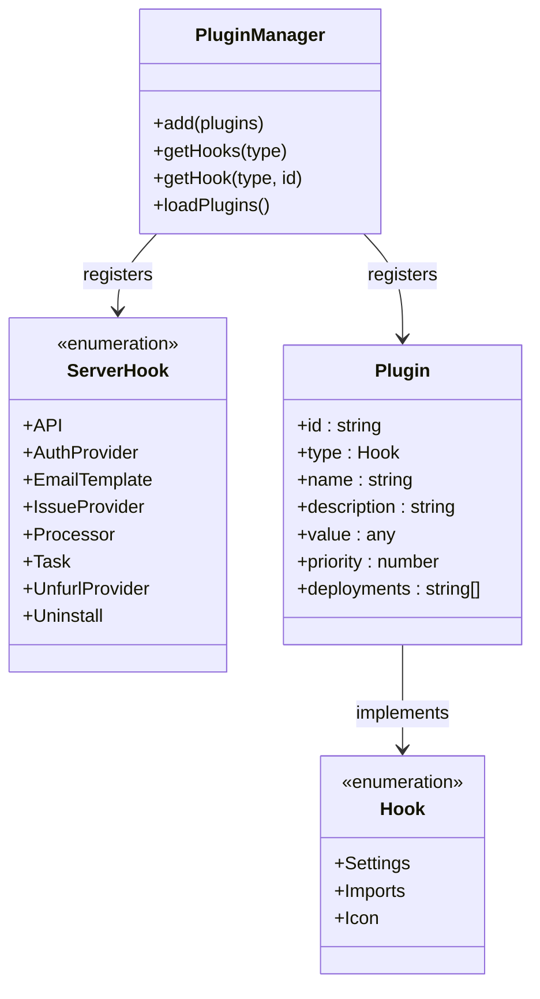
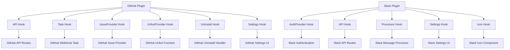
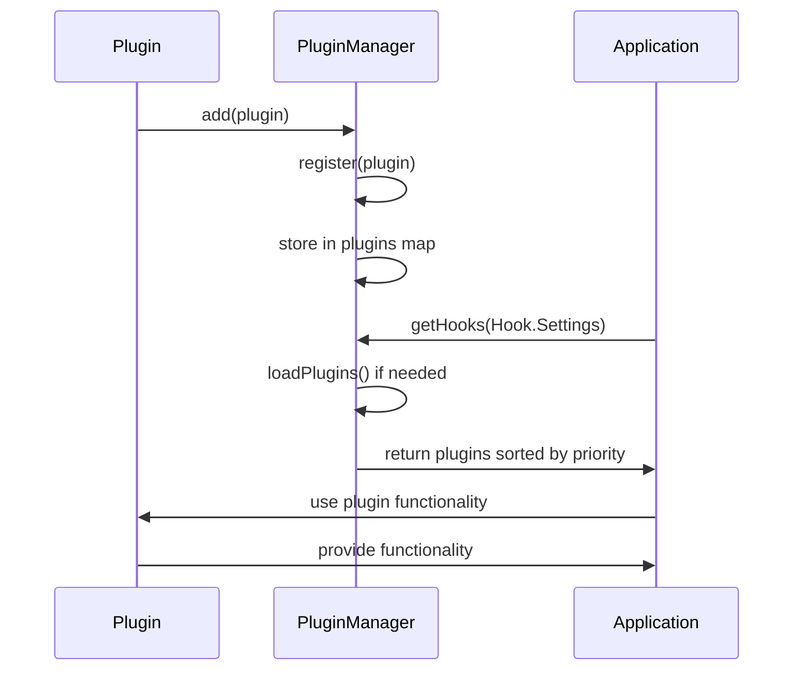

# Plugin Architecture

<cite>
**Referenced Files in This Document**   
- [app/utils/PluginManager.ts](file://app/utils/PluginManager.ts)
- [server/utils/PluginManager.ts](file://server/utils/PluginManager.ts)
- [plugins/github/server/index.ts](file://plugins/github/server/index.ts)
- [plugins/slack/server/index.ts](file://plugins/slack/server/index.ts)
- [plugins/github/client/index.tsx](file://plugins/github/client/index.tsx)
- [plugins/slack/client/index.tsx](file://plugins/slack/client/index.tsx)
- [plugins/github/plugin.json](file://plugins/github/plugin.json)
- [plugins/slack/plugin.json](file://plugins/slack/plugin.json)
</cite>

## Table of Contents
1. [Introduction](#introduction)
2. [Plugin System Overview](#plugin-system-overview)
3. [Plugin Structure and Components](#plugin-structure-and-components)
4. [PluginManager Implementation](#pluginmanager-implementation)
5. [Hook System and Integration Points](#hook-system-and-integration-points)
6. [Plugin Lifecycle Management](#plugin-lifecycle-management)
7. [Client-Server Plugin Interactions](#client-server-plugin-interactions)
8. [Security and Deployment Considerations](#security-and-deployment-considerations)
9. [Plugin Examples and Use Cases](#plugin-examples-and-use-cases)
10. [System Architecture Diagram](#system-architecture-diagram)
11. [Component Interaction Diagram](#component-interaction-diagram)

## Introduction
The baozi application implements a modular plugin architecture that enables extensibility through client, server, and shared components. This architecture allows third-party integrations and custom functionality to be added without modifying the core application code. The plugin system is designed to support various integration patterns, including authentication providers, API extensions, UI components, and background processing tasks. This document provides a comprehensive overview of the plugin architecture, detailing the design principles, implementation details, and integration patterns that enable the extensibility of the baozi application.

## Plugin System Overview
The plugin system in the baozi application is built around a dual PluginManager implementation that handles both client-side and server-side plugin components. The architecture supports three types of plugin components: client, server, and shared. Client components are responsible for UI extensions and client-side functionality, while server components handle API endpoints, authentication providers, and background processing. Shared components contain code that can be used by both client and server environments. The system uses a hook-based integration model where plugins register themselves at specific extension points in the application lifecycle. This design enables loose coupling between the core application and plugins, allowing for dynamic loading and unloading of functionality.

**Section sources**
- [app/utils/PluginManager.ts](file://app/utils/PluginManager.ts#L1-L164)
- [server/utils/PluginManager.ts](file://server/utils/PluginManager.ts#L1-L134)

## Plugin Structure and Components
Plugins in the baozi application follow a standardized directory structure with separate directories for client, server, and shared components. Each plugin contains a plugin.json file that defines metadata such as the plugin ID, name, priority, and description. The client directory contains React components and UI extensions that integrate with the frontend application, while the server directory contains backend functionality such as API routes, authentication providers, and background tasks. The shared directory contains code that can be used by both client and server components, such as utility functions and type definitions. This separation of concerns allows plugins to extend both the frontend and backend functionality of the application while maintaining clear boundaries between components.



**Diagram sources**
- [plugins/github/plugin.json](file://plugins/github/plugin.json#L1-L7)
- [plugins/slack/plugin.json](file://plugins/slack/plugin.json#L1-L7)

**Section sources**
- [plugins/github](file://plugins/github)
- [plugins/slack](file://plugins/slack)

## PluginManager Implementation
The PluginManager implementation is split between client and server environments, with each having its own PluginManager class that handles the loading and registration of plugins. The client-side PluginManager (app/utils/PluginManager.ts) is responsible for loading client components and managing UI extensions, while the server-side PluginManager (server/utils/PluginManager.ts) handles server components such as API routes and background tasks. Both implementations follow a similar pattern of plugin registration, storage, and retrieval. The PluginManager uses a Map to store plugins by their hook type, allowing for efficient lookup and retrieval of plugins based on their integration point. The system supports plugin priority, which determines the order of execution for plugins of the same type, with lower priority values executed first.

**Section sources**
- [app/utils/PluginManager.ts](file://app/utils/PluginManager.ts#L68-L153)
- [server/utils/PluginManager.ts](file://server/utils/PluginManager.ts#L67-L133)

## Hook System and Integration Points
The hook system in the baozi application provides specific integration points where plugins can extend the functionality of the core application. There are different sets of hooks for client and server environments, reflecting the different types of functionality that can be extended. Client-side hooks include Settings, Imports, and Icon, which allow plugins to add configuration screens, import functionality, and custom icons to the application. Server-side hooks include API, AuthProvider, IssueProvider, Processor, Task, UnfurlProvider, and Uninstall, which enable plugins to extend the backend functionality with custom API endpoints, authentication providers, issue tracking integration, background processing, and more. Plugins register themselves with the PluginManager by specifying the hook type and providing the appropriate implementation.



**Diagram sources**
- [app/utils/PluginManager.ts](file://app/utils/PluginManager.ts#L13-L17)
- [server/utils/PluginManager.ts](file://server/utils/PluginManager.ts#L24-L33)

**Section sources**
- [app/utils/PluginManager.ts](file://app/utils/PluginManager.ts#L13-L17)
- [server/utils/PluginManager.ts](file://server/utils/PluginManager.ts#L24-L33)

## Plugin Lifecycle Management
The plugin lifecycle in the baozi application is managed through a combination of static registration and dynamic loading. Plugins are registered with the PluginManager when their index files are loaded, typically through a call to PluginManager.add(). The client-side PluginManager loads plugins asynchronously using dynamic imports, while the server-side PluginManager uses Node.js require() to load plugin files during application startup. The system includes lifecycle methods for loading plugins, with the loadPlugins() method responsible for discovering and loading all available plugins. Plugin registration is conditional based on environment variables and deployment configuration, allowing plugins to be enabled or disabled based on the deployment environment. The PluginManager also supports priority-based ordering of plugins, which affects both execution order and UI presentation.

**Section sources**
- [app/utils/PluginManager.ts](file://app/utils/PluginManager.ts#L139-L147)
- [server/utils/PluginManager.ts](file://server/utils/PluginManager.ts#L118-L130)

## Client-Server Plugin Interactions
Client-server plugin interactions in the baozi application are designed to maintain separation of concerns while enabling seamless integration between frontend and backend functionality. Client components interact with server components through well-defined API endpoints, typically registered by the server component using the API hook. The shared directory allows for code reuse between client and server components, such as type definitions and utility functions that are needed in both environments. Configuration is shared between client and server through environment variables and the plugin.json manifest file. The system uses a consistent plugin ID to correlate client and server components of the same plugin, enabling coordinated functionality across the stack. This architecture allows plugins to provide end-to-end functionality while maintaining clear boundaries between client and server responsibilities.

**Section sources**
- [plugins/github/client/index.tsx](file://plugins/github/client/index.tsx#L1-L19)
- [plugins/github/server/index.ts](file://plugins/github/server/index.ts#L1-L43)

## Security and Deployment Considerations
The plugin architecture in the baozi application includes several security and deployment considerations to ensure safe and reliable operation. Plugins can be restricted to specific deployment environments through the deployments property in the plugin configuration, allowing different sets of plugins to be enabled for cloud, community, and enterprise deployments. The system includes conditional loading based on environment variables, preventing plugins from being loaded when required configuration is not present. Server-side plugins are loaded during application startup, with error handling to prevent plugin loading failures from affecting the core application. The architecture follows the principle of least privilege, with plugins only having access to the specific extension points they need. The use of isolated plugin directories and manifest files provides a clear boundary between plugin code and core application code, reducing the risk of unintended interactions.

**Section sources**
- [app/utils/PluginManager.ts](file://app/utils/PluginManager.ts#L88-L93)
- [server/utils/PluginManager.ts](file://server/utils/PluginManager.ts#L82-L86)

## Plugin Examples and Use Cases
The baozi application includes several example plugins that demonstrate the capabilities of the plugin architecture. The GitHub plugin provides integration with GitHub repositories, enabling rich link previews for GitHub issues and pull requests, as well as issue tracking functionality. The Slack plugin adds Slack authentication, slash command support, and rich link unfurling for Outline content shared in Slack channels. These plugins demonstrate the use of multiple hook types to provide comprehensive integration with third-party services. The GitHub plugin uses the API, Task, IssueProvider, UnfurlProvider, and Uninstall hooks to provide backend functionality, while also using the Settings hook to add a configuration interface in the client. The Slack plugin uses the AuthProvider, API, and Processor hooks on the server side, and the Settings and Icon hooks on the client side, demonstrating how plugins can extend both frontend and backend functionality.



**Diagram sources**
- [plugins/github/server/index.ts](file://plugins/github/server/index.ts#L19-L42)
- [plugins/slack/server/index.ts](file://plugins/slack/server/index.ts#L11-L27)
- [plugins/github/client/index.tsx](file://plugins/github/client/index.tsx#L6-L18)
- [plugins/slack/client/index.tsx](file://plugins/slack/client/index.tsx#L6-L24)

**Section sources**
- [plugins/github](file://plugins/github)
- [plugins/slack](file://plugins/slack)

## System Architecture Diagram
The overall system architecture of the plugin system shows the relationship between the core application, the PluginManager, and individual plugins. The architecture is divided into client and server components, with separate PluginManager instances managing plugins in each environment. Plugins are loaded from the plugins directory and register themselves with the appropriate PluginManager using specific hooks. The client PluginManager handles UI extensions and client-side functionality, while the server PluginManager manages API endpoints, authentication providers, and background tasks. The shared directory allows for code reuse between client and server components, while maintaining separation of concerns.

```mermaid
graph TD
subgraph Client
ClientPluginManager[Client PluginManager]
ClientPlugins[Client Plugins]
ClientApp[Core Application]
end
subgraph Server
ServerPluginManager[Server PluginManager]
ServerPlugins[Server Plugins]
ServerApp[Core Application]
end
subgraph Plugins
ClientComponents[Client Components]
ServerComponents[Server Components]
SharedComponents[Shared Components]
end
ClientPluginManager --> ClientPlugins
ServerPluginManager --> ServerPlugins
ClientApp --> ClientPluginManager
ServerApp --> ServerPluginManager
ClientComponents --> ClientPlugins
ServerComponents --> ServerPlugins
SharedComponents --> ClientComponents
SharedComponents --> ServerComponents
ClientApp < --> ServerApp[API Communication]
```

**Diagram sources**
- [app/utils/PluginManager.ts](file://app/utils/PluginManager.ts#L68-L153)
- [server/utils/PluginManager.ts](file://server/utils/PluginManager.ts#L67-L133)

## Component Interaction Diagram
The component interaction diagram illustrates how plugins interact with the core application through the PluginManager. When a plugin is loaded, it registers itself with the PluginManager by calling the add() method with one or more plugin definitions. Each plugin definition specifies a hook type and the corresponding implementation. The PluginManager stores these plugins in a map indexed by hook type, allowing for efficient retrieval. When the application needs to use plugin functionality, it calls getHooks() or getHook() on the PluginManager to retrieve the appropriate plugins. The plugins are returned in priority order, allowing for controlled execution sequence. This interaction pattern enables the core application to remain unaware of specific plugins while still being able to leverage their functionality through well-defined interfaces.



**Diagram sources**
- [app/utils/PluginManager.ts](file://app/utils/PluginManager.ts#L76-L120)
- [server/utils/PluginManager.ts](file://server/utils/PluginManager.ts#L74-L112)

**Section sources**
- [app/utils/PluginManager.ts](file://app/utils/PluginManager.ts#L76-L120)
- [server/utils/PluginManager.ts](file://server/utils/PluginManager.ts#L74-L112)