# Plugin Development Guide

<cite>
**Referenced Files in This Document**   
- [plugin.json](file://plugins/azure/plugin.json)
- [client/index.tsx](file://plugins/azure/client/index.tsx)
- [server/index.ts](file://plugins/azure/server/index.ts)
- [app/utils/PluginManager.ts](file://app/utils/PluginManager.ts)
- [server/utils/PluginManager.ts](file://server/utils/PluginManager.ts)
- [app/components/PluginIcon.tsx](file://app/components/PluginIcon.tsx)
- [app/hooks/useSettingsConfig.ts](file://app/hooks/useSettingsConfig.ts)
- [app/scenes/Settings/Import.tsx](file://app/scenes/Settings/Import.tsx)
- [server/models/helpers/AuthenticationHelper.ts](file://server/models/helpers/AuthenticationHelper.ts)
- [server/routes/api/urls/urls.ts](file://server/routes/api/urls/urls.ts)
- [server/queues/tasks/CacheIssueSourcesTask.ts](file://server/queues/tasks/CacheIssueSourcesTask.ts)
- [server/queues/processors/IntegrationDeletedProcessor.ts](file://server/queues/processors/IntegrationDeletedProcessor.ts)
- [plugins/github/server/GitHubIssueProvider.ts](file://plugins/github/server/GitHubIssueProvider.ts)
- [plugins/github/server/api/github.ts](file://plugins/github/server/api/github.ts)
- [plugins/github/client/Settings.tsx](file://plugins/github/client/Settings.tsx)
- [plugins/github/shared/GitHubUtils.ts](file://plugins/github/shared/GitHubUtils.ts)
</cite>

## Table of Contents
1. [Introduction](#introduction)
2. [Project Structure](#project-structure)
3. [Core Components](#core-components)
4. [Architecture Overview](#architecture-overview)
5. [Detailed Component Analysis](#detailed-component-analysis)
6. [Dependency Analysis](#dependency-analysis)
7. [Performance Considerations](#performance-considerations)
8. [Troubleshooting Guide](#troubleshooting-guide)
9. [Conclusion](#conclusion)

## Introduction
This guide provides comprehensive documentation for developing plugins for the baozi application. It covers the complete plugin development lifecycle, including setting up a new plugin project, implementing client and server components, registering hooks for various extension points, and following secure coding practices. The guide also includes examples of common plugin patterns, testing strategies, deployment considerations, and troubleshooting tips.

## Project Structure
The baozi application follows a modular architecture with a dedicated plugins directory for extensibility. The plugin system is designed to support both client-side (React) and server-side (Node.js) components, allowing developers to extend the application's functionality in various ways.

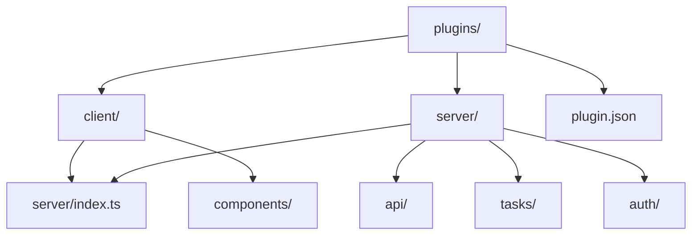

**Diagram sources**
- [plugins/azure](file://plugins/azure)

**Section sources**
- [plugins/azure](file://plugins/azure)

## Core Components
The plugin system in baozi consists of several core components that enable extensibility. These include the PluginManager classes for both client and server, the plugin manifest file (plugin.json), and the various hook types that plugins can register for.

**Section sources**
- [app/utils/PluginManager.ts](file://app/utils/PluginManager.ts)
- [server/utils/PluginManager.ts](file://server/utils/PluginManager.ts)

## Architecture Overview
The baozi plugin architecture is designed to be modular and extensible, with clear separation between client and server components. The system uses a hook-based registration mechanism that allows plugins to extend various aspects of the application.

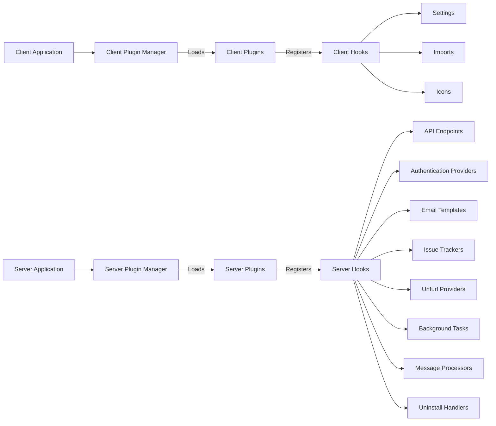

**Diagram sources**
- [app/utils/PluginManager.ts](file://app/utils/PluginManager.ts)
- [server/utils/PluginManager.ts](file://server/utils/PluginManager.ts)

## Detailed Component Analysis

### Plugin Structure and Manifest
Each plugin in the baozi application follows a standardized directory structure and includes a manifest file (plugin.json) that defines its metadata and configuration.

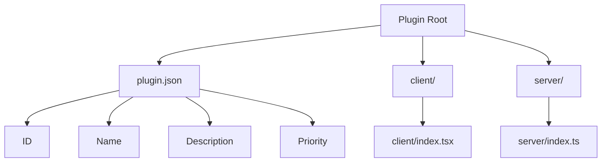

The plugin.json file contains essential metadata about the plugin:

```json
{
  "id": "github",
  "name": "GitHub",
  "priority": 10,
  "description": "Adds a GitHub integration for link unfurling."
}
```

**Diagram sources**
- [plugins/github/plugin.json](file://plugins/github/plugin.json)

**Section sources**
- [plugins/github/plugin.json](file://plugins/github/plugin.json)

### Client-Side Plugin Implementation
Client-side plugins are implemented using React and are loaded dynamically by the client plugin manager. They can register for various client hooks to extend the user interface.

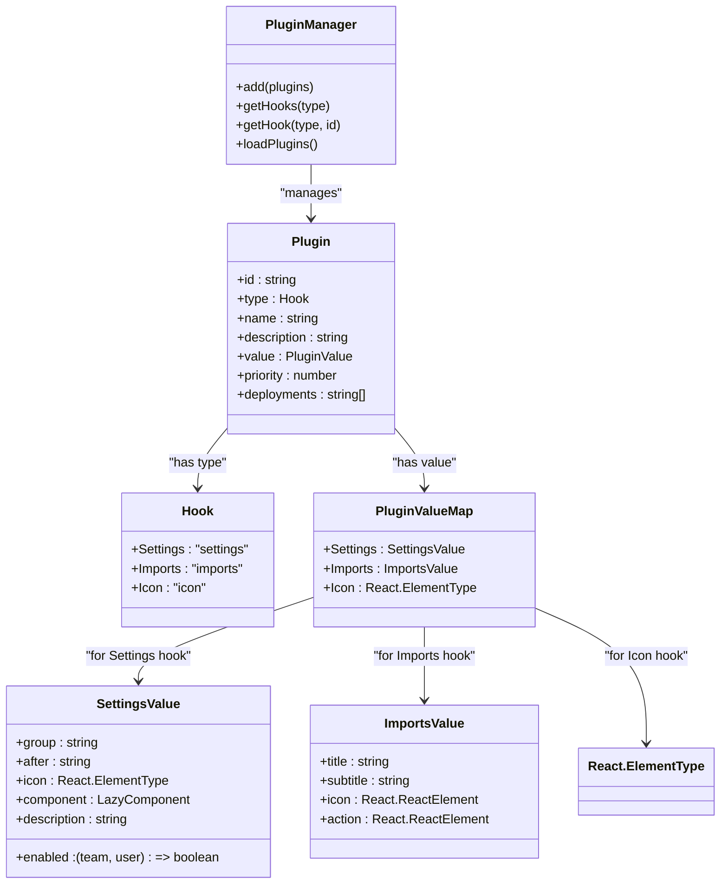

**Diagram sources**
- [app/utils/PluginManager.ts](file://app/utils/PluginManager.ts)

**Section sources**
- [app/utils/PluginManager.ts](file://app/utils/PluginManager.ts)

### Server-Side Plugin Implementation
Server-side plugins are implemented using Node.js and can register for various server hooks to extend the application's backend functionality.

```mermaid
classDiagram
class PluginManager {
+add(plugins)
+getHooks(type)
+loadPlugins()
}
class Plugin {
+type : Hook
+name : string
+description : string
+value : PluginValue
+priority : number
}
class Hook {
+API : "api"
+AuthProvider : "authProvider"
+EmailTemplate : "emailTemplate"
+IssueProvider : "issueProvider"
+Processor : "processor"
+Task : "task"
+UnfurlProvider : "unfurl"
+Uninstall : "uninstall"
}
class PluginValueMap {
+API : Router
+AuthProvider : {router : Router, id : string}
+EmailTemplate : typeof BaseEmail
+IssueProvider : BaseIssueProvider
+Processor : typeof BaseProcessor
+Task : typeof BaseTask
+UnfurlProvider : {unfurl : UnfurlSignature, cacheExpiry : number}
+Uninstall : UninstallSignature
}
PluginManager --> Plugin : "manages"
Plugin --> Hook : "has type"
Plugin --> PluginValueMap : "has value"
```

**Diagram sources**
- [server/utils/PluginManager.ts](file://server/utils/PluginManager.ts)

**Section sources**
- [server/utils/PluginManager.ts](file://server/utils/PluginManager.ts)

### Plugin Registration and Loading
The plugin system uses a two-phase loading process: first loading client plugins when the application starts, and then loading server plugins when the server initializes.

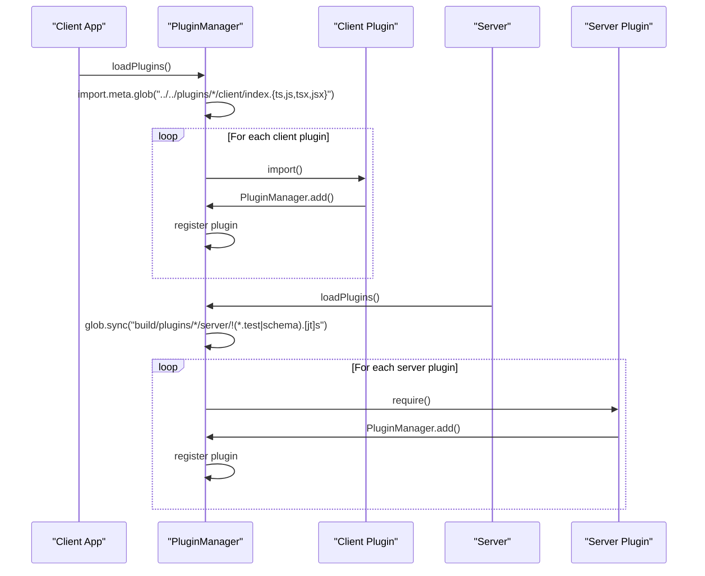

**Diagram sources**
- [app/utils/PluginManager.ts](file://app/utils/PluginManager.ts)
- [server/utils/PluginManager.ts](file://server/utils/PluginManager.ts)

**Section sources**
- [app/utils/PluginManager.ts](file://app/utils/PluginManager.ts)
- [server/utils/PluginManager.ts](file://server/utils/PluginManager.ts)

### Client Hook Types
The client plugin system supports several hook types that allow plugins to extend the user interface in different ways.

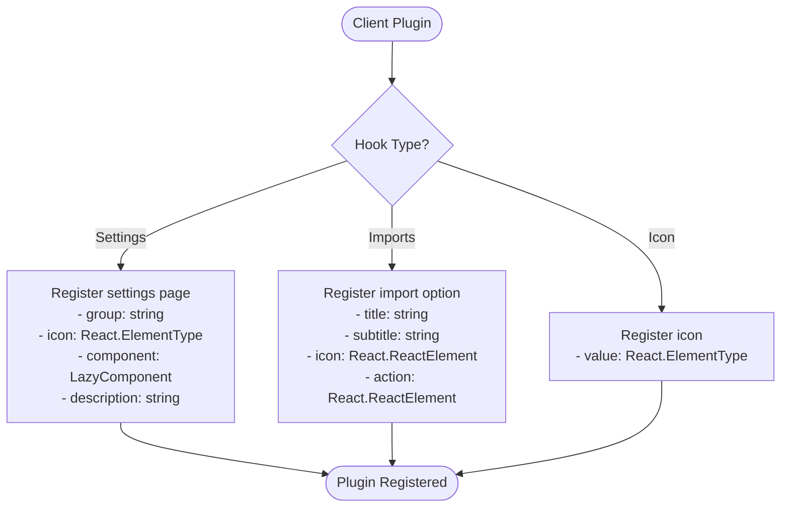

**Diagram sources**
- [app/utils/PluginManager.ts](file://app/utils/PluginManager.ts)

**Section sources**
- [app/utils/PluginManager.ts](file://app/utils/PluginManager.ts)

### Server Hook Types
The server plugin system supports several hook types that allow plugins to extend the application's backend functionality.

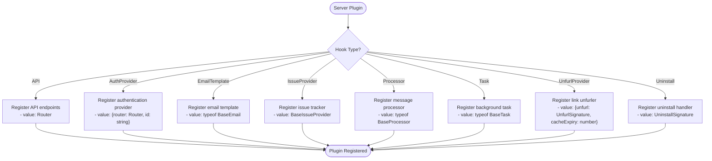

**Diagram sources**
- [server/utils/PluginManager.ts](file://server/utils/PluginManager.ts)

**Section sources**
- [server/utils/PluginManager.ts](file://server/utils/PluginManager.ts)

### Example: GitHub Plugin Implementation
The GitHub plugin serves as a comprehensive example of how to implement a plugin that integrates with an external service.

```mermaid
graph TD
GitHubPlugin[GitHub Plugin] --> Client[client/]
GitHubPlugin --> Server[server/]
GitHubPlugin --> Shared[shared/]
Client --> Settings[Settings.tsx]
Client --> Icon[Icon.tsx]
Client --> Index[client/index.tsx]
Server --> API[api/github.ts]
Server --> GitHub[github.ts]
Server --> Tasks[GitHubWebhookTask.ts]
Server --> Uninstall[uninstall.ts]
Server --> Index[server/index.ts]
Shared --> Utils[GitHubUtils.ts]
Shared --> Types[types.ts]
subgraph "Client Components"
Settings --> |Displays| UI[Settings UI]
Icon --> |Used in| PluginIcon[PluginIcon]
Index --> |Registers| SettingsHook[Settings Hook]
Index --> |Registers| IconHook[Icon Hook]
end
subgraph "Server Components"
API --> |Handles| OAuth[OAuth Callback]
API --> |Handles| Webhooks[Webhook Events]
GitHub --> |Provides| Unfurl[Link Unfurling]
Tasks --> |Processes| WebhookEvents[Webhook Events]
Uninstall --> |Handles| Cleanup[Cleanup on Uninstall]
Index --> |Registers| APIHook[API Hook]
Index --> |Registers| TaskHook[Task Hook]
Index --> |Registers| IssueProviderHook[Issue Provider Hook]
Index --> |Registers| UnfurlProviderHook[Unfurl Provider Hook]
Index --> |Registers| UninstallHook[Uninstall Hook]
end
```

**Diagram sources**
- [plugins/github](file://plugins/github)

**Section sources**
- [plugins/github](file://plugins/github)

### GitHub Plugin Client Implementation
The client-side implementation of the GitHub plugin registers for the Settings and Icon hooks to extend the user interface.

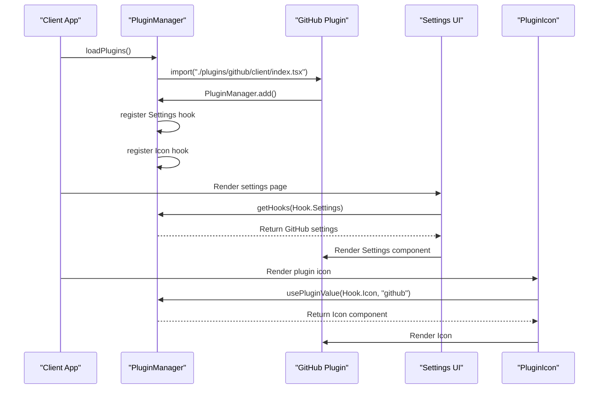

**Diagram sources**
- [plugins/github/client/index.tsx](file://plugins/github/client/index.tsx)
- [plugins/github/client/Settings.tsx](file://plugins/github/client/Settings.tsx)
- [app/components/PluginIcon.tsx](file://app/components/PluginIcon.tsx)

**Section sources**
- [plugins/github/client/index.tsx](file://plugins/github/client/index.tsx)
- [plugins/github/client/Settings.tsx](file://plugins/github/client/Settings.tsx)
- [app/components/PluginIcon.tsx](file://app/components/PluginIcon.tsx)

### GitHub Plugin Server Implementation
The server-side implementation of the GitHub plugin registers for multiple hooks to provide comprehensive integration with GitHub.

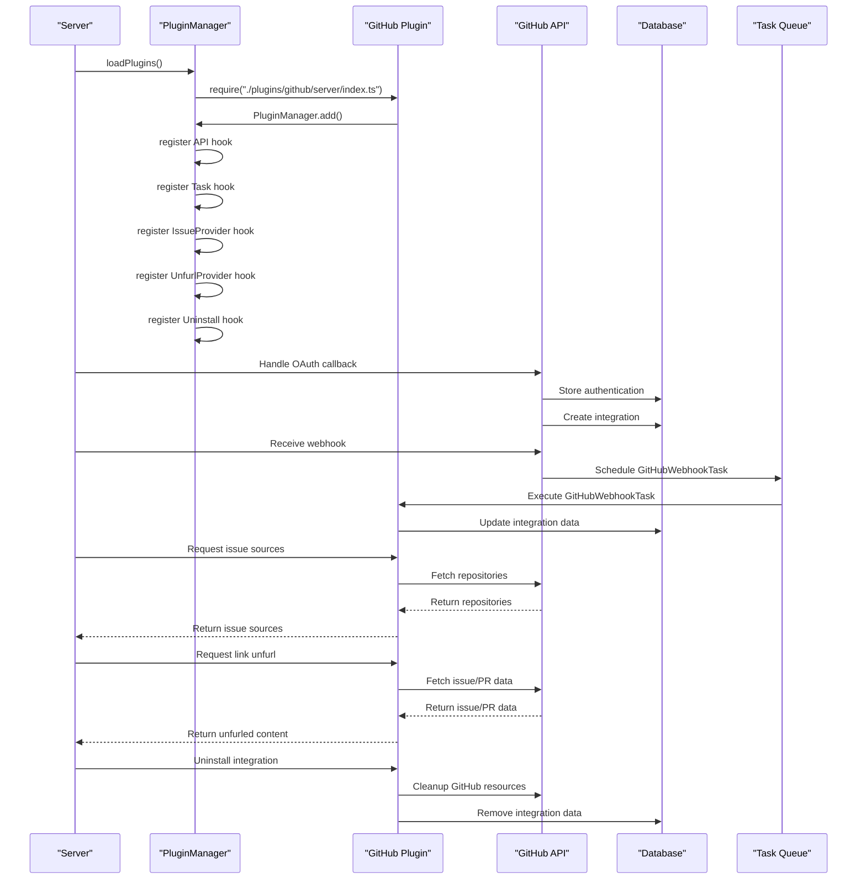

**Diagram sources**
- [plugins/github/server/index.ts](file://plugins/github/server/index.ts)
- [plugins/github/server/api/github.ts](file://plugins/github/server/api/github.ts)
- [plugins/github/server/GitHubIssueProvider.ts](file://plugins/github/server/GitHubIssueProvider.ts)

**Section sources**
- [plugins/github/server/index.ts](file://plugins/github/server/index.ts)
- [plugins/github/server/api/github.ts](file://plugins/github/server/api/github.ts)
- [plugins/github/server/GitHubIssueProvider.ts](file://plugins/github/server/GitHubIssueProvider.ts)

## Dependency Analysis
The plugin system in baozi has a well-defined dependency structure that ensures plugins are loaded and initialized correctly.

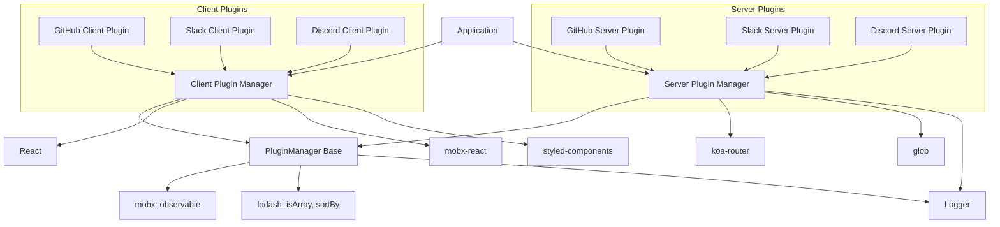

**Diagram sources**
- [app/utils/PluginManager.ts](file://app/utils/PluginManager.ts)
- [server/utils/PluginManager.ts](file://server/utils/PluginManager.ts)

**Section sources**
- [app/utils/PluginManager.ts](file://app/utils/PluginManager.ts)
- [server/utils/PluginManager.ts](file://server/utils/PluginManager.ts)

## Performance Considerations
The plugin system is designed with performance in mind, using lazy loading and efficient registration mechanisms to minimize startup time and memory usage.

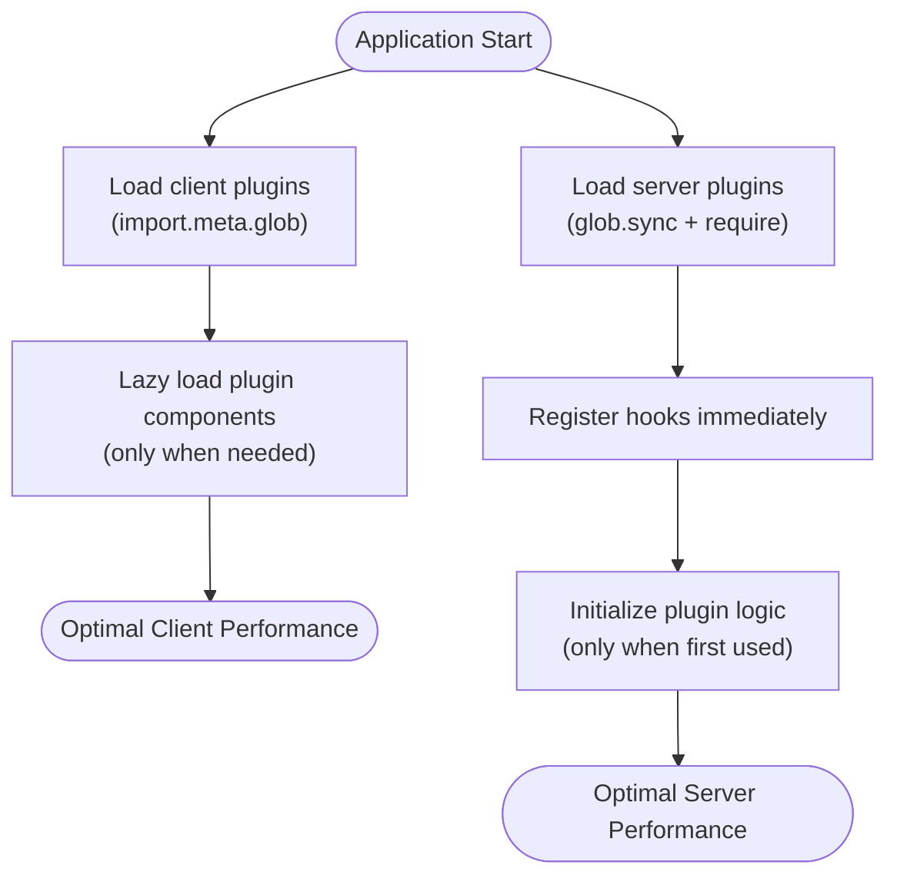

**Diagram sources**
- [app/utils/PluginManager.ts](file://app/utils/PluginManager.ts)
- [server/utils/PluginManager.ts](file://server/utils/PluginManager.ts)

**Section sources**
- [app/utils/PluginManager.ts](file://app/utils/PluginManager.ts)
- [server/utils/PluginManager.ts](file://server/utils/PluginManager.ts)

## Troubleshooting Guide
This section provides guidance for common issues encountered during plugin development.

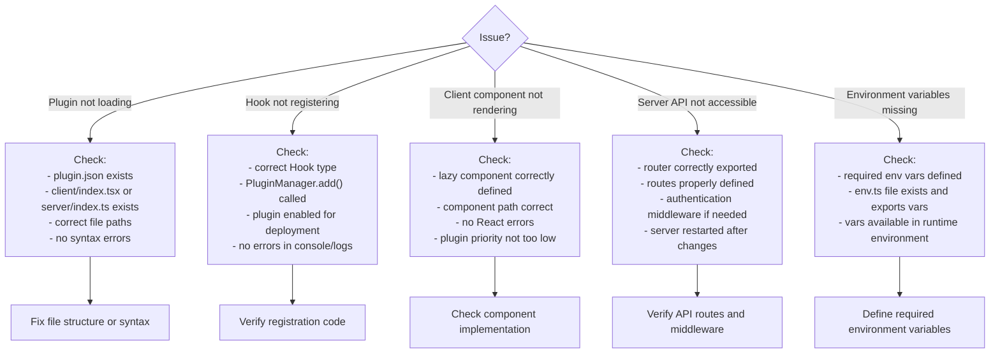

**Diagram sources**
- [app/utils/PluginManager.ts](file://app/utils/PluginManager.ts)
- [server/utils/PluginManager.ts](file://server/utils/PluginManager.ts)

**Section sources**
- [app/utils/PluginManager.ts](file://app/utils/PluginManager.ts)
- [server/utils/PluginManager.ts](file://server/utils/PluginManager.ts)

## Conclusion
The baozi plugin system provides a robust and flexible framework for extending the application's functionality. By following the patterns and practices outlined in this guide, developers can create plugins that seamlessly integrate with the core application, providing valuable features to users. The clear separation between client and server components, combined with the hook-based registration system, makes it easy to develop, test, and deploy plugins that enhance the baozi experience.