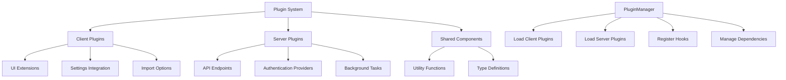
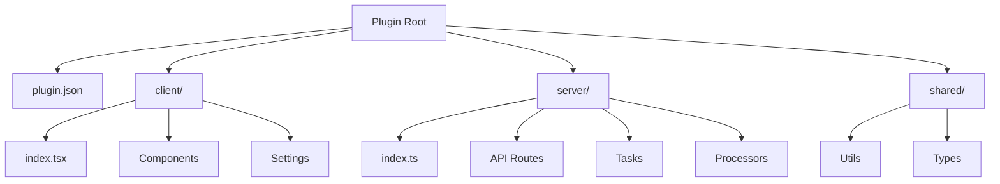
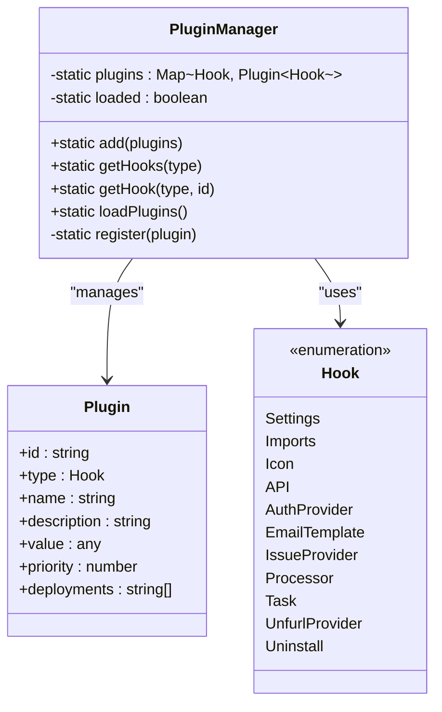
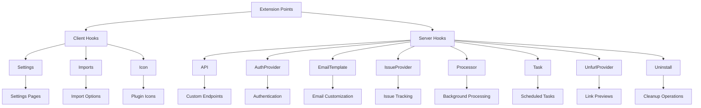
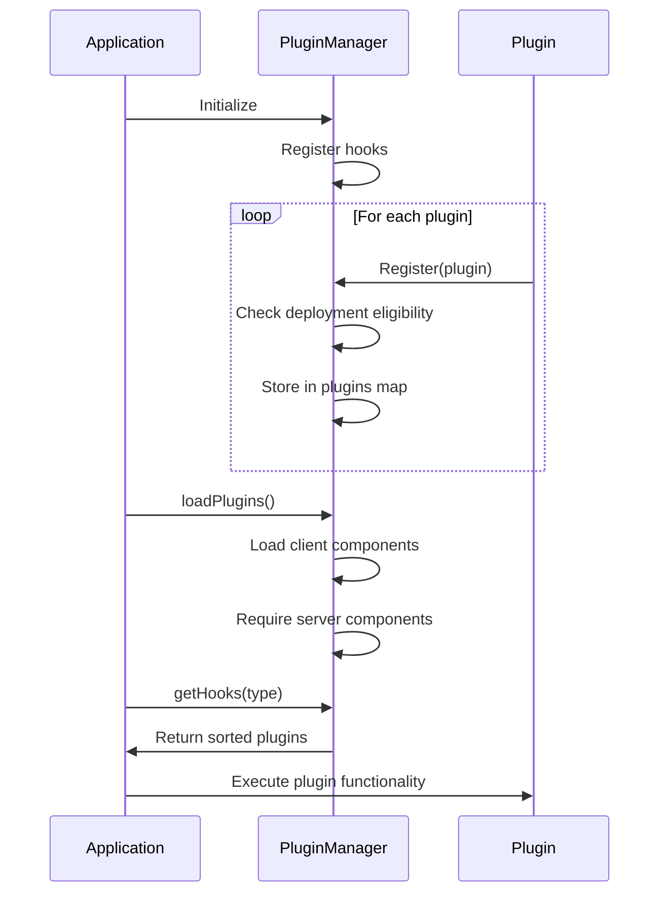
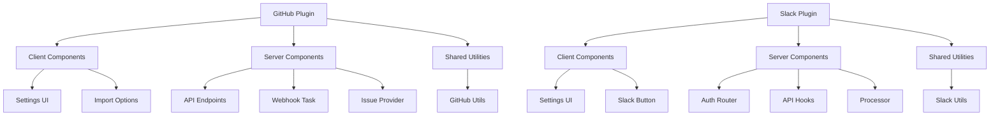

# Plugin System

<cite>
**Referenced Files in This Document**   
- [PluginManager.ts](file://app/utils/PluginManager.ts)
- [PluginManager.ts](file://server/utils/PluginManager.ts)
- [plugin.json](file://plugins/github/plugin.json)
- [plugin.json](file://plugins/slack/plugin.json)
- [index.ts](file://plugins/github/server/index.ts)
- [index.ts](file://plugins/slack/server/index.ts)
- [GitHubIssueProvider.ts](file://plugins/github/server/GitHubIssueProvider.ts)
- [PluginIcon.tsx](file://app/components/PluginIcon.tsx)
</cite>

## Table of Contents
1. [Introduction](#introduction)
2. [Plugin Architecture Overview](#plugin-architecture-overview)
3. [Plugin Structure and Components](#plugin-structure-and-components)
4. [PluginManager Implementation](#pluginmanager-implementation)
5. [Extension Points and Integrations](#extension-points-and-integrations)
6. [Hook System and Plugin Lifecycle](#hook-system-and-plugin-lifecycle)
7. [Security and Deployment Considerations](#security-and-deployment-considerations)
8. [Practical Examples](#practical-examples)
9. [Conclusion](#conclusion)

## Introduction

The baozi application features a robust plugin system that enables extensibility through both client and server components. This architecture allows developers to extend functionality by creating plugins that integrate with various parts of the application lifecycle. The plugin system supports multiple extension points including authentication providers, email templates, issue trackers, and storage providers. Plugins are organized in the `plugins/` directory with separate client, server, and shared components, enabling both frontend and backend extensions. The system uses a hook-based integration model that allows plugins to register functionality at specific points in the application. This document provides comprehensive coverage of the plugin architecture, implementation details, and practical usage examples.

## Plugin Architecture Overview

The plugin system in baozi follows a modular architecture that separates client and server concerns while providing a unified interface for extension. The architecture consists of three main components: the PluginManager, plugin definitions, and extension points. The system is designed to be deployment-aware, allowing plugins to be enabled or disabled based on the deployment environment (cloud, community, or enterprise). Client plugins are loaded asynchronously using dynamic imports, while server plugins are loaded synchronously during application startup. The architecture supports both UI extensions (such as settings pages and import options) and backend integrations (such as authentication providers and API endpoints). This separation of concerns allows for flexible extension of the application without modifying the core codebase.

**Diagram sources**
- [PluginManager.ts](file://app/utils/PluginManager.ts)
- [PluginManager.ts](file://server/utils/PluginManager.ts)

**Section sources**
- [PluginManager.ts](file://app/utils/PluginManager.ts)
- [PluginManager.ts](file://server/utils/PluginManager.ts)

## Plugin Structure and Components

Plugins in the baozi application follow a standardized directory structure that organizes components into client, server, and shared directories. Each plugin contains a `plugin.json` file that defines metadata such as the plugin ID, name, priority, and description. The client directory contains React components and UI extensions that integrate with the frontend, while the server directory contains backend logic, API routes, and service integrations. The shared directory contains code that can be used by both client and server components, such as utility functions and type definitions. This structure enables clean separation of concerns and facilitates code reuse across the application. Plugins can include various components such as settings pages, import options, authentication providers, and API endpoints, all registered through the hook system.

**Diagram sources**
- [plugin.json](file://plugins/github/plugin.json)
- [plugin.json](file://plugins/slack/plugin.json)

**Section sources**
- [plugin.json](file://plugins/github/plugin.json)
- [plugin.json](file://plugins/slack/plugin.json)

## PluginManager Implementation

The PluginManager is implemented separately for client and server environments, with each implementation handling the specific requirements of its execution context. The client-side PluginManager uses MobX observables to manage plugin state and provides reactive hooks for accessing plugin values. It loads client components asynchronously using dynamic imports, which improves application startup performance. The server-side PluginManager uses Node.js's require system to load server components synchronously during application initialization. Both implementations share a common plugin registration interface but differ in their loading strategies and dependency management. The PluginManager supports priority-based ordering of plugins, allowing critical extensions to execute before others. It also includes deployment filtering, enabling plugins to be restricted to specific deployment environments.

**Diagram sources**
- [PluginManager.ts](file://app/utils/PluginManager.ts)
- [PluginManager.ts](file://server/utils/PluginManager.ts)

**Section sources**
- [PluginManager.ts](file://app/utils/PluginManager.ts)
- [PluginManager.ts](file://server/utils/PluginManager.ts)

## Extension Points and Integrations

The plugin system provides multiple extension points that allow plugins to integrate with different aspects of the application. These extension points, known as hooks, include UI extensions such as settings pages and import options, as well as backend integrations like authentication providers and API endpoints. The Settings hook allows plugins to add configuration pages to the application's settings interface, while the Imports hook enables integration with external content sources. Server-side hooks include API for adding custom endpoints, AuthProvider for implementing authentication methods, and IssueProvider for integrating with issue tracking systems. The system also supports background processing through Processor and Task hooks, enabling asynchronous operations. These extension points provide a comprehensive interface for extending the application's functionality in both the frontend and backend.

**Diagram sources**
- [PluginManager.ts](file://app/utils/PluginManager.ts)
- [PluginManager.ts](file://server/utils/PluginManager.ts)

**Section sources**
- [PluginManager.ts](file://app/utils/PluginManager.ts)
- [PluginManager.ts](file://server/utils/PluginManager.ts)

## Hook System and Plugin Lifecycle

The hook system in baozi's plugin architecture provides a structured way for plugins to integrate with the application at specific points in the execution lifecycle. Each hook represents a specific extension point, and plugins register themselves with these hooks to provide functionality. The client-side PluginManager uses the `usePluginValue` hook to access registered plugin values reactively, while the server-side manager uses synchronous registration during startup. The plugin lifecycle begins with registration, where plugins are added to the manager and filtered based on deployment environment. During application initialization, client plugins are loaded asynchronously, while server plugins are loaded synchronously. The system maintains plugin priority, ensuring that higher-priority extensions are processed first. This lifecycle management ensures that plugins are properly initialized and available when needed by the application.

**Diagram sources**
- [PluginManager.ts](file://app/utils/PluginManager.ts)
- [PluginManager.ts](file://server/utils/PluginManager.ts)

**Section sources**
- [PluginManager.ts](file://app/utils/PluginManager.ts)
- [PluginManager.ts](file://server/utils/PluginManager.ts)

## Security and Deployment Considerations

The plugin system incorporates several security and deployment considerations to ensure safe and reliable operation. Plugins can be restricted to specific deployment environments through the deployments property, allowing different functionality in cloud, community, and enterprise versions. The system includes environment variable checks to enable or disable plugins based on configuration, preventing unauthorized access to sensitive integrations. Server-side plugins are loaded from the build directory, ensuring that only compiled and verified code is executed. The PluginManager includes logging of plugin registration, which aids in monitoring and debugging. Additionally, the system uses priority-based execution ordering, which can be used to ensure that security-critical plugins are loaded first. These considerations help maintain the integrity and security of the application while allowing flexible extension.

**Section sources**
- [PluginManager.ts](file://app/utils/PluginManager.ts)
- [PluginManager.ts](file://server/utils/PluginManager.ts)

## Practical Examples

Several practical examples demonstrate the plugin system's capabilities in the baozi application. The GitHub plugin integrates with GitHub's API to provide issue tracking, link unfurling, and webhook handling. It registers multiple hooks including API for custom endpoints, IssueProvider for issue source management, and UnfurlProvider for link previews. The Slack plugin adds Slack authentication, slash command support, and link unfurling by registering AuthProvider, API, and Processor hooks. The Google Drive plugin enables file attachment and storage integration. These plugins follow the standard structure with client components for UI integration, server components for backend functionality, and shared utilities. The plugin.json files define metadata and priority, ensuring proper integration with the application. These examples illustrate how the plugin system enables comprehensive integration with external services while maintaining a consistent interface.

**Diagram sources**
- [index.ts](file://plugins/github/server/index.ts)
- [index.ts](file://plugins/slack/server/index.ts)
- [GitHubIssueProvider.ts](file://plugins/github/server/GitHubIssueProvider.ts)

**Section sources**
- [index.ts](file://plugins/github/server/index.ts)
- [index.ts](file://plugins/slack/server/index.ts)
- [GitHubIssueProvider.ts](file://plugins/github/server/GitHubIssueProvider.ts)

## Conclusion

The plugin system in the baozi application provides a comprehensive and flexible architecture for extending functionality through client and server components. By leveraging the PluginManager implementation in both server/utils/ and app/utils/, developers can create rich integrations that enhance the application's capabilities. The standardized plugin structure in the plugins/ directory with client, server, and shared components enables clean separation of concerns and promotes code reuse. The hook system provides well-defined extension points for authentication providers, email templates, issue trackers, and storage providers, allowing plugins to integrate seamlessly with the application lifecycle. This architecture supports both simple UI extensions and complex backend integrations, making it a powerful tool for extending the application's functionality. The system's attention to security, deployment considerations, and lifecycle management ensures reliable and maintainable plugin operation.