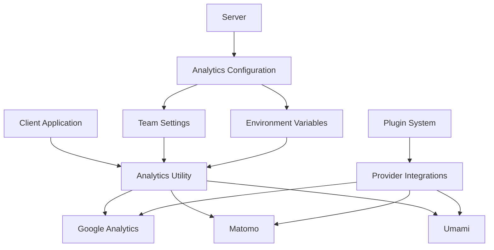
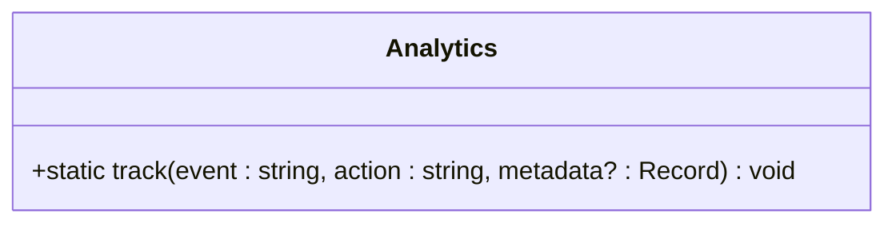
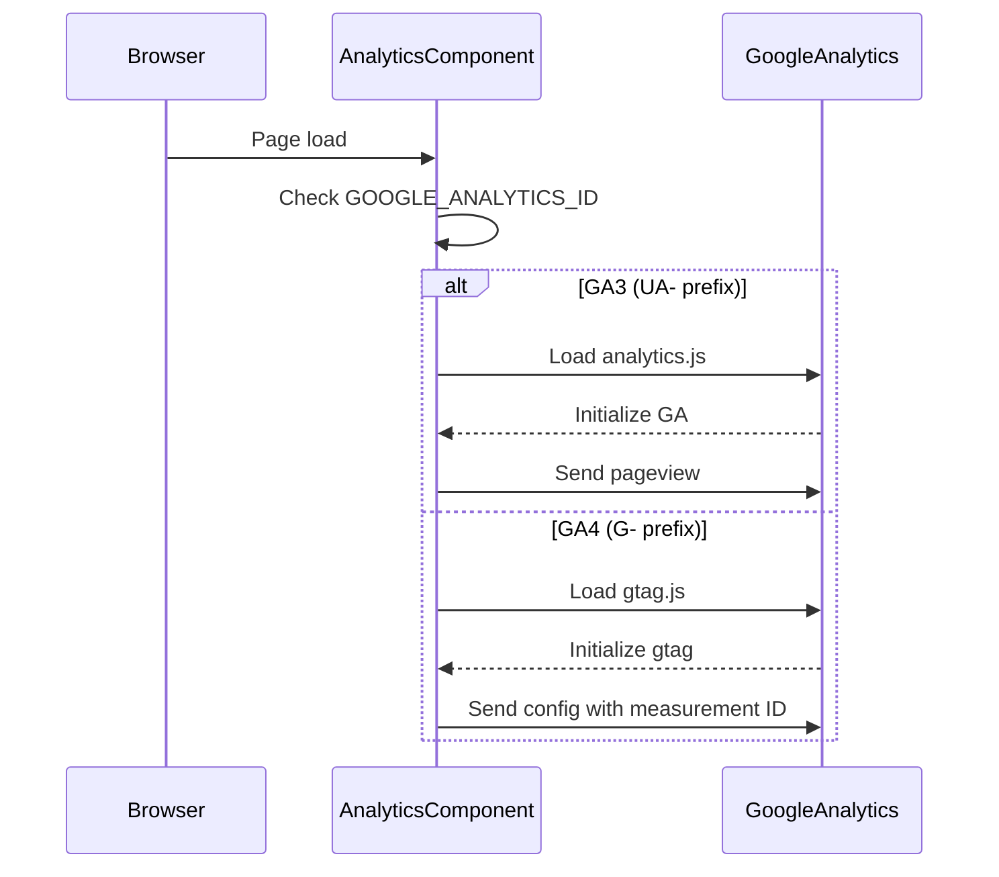
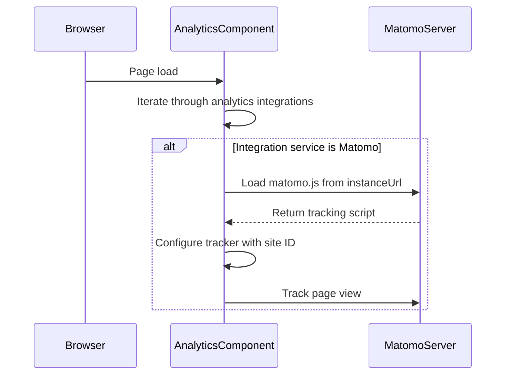
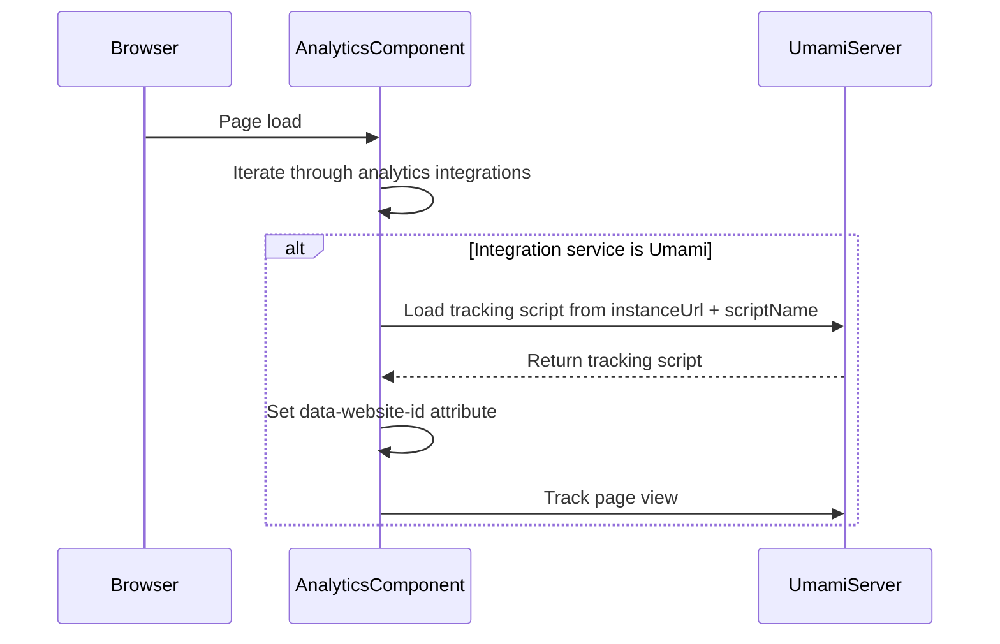
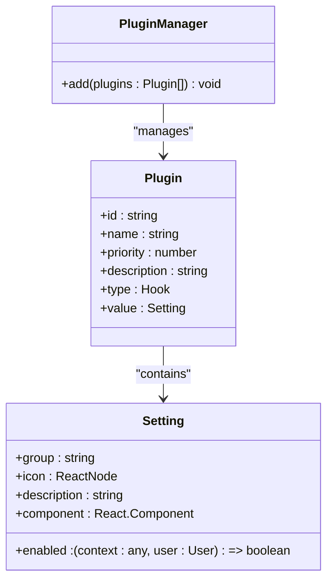
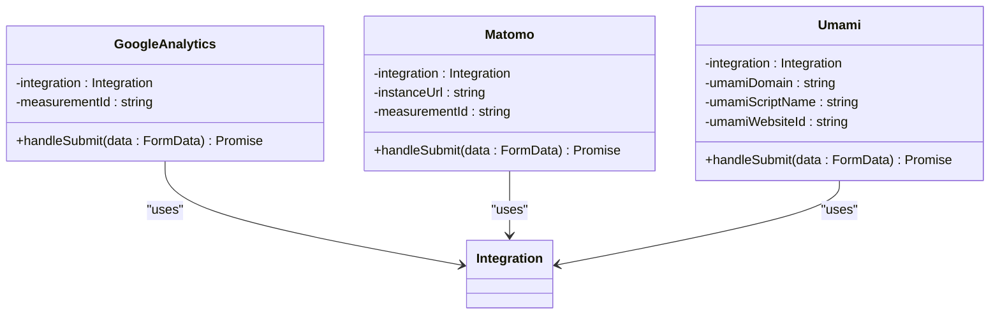
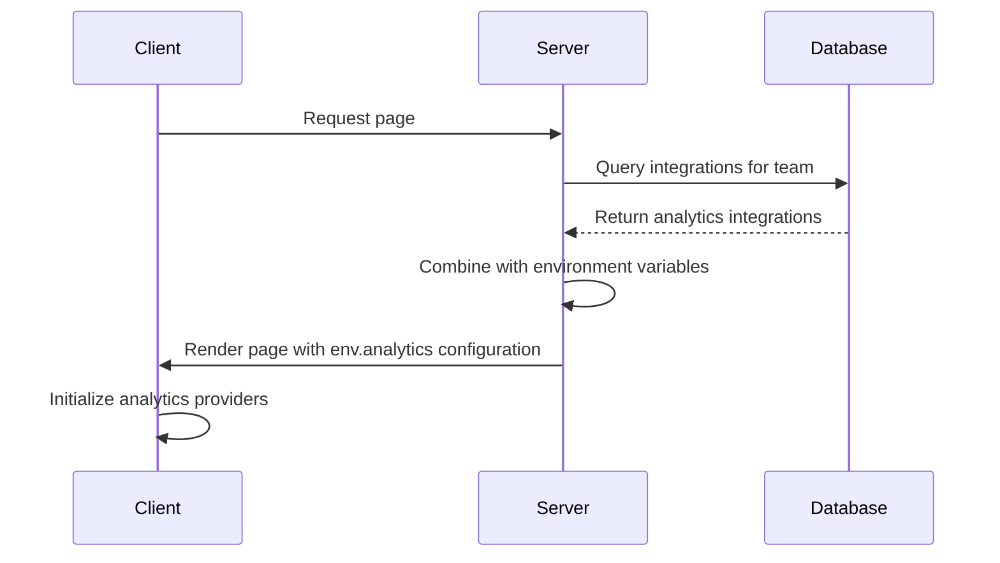
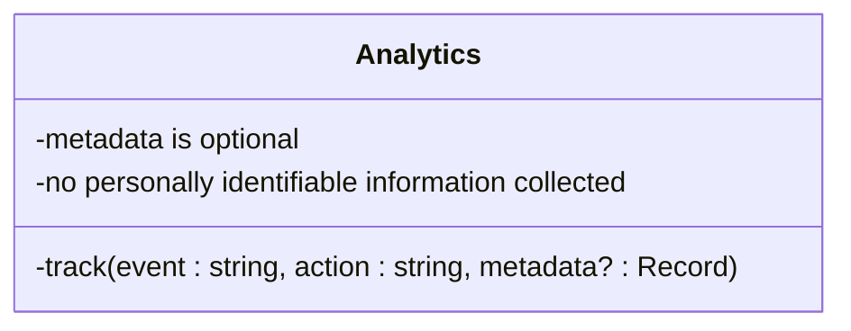
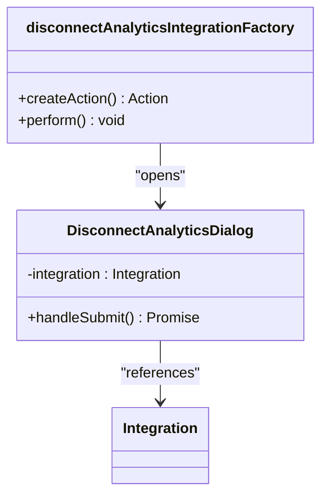

# Analytics Integrations

<cite>
**Referenced Files in This Document**   
- [Analytics.ts](file://app/utils/Analytics.ts)
- [Analytics.tsx](file://app/components/Analytics.tsx)
- [types.ts](file://shared/types.ts)
- [env.ts](file://server/env.ts)
- [app.ts](file://server/routes/app.ts)
- [index.ts](file://server/routes/index.ts)
- [googleanalytics/plugin.json](file://plugins/googleanalytics/plugin.json)
- [matomo/plugin.json](file://plugins/matomo/plugin.json)
- [umami/plugin.json](file://plugins/umami/plugin.json)
- [Settings.tsx](file://plugins/googleanalytics/client/Settings.tsx)
- [Settings.tsx](file://plugins/matomo/client/Settings.tsx)
- [Settings.tsx](file://plugins/umami/client/Settings.tsx)
- [index.tsx](file://plugins/googleanalytics/client/index.tsx)
- [index.tsx](file://plugins/matomo/client/index.tsx)
- [index.tsx](file://plugins/umami/client/index.tsx)
- [integrations.tsx](file://app/actions/definitions/integrations.tsx)
- [DisconnectAnalyticsDialog.tsx](file://app/components/DisconnectAnalyticsDialog.tsx)
</cite>

## Table of Contents
1. [Introduction](#introduction)
2. [Core Analytics Architecture](#core-analytics-architecture)
3. [Provider-Specific Implementations](#provider-specific-implementations)
4. [Configuration and Settings UI](#configuration-and-settings-ui)
5. [Event Tracking and Instrumentation](#event-tracking-and-instrumentation)
6. [Privacy and Compliance](#privacy-and-compliance)
7. [Implementation Guide for New Providers](#implementation-guide-for-new-providers)
8. [Troubleshooting Common Issues](#troubleshooting-common-issues)
9. [Conclusion](#conclusion)

## Introduction

The baozi application provides a robust analytics integration framework that enables organizations to track user interactions, page views, and system events through various third-party analytics providers. This document details the implementation of analytics plugins for Google Analytics, Matomo, and Umami, explaining how these integrations hook into the centralized Analytics utility. The system is designed to be extensible, privacy-conscious, and easy to configure, allowing teams to gain insights into document adoption and user engagement while maintaining compliance with data protection regulations.

The analytics framework supports both server-side and client-side tracking, with configuration options available through both environment variables and a user interface. The implementation prioritizes data ownership, allowing self-hosted solutions like Matomo and Umami to give organizations complete control over their analytics data.

**Section sources**
- [Analytics.ts](file://app/utils/Analytics.ts#L1-L31)
- [Analytics.tsx](file://app/components/Analytics.tsx#L1-L131)

## Core Analytics Architecture

The analytics system in baozi follows a centralized utility pattern with provider-specific initialization. The architecture consists of several key components that work together to deliver tracking functionality across the application.



**Diagram sources**
- [Analytics.ts](file://app/utils/Analytics.ts#L4-L31)
- [Analytics.tsx](file://app/components/Analytics.tsx#L12-L127)
- [types.ts](file://shared/types.ts#L107-L120)

The core of the analytics system is implemented in two main components: the `Analytics` utility class and the `Analytics` React component. The utility class provides a static `track` method for sending events, while the component handles the initialization of analytics scripts based on configuration.

The `Analytics` utility class (located in `app/utils/Analytics.ts`) serves as the central interface for event tracking. It supports both Google Analytics 3 (GA3) and Google Analytics 4 (GA4) through different mechanisms:



**Diagram sources**
- [Analytics.ts](file://app/utils/Analytics.ts#L4-L31)

The React component (located in `app/components/Analytics.tsx`) is responsible for initializing the analytics scripts based on the current team's configuration and environment variables. It uses React's `useEffect` hooks to load the appropriate tracking scripts for each enabled provider.

**Section sources**
- [Analytics.ts](file://app/utils/Analytics.ts#L4-L31)
- [Analytics.tsx](file://app/components/Analytics.tsx#L12-L127)

## Provider-Specific Implementations

### Google Analytics

Google Analytics integration supports both GA3 (Universal Analytics) and GA4 (Google Analytics 4) implementations. The system checks for the presence of a Google Analytics ID in the environment variables and initializes the appropriate tracking script.



**Diagram sources**
- [Analytics.tsx](file://app/components/Analytics.tsx#L14-L81)
- [env.ts](file://server/env.ts#L493-L497)

The implementation includes privacy considerations such as disabling Google signals and restricted data processing by default, aligning with GDPR compliance requirements.

### Matomo

Matomo integration provides a self-hosted analytics solution that gives organizations complete control over their data. The implementation dynamically loads the Matomo tracking script from the configured instance URL.



**Diagram sources**
- [Analytics.tsx](file://app/components/Analytics.tsx#L83-L106)

The Matomo implementation respects the organization's instance configuration, using the `instanceUrl` and `measurementId` (site ID) from the integration settings to properly configure the tracker.

### Umami

Umami integration provides a privacy-focused, self-hosted analytics solution. The implementation injects the Umami script into the page header with the appropriate configuration parameters.



**Diagram sources**
- [Analytics.tsx](file://app/components/Analytics.tsx#L109-L124)

The Umami implementation allows for flexible script configuration, supporting custom script names and domains to accommodate various deployment scenarios.

**Section sources**
- [Analytics.tsx](file://app/components/Analytics.tsx#L14-L124)

## Configuration and Settings UI

### Plugin Architecture

The analytics plugins are implemented using a modular plugin architecture that allows for easy extension and configuration. Each analytics provider is implemented as a separate plugin with its own configuration.



**Diagram sources**
- [index.tsx](file://plugins/googleanalytics/client/index.tsx#L6-L18)
- [index.tsx](file://plugins/matomo/client/index.tsx#L7-L20)
- [index.tsx](file://plugins/umami/client/index.tsx#L7-L20)

The plugin system uses the `PluginManager` to register analytics integrations, specifying the settings group, icon, description, and component to render in the settings UI.

### Settings Components

Each analytics provider has a dedicated settings component that allows administrators to configure the integration. These components follow a consistent pattern for form handling and state management.



**Diagram sources**
- [Settings.tsx](file://plugins/googleanalytics/client/Settings.tsx#L24-L119)
- [Settings.tsx](file://plugins/matomo/client/Settings.tsx#L24-L119)
- [Settings.tsx](file://plugins/umami/client/Settings.tsx#L24-L171)

The settings components use React Hook Form for form state management and validation, providing a smooth user experience when configuring analytics integrations.

### Configuration Model

The analytics configuration is defined in the shared types and follows a type-safe approach using TypeScript discriminated unions.

```mermaid
classDiagram
class IntegrationSettings {
+measurementId : string
+instanceUrl? : string
+scriptName? : string
}
class IntegrationType {
+Analytics = "analytics"
}
class IntegrationService {
+GoogleAnalytics = "google-analytics"
+Matomo = "matomo"
+Umami = "umami"
}
class PublicEnv {
+analytics : { service : IntegrationService, settings : IntegrationSettings<IntegrationType.Analytics> }[]
}
IntegrationSettings --> IntegrationType : "extends"
PublicEnv --> IntegrationService : "references"
PublicEnv --> IntegrationSettings : "references"
```

**Diagram sources**
- [types.ts](file://shared/types.ts#L188-L229)
- [types.ts](file://shared/types.ts#L91-L97)

The configuration model supports multiple analytics providers through an array of service configurations, allowing teams to enable multiple analytics solutions simultaneously.

**Section sources**
- [plugin.json](file://plugins/googleanalytics/plugin.json#L1-L7)
- [plugin.json](file://plugins/matomo/plugin.json#L1-L8)
- [plugin.json](file://plugins/umami/plugin.json#L1-L8)
- [Settings.tsx](file://plugins/googleanalytics/client/Settings.tsx#L24-L119)
- [Settings.tsx](file://plugins/matomo/client/Settings.tsx#L24-L119)
- [Settings.tsx](file://plugins/umami/client/Settings.tsx#L24-L171)
- [index.tsx](file://plugins/googleanalytics/client/index.tsx#L6-L18)
- [index.tsx](file://plugins/matomo/client/index.tsx#L7-L20)
- [index.tsx](file://plugins/umami/client/index.tsx#L7-L20)

## Event Tracking and Instrumentation

### Centralized Tracking Utility

The `Analytics` utility class provides a centralized interface for tracking events across the application. This utility abstracts the underlying analytics providers and provides a consistent API for event tracking.

```mermaid
classDiagram
class Analytics {
+static track(event : string, action : string, metadata? : Record<string, string>) void
}
Analytics --> "GA3" : window.ga
Analytics --> "GA4" : window.dataLayer
```

**Diagram sources**
- [Analytics.ts](file://app/utils/Analytics.ts#L4-L31)

The `track` method accepts three parameters:
- `event`: The event category (e.g., "document", "collection", "user")
- `action`: The specific action within the category (e.g., "create", "update", "delete")
- `metadata`: Optional additional data to include with the event

The utility automatically routes events to the appropriate analytics provider based on the current configuration.

### Event Routing

The event routing system supports both GA3 and GA4 implementations, ensuring compatibility with different Google Analytics configurations.

```mermaid
flowchart TD
A[track(event, action, metadata)] --> B{window.ga exists?}
B --> |Yes| C[GA3: window.ga("send", "event", event, action)]
B --> |No| D{window.dataLayer exists?}
D --> |Yes| E[GA4: window.dataLayer.push({event, action, ...metadata})]
D --> |No| F[No analytics provider available]
```

**Diagram sources**
- [Analytics.ts](file://app/utils/Analytics.ts#L11-L28)

For GA3, events are sent using the `ga` function with the "send" command and "event" hit type. For GA4, events are pushed to the `dataLayer` array with the event name, action, and any additional metadata.

### Server-Side Configuration

Analytics providers are configured on the server side based on team settings and environment variables. The configuration is then exposed to the client through the `env` object.



**Diagram sources**
- [app.ts](file://server/routes/app.ts#L154-L183)
- [index.ts](file://server/routes/index.ts#L167-L175)

The server queries the database for analytics integrations associated with the current team and combines this with any environment-level analytics configuration before sending it to the client.

**Section sources**
- [Analytics.ts](file://app/utils/Analytics.ts#L11-L28)
- [Analytics.tsx](file://app/components/Analytics.tsx#L14-L124)
- [app.ts](file://server/routes/app.ts#L154-L183)
- [index.ts](file://server/routes/index.ts#L167-L175)

## Privacy and Compliance

### Data Minimization

The analytics implementation follows data minimization principles by only collecting essential information and providing options to disable tracking. The system is designed to comply with privacy regulations such as GDPR.



**Diagram sources**
- [Analytics.ts](file://app/utils/Analytics.ts#L11-L28)

The tracking system does not collect personally identifiable information by default. Event metadata is limited to contextual information relevant to the action being performed.

### Opt-Out Mechanisms

The system provides mechanisms for users and administrators to disconnect analytics integrations, giving organizations control over their data collection practices.



**Diagram sources**
- [integrations.tsx](file://app/actions/definitions/integrations.tsx#L8-L27)
- [DisconnectAnalyticsDialog.tsx](file://app/components/DisconnectAnalyticsDialog.tsx#L15-L49)

Administrators can disconnect analytics integrations through the settings UI, which triggers a confirmation dialog before permanently removing the integration.

### Privacy by Default

The implementation includes privacy-preserving defaults for analytics providers:

- Google Analytics: Disables Google signals and restricted data processing
- Self-hosted solutions: Data remains within the organization's infrastructure
- No cross-site tracking by default

These defaults ensure that the system is compliant with privacy regulations out of the box, while still allowing organizations to customize their tracking based on their specific requirements.

**Section sources**
- [Analytics.tsx](file://app/components/Analytics.tsx#L61-L64)
- [integrations.tsx](file://app/actions/definitions/integrations.tsx#L8-L27)
- [DisconnectAnalyticsDialog.tsx](file://app/components/DisconnectAnalyticsDialog.tsx#L15-L49)

## Implementation Guide for New Providers

### Required Data Points

When implementing a new analytics provider, the following data points are required:

- **Provider ID**: A unique identifier for the provider (e.g., "google-analytics", "matomo", "umami")
- **Measurement ID**: The identifier used by the provider to track data (site ID, measurement ID, etc.)
- **Instance URL**: For self-hosted solutions, the URL of the analytics instance
- **Script configuration**: Any additional configuration needed for the tracking script

### Plugin Structure

New analytics providers should follow the established plugin structure:

1. Create a plugin directory under `plugins/`
2. Add a `plugin.json` file with basic metadata
3. Implement a client directory with:
   - `Icon.tsx`: The provider's icon
   - `Settings.tsx`: The settings component
   - `index.tsx`: The plugin registration
4. Ensure the plugin is registered with the `PluginManager`

### Integration Steps

To implement a new analytics provider:

1. Define the provider in the `IntegrationService` enum in `shared/types.ts`
2. Add the provider to the `UserCreatableIntegrationService` type
3. Create the plugin directory and files
4. Implement the settings component with form validation
5. Register the plugin with the `PluginManager`
6. Implement the tracking script loading in `app/components/Analytics.tsx`
7. Add documentation for the new provider

The implementation should follow the same patterns as existing providers, ensuring consistency in the user experience and code quality.

**Section sources**
- [types.ts](file://shared/types.ts#L122-L132)
- [Analytics.tsx](file://app/components/Analytics.tsx#L83-L124)

## Troubleshooting Common Issues

### Tracking Accuracy

Common issues with tracking accuracy include:

- **Missing page views**: Ensure the analytics component is rendered on all pages
- **Delayed event tracking**: Check network connectivity to the analytics provider
- **Duplicate events**: Verify that event tracking code is not being called multiple times

To diagnose tracking issues, use the browser's developer tools to:
1. Check the Network tab for analytics requests
2. Verify that the tracking scripts are loading correctly
3. Inspect the Console for any JavaScript errors

### Event Naming Conventions

Consistent event naming is crucial for meaningful analytics. Follow these conventions:

- Use clear, descriptive event categories (e.g., "document", "collection", "user")
- Use consistent action names (e.g., "create", "update", "delete", "view")
- Avoid abbreviations and acronyms
- Use lowercase with hyphens for multi-word names

### GDPR Compliance

To ensure GDPR compliance:

1. Provide clear information about data collection in your privacy policy
2. Allow users to opt out of tracking where required
3. Anonymize IP addresses if possible
4. Use privacy-preserving defaults
5. Regularly audit data collection practices

The baozi analytics system provides built-in compliance features, but organizations should still review their specific requirements and configure the system accordingly.

**Section sources**
- [Analytics.ts](file://app/utils/Analytics.ts#L11-L28)
- [Analytics.tsx](file://app/components/Analytics.tsx#L14-L124)

## Conclusion

The analytics integration system in baozi provides a flexible, privacy-conscious framework for tracking user interactions and system events. By supporting multiple analytics providers including Google Analytics, Matomo, and Umami, the system allows organizations to choose the solution that best fits their needs and compliance requirements.

The implementation follows best practices for modularity, with a clear separation between the centralized tracking utility and provider-specific implementations. The plugin architecture makes it easy to add new providers, while the consistent settings UI ensures a smooth experience for administrators.

Key strengths of the system include:
- Support for both cloud-based and self-hosted analytics solutions
- Privacy-preserving defaults that comply with GDPR
- Flexible configuration through both environment variables and UI settings
- Centralized event tracking with a simple, consistent API

Organizations can leverage this system to gain valuable insights into document adoption and user engagement while maintaining control over their data and compliance with privacy regulations.