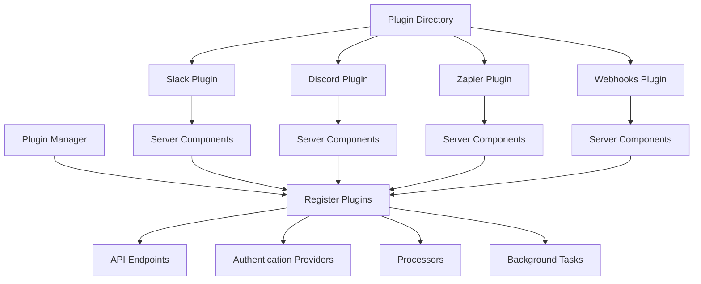
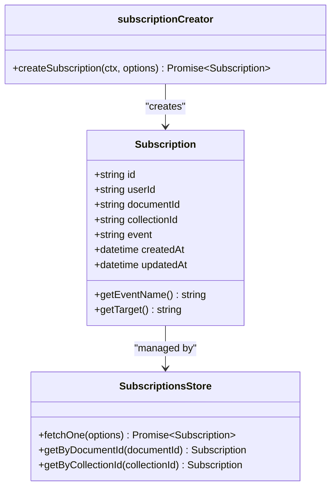
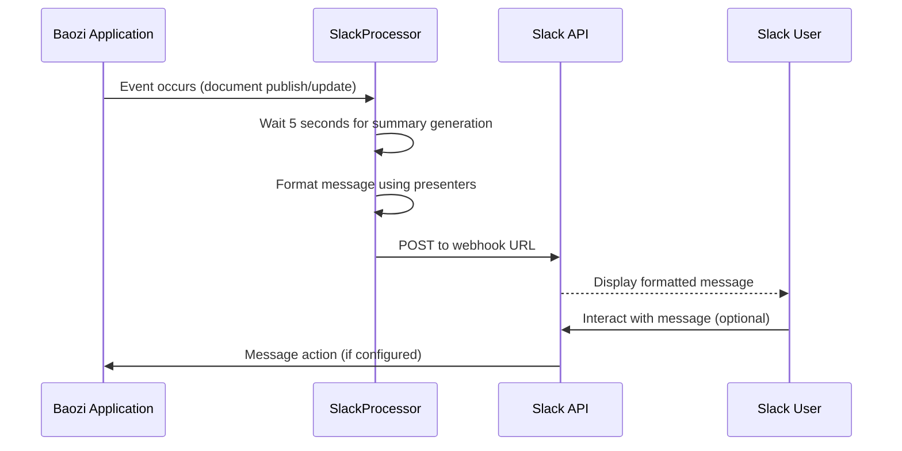
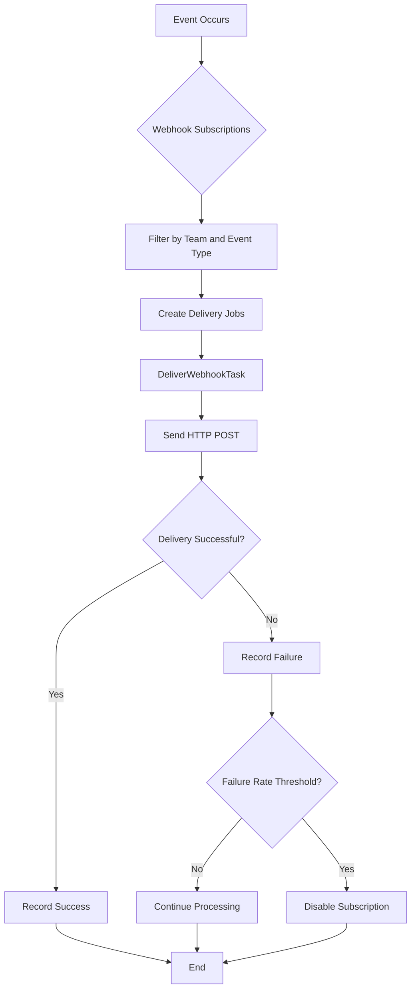
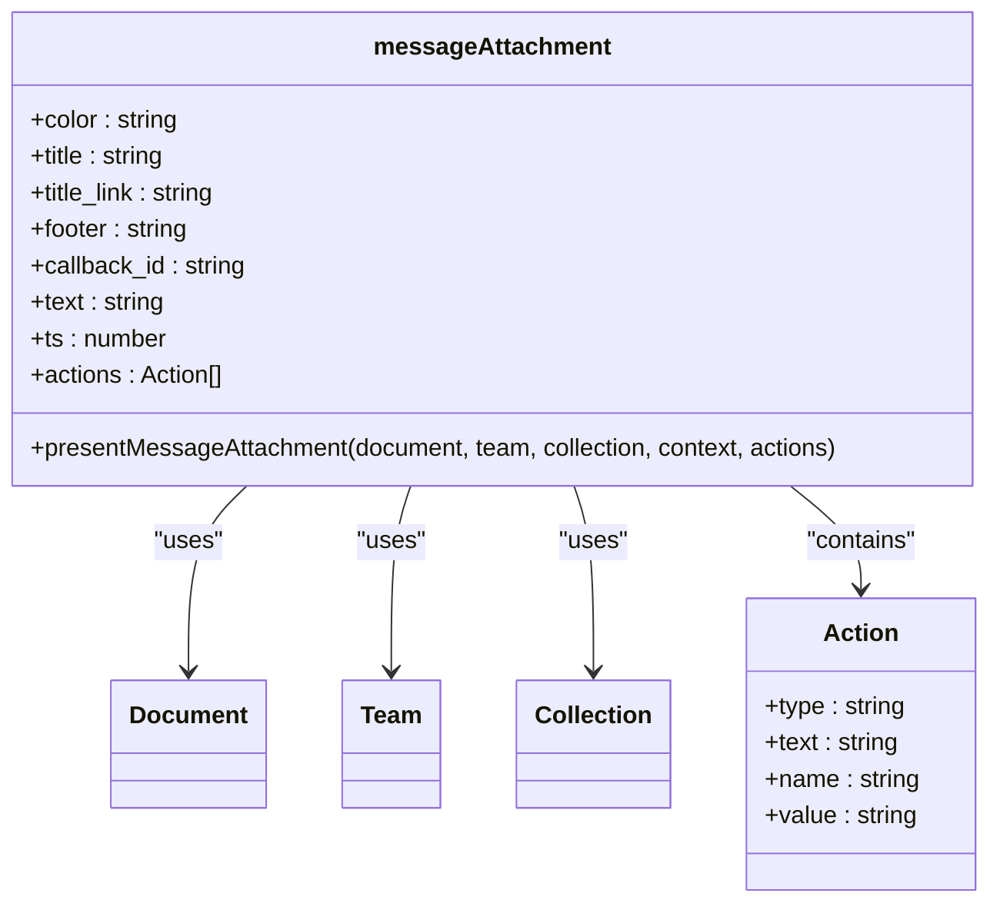
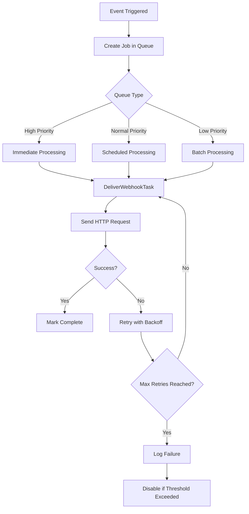

# Communication Platforms

<cite>
**Referenced Files in This Document**   
- [slack.ts](file://plugins/slack/server/slack.ts)
- [SlackProcessor.ts](file://plugins/slack/server/processors/SlackProcessor.ts)
- [messageAttachment.ts](file://plugins/slack/server/presenters/messageAttachment.ts)
- [env.ts](file://plugins/slack/server/env.ts)
- [index.ts](file://plugins/slack/server/index.ts)
- [webhooks.ts](file://plugins/webhooks/server/webhooks.ts)
- [WebhookProcessor.ts](file://plugins/webhooks/server/processors/WebhookProcessor.ts)
- [DeliverWebhookTask.ts](file://plugins/webhooks/server/tasks/DeliverWebhookTask.ts)
- [webhookSubscription.ts](file://plugins/webhooks/server/api/webhookSubscriptions.ts)
- [WebhookSubscription.ts](file://server/models/WebhookSubscription.ts)
- [zapier.ts](file://plugins/zapier/server/zapier.ts)
- [discord.ts](file://plugins/discord/server/discord.ts)
</cite>

## Table of Contents
1. [Introduction](#introduction)
2. [Plugin Architecture](#plugin-architecture)
3. [Event Subscription System](#event-subscription-system)
4. [Slack Integration](#slack-integration)
5. [Discord Integration](#discord-integration)
6. [Zapier Integration](#zapier-integration)
7. [Webhook Endpoints](#webhook-endpoints)
8. [Message Formatting and Presenters](#message-formatting-and-presenters)
9. [Delivery Mechanisms and Background Jobs](#delivery-mechanisms-and-background-jobs)
10. [Configuration and Authentication](#configuration-and-authentication)
11. [Common Issues and Troubleshooting](#common-issues-and-troubleshooting)
12. [Implementing New Integrations](#implementing-new-integrations)
13. [Conclusion](#conclusion)

## Introduction
The baozi application provides robust communication platform integrations through a plugin-based architecture that enables notifications, workflow automation, and cross-platform messaging. This documentation details the implementation of plugins for Slack, Discord, Zapier, and generic webhook endpoints, explaining how these integrations facilitate real-time communication between the application and external platforms. The system leverages event-driven architecture, background job processing, and message formatting through presenters to deliver consistent and reliable notifications. These integrations allow teams to stay informed about document changes, user activities, and other system events directly within their preferred communication channels, enhancing collaboration and workflow efficiency.

**Section sources**
- [slack.ts](file://plugins/slack/server/slack.ts#L1-L100)
- [webhooks.ts](file://plugins/webhooks/server/webhooks.ts#L1-L50)

## Plugin Architecture

The baozi application implements a modular plugin architecture that allows for extensible communication platform integrations. The system uses a server-side plugin manager that registers different types of plugins based on their functionality. Each communication platform is implemented as a separate plugin with its own server components, configuration, and integration logic. The plugin system supports various hook types including API endpoints, authentication providers, processors, and background tasks. When a plugin is enabled, it registers its components with the PluginManager, which then makes them available throughout the application. This architecture allows for clean separation of concerns and enables new communication platforms to be added without modifying the core application code. The plugin manager handles loading all server components from the plugins directory during application startup, ensuring that all integrations are properly initialized.

**Diagram sources**
- [PluginManager.ts](file://server/utils/PluginManager.ts#L1-L134)
- [index.ts](file://plugins/slack/server/index.ts#L1-L28)

**Section sources**
- [PluginManager.ts](file://server/utils/PluginManager.ts#L1-L134)
- [index.ts](file://plugins/slack/server/index.ts#L1-L28)

## Event Subscription System

The event subscription system in baozi enables users to receive notifications for specific events within the application. Users can subscribe to events at both the document and collection levels, allowing for granular control over notification preferences. The system tracks subscriptions in the database and associates them with specific users, documents, or collections. When an event occurs that matches a user's subscription criteria, the system triggers the appropriate notification delivery mechanism. The subscription model supports different event types including document creation, updates, and deletions, as well as user and collection-level events. This flexible subscription system forms the foundation for all communication platform integrations, ensuring that relevant events are delivered to the appropriate external services based on user preferences and configuration.

**Diagram sources**
- [Subscription.ts](file://server/models/Subscription.ts#L1-L100)
- [SubscriptionsStore.ts](file://app/stores/SubscriptionsStore.ts#L1-L57)
- [subscriptionCreator.ts](file://server/commands/subscriptionCreator.ts#L1-L50)

**Section sources**
- [Subscription.ts](file://server/models/Subscription.ts#L1-L100)
- [SubscriptionsStore.ts](file://app/stores/SubscriptionsStore.ts#L1-L57)
- [subscriptionCreator.ts](file://server/commands/subscriptionCreator.ts#L1-L50)

## Slack Integration

The Slack integration in baozi provides comprehensive notification capabilities that connect the application with Slack workspaces. The integration is implemented as a server plugin that registers authentication routes, API endpoints, and a processor for handling events. When enabled, the integration allows users to authenticate their Slack accounts and configure webhook URLs for receiving notifications. The system supports posting messages to specific channels when documents are published or updated within designated collections. Configuration options include enabling message actions that allow users to post content directly to Slack from search results. The integration uses Slack's message attachment format to present rich content including document titles, summaries, and metadata. Events are processed through a background job queue to ensure reliable delivery even during periods of high activity.

**Diagram sources**
- [SlackProcessor.ts](file://plugins/slack/server/processors/SlackProcessor.ts#L1-L148)
- [messageAttachment.ts](file://plugins/slack/server/presenters/messageAttachment.ts#L1-L34)
- [env.ts](file://plugins/slack/server/env.ts#L48-L59)

**Section sources**
- [SlackProcessor.ts](file://plugins/slack/server/processors/SlackProcessor.ts#L1-L148)
- [messageAttachment.ts](file://plugins/slack/server/presenters/messageAttachment.ts#L1-L34)
- [env.ts](file://plugins/slack/server/env.ts#L48-L59)

## Discord Integration

The Discord integration enables baozi users to connect their workspaces with Discord servers for real-time notifications and updates. Implemented as a dedicated plugin, the integration provides authentication capabilities that allow users to link their Discord accounts to the application. The system uses Discord's OAuth2 flow to securely authenticate users and obtain necessary permissions. Once configured, the integration can send notifications to designated Discord channels when important events occur within the application, such as document updates or user activities. The implementation includes error handling mechanisms to manage common issues like rate limiting and invalid webhook URLs. Configuration options allow administrators to control which events trigger notifications and where they are delivered within their Discord server structure.

**Section sources**
- [discord.ts](file://plugins/discord/server/discord.ts#L1-L50)
- [env.ts](file://plugins/discord/server/env.ts#L1-L32)
- [errors.ts](file://plugins/discord/server/errors.ts#L1-L16)

## Zapier Integration

The Zapier integration in baozi provides a bridge between the application and the extensive Zapier automation platform, enabling users to connect with thousands of other applications. The integration is implemented as a plugin that adds a settings interface for configuring Zapier connections. When enabled, it allows users to create "Zaps" that trigger actions in other applications based on events in baozi. The integration leverages Zapier's webhook system to receive notifications about document changes, user activities, and other system events. Configuration options include authentication tokens and connection settings that ensure secure communication between the platforms. This integration significantly extends the functionality of baozi by enabling complex workflow automations that span multiple applications, allowing users to build custom workflows that fit their specific business processes.

**Section sources**
- [zapier.ts](file://plugins/zapier/server/zapier.ts#L1-L30)
- [Settings.tsx](file://plugins/zapier/client/Settings.tsx#L1-L53)
- [plugin.json](file://plugins/zapier/plugin.json#L1-L7)

## Webhook Endpoints

The webhook endpoints in baozi provide a flexible mechanism for integrating with any external service that can receive HTTP POST requests. The system allows users to create webhook subscriptions that specify a target URL and the events they want to receive notifications for. Each subscription can be configured to receive all events or a specific subset, providing granular control over data flow. The implementation includes security features such as payload signing using HMAC signatures to verify the authenticity of delivered messages. Webhook deliveries are processed through a background job queue to ensure reliable delivery and handle potential failures gracefully. The system tracks delivery status and can automatically disable subscriptions that consistently fail, preventing unnecessary load on external services. This generic webhook system serves as the foundation for many custom integrations and provides maximum flexibility for connecting with third-party applications.

**Diagram sources**
- [WebhookProcessor.ts](file://plugins/webhooks/server/processors/WebhookProcessor.ts#L1-L35)
- [DeliverWebhookTask.ts](file://plugins/webhooks/server/tasks/DeliverWebhookTask.ts#L1-L844)
- [WebhookSubscription.ts](file://server/models/WebhookSubscription.ts#L1-L168)

**Section sources**
- [WebhookProcessor.ts](file://plugins/webhooks/server/processors/WebhookProcessor.ts#L1-L35)
- [DeliverWebhookTask.ts](file://plugins/webhooks/server/tasks/DeliverWebhookTask.ts#L1-L844)
- [WebhookSubscription.ts](file://server/models/WebhookSubscription.ts#L1-L168)

## Message Formatting and Presenters

The message formatting system in baozi uses presenter classes to transform application data into formats suitable for external communication platforms. Presenters are responsible for extracting relevant information from models like Document, Collection, and User, and structuring it according to the requirements of the target platform. For example, the Slack integration uses a message attachment presenter that formats document information with appropriate colors, titles, and links. The system handles special formatting requirements such as converting HTML bold tags to Markdown syntax for Slack messages. Presenters also manage contextual information like search result highlights and ensure that message content adheres to platform-specific limitations on length and formatting. This abstraction layer allows the core application logic to remain separate from the presentation concerns of external integrations, making it easier to support multiple platforms with consistent data formatting.

**Diagram sources**
- [messageAttachment.ts](file://plugins/slack/server/presenters/messageAttachment.ts#L1-L34)
- [Document.ts](file://server/models/Document.ts#L94-L1314)
- [Team.ts](file://server/models/Team.ts#L54-L473)

**Section sources**
- [messageAttachment.ts](file://plugins/slack/server/presenters/messageAttachment.ts#L1-L34)
- [Document.ts](file://server/models/Document.ts#L94-L1314)
- [Team.ts](file://server/models/Team.ts#L54-L473)

## Delivery Mechanisms and Background Jobs

The delivery mechanisms in baozi's communication platform integrations rely on a robust background job queue system to ensure reliable message delivery. All notifications are processed asynchronously through dedicated worker tasks that handle the actual HTTP requests to external services. This approach prevents notification delivery from blocking the main application flow and allows for better error handling and retry logic. The system uses a priority-based queue that ensures critical notifications are delivered promptly while less urgent messages are processed according to their priority level. Failed deliveries are automatically retried with exponential backoff, and the system tracks delivery statistics to identify and address persistent issues. The background job architecture also enables batch processing of notifications, reducing the load on external APIs and improving overall system performance.

**Diagram sources**
- [DeliverWebhookTask.ts](file://plugins/webhooks/server/tasks/DeliverWebhookTask.ts#L1-L844)
- [BaseTask.ts](file://server/queues/tasks/BaseTask.ts#L1-L50)
- [queue.ts](file://server/queues/queue.ts#L1-L70)

**Section sources**
- [DeliverWebhookTask.ts](file://plugins/webhooks/server/tasks/DeliverWebhookTask.ts#L1-L844)
- [BaseTask.ts](file://server/queues/tasks/BaseTask.ts#L1-L50)
- [queue.ts](file://server/queues/queue.ts#L1-L70)

## Configuration and Authentication

The configuration and authentication system for communication platform plugins in baozi provides secure and flexible options for connecting with external services. Each plugin implements environment-specific configuration through dedicated environment classes that validate and process settings like client IDs, secrets, and webhook URLs. Authentication follows industry-standard OAuth2 flows for platforms like Slack, Discord, and Google, ensuring secure credential handling without storing sensitive information in plaintext. The system uses encrypted storage for secrets and tokens, with rotation capabilities to enhance security. Configuration options are exposed through intuitive settings interfaces that guide users through the setup process. Environment variables control global settings like rate limiting, message actions, and deployment restrictions, allowing administrators to tailor the integration behavior to their specific requirements and compliance needs.

**Section sources**
- [env.ts](file://plugins/slack/server/env.ts#L1-L59)
- [env.ts](file://plugins/discord/server/env.ts#L1-L32)
- [env.ts](file://plugins/webhooks/server/env.ts#L1-L25)

## Common Issues and Troubleshooting

Common issues with communication platform integrations in baozi typically revolve around authentication, rate limiting, and message delivery reliability. Authentication failures often occur due to incorrect client credentials or expired tokens, which can be resolved by re-authenticating the connection. Rate limiting issues may arise when too many notifications are sent in a short period, particularly with platforms like Slack and Discord that have strict API limits; implementing proper queuing and batching can mitigate this. Message delivery failures can result from invalid webhook URLs, network connectivity issues, or payload size constraints; the system automatically retries failed deliveries and can disable problematic subscriptions to prevent cascading failures. Payload size limitations require careful message formatting to ensure content fits within platform constraints while maintaining readability. Monitoring delivery logs and failure rates helps identify and resolve issues before they impact users.

**Section sources**
- [DeliverWebhookTask.ts](file://plugins/webhooks/server/tasks/DeliverWebhookTask.ts#L764-L800)
- [errors.ts](file://plugins/discord/server/errors.ts#L1-L16)
- [SlackProcessor.ts](file://plugins/slack/server/processors/SlackProcessor.ts#L25-L38)

## Implementing New Integrations

Implementing new communication platform integrations in baozi follows a standardized pattern that leverages the existing plugin architecture. Developers should create a new plugin directory with server and client components, following the structure of existing integrations. The server component must register with the PluginManager using appropriate hook types such as API, Processor, or Task. The integration should implement event handling through a processor class that extends BaseProcessor and specifies the events it responds to. Message formatting should be handled by presenter classes that transform application data into the target platform's required format. Authentication flows should follow OAuth2 best practices with secure token storage. The implementation must include proper error handling and logging to facilitate troubleshooting. Configuration options should be exposed through environment variables and user-facing settings interfaces to provide flexibility and control.

**Section sources**
- [index.ts](file://plugins/slack/server/index.ts#L1-L28)
- [SlackProcessor.ts](file://plugins/slack/server/processors/SlackProcessor.ts#L1-L148)
- [BaseProcessor.ts](file://server/queues/processors/BaseProcessor.ts#L1-L17)

## Conclusion

The communication platform integrations in baozi provide a powerful and flexible system for connecting the application with external services like Slack, Discord, Zapier, and custom webhook endpoints. Through a modular plugin architecture, event-driven design, and robust background processing, the system delivers reliable notifications and enables workflow automation across platforms. The implementation demonstrates careful attention to security, reliability, and user experience, with features like encrypted credential storage, automatic retry mechanisms, and intuitive configuration interfaces. By leveraging presenters for message formatting and a centralized event subscription system, the architecture maintains clean separation between core functionality and integration-specific concerns. This design allows for easy extension with new communication platforms while ensuring consistent behavior and maintainability across all integrations.