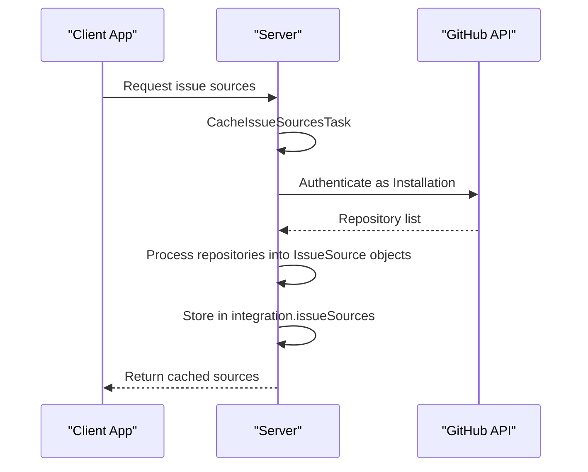
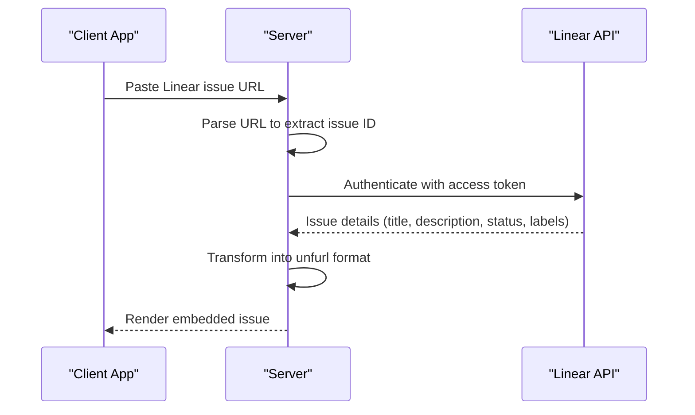
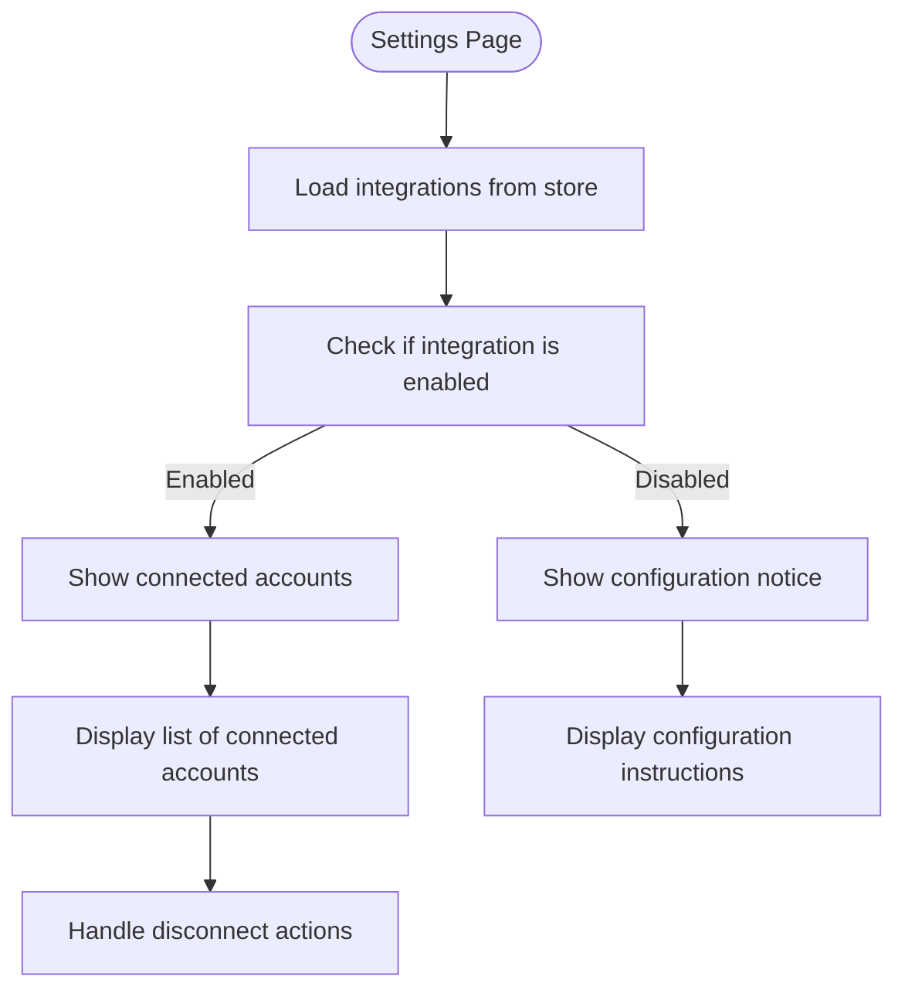

# Issue Trackers

<cite>
**Referenced Files in This Document**   
- [BaseIssueProvider.ts](file://server/utils/BaseIssueProvider.ts)
- [GitHubIssueProvider.ts](file://plugins/github/server/GitHubIssueProvider.ts)
- [github.ts](file://plugins/github/server/github.ts)
- [linear.ts](file://plugins/linear/server/linear.ts)
- [CacheIssueSourcesTask.ts](file://server/queues/tasks/CacheIssueSourcesTask.ts)
- [GitHubWebhookTask.ts](file://plugins/github/server/tasks/GitHubWebhookTask.ts)
- [Integration.ts](file://server/models/Integration.ts)
- [schema.ts](file://shared/schema.ts)
- [Settings.tsx](file://plugins/github/client/Settings.tsx)
- [Settings.tsx](file://plugins/linear/client/Settings.tsx)
- [index.ts](file://plugins/github/server/index.ts)
- [index.ts](file://plugins/linear/server/index.ts)
</cite>

## Table of Contents
1. [Introduction](#introduction)
2. [Core Architecture](#core-architecture)
3. [Implementation Details](#implementation-details)
4. [Configuration Patterns](#configuration-patterns)
5. [Common Issues and Solutions](#common-issues-and-solutions)
6. [Extending the System](#extending-the-system)
7. [Conclusion](#conclusion)

## Introduction

The baozi application provides robust integration with issue tracking systems through its plugin architecture, enabling seamless connection between documentation and development workflows. This document details the implementation of GitHub and Linear integrations, which allow users to create issues, synchronize status updates, and establish bidirectional linking between documents and tasks. The system is designed to be accessible to beginners while offering sufficient technical depth for experienced developers to extend and customize.

The integrations leverage a modular plugin system that supports real-time synchronization, webhook event handling, and rich UI components for embedding issue data directly within documents. By connecting documentation to development workflows, teams can maintain context and traceability across their entire development lifecycle.

## Core Architecture

The issue tracker integration system in baozi follows a well-defined architectural pattern centered around extensibility and separation of concerns. At its core is the `BaseIssueProvider` abstract class, which defines the contract for all issue tracker integrations.

```mermaid
classDiagram
class BaseIssueProvider {
<<abstract>>
+service : IssueTrackerIntegrationService
+constructor(service : IssueTrackerIntegrationService)
+fetchSources(integration : Integration) : Promise~IssueSource[]~
+handleWebhook(payload : Record, headers : Record) : Promise~void~
}
class GitHubIssueProvider {
+fetchSources(integration : Integration) : Promise~IssueSource[]~
+handleWebhook(payload : Record, headers : Record) : Promise~void~
+handleInstallationEvent(payload : Record, action : string) : Promise~void~
+handleInstallationRepositoriesEvent(event : InstallationRepositoriesEvent) : Promise~void~
+handleRepositoryEvent(payload : Record, action : string, hookId : string) : Promise~void~
}
class Integration {
+type : IntegrationType
+service : IntegrationService
+settings : IntegrationSettings
+events : string[]
+issueSources : IssueSource[] | null
+userId : string
+teamId : string
+collectionId : string | null
+authenticationId : string
}
class IssueSource {
+id : string
+name : string
+owner : {id : string, name : string}
+service : IssueTrackerIntegrationService
}
BaseIssueProvider <|-- GitHubIssueProvider
Integration --> IssueSource : "stores"
GitHubIssueProvider --> Integration : "uses"
```

**Diagram sources**
- [BaseIssueProvider.ts](file://server/utils/BaseIssueProvider.ts#L1-L23)
- [Integration.ts](file://server/models/Integration.ts#L25-L105)
- [schema.ts](file://shared/schema.ts#L51-L72)

**Section sources**
- [BaseIssueProvider.ts](file://server/utils/BaseIssueProvider.ts#L1-L23)
- [Integration.ts](file://server/models/Integration.ts#L25-L105)

The architecture follows these key principles:
- **Abstraction**: The `BaseIssueProvider` establishes a common interface for all issue tracker integrations
- **Separation of Concerns**: Client and server components are cleanly separated
- **Event-Driven Design**: Webhook events trigger updates and synchronization
- **Data Persistence**: Issue sources are stored in the database for offline access

The `Integration` model serves as the central entity for managing third-party service connections, storing configuration settings, authentication details, and cached issue sources. This model is enhanced with the `issueSources` field, which contains an array of `IssueSource` objects representing repositories or projects from the connected issue tracker.

## Implementation Details

### GitHub Integration

The GitHub integration is implemented through several key components that work together to provide a seamless experience. The `GitHubIssueProvider` class extends `BaseIssueProvider` and implements the specific logic for interacting with GitHub's API.



**Diagram sources**
- [GitHubIssueProvider.ts](file://plugins/github/server/GitHubIssueProvider.ts#L19-L258)
- [CacheIssueSourcesTask.ts](file://server/queues/tasks/CacheIssueSourcesTask.ts#L1-L31)

**Section sources**
- [GitHubIssueProvider.ts](file://plugins/github/server/GitHubIssueProvider.ts#L19-L258)
- [github.ts](file://plugins/github/server/github.ts#L1-L307)

The implementation includes:
- **Authentication**: Uses GitHub App authentication with installation tokens
- **Source Fetching**: Retrieves repositories accessible to the installation
- **Webhook Handling**: Processes installation, repository, and permission events
- **Real-time Updates**: Updates the `issueSources` cache when repositories are added or renamed

The `fetchSources` method authenticates as a GitHub installation and paginates through all accessible repositories, transforming them into `IssueSource` objects that are stored in the integration's `issueSources` field. This cached data enables quick access to repository information without repeatedly calling the GitHub API.

### Linear Integration

The Linear integration follows a similar pattern but adapts to Linear's GraphQL-based API and OAuth2 authentication flow. The implementation is centered around the `linear.ts` file, which contains the core logic for interacting with Linear's API.



**Diagram sources**
- [linear.ts](file://plugins/linear/server/linear.ts#L1-L264)
- [github.ts](file://plugins/github/server/github.ts#L1-L307)

**Section sources**
- [linear.ts](file://plugins/linear/server/linear.ts#L1-L264)

Key implementation aspects include:
- **OAuth2 Flow**: Implements standard authorization code grant with refresh tokens
- **Unfurling**: Converts Linear issue URLs into rich previews with status indicators
- **State Management**: Tracks workflow state and calculates completion percentage
- **Error Handling**: Gracefully handles API errors and permission issues

The integration uses Linear's SDK to interact with their API, providing type safety and convenience methods for common operations. The `unfurl` method is particularly important as it enables the embedding of Linear issues directly within documents by fetching and formatting issue data.

### UI Components and Settings

Both integrations provide comprehensive settings interfaces that allow users to manage their connections. The client-side implementations use React components that integrate with the application's store system.



**Diagram sources**
- [Settings.tsx](file://plugins/github/client/Settings.tsx#L1-L154)
- [Settings.tsx](file://plugins/linear/client/Settings.tsx#L1-L149)

**Section sources**
- [Settings.tsx](file://plugins/github/client/Settings.tsx#L1-L154)
- [Settings.tsx](file://plugins/linear/client/Settings.tsx#L1-L149)

The settings UI includes:
- Connection status indicators
- Account information with avatars
- Connection and disconnection buttons
- Error handling for authentication failures
- Responsive design for different screen sizes

## Configuration Patterns

### Workspace Mapping

The system supports multiple workspaces or organizations through careful mapping between baozi teams and external service workspaces. For GitHub, this is achieved by storing the installation account information in the integration settings:

```typescript
settings: {
  github: {
    installation: {
      id: number,
      account: {
        id: string,
        name: string,
        avatarUrl: string
      }
    }
  }
}
```

For Linear, the workspace key is stored to enable routing to the correct workspace:

```typescript
settings: {
  linear: {
    workspace: {
      key: string,
      name: string,
      logoUrl: string
    }
  }
}
```

This mapping allows users to connect multiple workspaces while ensuring that issue references are resolved correctly.

### Authentication Delegation

Both integrations use OAuth2 for authentication, but with different flows tailored to each service:

**GitHub** uses GitHub App authentication, which provides several advantages:
- Installation-based permissions
- Fine-grained access control
- Automatic permission inheritance
- Support for organization-wide installations

**Linear** uses standard OAuth2 with the following scopes:
- `read`: For reading issues and project data
- `issues:create`: For creating new issues from documents

The authentication flow follows the standard pattern:
1. User initiates connection from settings page
2. Redirected to service authorization page
3. Service redirects back with authorization code
4. Server exchanges code for access token
5. Token stored securely in database

### Permission Synchronization

The system maintains permission synchronization through several mechanisms:

1. **Webhook Events**: Both services send webhook events when permissions change
2. **Periodic Refresh**: Issue sources are refreshed periodically to detect changes
3. **On-demand Updates**: Sources are refreshed when users interact with the integration

For GitHub, the system listens to three key webhook events:
- `installation`: When new permissions are accepted
- `installation_repositories`: When repositories are added or removed
- `repository`: When repository details change (e.g., renaming)

The webhook handlers update the `issueSources` cache accordingly, ensuring that the UI always reflects the current state of the connected repositories.

## Common Issues and Solutions

### Rate Limiting

Both GitHub and Linear APIs enforce rate limits to prevent abuse. The system addresses this through several strategies:

- **Caching**: Results are cached in the database to minimize API calls
- **Pagination**: Large result sets are paginated to avoid hitting limits
- **Exponential Backoff**: Failed requests are retried with increasing delays
- **Queueing**: Non-critical operations are queued for later processing

The `CacheIssueSourcesTask` runs periodically to refresh the cache, reducing the need for real-time API calls during user interactions.

### Stale References

Stale references can occur when issues or repositories are deleted or renamed. The system handles this through:

- **Webhook Integration**: Immediate updates when changes occur
- **Validation on Access**: Checking if referenced issues still exist
- **Graceful Degradation**: Displaying appropriate messages when references are broken

For example, when a GitHub repository is renamed, the `handleRepositoryEvent` method updates the corresponding `IssueSource` in the cache, ensuring that existing references continue to work.

### Conflict Resolution

Conflicts can arise when multiple users modify the same integration settings. The system uses database transactions with row-level locking to prevent race conditions:

```typescript
await sequelize.transaction(async (transaction) => {
  await integration.reload({ 
    transaction, 
    lock: transaction.LOCK.UPDATE 
  });
  // Update integration settings
  await integration.save({ transaction });
});
```

This ensures that updates are atomic and consistent, preventing data corruption when multiple operations occur simultaneously.

## Extending the System

### Required API Endpoints

To implement a new issue tracker integration, the following API endpoints are typically required:

1. **Authentication**: OAuth2 authorization and token exchange
2. **Resource Listing**: Endpoint to list projects, repositories, or boards
3. **Resource Details**: Endpoint to retrieve specific issue or task details
4. **Creation**: Endpoint to create new issues or tasks
5. **Webhooks**: Endpoint to receive real-time updates

### Data Model Mappings

New integrations should map their data model to the existing `IssueSource` schema:

```typescript
interface IssueSource {
  id: string;           // Unique identifier
  name: string;         // Display name
  owner: {              // Organization or workspace
    id: string;
    name: string;
  };
  service: IssueTrackerIntegrationService; // Enum value
}
```

Additional service-specific data can be stored in the integration settings or retrieved on-demand.

### Real-time Update Strategies

Effective real-time updates require implementing one or more of these strategies:

1. **Webhooks**: Most efficient for real-time updates
2. **Polling**: Fallback for services without webhook support
3. **WebSocket**: For services that support persistent connections
4. **Server-Sent Events**: Alternative to WebSockets

The system should always prefer webhooks when available, as they provide immediate notifications with minimal overhead.

## Conclusion

The issue tracker integrations in baozi provide a powerful bridge between documentation and development workflows. By leveraging a modular plugin architecture, the system supports seamless integration with popular services like GitHub and Linear, enabling bidirectional linking, status synchronization, and rich embedded content.

The implementation demonstrates several best practices in integration design:
- Clear separation between client and server components
- Robust error handling and graceful degradation
- Efficient caching to minimize API usage
- Comprehensive webhook handling for real-time updates
- Secure authentication and permission management

For developers looking to extend the system, the well-defined interfaces and patterns make it straightforward to add support for additional issue trackers. The combination of accessibility for beginners and depth for experienced developers ensures that the integrations can serve a wide range of use cases and technical requirements.