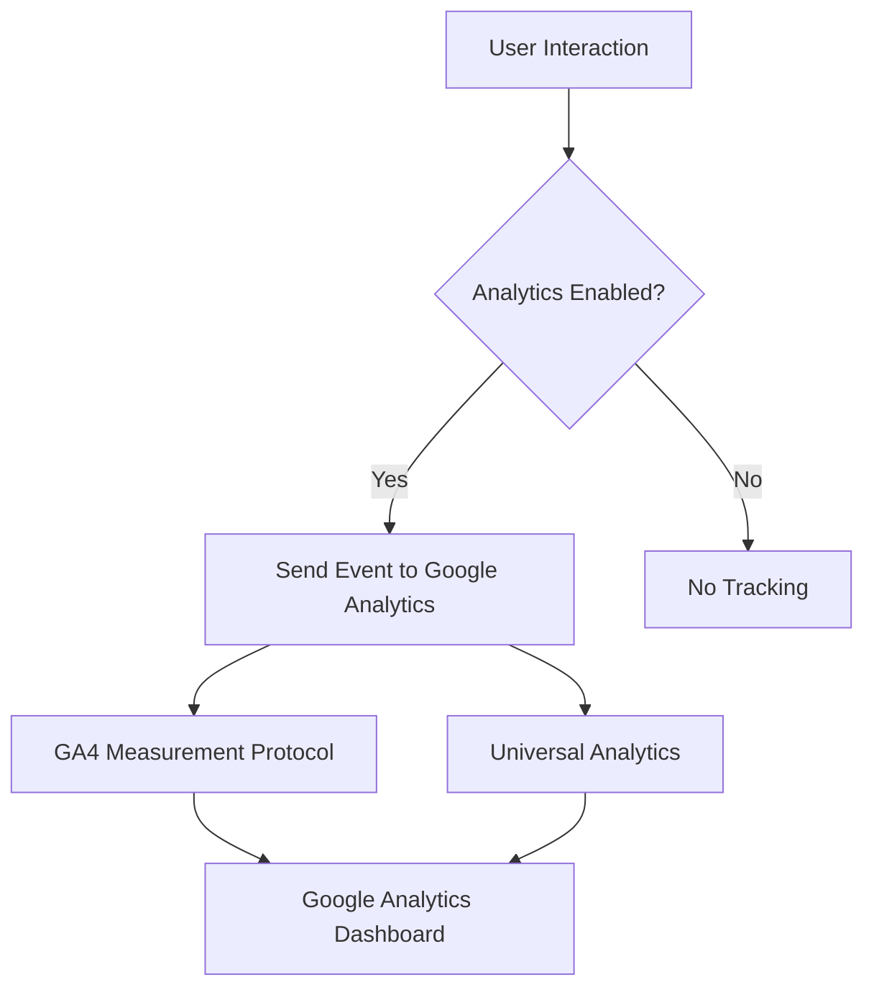
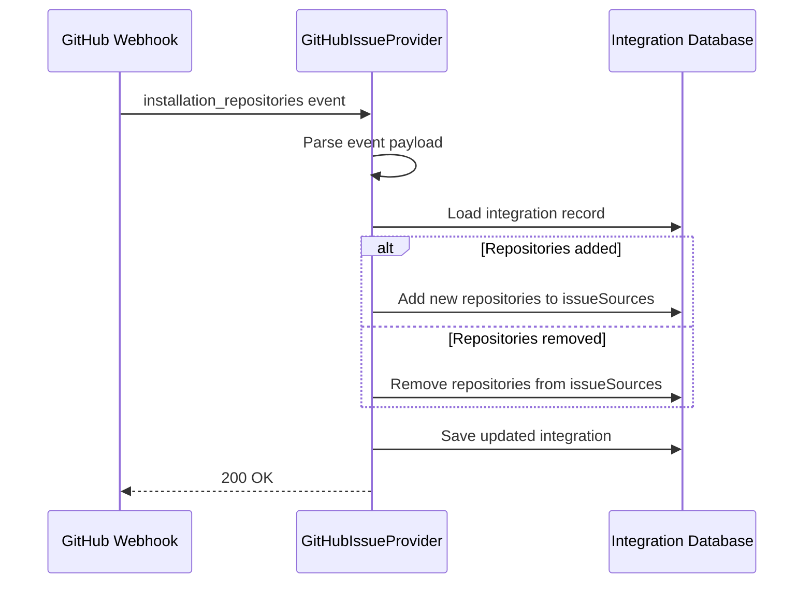
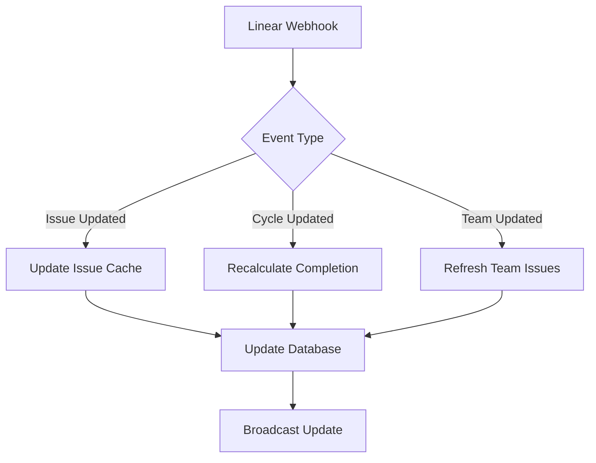
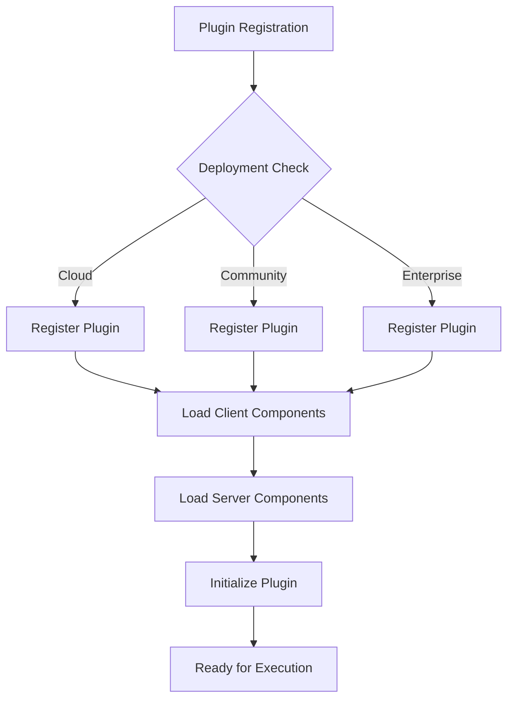

# Plugin Types

<cite>
**Referenced Files in This Document**   
- [PluginManager.ts](file://app/utils/PluginManager.ts)
- [PluginManager.ts](file://server/utils/PluginManager.ts)
- [types.ts](file://shared/types.ts)
- [BaseIssueProvider.ts](file://server/utils/BaseIssueProvider.ts)
- [github.ts](file://plugins/github/server/github.ts)
- [GitHubIssueProvider.ts](file://plugins/github/server/GitHubIssueProvider.ts)
- [linear.ts](file://plugins/linear/server/linear.ts)
- [slack.ts](file://plugins/slack/server/slack.ts)
- [google.ts](file://plugins/google/server/google.ts)
- [oidc.ts](file://plugins/oidc/server/oidc.ts)
- [googleanalytics.ts](file://plugins/googleanalytics/client/index.tsx)
- [matomo.ts](file://plugins/matomo/client/index.tsx)
- [umami.ts](file://plugins/umami/client/index.tsx)
- [storage.ts](file://plugins/storage/server/api/files.ts)
- [zapier.ts](file://plugins/zapier/server/index.ts)
- [webhooks.ts](file://plugins/webhooks/server/index.ts)
- [plugin.json](file://plugins/github/plugin.json)
- [plugin.json](file://plugins/linear/plugin.json)
- [plugin.json](file://plugins/slack/plugin.json)
- [plugin.json](file://plugins/google/plugin.json)
- [plugin.json](file://plugins/oidc/plugin.json)
- [plugin.json](file://plugins/googleanalytics/plugin.json)
- [plugin.json](file://plugins/matomo/plugin.json)
- [plugin.json](file://plugins/umami/plugin.json)
- [plugin.json](file://plugins/storage/plugin.json)
- [plugin.json](file://plugins/zapier/plugin.json)
- [plugin.json](file://plugins/webhooks/plugin.json)
</cite>

## Table of Contents
1. [Introduction](#introduction)
2. [Authentication Provider Plugins](#authentication-provider-plugins)
3. [Analytics Integration Plugins](#analytics-integration-plugins)
4. [Storage Provider Plugins](#storage-provider-plugins)
5. [Communication Platform Plugins](#communication-platform-plugins)
6. [Issue Tracking Plugins](#issue-tracking-plugins)
7. [Plugin Architecture Overview](#plugin-architecture-overview)
8. [Implementation Details](#implementation-details)
9. [Common Issues and Solutions](#common-issues-and-solutions)
10. [Conclusion](#conclusion)

## Introduction

The baozi application implements a comprehensive plugin system that extends its core functionality across multiple domains. This document details the various plugin types available in the application, including authentication providers, analytics integrations, storage providers, communication platforms, and issue tracking systems. Each plugin type follows a consistent architecture pattern while providing specialized functionality through well-defined interfaces and domain models.

The plugin system is built on a dual-layer architecture with separate client and server components, allowing for both user interface extensions and backend service integrations. Plugins are registered through a centralized PluginManager that handles lifecycle management, dependency resolution, and execution ordering based on priority levels.

**Section sources**
- [PluginManager.ts](file://app/utils/PluginManager.ts#L1-L164)
- [PluginManager.ts](file://server/utils/PluginManager.ts#L1-L134)

## Authentication Provider Plugins

Authentication provider plugins extend the login capabilities of the baozi application by integrating with external identity providers. These plugins implement the AuthProvider hook type and provide OAuth-based authentication flows for seamless user access.

### GitHub Authentication

The GitHub authentication plugin enables users to sign in using their GitHub credentials. It implements the OAuth 2.0 authorization code flow with PKCE, handling both the authorization and token exchange phases. The plugin registers an authentication route and integrates with GitHub's API to retrieve user profile information upon successful authentication.

Configuration parameters include:
- `GITHUB_CLIENT_ID`: The GitHub OAuth application client ID
- `GITHUB_CLIENT_SECRET`: The GitHub OAuth application client secret
- `GITHUB_URL`: Optional custom GitHub Enterprise URL

The plugin supports both cloud-hosted and self-hosted GitHub instances, with appropriate URL configuration for API endpoints.

**Section sources**
- [github.ts](file://plugins/google/server/google.ts#L1-L50)
- [plugin.json](file://plugins/github/plugin.json#L1-L6)

### Google Authentication

The Google authentication plugin provides sign-in functionality through Google accounts using OAuth 2.0. It follows Google's authentication best practices, including state parameter validation and secure token storage. The plugin handles the complete authentication flow from initial redirect to callback processing and user session creation.

Key implementation details:
- Uses Google's OpenID Connect discovery document to dynamically configure endpoints
- Implements proper error handling for revoked tokens and expired sessions
- Supports both personal Google accounts and Google Workspace accounts

Configuration requires:
- `GOOGLE_CLIENT_ID`: Google OAuth client ID
- `GOOGLE_CLIENT_SECRET`: Google OAuth client secret

**Section sources**
- [google.ts](file://plugins/google/server/google.ts#L1-L50)
- [plugin.json](file://plugins/google/plugin.json#L1-L6)

### OIDC Authentication

The OIDC (OpenID Connect) plugin provides a generic authentication provider that can integrate with any OpenID Connect-compliant identity provider. This includes services like Auth0, Okta, Azure AD, and custom OIDC implementations.

The plugin supports two configuration modes:
1. **Manual configuration**: Direct specification of authorization, token, and userinfo endpoints
2. **Discovery configuration**: Automatic endpoint discovery using the provider's `.well-known/openid-configuration` endpoint

Implementation features:
- Dynamic client registration support
- Configurable display name for the provider in the UI
- Token refresh handling with automatic renewal
- Support for custom scopes and claims mapping

Configuration parameters:
- `OIDC_CLIENT_ID` and `OIDC_CLIENT_SECRET`: OAuth credentials
- `OIDC_ISSUER_URL`: Base URL of the OIDC provider
- `OIDC_DISPLAY_NAME`: Custom name displayed to users

**Section sources**
- [oidc.ts](file://plugins/oidc/server/oidc.ts#L1-L50)
- [plugin.json](file://plugins/oidc/plugin.json#L1-L6)

## Analytics Integration Plugins

Analytics integration plugins enable tracking and reporting capabilities by connecting the baozi application with external analytics services. These plugins implement the Analytics hook type and provide client-side instrumentation for user behavior tracking.

### Google Analytics

The Google Analytics plugin integrates with Google Analytics 4 (GA4) to track user interactions and application usage patterns. It supports both the legacy Universal Analytics (UA) and modern GA4 measurement protocols, allowing for gradual migration between versions.

Implementation details:
- Automatically loads the Google Analytics script based on the configured measurement ID format
- Tracks page views, events, and custom dimensions
- Supports enhanced measurement features like scroll tracking and outbound link tracking
- Implements PWA installation event tracking

Configuration:
- `GOOGLE_ANALYTICS_ID`: Measurement ID (starts with "G-" for GA4, "UA-" for Universal Analytics)



**Diagram sources**
- [Analytics.tsx](file://app/components/Analytics.tsx#L1-L49)
- [plugin.json](file://plugins/googleanalytics/plugin.json#L1-L6)

**Section sources**
- [Analytics.tsx](file://app/components/Analytics.tsx#L1-L49)
- [plugin.json](file://plugins/googleanalytics/plugin.json#L1-L6)

### Matomo Analytics

The Matomo plugin provides integration with self-hosted Matomo analytics instances, offering privacy-focused tracking without reliance on third-party services. It implements the Matomo JavaScript tracker API for comprehensive event collection.

Key features:
- Configurable instance URL and script name for self-hosted deployments
- Measurement ID for site identification in Matomo
- Support for custom dimensions and user ID tracking
- Opt-out capability for privacy compliance

Configuration parameters:
- `MATOMO_MEASUREMENT_ID`: Site ID in Matomo
- `MATOMO_INSTANCE_URL`: Base URL of the Matomo instance
- `MATOMO_SCRIPT_NAME`: Name of the Matomo tracking script (default: "matomo")

**Section sources**
- [matomo.ts](file://plugins/matomo/client/index.tsx#L1-L50)
- [plugin.json](file://plugins/matomo/plugin.json#L1-L6)

### Umami Analytics

The Umami plugin integrates with the Umami open-source analytics platform, providing a lightweight alternative to traditional analytics services. It follows the same configuration pattern as other analytics plugins while leveraging Umami's simplified tracking API.

Implementation characteristics:
- Minimal footprint with reduced impact on page load performance
- Focus on essential metrics without excessive data collection
- Support for self-hosted Umami instances
- Automatic event tracking for key application interactions

Configuration:
- `UMAMI_MEASUREMENT_ID`: Website ID in Umami
- `UMAMI_INSTANCE_URL`: URL of the Umami instance

**Section sources**
- [umami.ts](file://plugins/umami/client/index.tsx#L1-L50)
- [plugin.json](file://plugins/umami/plugin.json#L1-L6)

## Storage Provider Plugins

Storage provider plugins extend the file handling capabilities of the baozi application by integrating with external storage services. These plugins implement the Storage hook type and provide abstraction over different storage backends.

The storage plugin architecture is built around the BaseStorage abstract class, which defines a consistent interface for file operations regardless of the underlying storage provider. This allows the application to support multiple storage backends through a unified API.

Core functionality provided by storage plugins:
- File upload and download operations
- Stream-based file access for efficient large file handling
- Signed URL generation for secure temporary access
- File metadata management
- Content disposition handling for proper browser rendering

The storage system supports various content types and automatically determines whether files should be displayed inline or downloaded as attachments based on MIME type and security considerations.

```mermaid
classDiagram
class BaseStorage {
+abstract getFileStream(key, range) Promise~ReadableStream~
+abstract getUploadUrl(isServerUpload) string
+abstract getUrlForKey(key) string
+abstract getSignedUrl(key, expiresIn) Promise~string~
+abstract store(body, contentLength, contentType, key, acl) Promise~string~
+abstract getFileHandle(key) Promise~{path, cleanup}~
+abstract deleteFile(key) Promise~void~
+getContentDisposition(contentType) string
}
class S3Storage {
+getFileStream(key, range) Promise~ReadableStream~
+getUploadUrl(isServerUpload) string
+getUrlForKey(key) string
+getSignedUrl(key, expiresIn) Promise~string~
+store(body, contentLength, contentType, key, acl) Promise~string~
+getFileHandle(key) Promise~{path, cleanup}~
+deleteFile(key) Promise~void~
}
class GoogleCloudStorage {
+getFileStream(key, range) Promise~ReadableStream~
+getUploadUrl(isServerUpload) string
+getUrlForKey(key) string
+getSignedUrl(key, expiresIn) Promise~string~
+store(body, contentLength, contentType, key, acl) Promise~string~
+getFileHandle(key) Promise~{path, cleanup}~
+deleteFile(key) Promise~void~
}
BaseStorage <|-- S3Storage
BaseStorage <|-- GoogleCloudStorage
```

**Diagram sources**
- [BaseStorage.ts](file://server/storage/files/BaseStorage.ts#L1-L277)
- [files.ts](file://plugins/storage/server/api/files.ts#L1-L100)

**Section sources**
- [BaseStorage.ts](file://server/storage/files/BaseStorage.ts#L1-L277)
- [files.ts](file://plugins/storage/server/api/files.ts#L1-L100)

## Communication Platform Plugins

Communication platform plugins enable notifications and workflow integrations with external messaging and automation services. These plugins implement various hook types to provide comprehensive communication capabilities.

### Slack Integration

The Slack plugin provides bidirectional integration with Slack workspaces, enabling notifications, commands, and workflow automation. It implements multiple plugin types to support different integration scenarios:

- **AuthProvider**: Enables user authentication via Slack credentials
- **API**: Provides webhook endpoints for receiving Slack events
- **Processor**: Handles incoming Slack messages and events
- **Task**: Executes scheduled operations related to Slack integration

Key features:
- OAuth 2.0 authentication flow for workspace installation
- Slash command support for interactive commands
- Message actions for contextual interactions
- Notification posting to configured channels
- Interactive message components support

Configuration parameters:
- `SLACK_CLIENT_ID` and `SLACK_CLIENT_SECRET`: OAuth credentials
- `SLACK_MESSAGE_ACTIONS`: Enable/disable message action buttons
- `SLACK_SIGNING_SECRET`: Verification token for webhook security

The plugin supports both app-level and user-level authentication, allowing for different permission scopes based on integration requirements.

**Section sources**
- [slack.ts](file://plugins/slack/server/slack.ts#L1-L100)
- [plugin.json](file://plugins/slack/plugin.json#L1-L6)

### Discord Integration

The Discord plugin enables integration with Discord servers, providing notification capabilities and potential for bot interactions. Similar to the Slack plugin, it implements the AuthProvider hook for user authentication via Discord credentials.

Implementation details:
- Standard OAuth 2.0 flow for Discord authentication
- Support for Discord's scope-based permission model
- User profile retrieval including avatar and discriminator
- Guild membership information access (when authorized)

Configuration requires:
- `DISCORD_CLIENT_ID`: Discord application client ID
- `DISCORD_CLIENT_SECRET`: Discord application client secret
- `DISCORD_BOT_TOKEN`: Optional bot token for advanced interactions

The plugin focuses primarily on authentication integration, with potential for future expansion to include notification and command features.

**Section sources**
- [discord.ts](file://plugins/discord/server/discord.ts#L1-L50)
- [plugin.json](file://plugins/discord/plugin.json#L1-L6)

### Zapier Integration

The Zapier plugin enables workflow automation by connecting the baozi application to the Zapier platform. It implements the Task and Processor hooks to support event-driven integrations with hundreds of external services.

Key capabilities:
- Webhook endpoint for receiving triggers from Zapier
- Event processing for document creation, updates, and other actions
- Data transformation to match Zapier's expected formats
- Error handling and retry mechanisms for reliable delivery

The plugin allows users to create "Zaps" that automate workflows such as:
- Creating tasks in project management tools when documents are updated
- Sending notifications to messaging platforms
- Syncing data with CRM systems
- Triggering email campaigns based on user activity

Configuration is primarily handled through the Zapier interface, with minimal setup required in the baozi application.

**Section sources**
- [zapier.ts](file://plugins/zapier/server/index.ts#L1-L30)
- [plugin.json](file://plugins/zapier/plugin.json#L1-L6)

### Webhooks Integration

The webhooks plugin provides a generic integration mechanism for sending events to external HTTP endpoints. It implements multiple hook types to support comprehensive webhook functionality:

- **API**: Endpoint for receiving webhook deliveries
- **Processor**: Handles webhook event processing and delivery
- **Task**: Manages scheduled webhook operations and retries
- **Uninstall**: Cleanup logic for removed webhook integrations

Implementation features:
- Configurable delivery URLs and HTTP methods
- Payload templating for custom data formatting
- Delivery retry with exponential backoff
- Signature verification for security
- Delivery history and logging

The plugin supports various event types including document updates, user actions, and system events, allowing for flexible integration with external systems.

**Section sources**
- [webhooks.ts](file://plugins/webhooks/server/index.ts#L1-L50)
- [plugin.json](file://plugins/webhooks/plugin.json#L1-L6)

## Issue Tracking Plugins

Issue tracking plugins integrate development tools with the baozi application, enabling reference and linking to issues, pull requests, and other development artifacts. These plugins implement the IssueProvider hook type and provide specialized functionality for development workflow integration.

### GitHub Issue Integration

The GitHub issue tracking plugin provides deep integration with GitHub repositories, allowing users to reference and link to issues, pull requests, and other GitHub objects. It implements the BaseIssueProvider abstract class and provides specific functionality for GitHub's API.

Key features:
- Repository source discovery through GitHub's installation API
- Real-time synchronization of repository lists
- Webhook handling for installation events, repository changes, and other notifications
- Issue and pull request unfurling with rich previews
- Permission-aware access to repositories based on installation scope

The plugin uses GitHub's App authentication model, allowing it to access repositories where the app has been installed without requiring individual user tokens for all operations.

Implementation details:
- Uses Octokit libraries for API interactions
- Implements pagination for handling large repository lists
- Caches repository lists to reduce API calls
- Handles webhook events for automatic synchronization

Configuration is primarily handled through GitHub's app installation process, with the plugin responding to webhook events to maintain synchronization.



**Diagram sources**
- [GitHubIssueProvider.ts](file://plugins/github/server/GitHubIssueProvider.ts#L1-L259)
- [plugin.json](file://plugins/github/plugin.json#L1-L6)

**Section sources**
- [GitHubIssueProvider.ts](file://plugins/github/server/GitHubIssueProvider.ts#L1-L259)
- [plugin.json](file://plugins/github/plugin.json#L1-L6)

### Linear Integration

The Linear issue tracking plugin integrates with the Linear project management platform, providing similar functionality to the GitHub integration but tailored to Linear's API and data model.

Key capabilities:
- Workspace source discovery through Linear's GraphQL API
- Issue unfurling with detailed previews including status, labels, and assignees
- Completion percentage calculation based on workflow state
- OAuth 2.0 authentication with refresh token support
- Webhook handling for issue updates and other events

Implementation characteristics:
- Uses Linear's SDK for API interactions
- Implements token refresh logic with automatic renewal
- Supports multiple Linear workspaces per team
- Calculates issue completion percentage based on workflow position

The plugin handles authentication through OAuth, storing access and refresh tokens securely and implementing automatic token refresh when needed.



**Diagram sources**
- [linear.ts](file://plugins/linear/server/linear.ts#L1-L264)
- [plugin.json](file://plugins/linear/plugin.json#L1-L6)

**Section sources**
- [linear.ts](file://plugins/linear/server/linear.ts#L1-L264)
- [plugin.json](file://plugins/linear/plugin.json#L1-L6)

## Plugin Architecture Overview

The baozi application implements a dual-layer plugin architecture with separate client and server components. This design allows for both user interface extensions and backend service integrations while maintaining security and performance.

### Client-Server Architecture

The plugin system is divided into client and server components, each with distinct responsibilities:

- **Client plugins**: Handle user interface elements, client-side logic, and browser interactions
- **Server plugins**: Manage backend operations, API integrations, and data processing

This separation ensures that sensitive operations and credentials remain on the server side, while client plugins focus on presentation and user experience.

### Plugin Lifecycle

Plugins follow a standardized lifecycle managed by the PluginManager:

1. **Registration**: Plugins are registered with the PluginManager during application startup
2. **Loading**: Client and server components are loaded based on deployment environment
3. **Initialization**: Plugins initialize their components and establish connections
4. **Execution**: Plugins respond to events and requests based on their hook types
5. **Cleanup**: Plugins perform cleanup operations during uninstallation

The PluginManager handles dependency resolution and execution ordering based on priority levels, ensuring consistent behavior across different plugin combinations.



**Diagram sources**
- [PluginManager.ts](file://app/utils/PluginManager.ts#L1-L164)
- [PluginManager.ts](file://server/utils/PluginManager.ts#L1-L134)

**Section sources**
- [PluginManager.ts](file://app/utils/PluginManager.ts#L1-L164)
- [PluginManager.ts](file://server/utils/PluginManager.ts#L1-L134)

## Implementation Details

### Plugin Interface and Types

The plugin system is built around a set of well-defined interfaces and types that ensure consistency across different plugin implementations. The core types are defined in the PluginManager and shared across client and server components.

Client plugin types (defined in `app/utils/PluginManager.ts`):
- **Settings**: Adds configuration screens to the settings interface
- **Imports**: Provides import functionality for data migration
- **Icon**: Supplies icons for use in the application interface

Server plugin types (defined in `server/utils/PluginManager.ts`):
- **API**: Mounts additional API routes and endpoints
- **AuthProvider**: Adds authentication providers for user login
- **EmailTemplate**: Extends email template functionality
- **IssueProvider**: Integrates with issue tracking systems
- **Processor**: Handles background processing tasks
- **Task**: Registers scheduled tasks and jobs
- **UnfurlProvider**: Enables rich link previews for external resources
- **Uninstall**: Provides cleanup logic for plugin removal

Each plugin type has a specific value type that defines the expected structure and functionality.

### Configuration and Deployment

Plugins support deployment-specific configuration through the `deployments` property, which controls where a plugin is available:

- **cloud**: Available in cloud-hosted deployments
- **community**: Available in community/self-hosted deployments
- **enterprise**: Available in enterprise deployments

This allows for differential feature availability based on the deployment environment while using the same codebase.

Plugins are configured through environment variables and plugin-specific configuration files (`plugin.json`). The configuration follows a consistent pattern across plugin types, with common properties including:

- `id`: Unique identifier for the plugin
- `name`: Display name shown to users
- `description`: Brief description of the plugin's functionality
- `priority`: Execution order (lower values execute first)
- `deployments`: Target deployment environments

### Data Models and Integration

Plugins interact with the application's data models through well-defined interfaces and service layers. The integration system uses the Integration model to store configuration and state for connected services.

Key data models:
- **Integration**: Stores configuration for connected services
- **IntegrationAuthentication**: Manages authentication tokens and credentials
- **IssueSource**: Caches available issue sources from external systems
- **WebhookSubscription**: Tracks webhook endpoints and delivery settings

The integration system supports secure storage of credentials and tokens, with automatic refresh for short-lived tokens and proper cleanup during uninstallation.

**Section sources**
- [types.ts](file://shared/types.ts#L1-L664)
- [PluginManager.ts](file://app/utils/PluginManager.ts#L1-L164)
- [PluginManager.ts](file://server/utils/PluginManager.ts#L1-L134)

## Common Issues and Solutions

### Authentication Token Expiration

**Issue**: Authentication tokens expire, causing integration failures.

**Solution**: Implement token refresh logic using refresh tokens when available. The Linear plugin demonstrates this pattern with its `refreshTokenIfNeeded` method that automatically renews access tokens before they expire.

```typescript
const accessToken = await integration.authentication.refreshTokenIfNeeded(
  async (refreshToken: string) => Linear.refreshToken(refreshToken),
  5 * Minute.ms
);
```

### Webhook Delivery Failures

**Issue**: Webhook deliveries fail due to network issues or endpoint unavailability.

**Solution**: Implement retry mechanisms with exponential backoff. The webhooks plugin should include delivery retry logic that attempts redelivery with increasing intervals between attempts.

### Rate Limiting

**Issue**: External API rate limits are exceeded during synchronization operations.

**Solution**: Implement rate limiting awareness and adaptive polling. The GitHub issue provider handles this by using paginated requests and respecting GitHub's rate limit headers.

### Configuration Errors

**Issue**: Incorrect configuration parameters prevent plugin initialization.

**Solution**: Implement comprehensive validation of configuration parameters during plugin registration. The OIDC plugin demonstrates this by checking for required configuration before enabling the plugin.

```typescript
const hasManualConfig = !!(env.OIDC_CLIENT_ID && env.OIDC_CLIENT_SECRET && env.OIDC_AUTH_URI);
const hasIssuerConfig = !!(env.OIDC_CLIENT_ID && env.OIDC_CLIENT_SECRET && env.OIDC_ISSUER_URL);
const enabled = hasManualConfig || hasIssuerConfig;
```

### Data Synchronization

**Issue**: Data becomes out of sync between the application and external services.

**Solution**: Implement webhook-based synchronization where possible, supplemented by periodic polling. The GitHub and Linear plugins use webhooks to receive real-time updates, ensuring data consistency.

### Error Handling

**Issue**: Unhandled errors cause plugin failures and degraded user experience.

**Solution**: Implement comprehensive error handling with appropriate logging and user feedback. All external API calls should be wrapped in try-catch blocks with meaningful error messages.

**Section sources**
- [GitHubIssueProvider.ts](file://plugins/github/server/GitHubIssueProvider.ts#L1-L259)
- [linear.ts](file://plugins/linear/server/linear.ts#L1-L264)
- [oidc.ts](file://plugins/oidc/server/oidc.ts#L1-L50)

## Conclusion

The baozi application's plugin system provides a robust and extensible architecture for integrating with external services across multiple domains. By implementing a consistent pattern of client-server separation, well-defined interfaces, and comprehensive error handling, the system enables reliable integration with authentication providers, analytics services, storage backends, communication platforms, and issue tracking systems.

The modular design allows for easy addition of new plugin types and services while maintaining security and performance. The use of standardized configuration, deployment controls, and lifecycle management ensures consistent behavior across different environments and deployment scenarios.

For developers implementing new plugins, the existing implementations provide clear patterns to follow, with comprehensive examples for authentication, API integration, background processing, and user interface extensions. The system's flexibility supports both simple integrations and complex workflows, making it a powerful foundation for extending the application's capabilities.