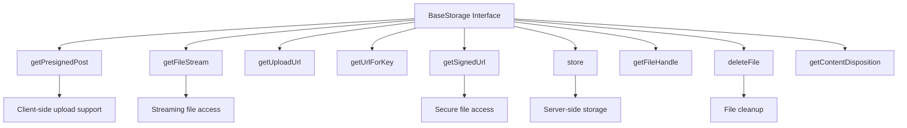
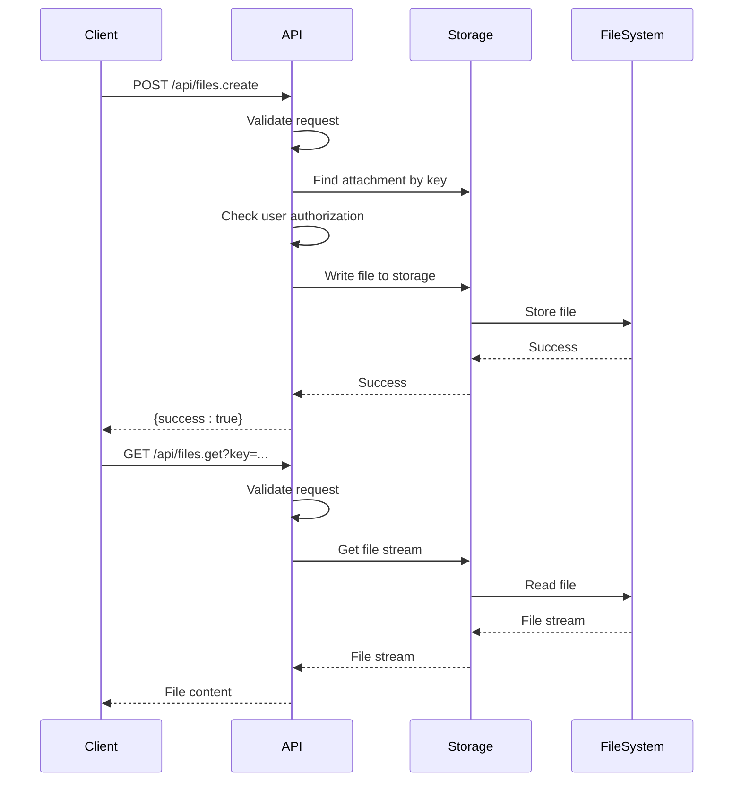
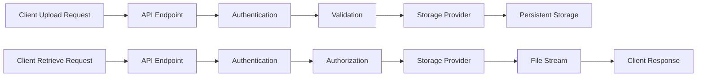

# Storage Providers

<cite>
**Referenced Files in This Document**   
- [BaseStorage.ts](file://server/storage/files/BaseStorage.ts)
- [LocalStorage.ts](file://server/storage/files/LocalStorage.ts)
- [S3Storage.ts](file://server/storage/files/S3Storage.ts)
- [files.ts](file://plugins/storage/server/api/files.ts)
- [Attachment.ts](file://server/models/Attachment.ts)
- [env.ts](file://server/env.ts)
</cite>

## Table of Contents
1. [Introduction](#introduction)
2. [Core Architecture](#core-architecture)
3. [BaseStorage Interface](#basestorage-interface)
4. [Concrete Implementations](#concrete-implementations)
5. [API Endpoints](#api-endpoints)
6. [Data Flow](#data-flow)
7. [Configuration and Environment](#configuration-and-environment)
8. [Common Issues and Solutions](#common-issues-and-solutions)
9. [Implementing New Providers](#implementing-new-providers)
10. [Performance Optimization](#performance-optimization)

## Introduction
The baozi application provides a flexible storage provider system that allows for pluggable file storage backends. This document details the implementation of storage provider plugins, focusing on the abstract BaseStorage interface and its concrete implementations such as LocalStorage and S3Storage. The system is designed to support various storage backends while maintaining a consistent API for file operations including upload, retrieval, and deletion. The architecture enables seamless integration of new storage providers through dependency injection and adheres to a well-defined interface contract.

**Section sources**
- [BaseStorage.ts](file://server/storage/files/BaseStorage.ts#L1-L278)

## Core Architecture
The storage provider system in baozi follows a plugin-based architecture with a clear separation between the abstract interface and concrete implementations. At the core of this system is the BaseStorage abstract class, which defines the contract for all storage providers. The architecture supports multiple storage backends through polymorphism, allowing the application to switch between different storage implementations without changing the client code. The system integrates with the application's dependency injection framework, enabling runtime configuration of storage providers based on environment variables.

```mermaid
classDiagram
class BaseStorage {
+static defaultSignedUrlExpires : number
+getPresignedPost(ctx, key, acl, maxUploadSize, contentType) : Promise~Partial~PresignedPost~~
+getFileStream(key, range) : Promise~NodeJS.ReadableStream | null~
+getUploadUrl(isServerUpload) : string
+getUrlForKey(key) : string
+getSignedUrl(key, expiresIn) : Promise~string~
+store(body, contentLength, contentType, key, acl) : Promise~string | undefined~
+getFileHandle(key) : Promise~{path : string, cleanup : () => Promise~void~~~
+getFileBuffer(key) : Promise~Buffer~
+storeFromUrl(url, key, acl, init, options) : Promise~{url : string, contentType : string, contentLength : number} | undefined~
+deleteFile(key) : Promise~void~
+getContentDisposition(contentType) : string
+safeInlineContentTypes : string[]
}
class LocalStorage {
+getPresignedPost(ctx, key, acl, maxUploadSize, contentType) : Promise~Partial~PresignedPost~~
+getUploadUrl() : string
+getUrlForKey(key) : string
+store(body, key) : Promise~string~
+deleteFile(key) : Promise~void~
+getSignedUrl(key, expiresIn) : Promise~string~
+getFileHandle(key) : Promise~{path : string, cleanup : () => Promise~void~~~
+getFileStream(key, range) : Promise~NodeJS.ReadableStream | null~
+stat(key) : Promise~Stats~
+getFilePath(key) : string
}
class S3Storage {
+constructor()
+getPresignedPost(ctx, key, acl, maxUploadSize, contentType) : Promise~Partial~PresignedPost~~
+getUploadUrl(isServerUpload) : string
+getUrlForKey(key) : string
+store(body, contentType, key, acl) : Promise~string~
+deleteFile(key) : Promise~void~
+getSignedUrl(key, expiresIn) : Promise~string~
+getFileHandle(key) : Promise~{path : string, cleanup : () => Promise~void~~~
+getFileStream(key, range) : Promise~NodeJS.ReadableStream | null~
+getEndpoint() : string
+getBucket() : string
+client : S3Client
}
BaseStorage <|-- LocalStorage
BaseStorage <|-- S3Storage
```

**Diagram sources**
- [BaseStorage.ts](file://server/storage/files/BaseStorage.ts#L11-L276)
- [LocalStorage.ts](file://server/storage/files/LocalStorage.ts#L17-L181)
- [S3Storage.ts](file://server/storage/files/S3Storage.ts#L25-L249)

**Section sources**
- [BaseStorage.ts](file://server/storage/files/BaseStorage.ts#L11-L276)
- [LocalStorage.ts](file://server/storage/files/LocalStorage.ts#L17-L181)
- [S3Storage.ts](file://server/storage/files/S3Storage.ts#L25-L249)

## BaseStorage Interface
The BaseStorage abstract class serves as the foundation for all storage provider implementations in the baozi application. It defines a comprehensive interface for file storage operations, ensuring consistency across different storage backends. The interface includes methods for uploading files, retrieving file streams, generating signed URLs, and deleting files. Key methods include getPresignedPost for client-side uploads, getFileStream for reading files, and store for server-side file storage. The class also provides utility methods like getFileBuffer and storeFromUrl that are implemented using the abstract methods, promoting code reuse across implementations.



**Diagram sources**
- [BaseStorage.ts](file://server/storage/files/BaseStorage.ts#L11-L276)

**Section sources**
- [BaseStorage.ts](file://server/storage/files/BaseStorage.ts#L11-L276)

## Concrete Implementations
The baozi application provides two concrete implementations of the BaseStorage interface: LocalStorage and S3Storage. LocalStorage is designed for development and testing environments, storing files directly on the local file system. It uses JWT-based signed URLs for secure file access and leverages the fs-extra library for file operations. S3Storage implements the interface for AWS S3 and S3-compatible services, using the AWS SDK for JavaScript (v3) to interact with the storage backend. Both implementations follow the same interface contract while adapting to their respective storage systems' capabilities and constraints.

### LocalStorage Implementation
The LocalStorage class implements the BaseStorage interface for local file system storage. It stores files in a directory specified by the FILE_STORAGE_LOCAL_ROOT_DIR environment variable, defaulting to "/var/lib/outline/data". The implementation uses JWT tokens to generate signed URLs for secure file access, with expiration controlled by the defaultSignedUrlExpires property. File operations are performed using Node.js fs and fs-extra libraries, with proper error handling and directory management.

**Section sources**
- [LocalStorage.ts](file://server/storage/files/LocalStorage.ts#L17-L181)

### S3Storage Implementation
The S3Storage class implements the BaseStorage interface for AWS S3 and S3-compatible services. It uses the AWS SDK for JavaScript (v3) with the S3Client, Upload, and related classes to interact with the storage backend. The implementation supports S3 Accelerate for improved performance and handles both path-style and virtual-hosted bucket URLs. It uses AWS's presigned post and request presigner functionality to generate secure upload and download URLs.

**Section sources**
- [S3Storage.ts](file://server/storage/files/S3Storage.ts#L25-L249)

## API Endpoints
The storage provider system exposes REST API endpoints for file operations, defined in the files.ts route. The primary endpoints are "files.create" for uploading files and "files.get" for retrieving files. The "files.create" endpoint handles multipart form data uploads, validating the file size against the FILE_STORAGE_UPLOAD_MAX_SIZE limit and ensuring the user has permission to upload to the specified key. The "files.get" endpoint serves files with proper content type detection, content disposition headers, and support for byte range requests for partial content delivery.



**Diagram sources**
- [files.ts](file://plugins/storage/server/api/files.ts#L28-L176)

**Section sources**
- [files.ts](file://plugins/storage/server/api/files.ts#L28-L176)

## Data Flow
The data flow for file operations in the baozi application follows a consistent pattern from client request to persistent storage. When a client uploads a file, the request is handled by the "files.create" endpoint, which validates the request and delegates the file storage to the configured storage provider. The storage provider implementation then stores the file according to its specific backend, whether local file system or S3. For file retrieval, the "files.get" endpoint processes the request, checks authorization, and streams the file content from the storage provider to the client.



**Diagram sources**
- [files.ts](file://plugins/storage/server/api/files.ts#L28-L176)
- [BaseStorage.ts](file://server/storage/files/BaseStorage.ts#L11-L276)

**Section sources**
- [files.ts](file://plugins/storage/server/api/files.ts#L28-L176)
- [BaseStorage.ts](file://server/storage/files/BaseStorage.ts#L11-L276)

## Configuration and Environment
The storage provider system is configured through environment variables that control the behavior and selection of storage backends. The FILE_STORAGE environment variable determines which storage provider to use, with valid values of "local" or "s3" (default). File size limits are controlled by FILE_STORAGE_UPLOAD_MAX_SIZE, FILE_STORAGE_IMPORT_MAX_SIZE, and FILE_STORAGE_WORKSPACE_IMPORT_MAX_SIZE, allowing different limits for regular uploads, imports, and workspace-level imports. The LocalStorage implementation requires FILE_STORAGE_LOCAL_ROOT_DIR to specify the root directory for file storage.

**Section sources**
- [env.ts](file://server/env.ts#L651-L696)

## Common Issues and Solutions
The storage provider system addresses several common issues in file storage applications. File size limits are enforced through the FILE_STORAGE_UPLOAD_MAX_SIZE environment variable and multipart middleware configuration. Attachment expiry is supported through the expiresAt field in the Attachment model and the CleanupExpiredAttachmentsTask queue task. Cross-region replication is handled by the S3Storage implementation's support for S3 Accelerate, which optimizes data transfer between regions. Permission issues are addressed through proper file system permissions checking in the LocalStorage implementation.

**Section sources**
- [env.ts](file://server/env.ts#L651-L696)
- [Attachment.ts](file://server/models/Attachment.ts#L33-L236)
- [LocalStorage.ts](file://server/storage/files/LocalStorage.ts#L17-L181)

## Implementing New Providers
To implement a new storage provider, create a class that extends the BaseStorage abstract class and implements all abstract methods. The new provider must handle file uploads, downloads, deletion, and URL generation according to the interface contract. Required methods include getPresignedPost for client-side uploads, getFileStream for reading files, store for server-side storage, and deleteFile for cleanup. Error handling should follow the existing patterns, using appropriate error types from the application's error module. The provider should be registered in the dependency injection system and made configurable through environment variables.

**Section sources**
- [BaseStorage.ts](file://server/storage/files/BaseStorage.ts#L11-L276)

## Performance Optimization
The storage provider system includes several performance optimizations for large file transfers. The S3Storage implementation uses the AWS SDK's Upload class, which automatically handles multipart uploads for large files, improving upload reliability and performance. Both implementations support byte range requests through the range parameter in getFileStream, enabling efficient partial content delivery for large files. The LocalStorage implementation uses streaming file operations to minimize memory usage during file transfers. For high-performance scenarios, the S3 Accelerate feature can be enabled to optimize data transfer speeds.

**Section sources**
- [S3Storage.ts](file://server/storage/files/S3Storage.ts#L25-L249)
- [LocalStorage.ts](file://server/storage/files/LocalStorage.ts#L17-L181)