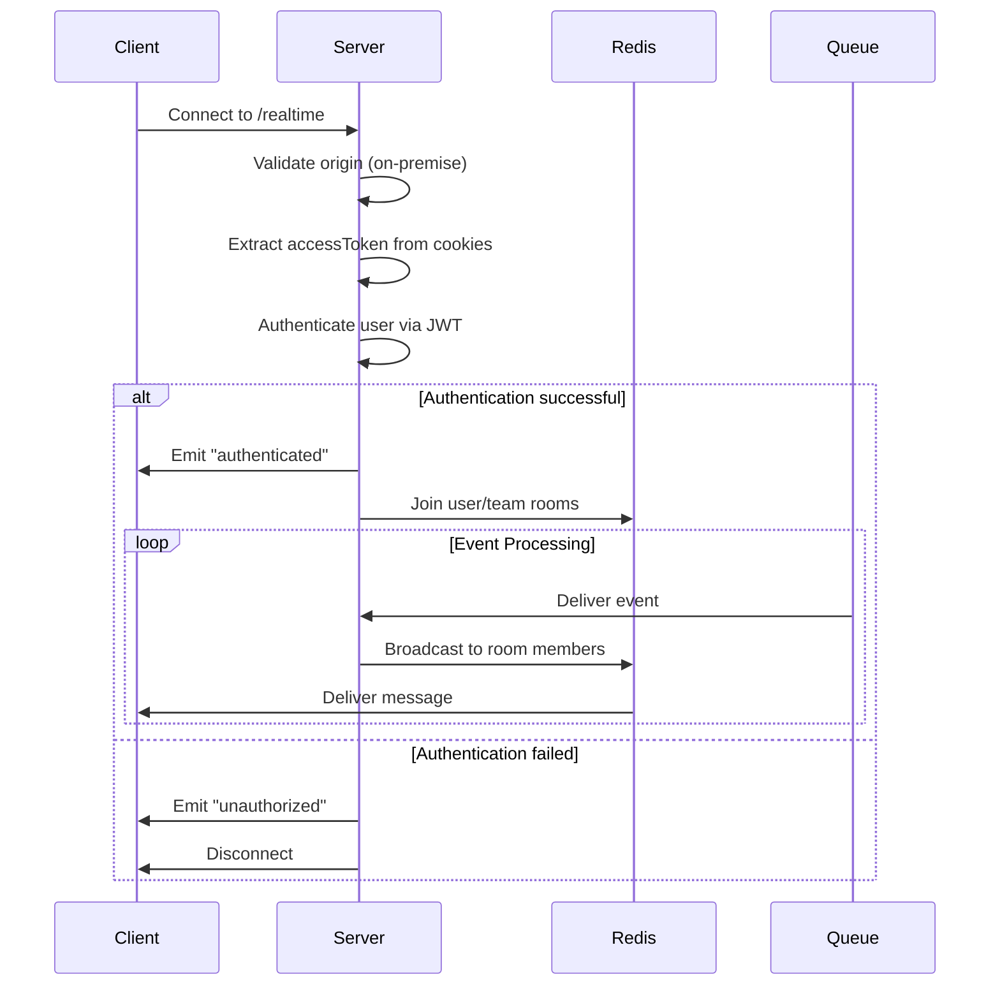
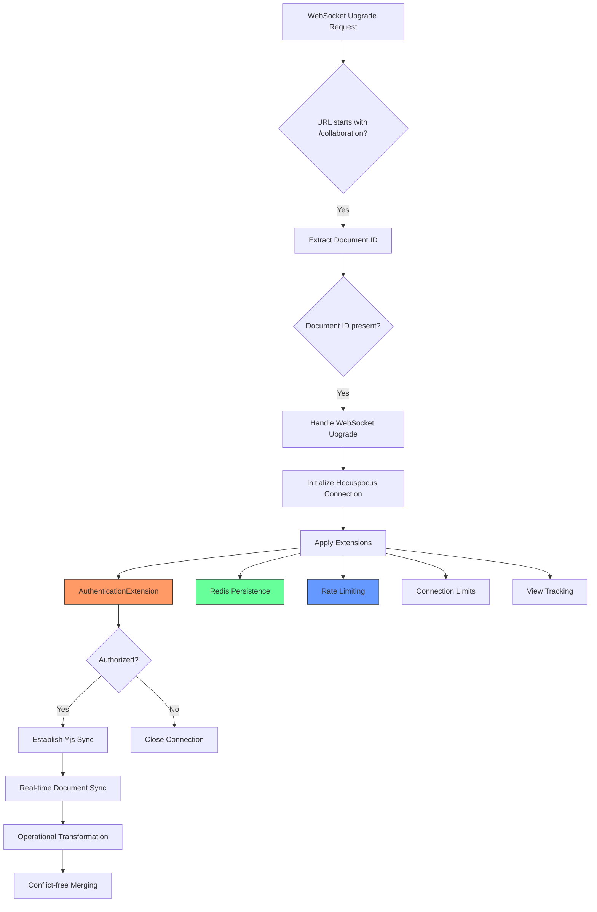
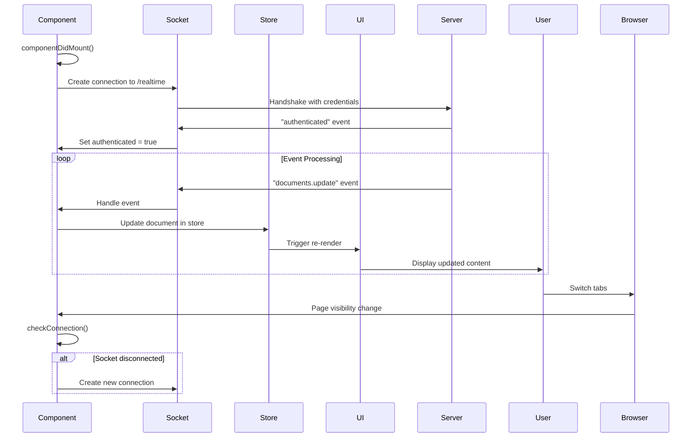
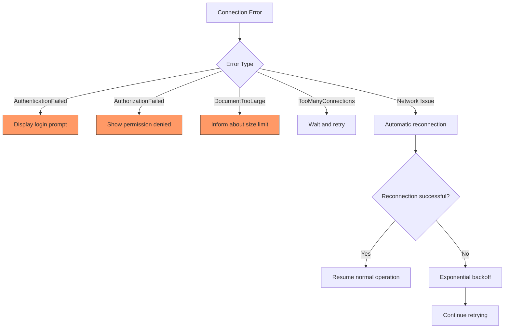

# Real-time Collaboration System

<cite>
**Referenced Files in This Document**   
- [websockets.ts](file://server/services/websockets.ts)
- [collaboration.ts](file://server/services/collaboration.ts)
- [WebsocketProvider.tsx](file://app/components/WebsocketProvider.tsx)
- [CloseEvents.ts](file://shared/collaboration/CloseEvents.ts)
</cite>

## Table of Contents
1. [Introduction](#introduction)
2. [Architecture Overview](#architecture-overview)
3. [Yjs Integration and CRDT Fundamentals](#yjs-integration-and-crdt-fundamentals)
4. [WebSocket Implementation](#websocket-implementation)
5. [Collaboration Service](#collaboration-service)
6. [Client-Side Connection Management](#client-side-connection-management)
7. [Shared Collaboration Primitives](#shared-collaboration-primitives)
8. [Message Formats and Data Synchronization](#message-formats-and-data-synchronization)
9. [Presence and Awareness Mechanisms](#presence-and-awareness-mechanisms)
10. [Performance Optimization Strategies](#performance-optimization-strategies)
11. [Error Handling and Connection Management](#error-handling-and-connection-management)

## Introduction
The baozi application implements a robust real-time collaboration system that enables multiple users to simultaneously edit documents with immediate synchronization and conflict-free consistency. This system leverages Yjs, a powerful implementation of Conflict-free Replicated Data Types (CRDTs), to ensure that all clients maintain a consistent state regardless of network latency or edit order. The architecture combines persistent WebSocket connections for low-latency communication with a sophisticated server-side collaboration service that manages document state, user awareness, and operational transformation. This documentation provides a comprehensive analysis of the collaborative editing capabilities, covering both conceptual overviews for beginners and technical details for experienced developers. The system uses terminology such as 'awareness' for user presence indicators, 'updates' for document state changes, 'broadcast' for message distribution, and 'presence' for real-time user activity tracking.

## Architecture Overview

The real-time collaboration system in baozi follows a client-server architecture with specialized services for different aspects of real-time communication. The system separates regular event broadcasting from collaborative document editing, allowing for optimized handling of different types of real-time interactions.

```mermaid
graph TB
subgraph "Client-Side"
A[Web Browser] --> B[WebsocketProvider]
B --> C[Yjs Provider]
C --> D[ProseMirror Editor]
end
subgraph "Server-Side"
E[API Server] --> F[Websockets Service]
E --> G[Collaboration Service]
F --> H[Redis Adapter]
G --> H
H --> I[Database]
end
B < --> |"/realtime"| F
C < --> |"/collaboration"| G
F < --> |Events| B
G < --> |Document Updates| C
style A fill:#f9f,stroke:#333
style D fill:#bbf,stroke:#333
style F fill:#f96,stroke:#333
style G fill:#6f9,stroke:#333
```

**Diagram sources**
- [websockets.ts](file://server/services/websockets.ts#L1-L260)
- [collaboration.ts](file://server/services/collaboration.ts#L1-L110)
- [WebsocketProvider.tsx](file://app/components/WebsocketProvider.tsx#L1-L740)

**Section sources**
- [websockets.ts](file://server/services/websockets.ts#L1-L260)
- [collaboration.ts](file://server/services/collaboration.ts#L1-L110)

## Yjs Integration and CRDT Fundamentals

The baozi application utilizes Yjs as the foundation for its real-time collaborative editing capabilities, implementing Conflict-free Replicated Data Types (CRDTs) to ensure eventual consistency across all clients. Yjs provides a mathematical guarantee that concurrent edits from multiple users will be merged correctly without conflicts, regardless of the order in which operations are received. The system uses Yjs's shared types, particularly Y.XmlFragment, to represent the document structure in a way that can be efficiently synchronized between clients. Each document maintains a Yjs document instance that tracks all content changes as discrete operations, which are then broadcast to other collaborators. The CRDT implementation ensures that operations are commutative, associative, and idempotent, meaning that the same final state will be reached regardless of the order in which operations are applied. This allows the system to handle network latency, disconnections, and out-of-order message delivery gracefully. The integration with ProseMirror is achieved through the y-prosemirror library, which translates between Yjs's internal representation and ProseMirror's document model, enabling seamless real-time updates in the editor interface.

**Section sources**
- [Multiplayer.ts](file://app/editor/extensions/Multiplayer.ts#L1-L122)

## WebSocket Implementation

The WebSocket implementation in server/services/websockets.ts establishes persistent connections between clients and the server for real-time event broadcasting. The service is initialized with a Koa application and HTTP server, creating a Socket.IO server instance that listens on the "/realtime" path. The configuration includes important settings such as ping intervals (15,000ms) and timeouts (30,000ms) to maintain connection health and detect inactive clients. The implementation uses Redis as an adapter to support horizontal scaling across multiple server instances, allowing the system to handle large numbers of concurrent connections. Authentication is performed using JWT tokens extracted from cookies, ensuring that only authorized users can establish connections. The service also integrates with a message queue (websocketQueue) to process events asynchronously, preventing blocking operations from affecting real-time performance. Connection upgrades are carefully managed to coexist with the collaboration service, with the system checking request URLs to route connections to the appropriate service endpoint.



**Diagram sources**
- [websockets.ts](file://server/services/websockets.ts#L1-L260)

**Section sources**
- [websockets.ts](file://server/services/websockets.ts#L1-L260)

## Collaboration Service

The collaboration service in server/services/collaboration.ts manages real-time document editing sessions using the Hocuspocus server framework, which is specifically designed for Yjs-based collaboration. The service listens on the "/collaboration" path and handles WebSocket connections for document synchronization. It extracts the document ID from the request URL, enabling multiple documents to be edited simultaneously with isolated state management. The service implements several critical extensions to enhance collaboration functionality: Redis extension for persistence and multi-server synchronization, Throttle extension for rate limiting to prevent abuse, ConnectionLimitExtension to control concurrent connections per user, and AuthenticationExtension to verify user permissions for document access. The PersistenceExtension ensures that document state is saved to the database, while the ViewsExtension tracks which users are currently viewing each document. The service also includes comprehensive logging and metrics collection through LoggerExtension and MetricsExtension, providing visibility into collaboration session performance and usage patterns.



**Diagram sources**
- [collaboration.ts](file://server/services/collaboration.ts#L1-L110)

**Section sources**
- [collaboration.ts](file://server/services/collaboration.ts#L1-L110)

## Client-Side Connection Management

The client-side implementation in app/components/WebsocketProvider.tsx handles connection management and message processing for real-time collaboration. This component establishes and maintains the WebSocket connection using Socket.IO client, automatically reconnecting when connections are lost due to network issues or page visibility changes. The provider listens for various events that represent changes to application state, such as document updates, comment additions, and user presence changes. When an event is received, the provider updates the corresponding MobX stores, which in turn trigger UI updates through React's reactivity system. The implementation includes sophisticated error handling, displaying user-friendly notifications for authorization errors and other issues. The component also manages room subscriptions, allowing clients to join and leave channels for specific documents, collections, or groups based on user permissions and navigation. Connection resilience is enhanced through reconnection strategies that adapt transport methods based on the environment, using only WebSockets for custom domains and falling back to polling when necessary.



**Diagram sources**
- [WebsocketProvider.tsx](file://app/components/WebsocketProvider.tsx#L1-L740)

**Section sources**
- [WebsocketProvider.tsx](file://app/components/WebsocketProvider.tsx#L1-L740)

## Shared Collaboration Primitives

The shared collaboration primitives in shared/collaboration/ provide standardized error codes and close events for consistent handling of collaboration-related issues across the application. These primitives ensure that both client and server components use the same error codes and messages when terminating connections or reporting issues. The CloseEvents.ts file defines constants for various error conditions, including DocumentTooLarge (code 1009), AuthenticationFailed (code 4401), AuthorizationFailed (code 4403), TooManyConnections (code 4503), and EditorUpdateError (code 4999). These standardized error codes allow clients to implement appropriate recovery strategies based on the specific error condition. For example, when a DocumentTooLarge error occurs, the client can inform the user that the document has exceeded size limits rather than displaying a generic connection error. Similarly, authentication and authorization failures can trigger specific workflows such as re-authentication or permission requests. These shared primitives ensure consistency in error handling and user experience across different parts of the application and different client implementations.

**Section sources**
- [CloseEvents.ts](file://shared/collaboration/CloseEvents.ts#L1-L25)

## Message Formats and Data Synchronization

The real-time collaboration system uses structured message formats to synchronize document state and application events between clients and servers. For document collaboration, Yjs automatically generates and processes update messages that contain operational transformations representing changes to the document state. These updates are efficiently encoded and transmitted over the WebSocket connection, minimizing bandwidth usage. For application-level events, the system uses named events with structured payloads, such as "documents.update" with a document descriptor containing the document ID and updated timestamp. The WebsocketProvider listens for these events and updates the corresponding MobX stores, which manage the application state. The message format includes mechanisms for avoiding unnecessary updates by comparing timestamps, ensuring that clients only process changes that represent newer versions of the data. The system also supports batched updates through events like "entities" that can contain multiple document or collection updates in a single message, reducing the number of individual events that need to be processed.

```mermaid
flowchart LR
A[Client Edit] --> B[Generate Yjs Update]
B --> C[Encode as ArrayBuffer]
C --> D[Send over WebSocket]
D --> E[Server Receives Update]
E --> F[Apply to Yjs Document]
F --> G[Broadcast to Other Clients]
G --> H[Receive Update]
H --> I[Apply to Local Yjs Document]
I --> J[Update ProseMirror Editor]
J --> K[Render Updated Content]
style B fill:#69f,stroke:#333
style F fill:#6f9,stroke:#333
style I fill:#96f,stroke:#333
```



**Diagram sources**
- [collaboration.ts](file://server/services/collaboration.ts#L1-L110)
- [WebsocketProvider.tsx](file://app/components/WebsocketProvider.tsx#L1-L740)

**Section sources**
- [collaboration.ts](file://server/services/collaboration.ts#L1-L110)
- [WebsocketProvider.tsx](file://app/components/WebsocketProvider.tsx#L1-L740)

## Presence and Awareness Mechanisms

The collaboration system implements sophisticated presence and awareness mechanisms that allow users to see which colleagues are currently viewing or editing the same document. This is achieved through the awareness feature of Yjs, which maintains a shared state containing information about connected clients. When a user opens a document, their client joins a collaboration room and registers their presence in the awareness state, including their user ID, cursor position, and selection range. This information is automatically synchronized with all other collaborators, enabling features like real-time cursor tracking and presence indicators. The system optimizes this functionality by only transmitting awareness updates when there are actual changes, and by automatically removing stale presence information when clients disconnect. The ViewsExtension in the collaboration service tracks document views at the server level, allowing the system to display accurate information about who is currently viewing each document, even when they are not actively making edits.

**Section sources**
- [Multiplayer.ts](file://app/editor/extensions/Multiplayer.ts#L1-L122)
- [collaboration.ts](file://server/services/collaboration.ts#L1-L110)

## Performance Optimization Strategies

The real-time collaboration system incorporates several performance optimization strategies to ensure responsive editing even with large documents and many collaborators. The server-side implementation uses debouncing with a 3,000ms interval (configurable up to 10,000ms) to batch multiple rapid updates, reducing the frequency of persistence operations and network broadcasts. The Redis adapter enables efficient message distribution across multiple server instances, supporting horizontal scaling of the collaboration infrastructure. On the client side, the system implements intelligent update handling by comparing timestamps before processing document updates, avoiding unnecessary re-renders when the local state is already current. The connection management includes adaptive reconnection strategies that switch between WebSocket and polling transports based on network conditions and domain configuration. The system also implements rate limiting at 50 requests per 60-second window to prevent abuse and ensure fair resource allocation among users. Additionally, the document size is limited by the maxPayload setting, preventing excessively large documents from impacting system performance.

**Section sources**
- [collaboration.ts](file://server/services/collaboration.ts#L1-L110)
- [websockets.ts](file://server/services/websockets.ts#L1-L260)

## Error Handling and Connection Management

The collaboration system implements comprehensive error handling and connection management to ensure reliability and a good user experience. Standardized error codes defined in shared/collaboration/CloseEvents.ts provide consistent error reporting across the application. The client-side WebsocketProvider listens for "unauthorized" events and displays appropriate error messages using the toast notification system, while also throwing exceptions to trigger authentication workflows. Connection resilience is enhanced through automatic reconnection logic that recreates the WebSocket connection when the page becomes visible after being in the background. The server-side implementation includes timeout handling (30,000ms) and ping intervals (15,000ms) to detect and clean up inactive connections. The system also handles document-specific errors such as DocumentTooLarge (code 1009) by closing the connection with a descriptive reason, allowing the client to inform the user about size limitations. Authentication failures are handled gracefully by disconnecting the socket and prompting for re-authentication, while maintaining the ability to reconnect once credentials are valid.



**Diagram sources**
- [CloseEvents.ts](file://shared/collaboration/CloseEvents.ts#L1-L25)
- [WebsocketProvider.tsx](file://app/components/WebsocketProvider.tsx#L1-L740)

**Section sources**
- [CloseEvents.ts](file://shared/collaboration/CloseEvents.ts#L1-L25)
- [WebsocketProvider.tsx](file://app/components/WebsocketProvider.tsx#L1-L740)