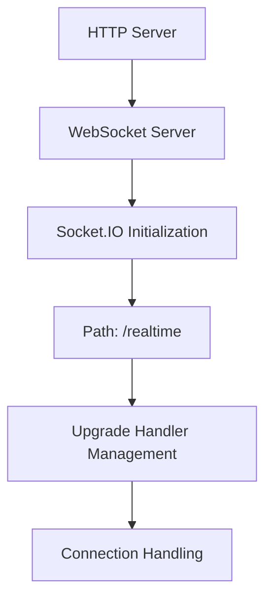
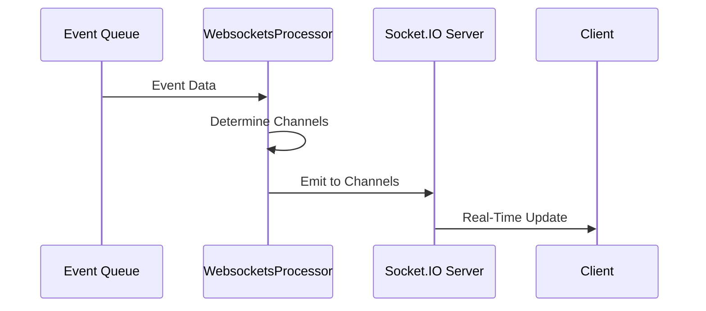
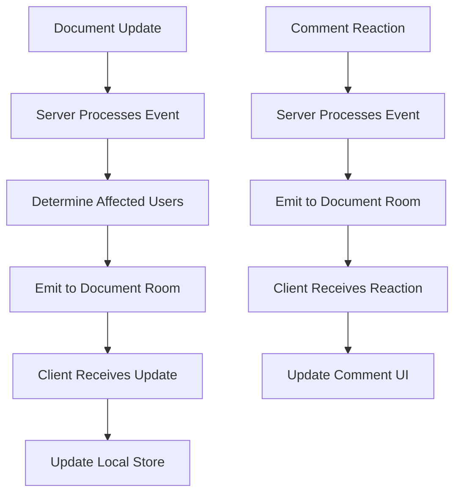

# WebSocket Implementation

<cite>
**Referenced Files in This Document**   
- [websockets.ts](file://server/services/websockets.ts)
- [WebsocketProvider.tsx](file://app/components/WebsocketProvider.tsx)
- [WebsocketsProcessor.ts](file://server/queues/processors/WebsocketsProcessor.ts)
</cite>

## Table of Contents
1. [Server-Side WebSocket Setup](#server-side-websocket-setup)
2. [Authentication and User Context](#authentication-and-user-context)
3. [Room-Based Subscription Model](#room-based-subscription-model)
4. [Event-Driven Architecture](#event-driven-architecture)
5. [Client-Side Connection Management](#client-side-connection-management)
6. [Real-Time Synchronization Examples](#real-time-synchronization-examples)
7. [Common Issues and Best Practices](#common-issues-and-best-practices)

## Server-Side WebSocket Setup

The WebSocket implementation in the baozi application is centered around the Socket.IO server configured in `server/services/websockets.ts`. The server is initialized with a specific path `/realtime` and configured to serve clients without serving client-side files directly. The configuration includes ping intervals and timeouts to maintain connection health. To allow coexistence with collaboration websockets, the upgrade handler is carefully managed to only handle requests to the `/realtime` path. This setup ensures that non-collaborative document events and real-time updates are efficiently distributed to clients.



**Diagram sources**
- [websockets.ts](file://server/services/websockets.ts#L32-L87)

**Section sources**
- [websockets.ts](file://server/services/websockets.ts#L27-L87)

## Authentication and User Context

Authentication for WebSocket connections is handled through JWT tokens extracted from cookies. Upon connection, the server parses the `accessToken` cookie and validates it to attach the corresponding user context to the socket. This user context is crucial for determining the user's permissions and subscription channels. If authentication fails or no token is present, the connection is terminated with an unauthorized error. The authenticated user context is stored on the socket client for the duration of the session, enabling personalized event distribution.

**Section sources**
- [websockets.ts](file://server/services/websockets.ts#L246-L259)

## Room-Based Subscription Model

The subscription model in the baozi application is based on rooms that correspond to team, collection, group, and document channels. Upon successful authentication, users are automatically joined to rooms based on their team and user ID, as well as collections and groups they have access to. Additional subscriptions to specific collections, groups, or documents are managed dynamically through 'join' and 'leave' events from the client side. This model ensures that users only receive events relevant to their permissions and current context, optimizing bandwidth and security.

```mermaid
graph TD
A[User Connection] --> B[Authentication]
B --> C[Team Room: team-{id}]
B --> D[User Room: user-{id}]
B --> E[Collection Rooms]
B --> F[Group Rooms]
G[Client Request] --> H[Join Event]
H --> I[Document Room: document-{id}]
H --> J[Additional Collection Room]
H --> K[Additional Group Room]
```

**Diagram sources**
- [websockets.ts](file://server/services/websockets.ts#L174-L239)

**Section sources**
- [websockets.ts](file://server/services/websockets.ts#L168-L239)

## Event-Driven Architecture

The event-driven architecture processes background job results through the `WebsocketsProcessor` and broadcasts them to relevant clients. Events from the event queue are processed by the `WebsocketsProcessor`, which determines the appropriate channels for each event based on the involved entities and user permissions. For example, document updates trigger events to all users with access to that document, while collection updates are broadcast to all members of the team or collection. This architecture ensures that real-time updates are delivered efficiently and securely to all relevant clients.



**Diagram sources**
- [WebsocketsProcessor.ts](file://server/queues/processors/WebsocketsProcessor.ts#L43-L888)

**Section sources**
- [WebsocketsProcessor.ts](file://server/queues/processors/WebsocketsProcessor.ts#L43-L888)

## Client-Side Connection Management

The client-side WebSocket connection is managed by the `WebsocketProvider.tsx` component, which handles the lifecycle of the connection, including creation, reconnection, and cleanup. The provider establishes a connection to the WebSocket server using the same origin and the `/realtime` path, with credentials included for authentication. Reconnection logic is implemented to handle network interruptions, with exponential backoff for reconnection attempts. The provider also listens for page visibility changes, attempting to reconnect when the page becomes visible again after being in the background.

**Section sources**
- [WebsocketProvider.tsx](file://app/components/WebsocketProvider.tsx#L82-L125)

## Real-Time Synchronization Examples

The WebSocket system enables real-time synchronization of various entities, including documents, comments, and notifications. For example, when a document is updated, the server broadcasts the change to all users with access to that document, triggering an update in their local stores. Similarly, comment reactions are synchronized in real time, with the server emitting events to all users in the document's room. User membership changes, such as adding or removing users from collections or groups, are also broadcasted, ensuring that all clients have consistent and up-to-date information.



**Diagram sources**
- [WebsocketProvider.tsx](file://app/components/WebsocketProvider.tsx#L246-L423)
- [WebsocketsProcessor.ts](file://server/queues/processors/WebsocketsProcessor.ts#L159-L169)

**Section sources**
- [WebsocketProvider.tsx](file://app/components/WebsocketProvider.tsx#L246-L423)
- [WebsocketsProcessor.ts](file://server/queues/processors/WebsocketsProcessor.ts#L159-L169)

## Common Issues and Best Practices

Common issues in the WebSocket implementation include unauthorized connections due to missing or invalid JWT tokens, and connection loss during network interruptions. To address these, the client implements robust reconnection logic and proper cleanup of socket references to prevent memory leaks. Best practices include using page visibility APIs to manage reconnections efficiently, ensuring that socket references are properly nullified during cleanup, and handling network interruptions gracefully to maintain a consistent UI state across clients. Additionally, the server-side implementation includes metrics and logging to monitor connection health and performance.

**Section sources**
- [WebsocketProvider.tsx](file://app/components/WebsocketProvider.tsx#L72-L80)
- [websockets.ts](file://server/services/websockets.ts#L117-L125)