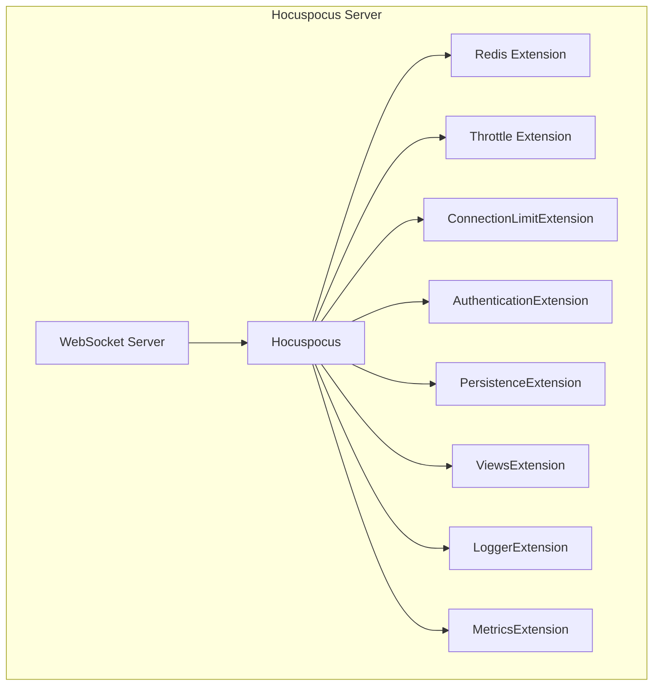
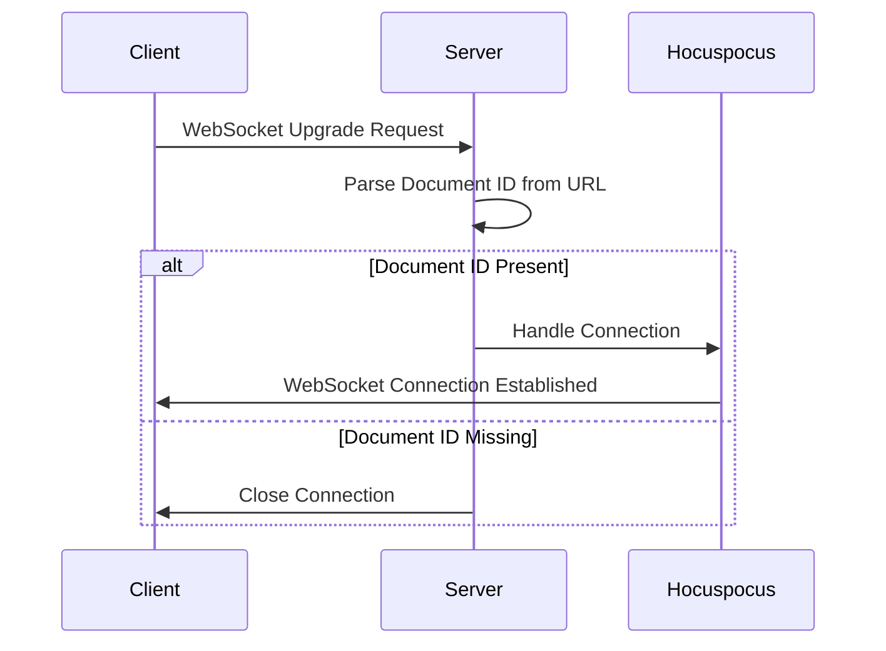
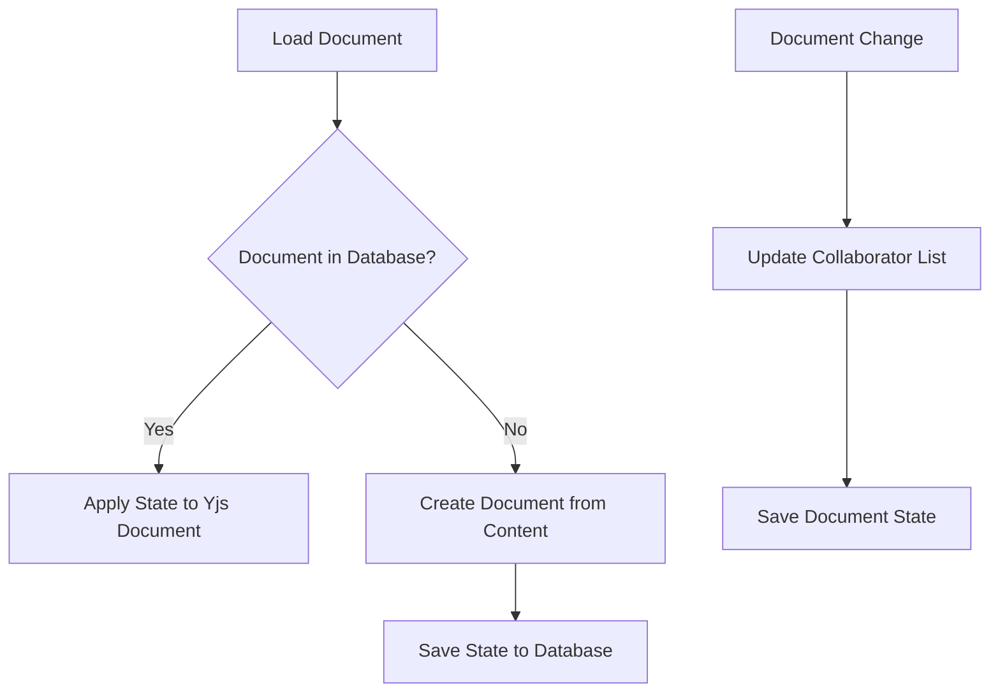
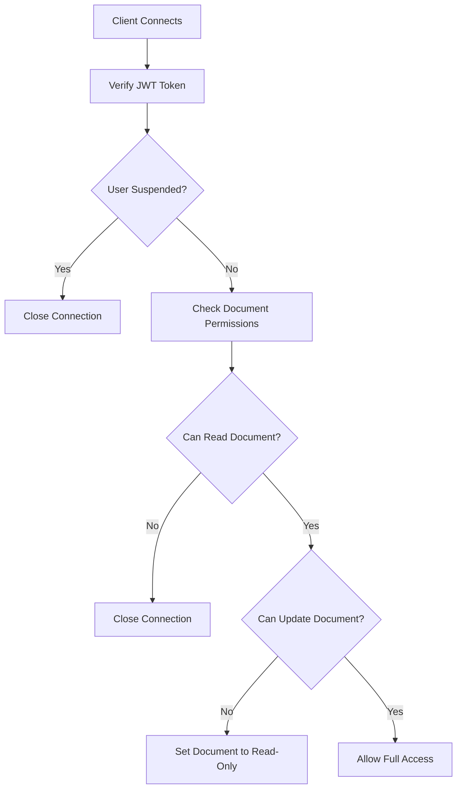
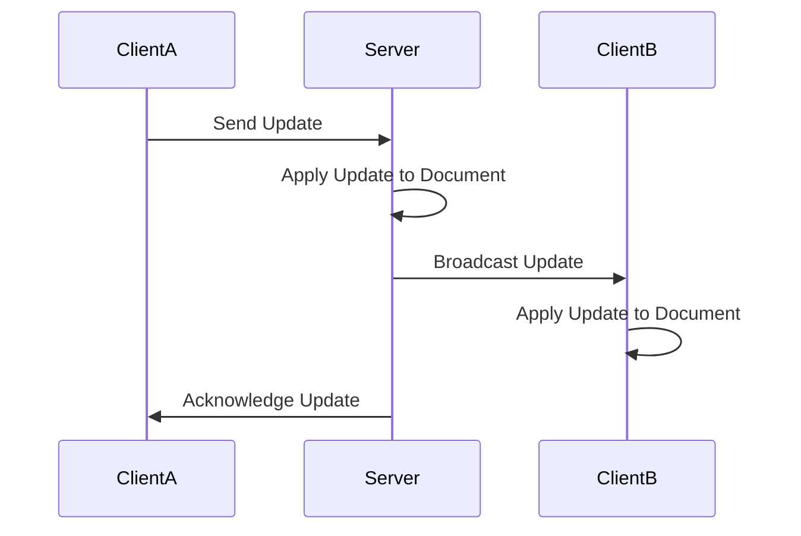
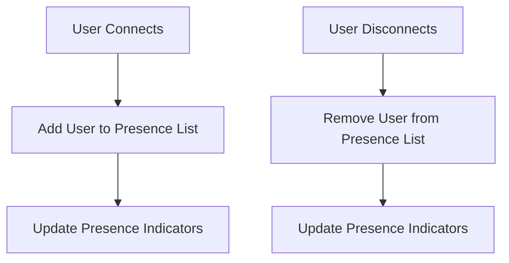
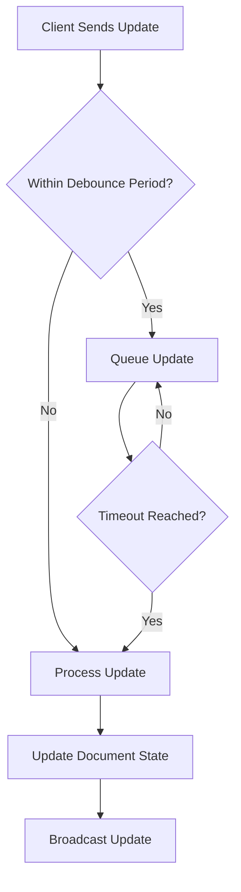
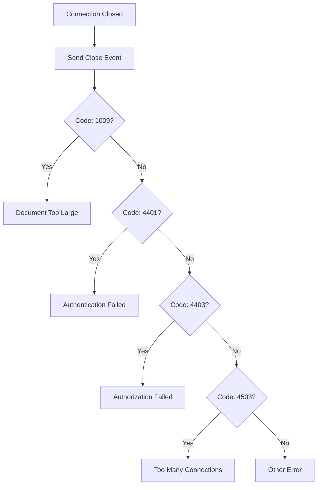

# Yjs Integration

<cite>
**Referenced Files in This Document**   
- [collaboration.ts](file://server/services/collaboration.ts)
- [PersistenceExtension.ts](file://server/collaboration/PersistenceExtension.ts)
- [AuthenticationExtension.ts](file://server/collaboration/AuthenticationExtension.ts)
- [CloseEvents.ts](file://shared/collaboration/CloseEvents.ts)
- [Document.ts](file://server/models/Document.ts)
- [ProsemirrorHelper.tsx](file://server/models/helpers/ProsemirrorHelper.tsx)
- [documentCollaborativeUpdater.ts](file://server/commands/documentCollaborativeUpdater.ts)
</cite>

## Table of Contents
1. [Introduction](#introduction)
2. [Yjs and CRDT Fundamentals](#yjs-and-crdt-fundamentals)
3. [Hocuspocus Server Configuration](#hocuspocus-server-configuration)
4. [Connection and Document Lifecycle](#connection-and-document-lifecycle)
5. [Persistence and Data Synchronization](#persistence-and-data-synchronization)
6. [Authentication and Authorization](#authentication-and-authorization)
7. [Operational Transform and Document State](#operational-transform-and-document-state)
8. [Awareness and Presence Management](#awareness-and-presence-management)
9. [Performance Optimization](#performance-optimization)
10. [Error Handling and Connection Management](#error-handling-and-connection-management)
11. [Troubleshooting Common Issues](#troubleshooting-common-issues)

## Introduction
The baozi application implements real-time collaborative editing through the integration of Yjs, a powerful library for building collaborative applications using Conflict-Free Replicated Data Types (CRDTs). This document provides a comprehensive overview of the Yjs integration, detailing the architecture, configuration, and operational mechanics that enable seamless multi-user collaboration. The system is built around the Hocuspocus server, which manages WebSocket connections, document synchronization, and persistence, ensuring that document state remains consistent across all clients without conflicts.

**Section sources**
- [collaboration.ts](file://server/services/collaboration.ts#L22-L108)

## Yjs and CRDT Fundamentals
Yjs is a JavaScript library that implements CRDTs to enable real-time collaborative editing. CRDTs are data structures that can be replicated across multiple devices and synchronized without requiring a central server to resolve conflicts. In the baozi application, Yjs manages the collaborative state of documents, allowing multiple users to edit the same document simultaneously. The library ensures that all changes are eventually consistent across all clients, regardless of the order in which they are applied. This is achieved through a combination of operational transforms and a shared document state that is synchronized via WebSockets.

## Hocuspocus Server Configuration
The Hocuspocus server is configured in `server/services/collaboration.ts` and serves as the backbone of the real-time collaboration system. It is initialized with a set of extensions that handle various aspects of document management, including authentication, persistence, and connection limits. The server is configured with debounce and timeout settings to optimize network performance, reducing the frequency of updates while ensuring that changes are propagated in a timely manner.

**Diagram sources**
- [collaboration.ts](file://server/services/collaboration.ts#L33-L57)

**Section sources**
- [collaboration.ts](file://server/services/collaboration.ts#L33-L57)

## Connection and Document Lifecycle
The Hocuspocus server listens for WebSocket upgrade requests on the `/collaboration` path. When a client connects, the server parses the document ID from the request URL and upgrades the connection to a WebSocket. The document ID is extracted from the URL path and used to associate the connection with a specific collaborative session. If the document ID is not present, the connection is closed. This ensures that only valid document sessions are established.

**Diagram sources**
- [collaboration.ts](file://server/services/collaboration.ts#L61-L87)

**Section sources**
- [collaboration.ts](file://server/services/collaboration.ts#L61-L87)

## Persistence and Data Synchronization
The `PersistenceExtension` is responsible for loading and persisting document state. When a document is loaded, the extension checks if the document already exists in the database. If it does, the state is applied to the Yjs document. If not, the document is created from the content or text fields. The extension also handles the persistence of changes, ensuring that the document state is saved to the database when changes are made.

**Diagram sources**
- [PersistenceExtension.ts](file://server/collaboration/PersistenceExtension.ts#L18-L123)

**Section sources**
- [PersistenceExtension.ts](file://server/collaboration/PersistenceExtension.ts#L18-L123)

## Authentication and Authorization
The `AuthenticationExtension` ensures that only authorized users can access and modify documents. When a client connects, the extension verifies the user's JWT token and checks if the user has the necessary permissions to read or update the document. If the user is not authorized, the connection is closed. The extension also sets the document to read-only for users who do not have update permissions, preventing them from making changes.

**Diagram sources**
- [AuthenticationExtension.ts](file://server/collaboration/AuthenticationExtension.ts#L9-L45)

**Section sources**
- [AuthenticationExtension.ts](file://server/collaboration/AuthenticationExtension.ts#L9-L45)

## Operational Transform and Document State
The baozi application uses operational transforms to synchronize document state across clients. When a user makes a change, the change is encoded as a Yjs update and sent to the server. The server applies the update to the document state and broadcasts it to all connected clients. This ensures that all clients have the same document state, even if they receive updates in a different order.

**Diagram sources**
- [documentCollaborativeUpdater.ts](file://server/commands/documentCollaborativeUpdater.ts#L25-L113)

**Section sources**
- [documentCollaborativeUpdater.ts](file://server/commands/documentCollaborativeUpdater.ts#L25-L113)

## Awareness and Presence Management
The system maintains awareness of connected users through the `ViewsExtension`, which tracks which users are viewing a document. This information is used to update presence indicators, showing which users are currently editing the document. The extension also handles the cleanup of presence data when a user disconnects, ensuring that the presence indicators are always accurate.

**Diagram sources**
- [collaboration.ts](file://server/services/collaboration.ts#L55-L57)

**Section sources**
- [collaboration.ts](file://server/services/collaboration.ts#L55-L57)

## Performance Optimization
The Hocuspocus server is configured with debounce and timeout settings to optimize network performance. The debounce setting delays the processing of updates, reducing the number of updates that need to be processed. The timeout setting ensures that updates are not delayed indefinitely, providing a balance between performance and responsiveness. Additionally, the server uses Redis to store document state, reducing the load on the database and improving response times.

**Diagram sources**
- [collaboration.ts](file://server/services/collaboration.ts#L34-L36)

**Section sources**
- [collaboration.ts](file://server/services/collaboration.ts#L34-L36)

## Error Handling and Connection Management
The system uses the `CloseEvents.ts` file to manage connection lifecycle events and ensure proper cleanup. When a connection is closed, the server sends a close event with a code and reason, indicating why the connection was closed. This allows clients to handle errors gracefully and retry connections if necessary. The server also handles connection throttling and rate limiting, preventing abuse and ensuring fair usage.

**Diagram sources**
- [CloseEvents.ts](file://shared/collaboration/CloseEvents.ts#L1-L25)

**Section sources**
- [CloseEvents.ts](file://shared/collaboration/CloseEvents.ts#L1-L25)

## Troubleshooting Common Issues
Common issues in the baozi application's real-time collaboration system include connection throttling, rate limiting, and failed synchronizations. Connection throttling occurs when too many connections are made to the server, and can be resolved by reducing the number of concurrent connections. Rate limiting occurs when a client sends too many requests, and can be resolved by reducing the frequency of requests. Failed synchronizations can occur due to network issues or server errors, and can be resolved by retrying the synchronization.

**Section sources**
- [collaboration.ts](file://server/services/collaboration.ts#L45-L50)
- [CloseEvents.ts](file://shared/collaboration/CloseEvents.ts#L1-L25)