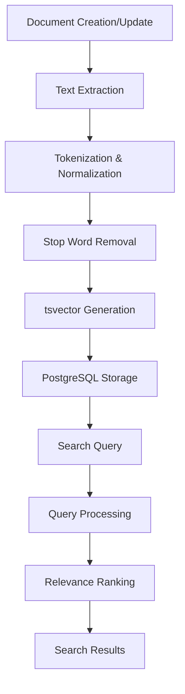
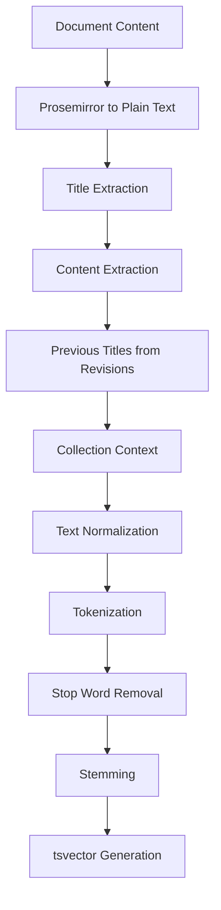
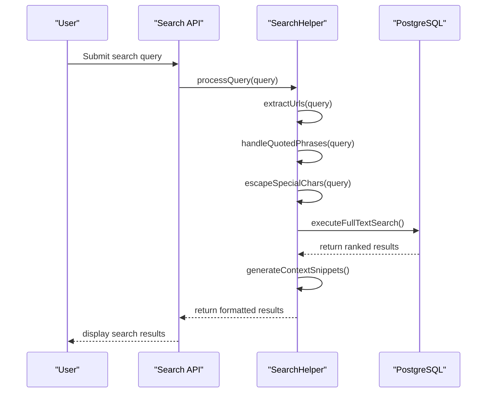

# Search Indexing

<cite>
**Referenced Files in This Document**   
- [SearchHelper.ts](file://server/models/helpers/SearchHelper.ts)
- [Document.ts](file://server/models/Document.ts)
- [Collection.ts](file://server/models/Collection.ts)
</cite>

## Table of Contents
1. [Introduction](#introduction)
2. [Indexing Architecture](#indexing-architecture)
3. [Text Extraction and Processing](#text-extraction-and-processing)
4. [Search Query Processing](#search-query-processing)
5. [Performance Optimization](#performance-optimization)
6. [Configuration and Scaling](#configuration-and-scaling)
7. [Troubleshooting Guide](#troubleshooting-guide)

## Introduction
The search indexing system in the baozi application provides full-text search capabilities across documents and collections. This system enables users to quickly find relevant content through a sophisticated indexing pipeline that processes document content, metadata, and relationships. The core implementation revolves around PostgreSQL's full-text search capabilities combined with application-level optimizations for relevance ranking and performance.

The indexing system extracts text content from documents, processes it through tokenization and normalization, and stores it in PostgreSQL's `tsvector` format for efficient querying. Documents are indexed with their titles, content, revision history, and metadata, allowing comprehensive search across all textual elements. The system also handles special cases like quoted phrases, URLs, and stop words to provide accurate search results.

**Section sources**
- [SearchHelper.ts](file://server/models/helpers/SearchHelper.ts#L71-L804)

## Indexing Architecture
The search indexing architecture is built around the `SearchHelper` class, which orchestrates the search process across documents and collections. The system uses PostgreSQL's full-text search capabilities with `tsvector` and `tsquery` types to enable efficient text searching. Documents are indexed with a `searchVector` field that contains the processed text content in a format optimized for search operations.

The architecture follows a multi-step process:
1. Text extraction from document content and metadata
2. Text normalization and tokenization
3. Stop word removal and stemming
4. Storage in PostgreSQL `tsvector` format
5. Query processing and result ranking

The system supports both user-specific searches and team-wide searches, with appropriate authorization checks to ensure users only see documents they have access to. Collections are also searchable, with results including both the collection metadata and the documents within.

**Diagram sources**
- [SearchHelper.ts](file://server/models/helpers/SearchHelper.ts#L71-L804)
- [Document.ts](file://server/models/Document.ts#L94-L1314)

**Section sources**
- [SearchHelper.ts](file://server/models/helpers/SearchHelper.ts#L71-L804)
- [Document.ts](file://server/models/Document.ts#L94-L1314)

## Text Extraction and Processing
The text extraction process begins with converting document content from its native format (Prosemirror JSON) to plain text using the `DocumentHelper.toPlainText()` method. This conversion preserves the semantic structure of the document while removing formatting elements that aren't relevant for search.

The system extracts text from multiple sources within a document:
- Document title
- Document content (body text)
- Previous titles (from revision history)
- Collection name (for context)

Text processing involves several key steps:
1. **Normalization**: Converting text to lowercase and removing accents using PostgreSQL's `unaccent` function
2. **Tokenization**: Breaking text into individual words or tokens
3. **Stop word removal**: Filtering out common words that don't contribute to search relevance
4. **Stemming**: Reducing words to their root form to match variations (e.g., "running" → "run")

The system maintains a comprehensive stop word list based on PostgreSQL's English stop word list, which includes common words like "the", "and", "or", "but", etc. This list is implemented as a `Set` for efficient lookup during the processing phase.

**Diagram sources**
- [SearchHelper.ts](file://server/models/helpers/SearchHelper.ts#L71-L804)
- [Document.ts](file://server/models/Document.ts#L94-L1314)

**Section sources**
- [SearchHelper.ts](file://server/models/helpers/SearchHelper.ts#L71-L804)
- [Document.ts](file://server/models/Document.ts#L94-L1314)

## Search Query Processing
The search query processing pipeline handles user input and converts it into efficient database queries. The system supports various query types and implements multiple strategies to ensure comprehensive results:

1. **Full-text search**: Using PostgreSQL's `tsquery` format with ranking based on `ts_rank`
2. **Exact phrase matching**: Supporting quoted phrases in search queries
3. **Fuzzy matching**: Handling partial matches and typos
4. **URL detection**: Special handling for URLs in search queries

The `webSearchQuery()` method transforms user input into a valid PostgreSQL `tsquery` by:
- Escaping special characters
- Handling quoted phrases
- Converting single quotes to `&` operators
- Adding wildcard operators for partial matching

For queries containing URLs, the system extracts the URLs and performs additional `ILIKE` searches to ensure they're found, as full-text search may not reliably match URLs due to their structure. The system limits URL matches to three to prevent performance issues with complex queries.

Search results are ranked using PostgreSQL's `ts_rank` function, which calculates relevance based on factors like:
- Term frequency
- Document length
- Position of matches
- Exact phrase matches

The system also generates contextual snippets around search matches, highlighting the relevant portions of text to help users quickly identify why a document matched their query.

**Diagram sources**
- [SearchHelper.ts](file://server/models/helpers/SearchHelper.ts#L71-L804)

**Section sources**
- [SearchHelper.ts](file://server/models/helpers/SearchHelper.ts#L71-L804)

## Performance Optimization
The search system implements several performance optimizations to handle large document sets efficiently:

1. **Batch Processing**: The system processes search results in batches using pagination parameters (`limit` and `offset`) to prevent memory issues with large result sets.

2. **Incremental Updates**: Documents are re-indexed only when they change, rather than through periodic full re-indexing. This is handled through Sequelize hooks that trigger re-indexing on document creation and updates.

3. **Database Indexing**: The system uses PostgreSQL's GIN (Generalized Inverted Index) indexes on the `searchVector` column for fast full-text search operations. A trigram index is also used on document titles for efficient partial matching.

4. **Caching**: Collection document structures are cached in Redis to avoid expensive database queries when determining document hierarchies.

5. **Query Optimization**: The system combines multiple search strategies:
   - Full-text search using `tsvector` for comprehensive text matching
   - Direct `ILIKE` queries for exact phrase and URL matching
   - Title-only searches for faster results when appropriate

For large document sets, the system prioritizes performance by:
- Limiting the maximum query length to 1000 characters
- Capping the number of URL and quoted phrase matches
- Using efficient data structures like `Set` for stop word lookup
- Minimizing database round trips through batch operations

The system also handles edge cases like syntax errors in search queries by providing user-friendly error messages instead of exposing database errors.

**Section sources**
- [SearchHelper.ts](file://server/models/helpers/SearchHelper.ts#L71-L804)
- [Document.ts](file://server/models/Document.ts#L94-L1314)

## Configuration and Scaling
The search indexing system includes several configuration options and scaling considerations:

1. **Query Length Limit**: The system limits search queries to 1000 characters to prevent performance issues and potential security vulnerabilities.

2. **Stop Word List**: The stop word list is hardcoded in the `SearchHelper` class and based on PostgreSQL's standard English stop word list. This can be customized by modifying the `STOP_WORDS` Set.

3. **Indexing Behavior**: Documents are automatically indexed when created or updated through Sequelize hooks. The system ensures that document changes trigger re-indexing by updating the `searchVector` field.

4. **Scaling Considerations**:
   - **Horizontal Scaling**: The stateless nature of search operations allows for easy horizontal scaling of application servers.
   - **Database Scaling**: PostgreSQL's full-text search capabilities scale well, but very large installations may benefit from read replicas for search queries.
   - **Caching Strategy**: The Redis cache for collection structures helps reduce database load.

5. **Performance Monitoring**: The system includes error handling for invalid search queries and logs performance metrics for slow queries.

To scale the system for very large document collections, consider:
- Implementing search result caching
- Using database partitioning for very large tables
- Adding read replicas for search-heavy workloads
- Monitoring and optimizing the GIN index performance

The system is designed to handle typical workloads efficiently, with optimizations that balance performance and accuracy.

**Section sources**
- [SearchHelper.ts](file://server/models/helpers/SearchHelper.ts#L71-L804)
- [Document.ts](file://server/models/Document.ts#L94-L1314)

## Troubleshooting Guide
Common issues and solutions for the search indexing system:

1. **Invalid Search Queries**: Queries with syntax errors return a "Invalid search query" error. This typically occurs with unbalanced quotes or special characters. The system validates queries and provides user-friendly error messages.

2. **Missing Results**: If expected documents don't appear in search results:
   - Verify the document is published and not archived
   - Check that the user has appropriate permissions
   - Ensure the search term isn't a stop word
   - Verify the text appears in the document content or title

3. **Performance Issues**: For slow search performance:
   - Check that the GIN index on `searchVector` exists and is being used
   - Monitor database performance during search operations
   - Consider the size of the result set and implement pagination
   - Verify that the Redis cache is functioning for collection structures

4. **URL Matching Problems**: URLs may not be found in full-text search due to their structure. The system implements additional `ILIKE` searches specifically for URLs to address this.

5. **Special Character Issues**: Queries with special characters may need escaping. The system automatically escapes special characters like backslashes and colons in search queries.

6. **Relevance Ranking Issues**: If results don't appear in expected order:
   - Verify that `ts_rank` is being calculated correctly
   - Check that exact phrase matches are properly weighted
   - Ensure that title matches are prioritized over content matches

The system includes comprehensive error handling, with invalid search queries caught and converted to user-friendly validation errors rather than exposing database-level errors.

**Section sources**
- [SearchHelper.ts](file://server/models/helpers/SearchHelper.ts#L71-L804)