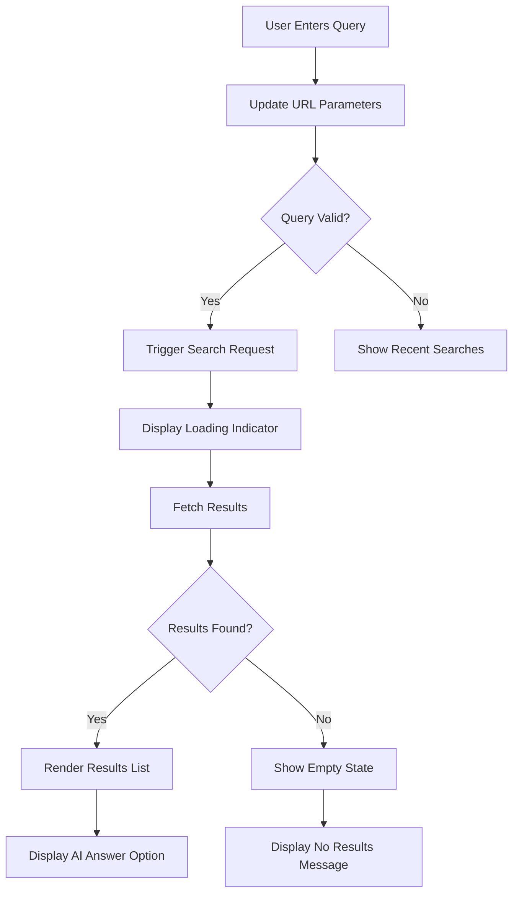
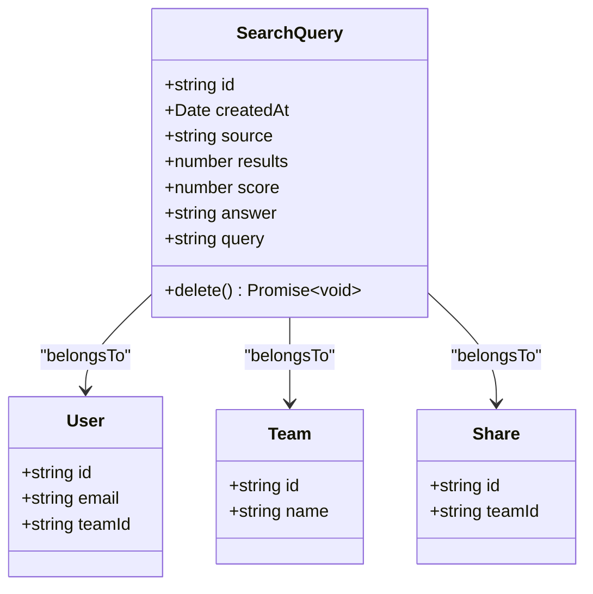
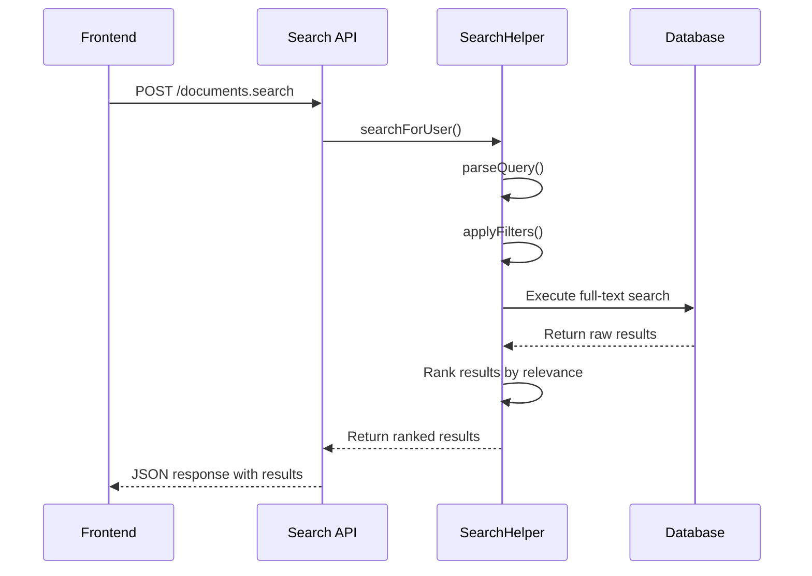

# Search Query Processing

<cite>
**Referenced Files in This Document**   
- [Search.tsx](file://app/scenes/Search/Search.tsx)
- [SearchQuery.ts](file://app/models/SearchQuery.ts)
- [SearchQuery.ts](file://server/models/SearchQuery.ts)
- [searchQuery.ts](file://server/presenters/searchQuery.ts)
- [searches.ts](file://server/routes/api/searches/searches.ts)
- [documents.ts](file://server/routes/api/documents/documents.ts)
- [SearchHelper.ts](file://server/models/helpers/SearchHelper.ts)
</cite>

## Table of Contents
1. [Introduction](#introduction)
2. [Search Query Lifecycle](#search-query-lifecycle)
3. [Frontend Search Interface](#frontend-search-interface)
4. [API Endpoint Implementation](#api-endpoint-implementation)
5. [Search Query Model](#search-query-model)
6. [Result Ranking and Relevance](#result-ranking-and-relevance)
7. [AI-Powered Search Answers](#ai-powered-search-answers)
8. [Query Caching and Performance](#query-caching-and-performance)
9. [Common Issues and Solutions](#common-issues-and-solutions)

## Introduction
The search query processing system in the baozi application provides a comprehensive search functionality that allows users to find documents and content across collections. The system handles natural language queries, processes them through a sophisticated backend, and returns ranked results with optional AI-generated answers. This document details the implementation of the search API endpoint and its integration with the frontend interface, covering the complete request/response flow, query parsing, result ranking, pagination, and performance optimization strategies.

## Search Query Lifecycle
The search query lifecycle begins when a user enters a search term in the frontend interface and ends when results are displayed and optionally stored for future reference. The process involves several key stages: query submission from the frontend, API request handling, database query transformation, result retrieval and ranking, response formatting, and client-side rendering. Each search query is tracked through the SearchQuery model, which records metadata about the query including its source, timestamp, and result count. This lifecycle enables both immediate search results and long-term analysis of search patterns to improve relevance over time.

**Section sources**
- [Search.tsx](file://app/scenes/Search/Search.tsx#L41-L367)
- [documents.ts](file://server/routes/api/documents/documents.ts#L1033-L1175)

## Frontend Search Interface
The frontend search interface is implemented in the Search component located at app/scenes/Search/Search.tsx. This React component provides a user-friendly search experience with multiple filter options including collection, user, date, and document type filters. The interface uses React hooks such as useQuery, usePaginatedRequest, and useStores to manage state and data fetching. When a user enters a search query, the component updates the URL query parameters and triggers a search request through the documents store. The search input supports keyboard navigation and special key handling for improved accessibility. Recent searches are displayed when no query is active, providing quick access to previously performed searches.

**Diagram sources**
- [Search.tsx](file://app/scenes/Search/Search.tsx#L41-L367)

**Section sources**
- [Search.tsx](file://app/scenes/Search/Search.tsx#L41-L367)

## API Endpoint Implementation
The search API endpoint is implemented in server/routes/api/documents/documents.ts and handles POST requests to the /documents.search endpoint. The endpoint accepts various parameters including the search query, collection ID, user ID, document ID, date filter, and status filter. It processes these parameters to construct a database query that retrieves relevant documents. The implementation includes comprehensive authorization checks to ensure users can only access documents they have permission to view. For shared documents, the endpoint verifies access through the share ID. The response includes pagination information, search results with contextual snippets, and policy data for client-side authorization. Search queries are recorded in the database when requesting the first page of results to track user search history.

**Section sources**
- [documents.ts](file://server/routes/api/documents/documents.ts#L1033-L1175)

## Search Query Model
The SearchQuery model serves as the foundation for tracking and analyzing user search behavior across the application. Implemented in both frontend (app/models/SearchQuery.ts) and backend (server/models/SearchQuery.ts) components, this model captures essential metadata about each search query. Key attributes include the query string (automatically truncated to 255 characters), source identifier (distinguishing between app, API, Slack, and OAuth origins), creation timestamp, result count, user score, and AI-generated answer. The model establishes relationships with User, Team, and Share entities, enabling comprehensive analysis of search patterns within organizational contexts. On the frontend, the model extends the base Model class with a delete method that removes search queries both locally and on the server.

**Diagram sources**
- [SearchQuery.ts](file://app/models/SearchQuery.ts#L3-L33)
- [SearchQuery.ts](file://server/models/SearchQuery.ts#L18-L95)

**Section sources**
- [SearchQuery.ts](file://app/models/SearchQuery.ts#L3-L33)
- [SearchQuery.ts](file://server/models/SearchQuery.ts#L18-L95)

## Result Ranking and Relevance
Result ranking in the baozi application is handled by the SearchHelper class in server/models/helpers/SearchHelper.ts. The system employs a multi-faceted approach to determine relevance, combining full-text search capabilities with contextual ranking factors. Natural language queries are transformed into database queries using PostgreSQL's full-text search functionality, with special handling for quoted phrases and special characters. The search query is processed to escape special characters and apply appropriate wildcards for prefix matching. Results are ranked based on factors including document relevance to the query, recency, and user-specific preferences. The system also supports filtering by various criteria such as date ranges, document status, and specific collections, allowing users to refine their search results for greater precision.

**Diagram sources**
- [documents.ts](file://server/routes/api/documents/documents.ts#L1033-L1175)
- [SearchHelper.ts](file://server/models/helpers/SearchHelper.ts#L71-L804)

**Section sources**
- [SearchHelper.ts](file://server/models/helpers/SearchHelper.ts#L71-L804)

## AI-Powered Search Answers
The AI-powered search answers feature provides direct responses to user queries by analyzing document content and generating concise summaries. This functionality is integrated into the frontend search interface through the AISearchAnswer component, which is conditionally rendered when the aiAnswerEnabled flag is true and a valid query exists. The AI system analyzes the search results and document content to generate a natural language answer that directly addresses the user's query. Users can toggle this feature on or off using the AI Answer switch in the search interface. The generated answers are stored in the SearchQuery model's answer field, allowing for future reference and analysis of AI performance. This feature enhances the search experience by providing immediate insights without requiring users to manually review multiple documents.

**Section sources**
- [Search.tsx](file://app/scenes/Search/Search.tsx#L299-L309)
- [AISearchAnswer.tsx](file://app/components/AISearchAnswer.tsx)

## Query Caching and Performance
The search system implements several performance optimization strategies to ensure responsive query processing and result retrieval. While explicit caching mechanisms are not detailed in the provided code, the architecture supports efficient data access through pagination and incremental loading. The usePaginatedRequest hook in the frontend handles lazy loading of search results, reducing initial load times and memory usage. The backend API endpoint processes queries efficiently by leveraging database indexing and full-text search capabilities. Future performance improvements could include implementing query result caching, pre-fetching likely search results based on user behavior, and optimizing database queries for complex search patterns. The system also includes safeguards against overly complex queries by limiting query length and using parameterized queries to prevent injection attacks.

**Section sources**
- [Search.tsx](file://app/scenes/Search/Search.tsx#L127-L129)
- [documents.ts](file://server/routes/api/documents/documents.ts#L1033-L1175)

## Common Issues and Solutions
Common issues in the search query processing system include slow query performance, incomplete result sets, and relevance ranking inaccuracies. Slow performance can be addressed through query optimization, database indexing improvements, and implementing result caching strategies. Incomplete results may occur due to permission restrictions or filtering criteria, which can be mitigated by providing clearer feedback to users about why certain documents are not appearing in results. Relevance ranking issues can be improved by refining the search algorithm and incorporating user feedback through the score attribute in the SearchQuery model. The system already includes safeguards against common issues such as excessively long queries and unauthorized access attempts. Additional improvements could include implementing query suggestion functionality, enhancing error handling for failed searches, and providing more detailed analytics about search performance.

**Section sources**
- [documents.ts](file://server/routes/api/documents/documents.ts#L1033-L1175)
- [Search.tsx](file://app/scenes/Search/Search.tsx#L311-L322)