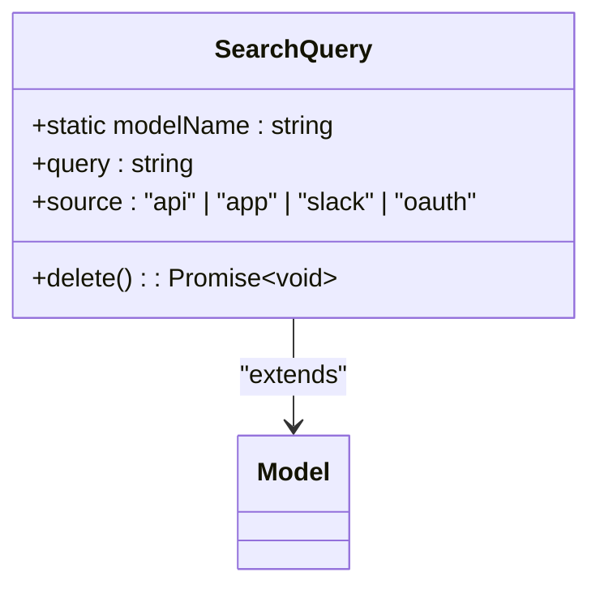
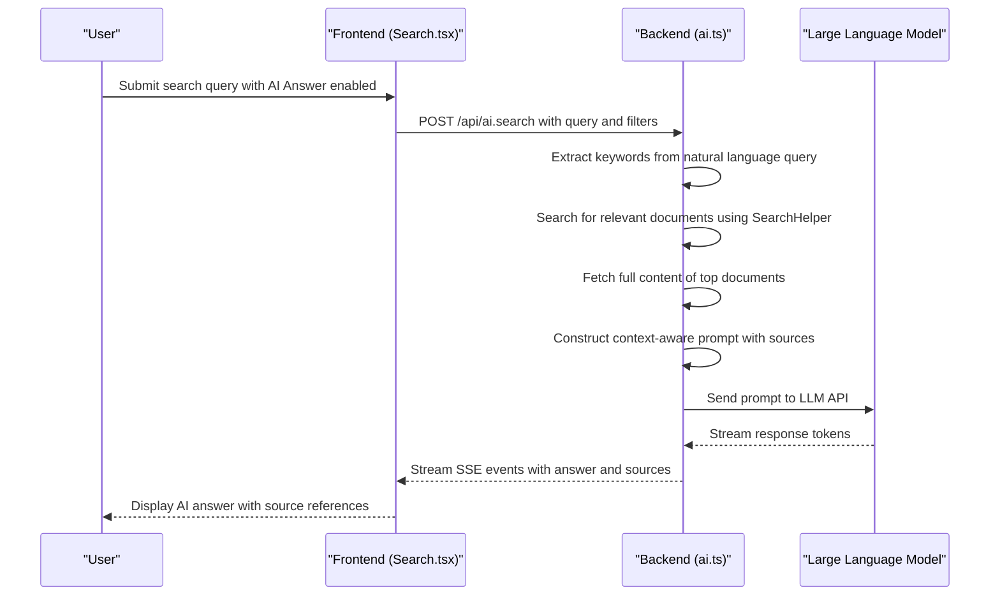

# Search System

<cite>
**Referenced Files in This Document**   
- [searchIndexer.ts](file://server/models/helpers/SearchHelper.ts)
- [server/routes/api/search/](file://server/routes/api/ai/ai.ts)
- [SearchHelper.ts](file://server/models/helpers/SearchHelper.ts)
- [SearchQuery.ts](file://app/models/SearchQuery.ts)
- [AISearchAnswer.tsx](file://app/components/AISearchAnswer.tsx)
- [Search.tsx](file://app/scenes/Search/Search.tsx)
</cite>

## Table of Contents
1. [Introduction](#introduction)
2. [Search Indexing Process](#search-indexing-process)
3. [Search Query Processing Pipeline](#search-query-processing-pipeline)
4. [SearchHelper Utilities](#searchhelper-utilities)
5. [SearchQuery Model](#searchquery-model)
6. [AI-Powered Search Answers](#ai-powered-search-answers)
7. [Customization and Extension](#customization-and-extension)
8. [Performance Optimization](#performance-optimization)
9. [Conclusion](#conclusion)

## Introduction
The baozi application provides a comprehensive full-text search system that enables users to efficiently find documents and content across collections. The search system combines traditional full-text indexing with AI-powered natural language processing to deliver relevant results and direct answers to user queries. This document explains the architecture and implementation of the search system, covering the indexing process, query pipeline, utility functions, and AI integration features.

## Search Indexing Process
The search indexing process in the baozi application is implemented through PostgreSQL's full-text search capabilities, with the SearchHelper class orchestrating the indexing logic. Documents are indexed using PostgreSQL's tsvector functionality, which creates optimized search vectors from document content and metadata. The indexing process automatically handles text normalization, including case folding, accent removal, and stop word filtering to improve search relevance. When documents are created or updated, their content is processed and stored in a dedicated searchVector column that enables efficient querying. The system also maintains separate indexes for document titles and metadata fields to support targeted searches.

**Section sources**
- [SearchHelper.ts](file://server/models/helpers/SearchHelper.ts#L0-L806)

## Search Query Processing Pipeline
The search query processing pipeline handles user search requests through a multi-stage process that begins with the API endpoint in server/routes/api/ai/ai.ts. When a user submits a search query, the request is validated and processed by the searchForUser method in SearchHelper. The pipeline first parses the query string, applying transformations to handle special characters and quoted phrases. It then constructs a database query that combines full-text search on the searchVector column with additional filters for collection, date ranges, and document status. The results are ranked using PostgreSQL's ts_rank function, which calculates relevance scores based on term frequency and proximity. Finally, contextual snippets are generated around matching terms to help users quickly identify relevant content.

**Section sources**
- [ai.ts](file://server/routes/api/ai/ai.ts#L0-L1394)
- [SearchHelper.ts](file://server/models/helpers/SearchHelper.ts#L0-L806)

## SearchHelper Utilities
The SearchHelper utilities implement the core search algorithms and ranking logic for the baozi application. This class provides methods for searching across different scopes (team-wide, user-specific, collection-specific) with consistent ranking and filtering behavior. The search algorithms use PostgreSQL's full-text search functions with custom configurations to optimize for document search use cases. Key features include support for quoted phrase matching, URL detection, and intelligent handling of special characters. The ranking logic combines multiple factors including term frequency, document recency, and field weighting (title vs. content). The utilities also implement snippet generation that highlights matching terms and provides context around search results.

```mermaid
classDiagram
class SearchHelper {
+static maxQueryLength : number
+static searchForTeam(team, options) : Promise~SearchResponse~
+static searchForUser(user, options) : Promise~SearchResponse~
+static searchTitlesForUser(user, options) : Promise~Document[]~
-static buildFindOptions(query) : FindOptions
-static buildWhere(model, options) : WhereOptions
-static buildResultContext(document, query) : string
-static webSearchQuery(query) : string
-static escapeQuery(query) : string
-static removeStopWords(query) : string
}
class SearchOptions {
+limit : number
+offset : number
+query : string
+collectionId : string
+share : Share
+dateFilter : DateFilter
+statusFilter : StatusFilter[]
+documentIds : string[]
+collaboratorIds : string[]
+snippetMinWords : number
+snippetMaxWords : number
}
class SearchResponse {
+results : {ranking : number, context : string, document : Document}[]
+total : number
}
SearchHelper --> SearchOptions : "accepts"
SearchHelper --> SearchResponse : "returns"
```

**Diagram sources**
- [SearchHelper.ts](file://server/models/helpers/SearchHelper.ts#L0-L806)

**Section sources**
- [SearchHelper.ts](file://server/models/helpers/SearchHelper.ts#L0-L806)

## SearchQuery Model
The SearchQuery model tracks user search history and preferences within the baozi application. This model stores the query string, source of the search (app, api, slack, oauth), and associated metadata. The model implements client-side functionality for managing search history, including the ability to delete individual search queries from the user's history. The query property is automatically truncated to 255 characters to ensure database compatibility and performance. The model integrates with the SearchesStore to maintain a synchronized view of recent searches across the application. This enables features like search autocomplete and recent search suggestions that improve the user experience.



**Diagram sources**
- [SearchQuery.ts](file://app/models/SearchQuery.ts#L0-L37)

**Section sources**
- [SearchQuery.ts](file://app/models/SearchQuery.ts#L0-L37)

## AI-Powered Search Answers
The AI-powered search answers feature provides direct responses to natural language queries by leveraging large language models (LLMs). When enabled, the system first performs a traditional search to identify relevant documents, then uses an LLM to generate a concise answer based on the content of those documents. The AISearchAnswer component handles the frontend integration, displaying the AI-generated answer with proper formatting and source citations. The backend implementation in ai.ts processes the search results, constructs a context-aware prompt for the LLM, and streams the response back to the client. The system supports configurable LLM providers through environment variables and includes fallback mechanisms for handling rate limits or service outages. Source documents are properly attributed with hyperlinks, allowing users to verify the information.



**Diagram sources**
- [AISearchAnswer.tsx](file://app/components/AISearchAnswer.tsx#L0-L517)
- [Search.tsx](file://app/scenes/Search/Search.tsx#L0-L425)
- [ai.ts](file://server/routes/api/ai/ai.ts#L0-L1394)

**Section sources**
- [AISearchAnswer.tsx](file://app/components/AISearchAnswer.tsx#L0-L517)
- [Search.tsx](file://app/scenes/Search/Search.tsx#L0-L425)
- [ai.ts](file://server/routes/api/ai/ai.ts#L0-L1394)

## Customization and Extension
The search system in the baozi application can be customized and extended to support new data sources and search behaviors. The modular design of the SearchHelper class allows for adding new search scopes or modifying ranking algorithms without affecting existing functionality. To extend the system with new data sources, developers can implement additional search methods that follow the same pattern as existing ones, ensuring consistency in the API and response format. The system supports configuration through environment variables for AI-related features, allowing different LLM providers to be used without code changes. Custom search filters can be added by extending the SearchOptions interface and updating the buildWhere method to handle new filter types. The event-driven architecture also enables integration with external systems through webhooks or message queues.

## Performance Optimization
The search system implements several performance optimizations to ensure responsive queries even with large document collections. The primary optimization is the use of PostgreSQL's full-text search indexes, which provide sub-second response times for most queries. The system implements query result caching at multiple levels, including database query caching and application-level result caching. For AI-powered answers, the system limits the number of documents processed (default: 5) to control token usage and response time. The search pipeline is designed to execute database operations in parallel where possible, reducing overall latency. Additional optimizations include efficient text processing algorithms, connection pooling, and query result pagination to minimize memory usage. The system also implements rate limiting and request queuing to maintain stability under heavy load.

## Conclusion
The baozi application's search system provides a robust and extensible full-text search capability that combines traditional database indexing with modern AI-powered features. The architecture separates concerns between indexing, query processing, and result presentation, enabling efficient maintenance and future enhancements. The integration of AI-generated answers represents a significant advancement in search usability, allowing users to get direct responses to natural language questions while maintaining proper attribution to source documents. The system's modular design and comprehensive API make it well-suited for customization and extension to meet evolving user needs.