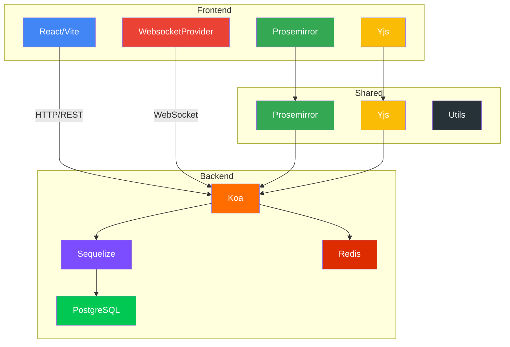
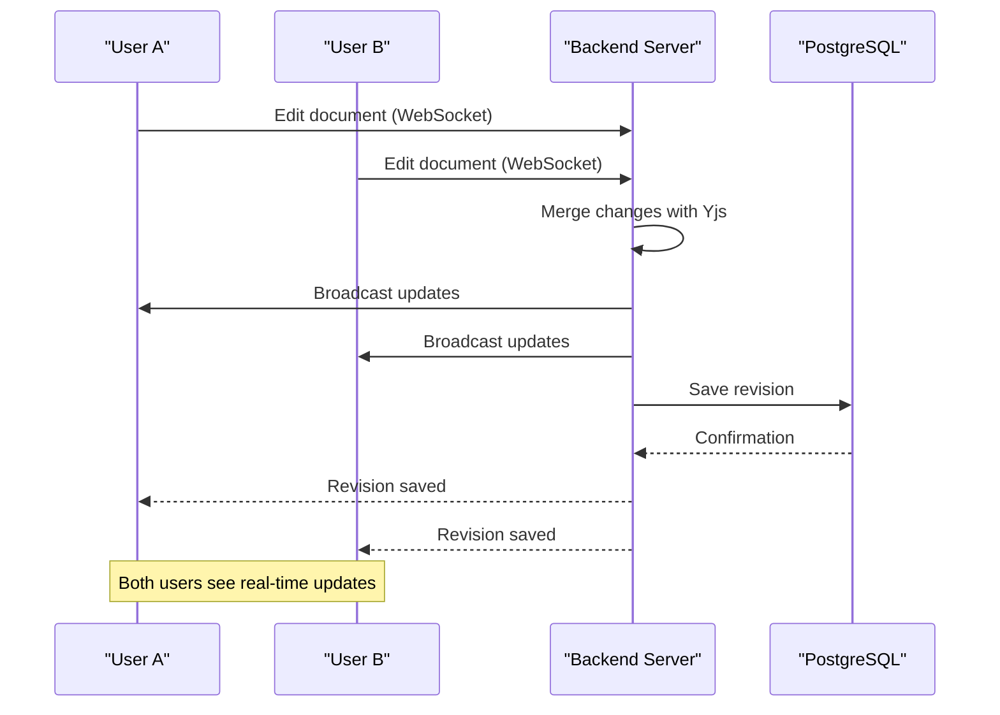
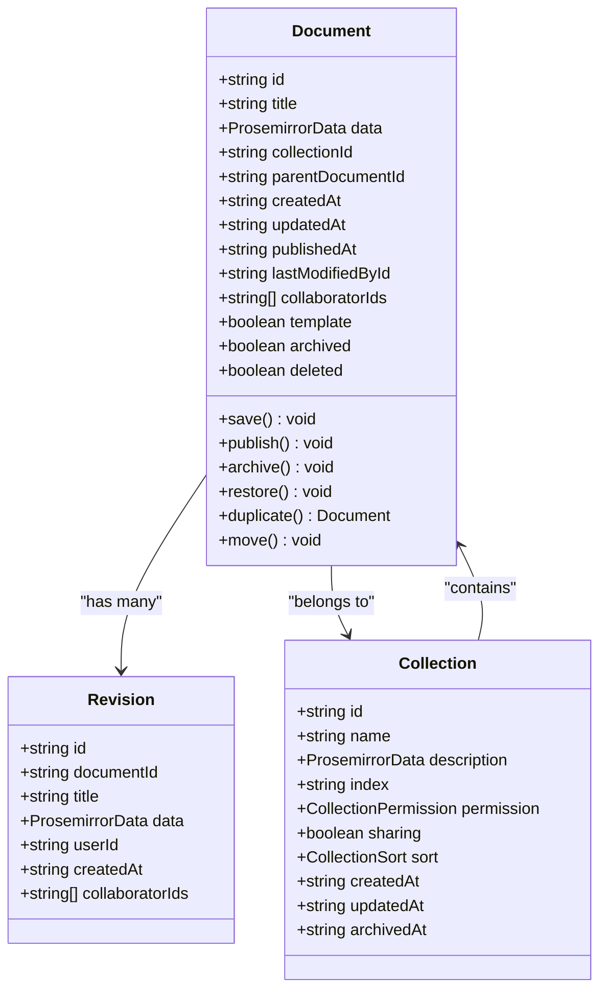
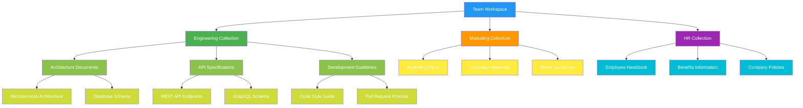
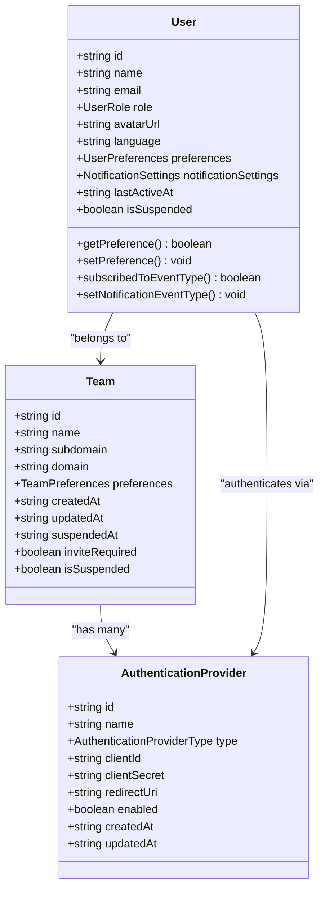
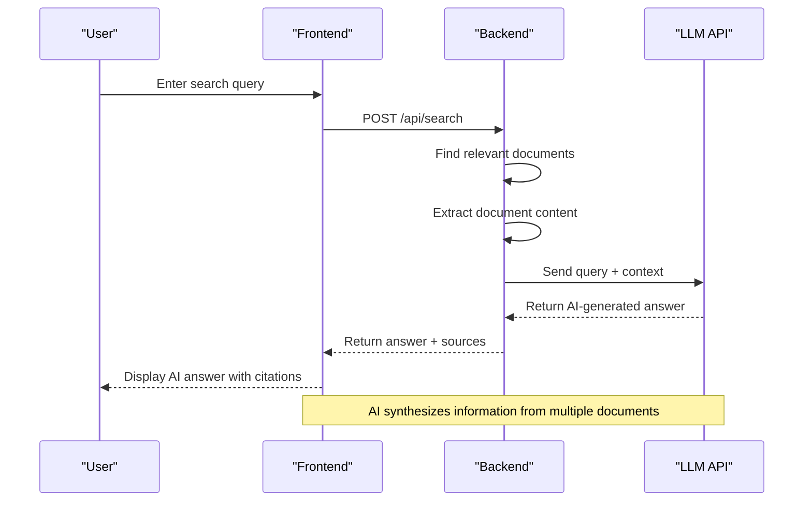
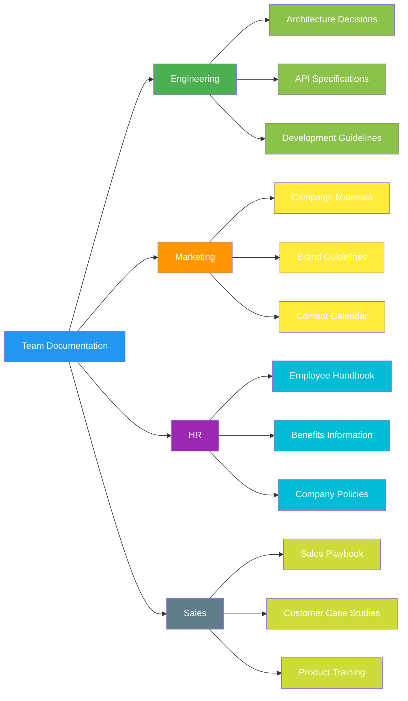

# System Overview

<cite>
**Referenced Files in This Document**   
- [Collection.ts](file://app/models/Collection.ts#L19-L455)
- [Document.ts](file://app/models/Document.ts#L39-L703)
- [Revision.ts](file://app/models/Revision.ts#L9-L67)
- [Share.ts](file://app/models/Share.ts#L12-L129)
- [AISearchAnswer.tsx](file://app/components/AISearchAnswer.tsx#L0-L38)
- [Search.tsx](file://app/scenes/Search/Search.tsx#L0-L100)
- [WebsocketProvider.tsx](file://app/components/WebsocketProvider.tsx#L5-L10)
- [collaboration](file://server/collaboration#L1-L10)
- [editor](file://shared/editor#L1-L5)
</cite>

## Table of Contents
1. [Introduction](#introduction)
2. [Core Components](#core-components)
3. [Architecture Overview](#architecture-overview)
4. [Real-Time Collaboration](#real-time-collaboration)
5. [Document Management](#document-management)
6. [Collection Organization](#collection-organization)
7. [User Authentication](#user-authentication)
8. [AI-Powered Search](#ai-powered-search)
9. [Practical Use Cases](#practical-use-cases)
10. [Conclusion](#conclusion)

## Introduction

The baozi collaborative knowledge base platform is a team-oriented knowledge management system designed to facilitate real-time collaboration, structured content organization, and seamless information sharing. Built with modern web technologies, the platform enables teams to create, organize, and maintain comprehensive knowledge bases that serve as central repositories for documentation, processes, and institutional knowledge.

The system's primary value proposition lies in its ability to transform static documentation into a dynamic, collaborative workspace where team members can simultaneously edit documents, track changes, and maintain version history. This approach eliminates the friction associated with traditional document management systems and promotes a culture of continuous knowledge improvement.

At its core, the platform revolves around several key concepts that structure the user experience:
- **Collections**: Organizational containers that group related documents, similar to folders or workspaces
- **Documents**: Individual content units that can be collaboratively edited and versioned
- **Revisions**: Historical snapshots that capture document changes over time
- **Shares**: Mechanisms for securely distributing content to internal and external stakeholders

The platform's architecture is designed to support these concepts through a robust technology stack that combines React/Vite for the frontend, Koa/Sequelize for the backend, and Prosemirror/Yjs for real-time collaborative editing. This combination enables a responsive user interface, scalable server infrastructure, and seamless multi-user editing experiences.

## Core Components

The baozi platform consists of several interconnected components that work together to provide a comprehensive knowledge management solution. The frontend, built with React and Vite, provides a responsive and intuitive user interface that leverages modern web standards for optimal performance. The backend, implemented with Koa and Sequelize, handles business logic, data persistence, and API routing, ensuring reliable and scalable server operations.

Shared components play a crucial role in maintaining consistency across the platform. Prosemirror serves as the rich text editor framework, providing advanced document editing capabilities with support for various content types and formatting options. Yjs enables real-time collaboration by implementing conflict-free replicated data types (CRDTs) that synchronize document state across multiple clients without requiring centralized coordination.

The relationship between these components follows a clean separation of concerns. The frontend communicates with the backend through well-defined API endpoints, while shared components provide common functionality that can be leveraged by both client and server code. This architectural approach ensures maintainability, testability, and extensibility, allowing the platform to evolve while preserving its core functionality.

**Section sources**
- [vite.config.ts](file://vite.config.ts#L1-L10)
- [server/index.ts](file://server/index.ts#L1-L20)
- [shared/editor](file://shared/editor#L1-L5)

## Architecture Overview

The baozi platform follows a three-tier architecture that separates concerns between presentation, business logic, and data storage layers. This design enables independent development and scaling of each component while maintaining clear interfaces between them.

**Diagram sources **
- [vite.config.ts](file://vite.config.ts#L1-L10)
- [server/index.ts](file://server/index.ts#L1-L20)
- [shared/editor](file://shared/editor#L1-L5)
- [app/components/WebsocketProvider.tsx](file://app/components/WebsocketProvider.tsx#L5-L10)

The frontend layer, built with React and Vite, provides a responsive user interface that leverages modern web standards for optimal performance. React's component-based architecture enables reusable UI elements, while Vite's build tooling ensures fast development cycles and optimized production bundles. The editor component, powered by Prosemirror, offers rich text editing capabilities with support for various content types and formatting options.

The backend layer, implemented with Koa and Sequelize, handles business logic, data persistence, and API routing. Koa, a lightweight Node.js framework, provides a robust foundation for building scalable server applications with middleware support for authentication, logging, and error handling. Sequelize, an ORM for Node.js, abstracts database interactions and provides a clean interface for working with the PostgreSQL database.

Real-time collaboration is enabled through WebSockets and the Yjs library, which implements conflict-free replicated data types (CRDTs) for seamless multi-user editing. The WebsocketProvider component manages the WebSocket connection and synchronizes document state across clients, ensuring that all users see consistent content regardless of their location or network conditions.

## Real-Time Collaboration

The real-time collaboration feature is a cornerstone of the baozi platform, enabling multiple users to simultaneously edit documents with immediate synchronization. This capability is implemented using Yjs, a CRDT-based library that ensures conflict-free replication of document state across distributed clients. When multiple users edit the same document, Yjs automatically resolves conflicts by merging changes in a way that preserves the intent of all collaborators.

The collaboration system follows a client-server architecture where the frontend clients maintain local document state and communicate changes through WebSockets to the backend server. The server acts as a coordination point, validating changes and broadcasting updates to all connected clients. This approach ensures data consistency while minimizing latency for individual users.

**Diagram sources **
- [server/collaboration](file://server/collaboration#L1-L10)
- [app/components/WebsocketProvider.tsx](file://app/components/WebsocketProvider.tsx#L5-L10)
- [shared/editor](file://shared/editor#L1-L5)

The collaboration system also includes presence indicators that show which users are currently viewing or editing a document. This feature enhances team awareness and facilitates spontaneous collaboration by making it easy to see who is working on a particular piece of content. Additionally, the system supports operational transformation, ensuring that changes are applied in a consistent order across all clients even when network conditions vary.

To ensure data integrity, the platform implements revision history that captures significant changes to documents over time. Each revision is timestamped and associated with the user who made the changes, providing an audit trail that can be used for accountability and recovery purposes. Users can browse through revision history and restore previous versions when needed, adding an extra layer of protection against accidental changes.

## Document Management

The document management system in the baozi platform provides a comprehensive solution for creating, organizing, and maintaining content. Documents serve as the fundamental building blocks of the knowledge base, supporting rich text editing, version control, and collaborative workflows. The system is designed to accommodate various content types, from simple notes to complex technical documentation, while maintaining consistency and discoverability.

Each document is represented as a Prosemirror document, which provides a structured data model for rich text content. This approach enables advanced formatting capabilities, including headings, lists, code blocks, and embedded media, while ensuring that content remains portable and accessible. Documents can be organized hierarchically within collections, creating a logical structure that mirrors the organization's information architecture.

**Diagram sources **
- [app/models/Document.ts](file://app/models/Document.ts#L39-L703)
- [app/models/Revision.ts](file://app/models/Revision.ts#L9-L67)
- [app/models/Collection.ts](file://app/models/Collection.ts#L19-L455)

The document lifecycle is managed through a series of states and transitions that reflect the content's maturity and accessibility. Documents can be created as drafts, published for team-wide access, archived for historical reference, or permanently deleted when no longer needed. This state management system provides clear semantics for content governance and helps teams maintain organized knowledge bases.

Version control is implemented through the revision system, which automatically creates snapshots of documents at significant points in their lifecycle. Revisions are created when documents are published, when major edits are made, or when users explicitly save a version. This approach balances the need for comprehensive history with performance considerations, ensuring that the system remains responsive even with extensive content.

## Collection Organization

Collections serve as the primary organizational unit in the baozi platform, providing a way to group related documents and establish access controls. Think of collections as folders or workspaces that contain documents on a specific topic, project, or department. This hierarchical organization enables teams to structure their knowledge base in a way that reflects their organizational structure and information architecture.

Each collection has configurable permissions that determine who can access its contents. The platform supports various permission levels, from public access to restricted membership, allowing teams to control the visibility of sensitive information. Collections can be shared with specific users or groups, and administrators can manage membership through a dedicated interface.

**Diagram sources **
- [app/models/Collection.ts](file://app/models/Collection.ts#L19-L455)
- [app/models/Document.ts](file://app/models/Document.ts#L39-L703)

Collections also support sorting and filtering options that help users navigate large amounts of content. Documents within a collection can be sorted by title, creation date, or custom index, and users can filter content based on status, author, or other metadata. This flexibility ensures that teams can find the information they need quickly, even as their knowledge base grows.

The platform includes features for managing collection metadata, such as descriptions, icons, and colors, which help distinguish different collections at a glance. These visual cues enhance usability and make it easier for users to identify the right collection for their needs. Additionally, collections can be nested or organized hierarchically, providing additional flexibility for complex information architectures.

## User Authentication

The user authentication system in the baozi platform provides secure access control and identity management for team members. The system supports multiple authentication methods, including email/password, social login providers, and enterprise identity solutions, ensuring that teams can integrate the platform with their existing identity infrastructure.

User roles and permissions are managed through a flexible access control system that supports various levels of access, from administrators with full control to viewers with read-only access. This role-based access control (RBAC) system enables organizations to enforce security policies and ensure that users only have access to the information they need to perform their jobs.

**Diagram sources **
- [app/models/User.ts](file://app/models/User.ts#L22-L245)
- [server/models/User.ts](file://server/models/User.ts#L81-L856)
- [server/models/Team.ts](file://server/models/Team.ts#L1-L50)

The authentication system integrates with the platform's collaboration features, ensuring that user identities are properly attributed to document changes and revisions. When users edit documents, their actions are recorded with their user ID, creating an audit trail that can be used for accountability and troubleshooting. This integration also enables presence indicators that show which users are currently viewing or editing a document.

Security is a primary consideration in the authentication design, with features like JWT-based session management, secure password storage, and protection against common web vulnerabilities. The system implements rate limiting, CSRF protection, and other security measures to protect against unauthorized access and abuse. Additionally, administrators can monitor user activity and manage security settings through a dedicated interface.

## AI-Powered Search

The AI-powered search feature enhances the platform's information retrieval capabilities by providing intelligent, context-aware answers to user queries. When enabled, this feature searches through relevant documents and uses artificial intelligence to generate comprehensive answers with proper source citations. This approach transforms the search experience from simple keyword matching to intelligent knowledge synthesis.

The AI search system works by first identifying relevant documents based on the user's query, then extracting content from those documents to create context for the AI model. The system sends this context along with the original query to a configured LLM (Large Language Model), which generates a concise answer that synthesizes information from multiple sources. The response includes citations to the source documents, allowing users to verify the information and explore the original content.

**Diagram sources **
- [app/components/AISearchAnswer.tsx](file://app/components/AISearchAnswer.tsx#L0-L38)
- [app/scenes/Search/Search.tsx](file://app/scenes/Search/Search.tsx#L0-L100)
- [server/routes/api/ai/ai.ts](file://server/routes/api/ai/ai.ts#L1-L50)

The AI search feature respects all document permissions, ensuring that users only receive information from documents they have access to. This security model prevents information leakage and maintains the integrity of the platform's access control system. The feature can be toggled on or off per search, giving users control over when to use AI assistance.

The system is designed to be extensible, supporting various LLM providers through configuration. Organizations can use public cloud services like OpenAI or deploy private models for enhanced data privacy. The platform also includes configuration options for controlling the behavior of AI responses, such as response length, citation format, and language preferences.

## Practical Use Cases

The baozi platform supports a wide range of practical use cases that address common challenges in team collaboration and knowledge management. These use cases demonstrate how the platform's features can be leveraged to improve productivity, enhance communication, and preserve institutional knowledge.

Team documentation is one of the most common use cases, where organizations use the platform to create and maintain comprehensive documentation for processes, procedures, and best practices. Engineering teams can document architecture decisions, API specifications, and development guidelines, while marketing teams can maintain campaign materials, brand guidelines, and content calendars. The real-time collaboration features enable teams to co-author documentation, ensuring that knowledge is captured while it's fresh and accurate.

**Diagram sources **
- [app/models/Collection.ts](file://app/models/Collection.ts#L19-L455)
- [app/models/Document.ts](file://app/models/Document.ts#L39-L703)
- [app/models/Share.ts](file://app/models/Share.ts#L12-L129)

Collaborative editing is another key use case, where team members work together on documents in real time. This capability is particularly valuable for brainstorming sessions, meeting notes, and project planning, where multiple perspectives need to be captured simultaneously. The platform's presence indicators and revision history provide transparency into the editing process, reducing conflicts and ensuring that all contributions are recognized.

Knowledge sharing extends beyond internal teams, as the platform supports secure sharing of content with external stakeholders. Organizations can create public-facing documentation sites, share project updates with clients, or collaborate with partners on joint initiatives. The sharing system includes controls for expiration, access restrictions, and content indexing, ensuring that shared information remains secure and up-to-date.

## Conclusion

The baozi collaborative knowledge base platform represents a comprehensive solution for team-oriented knowledge management, combining robust document management, real-time collaboration, and intelligent search capabilities. By leveraging modern web technologies and thoughtful architectural design, the platform addresses the challenges of information silos, version conflicts, and knowledge loss that plague many organizations.

The integration of React/Vite, Koa/Sequelize, and Prosemirror/Yjs creates a powerful foundation that balances performance, scalability, and user experience. This technology stack enables a responsive frontend, reliable backend operations, and seamless multi-user editing, all while maintaining a clean separation of concerns that facilitates maintenance and extension.

The platform's focus on collections, documents, revisions, and shares provides a coherent mental model for users, making it easy to organize and access information. The real-time collaboration features enhance team productivity by enabling simultaneous editing and immediate feedback, while the AI-powered search transforms information retrieval from simple keyword matching to intelligent knowledge synthesis.

As organizations continue to grapple with information overload and distributed workforces, the baozi platform offers a compelling solution for creating, organizing, and sharing knowledge in a way that is both efficient and effective. By providing the tools for collaborative authoring, structured organization, and intelligent discovery, the platform helps teams build comprehensive knowledge bases that serve as valuable assets for onboarding, decision-making, and continuous improvement.