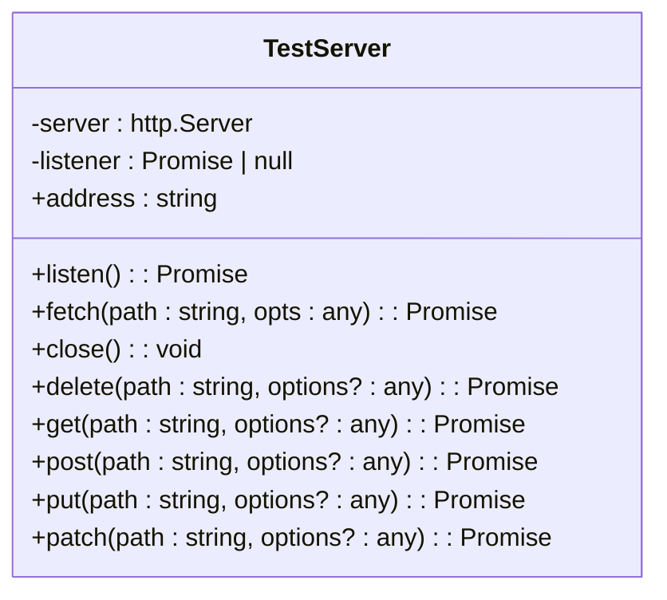
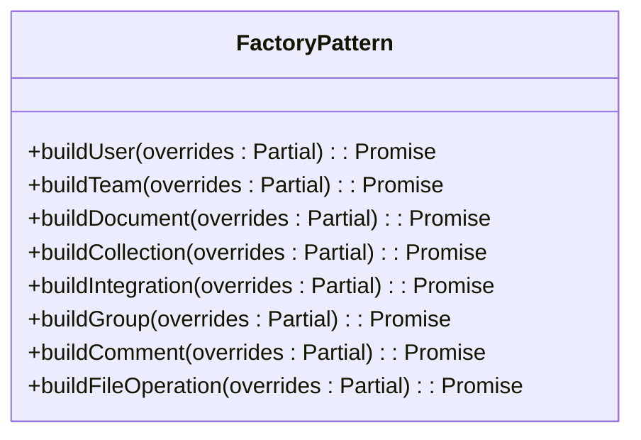

# Integration Testing

<cite>
**Referenced Files in This Document**   
- [TestServer.ts](file://server/test/TestServer.ts)
- [factories.ts](file://server/test/factories.ts)
- [support.ts](file://server/test/support.ts)
- [setup.ts](file://server/test/setup.ts)
</cite>

## Table of Contents
1. [Integration Testing Overview](#integration-testing-overview)
2. [TestServer for Isolated Environments](#testserver-for-isolated-environments)
3. [Component Interaction Validation](#component-interaction-validation)
4. [Factory Pattern for Test Scenarios](#factory-pattern-for-test-scenarios)
5. [Database and Transaction Management](#database-and-transaction-management)
6. [Test Data Isolation and Cleanup](#test-data-isolation-and-cleanup)
7. [API Endpoint Integration Testing](#api-endpoint-integration-testing)
8. [Service Layer Integration Testing](#service-layer-integration-testing)
9. [Background Job Handling](#background-job-handling)
10. [Performance and Reliability Guidelines](#performance-and-reliability-guidelines)

## Integration Testing Overview

Integration testing in the baozi application focuses on verifying the collaboration between frontend stores, API clients, and backend services. The testing framework ensures that components work together as expected in a simulated production environment. Integration tests validate data consistency across multiple models, verify proper transaction management, and ensure that service layer integrations function correctly. The framework uses isolated test environments to prevent interference between test cases and maintains data integrity through proper cleanup procedures.

**Section sources**
- [TestServer.ts](file://server/test/TestServer.ts#L1-L83)
- [support.ts](file://server/test/support.ts#L1-L57)

## TestServer for Isolated Environments

The TestServer class provides a mechanism for creating isolated test environments that simulate real application conditions. It wraps a Koa application instance and creates an HTTP server that listens on a random port during test execution. This approach ensures that each test runs in complete isolation without interfering with other tests or requiring specific port configurations.

**Diagram sources**
- [TestServer.ts](file://server/test/TestServer.ts#L1-L83)

The TestServer automatically handles JSON serialization when sending requests, setting the appropriate Content-Type header and stringifying object bodies. It also provides convenience methods for common HTTP verbs (GET, POST, PUT, DELETE, etc.) that wrap the underlying fetch functionality. The server is automatically cleaned up after all tests complete through the afterEach hook in the test setup.

**Section sources**
- [TestServer.ts](file://server/test/TestServer.ts#L1-L83)
- [support.ts](file://server/test/support.ts#L1-L57)

## Component Interaction Validation

Integration tests validate the interaction between frontend stores, API clients, and backend services through end-to-end scenarios. The testing framework uses the TestServer to simulate API requests and verify that data flows correctly through the system. Tests verify that frontend stores properly update in response to API responses and that backend services correctly process requests and update database records.

The integration testing approach ensures that component boundaries are properly respected and that data consistency is maintained across the application. Tests validate that authentication is properly enforced, authorization policies are applied, and that error conditions are handled gracefully across component boundaries.

**Section sources**
- [TestServer.ts](file://server/test/TestServer.ts#L1-L83)
- [support.ts](file://server/test/support.ts#L1-L57)

## Factory Pattern for Test Scenarios

The testing framework employs a factory pattern to create complex test scenarios with realistic data. Factories provide a convenient way to generate test data for various models while respecting relationships and constraints. Each factory function creates instances with valid default values and handles dependencies between related models.

**Diagram sources**
- [factories.ts](file://server/test/factories.ts#L1-L860)

Factory functions automatically handle dependencies, such as creating a team when building a user if no team is specified, or creating a collection when building a document. This reduces boilerplate code in tests and ensures consistent test data creation. Factories also support overriding default values through the overrides parameter, allowing tests to specify particular attributes while maintaining valid relationships.

**Section sources**
- [factories.ts](file://server/test/factories.ts#L1-L860)

## Database and Transaction Management

Integration tests manage database transactions to ensure data isolation and consistency. Each test runs within its own transaction that is rolled back after the test completes, preventing test data from persisting between tests. This approach ensures that tests are independent and can be run in any order without affecting each other.

The testing framework uses Sequelize's transaction functionality to wrap test execution in a transaction. The withAPIContext helper function creates a transaction and passes it through the API context, ensuring that all database operations within a test use the same transaction. This allows for proper isolation while still enabling the verification of database state changes during test execution.

**Section sources**
- [factories.ts](file://server/test/factories.ts#L1-L860)
- [support.ts](file://server/test/support.ts#L35-L57)

## Test Data Isolation and Cleanup

The testing framework ensures complete test data isolation through multiple mechanisms. Each test runs in its own database transaction that is rolled back after the test completes, preventing any data from persisting between tests. Additionally, the TestServer creates a new HTTP server instance for each test suite, ensuring complete isolation of the application environment.

The setup.ts file configures Jest to mock external dependencies such as Redis and AWS S3, preventing tests from interacting with real services. After each test, the Redis mock is flushed to ensure no state persists between tests. The database connection is closed and the test server is shut down after all tests complete, ensuring complete cleanup of resources.

**Section sources**
- [setup.ts](file://server/test/setup.ts#L1-L49)
- [support.ts](file://server/test/support.ts#L1-L57)

## API Endpoint Integration Testing

API endpoint integration tests verify the complete request-response cycle, from HTTP request to database update and response generation. Tests use the TestServer to make HTTP requests to API endpoints and validate the responses, including status codes, response bodies, and headers. The testing framework supports all HTTP methods and automatically handles JSON serialization.

Tests validate that API endpoints properly authenticate and authorize requests, validate input parameters, and return appropriate error responses for invalid inputs. They also verify that successful requests result in the expected database changes and that the response contains the correct data. The factory pattern simplifies the creation of test data needed for API testing.

**Section sources**
- [TestServer.ts](file://server/test/TestServer.ts#L1-L83)
- [factories.ts](file://server/test/factories.ts#L1-L860)

## Service Layer Integration Testing

Service layer integration tests verify the interaction between business logic components and data access layers. These tests ensure that service methods properly coordinate multiple operations, maintain data consistency, and handle errors appropriately. Tests validate that service methods respect authorization policies and emit appropriate events when state changes occur.

The testing framework allows for testing service layer components in isolation or as part of complete request flows. By using the withAPIContext helper, tests can simulate authenticated requests and verify that service methods behave correctly under various conditions. Tests also verify that service methods properly handle transactions and rollback changes when errors occur.

**Section sources**
- [factories.ts](file://server/test/factories.ts#L1-L860)
- [support.ts](file://server/test/support.ts#L35-L57)

## Background Job Handling

Integration tests account for background jobs and asynchronous operations that may be triggered during test execution. The testing framework ensures that background jobs do not interfere with test isolation or cause timing issues. Mocks are used for external services that might be called by background jobs, preventing tests from making real external requests.

Tests that depend on background job completion can await the completion of specific operations or use polling to check for expected state changes. The factory pattern includes support for creating test data related to background jobs, such as file operations and import tasks, allowing tests to verify the complete lifecycle of asynchronous operations.

**Section sources**
- [factories.ts](file://server/test/factories.ts#L1-L860)
- [setup.ts](file://server/test/setup.ts#L1-L49)

## Performance and Reliability Guidelines

To ensure optimal performance and reliability of integration tests, several guidelines should be followed. Tests should be focused and test a single scenario, avoiding overly complex test cases that are difficult to understand and maintain. The factory pattern should be used to minimize boilerplate code and ensure consistent test data creation.

Tests should avoid dependencies on external services by using mocks and stubs, ensuring consistent test execution regardless of network conditions. Database transactions should be used to isolate test data and ensure quick cleanup. Tests should also avoid hard-coded values when possible, using generated data to prevent conflicts between concurrent test runs.

**Section sources**
- [setup.ts](file://server/test/setup.ts#L1-L49)
- [factories.ts](file://server/test/factories.ts#L1-L860)
- [support.ts](file://server/test/support.ts#L1-L57)