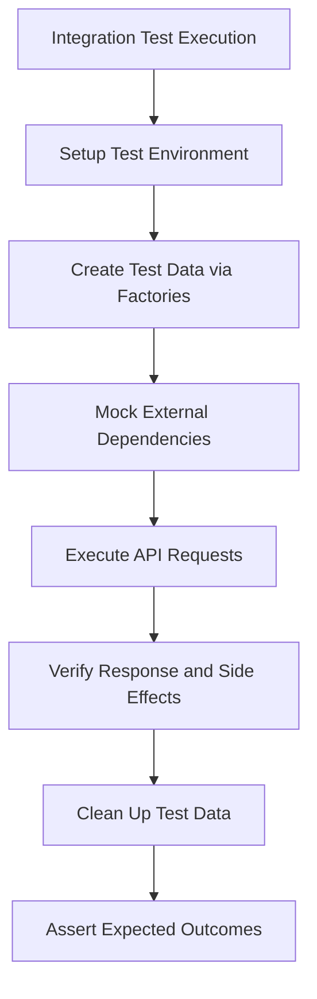
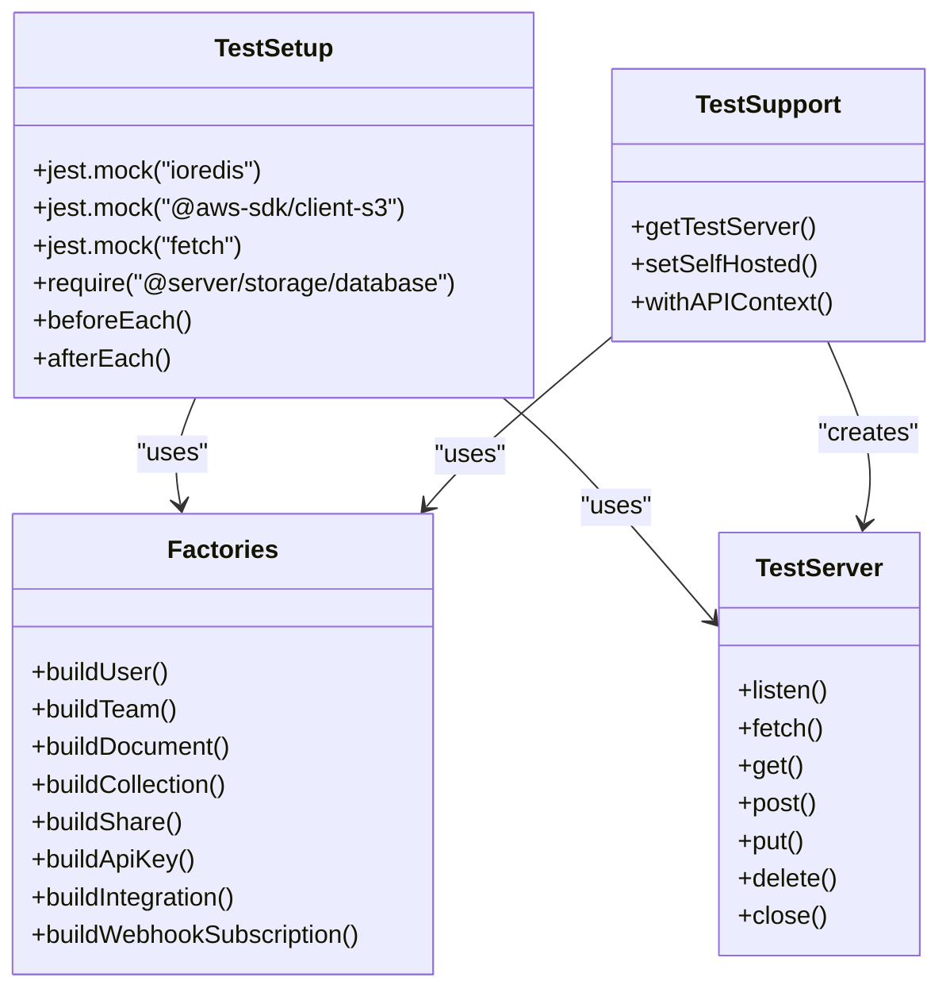

# Testing Strategy

<cite>
**Referenced Files in This Document**   
- [package.json](file://package.json)
- [README.md](file://README.md)
- [server/test/setup.ts](file://server/test/setup.ts)
- [server/test/factories.ts](file://server/test/factories.ts)
- [server/test/TestServer.ts](file://server/test/TestServer.ts)
- [server/test/support.ts](file://server/test/support.ts)
- [app/test/setup.ts](file://app/test/setup.ts)
- [server/test/globalTeardown.js](file://server/test/globalTeardown.js)
</cite>

## Table of Contents
1. [Introduction](#introduction)
2. [Unit Testing Approach](#unit-testing-approach)
3. [Integration Testing Strategy](#integration-testing-strategy)
4. [End-to-End Testing Implementation](#end-to-end-testing-implementation)
5. [Testing Utilities and Fixtures](#testing-utilities-and-fixtures)
6. [Continuous Integration Setup](#continuous-integration-setup)
7. [Code Coverage Requirements](#code-coverage-requirements)
8. [Test Organization and Best Practices](#test-organization-and-best-practices)

## Introduction
The baozi application employs a comprehensive testing strategy to ensure code quality, reliability, and maintainability across both frontend and backend components. The testing framework is built around Jest for unit and integration testing, with Cypress for end-to-end browser automation. The test suite is organized into distinct directories for server and application code, with shared testing utilities and fixtures that enable consistent test execution. This documentation provides a detailed overview of the testing approach, covering unit testing methodologies, integration testing strategies, end-to-end test implementation, testing utilities, continuous integration setup, and code coverage requirements.

**Section sources**
- [README.md](file://README.md#L56-L82)
- [package.json](file://package.json#L31-L34)

## Unit Testing Approach
The baozi application utilizes Jest as the primary testing framework for both frontend and backend code. Unit tests are organized in dedicated test directories within both the `app` and `server` components of the application. The testing strategy emphasizes thorough coverage of critical application components, particularly API endpoints and authentication-related functionality. The test suite is configured to run with different project configurations, allowing for targeted execution of frontend, backend, or shared code tests.

The unit testing approach follows a consistent pattern across the codebase, with test files named using the `.test.ts` extension and colocated with the code they test. This organization facilitates easy discovery and maintenance of tests. The application's package.json defines specific scripts for running different test suites, including `test:app` for frontend tests, `test:server` for backend tests, and `test:shared` for shared code tests. This modular approach enables developers to focus on specific areas of the application during development and debugging.

**Section sources**
- [package.json](file://package.json#L31-L34)
- [README.md](file://README.md#L60-L82)

## Integration Testing Strategy
The integration testing strategy for the baozi application focuses on verifying interactions between components and services to ensure proper system behavior. Integration tests are implemented using Jest and are designed to validate the collaboration between different parts of the application, such as database models, API endpoints, and business logic components. The testing framework includes specialized utilities like the `TestServer` class, which provides a lightweight HTTP server for testing API endpoints and their interactions.

Integration tests leverage factories and fixtures to create consistent test data and simulate real-world scenarios. The `factories.ts` file in the server test directory contains a comprehensive set of factory functions for creating test instances of various models, including users, teams, documents, and collections. These factories handle the creation of related entities and proper relationship setup, reducing boilerplate code and ensuring data consistency across tests. The integration testing approach also includes mocking of external dependencies such as AWS S3, Redis, and various API clients to isolate the system under test and ensure reliable test execution.

**Diagram sources **
- [server/test/TestServer.ts](file://server/test/TestServer.ts#L7-L82)
- [server/test/factories.ts](file://server/test/factories.ts#L57-L800)
- [server/test/setup.ts](file://server/test/setup.ts#L1-L49)

**Section sources**
- [server/test/TestServer.ts](file://server/test/TestServer.ts#L7-L82)
- [server/test/factories.ts](file://server/test/factories.ts#L57-L800)
- [server/test/setup.ts](file://server/test/setup.ts#L1-L49)

## End-to-End Testing Implementation
The baozi application implements end-to-end testing using Cypress for browser automation and user flow validation. While the specific Cypress configuration and test files are not visible in the current project structure, the testing strategy is designed to validate complete user workflows from the perspective of an actual user interacting with the application through a browser. End-to-end tests verify the integration of frontend and backend components, ensuring that user actions trigger the expected system responses and that the application state evolves correctly over time.

The end-to-end testing approach complements the unit and integration tests by providing a holistic view of the application's behavior. These tests typically follow realistic user scenarios, such as creating a new document, sharing it with team members, and verifying that the changes are properly reflected across different user interfaces. By automating these user flows, the end-to-end tests help catch issues that might not be apparent when testing individual components in isolation.

## Testing Utilities and Fixtures
The baozi application includes a comprehensive set of testing utilities and fixtures to support consistent and reliable test execution. The testing infrastructure is organized in dedicated test directories for both the server and application components, with shared setup and support files that configure the testing environment and provide common functionality.

The server-side testing utilities include a `setup.ts` file that configures Jest mocks for critical dependencies such as Redis, AWS S3, and fetch operations. This file also initializes the database models and sets up global test hooks for environment configuration. The `factories.ts` file provides a rich set of factory functions for creating test instances of various models, with intelligent defaults and relationship handling to minimize test setup code.

**Diagram sources **
- [server/test/setup.ts](file://server/test/setup.ts#L1-L49)
- [server/test/factories.ts](file://server/test/factories.ts#L57-L800)
- [server/test/TestServer.ts](file://server/test/TestServer.ts#L7-L82)
- [server/test/support.ts](file://server/test/support.ts#L1-L56)

**Section sources**
- [server/test/setup.ts](file://server/test/setup.ts#L1-L49)
- [server/test/factories.ts](file://server/test/factories.ts#L57-L800)
- [server/test/TestServer.ts](file://server/test/TestServer.ts#L7-L82)
- [server/test/support.ts](file://server/test/support.ts#L1-L56)

## Continuous Integration Setup
The continuous integration setup for the baozi application is configured through the package.json file, which defines the test scripts and execution environment. The application uses Jest as the test runner with a custom configuration file (.jestconfig.json) that specifies project-specific settings and test environments. The CI pipeline is designed to execute tests in a consistent environment with UTC timezone settings to avoid timezone-related test failures.

The Makefile includes targets for running tests and setting up the test environment, including database creation and migration. The `test` target in the Makefile orchestrates the setup of the PostgreSQL database, runs migrations, and executes the test suite. This automated setup ensures that tests run against a clean and consistent database state, reducing flakiness and improving reliability. The CI configuration also includes a watch mode for development, allowing developers to run tests automatically as they make changes to the codebase.

**Section sources**
- [package.json](file://package.json#L31-L34)
- [Makefile](file://Makefile#L20-L27)

## Code Coverage Requirements
The baozi application emphasizes sufficient test coverage for critical parts of the system without aiming for 100% unit test coverage. The testing strategy prioritizes thorough testing of API endpoints and authentication-related functionality, which are essential for the application's security and reliability. The README documentation explicitly states that the team aims for "sufficient test coverage for critical parts of the application" rather than追求 complete coverage, recognizing that some code paths may not require extensive testing.

The code coverage approach focuses on high-impact areas such as data validation, authorization logic, and complex business rules. By concentrating on these critical components, the testing strategy ensures that the most important aspects of the application are well-protected against regressions and bugs. This pragmatic approach to code coverage allows the development team to allocate testing resources effectively while maintaining a high level of confidence in the application's quality.

**Section sources**
- [README.md](file://README.md#L58-L59)

## Test Organization and Best Practices
The baozi application follows a well-organized testing structure with clear conventions for test file placement and naming. Tests are colocated with the code they test, using the `.test.ts` extension to identify test files. This organization makes it easy to locate tests for specific components and encourages developers to write tests as they implement new features.

The testing framework includes several best practices to ensure reliable and maintainable tests. These include the use of factories to create test data, mocking of external dependencies to isolate the system under test, and the use of transactional tests to ensure database consistency. The application also includes a global teardown script that cleans up test data after each test run, preventing test pollution and ensuring consistent test results.

The test organization extends to the configuration of different test environments, with separate setup files for frontend and backend tests. The frontend test setup initializes i18n, mocks local storage, and configures API client mocks, while the backend test setup focuses on database initialization and external service mocking. This separation of concerns allows each test suite to be configured optimally for its specific needs.

**Section sources**
- [app/test/setup.ts](file://app/test/setup.ts#L1-L13)
- [server/test/setup.ts](file://server/test/setup.ts#L1-L49)
- [server/test/globalTeardown.js](file://server/test/globalTeardown.js)