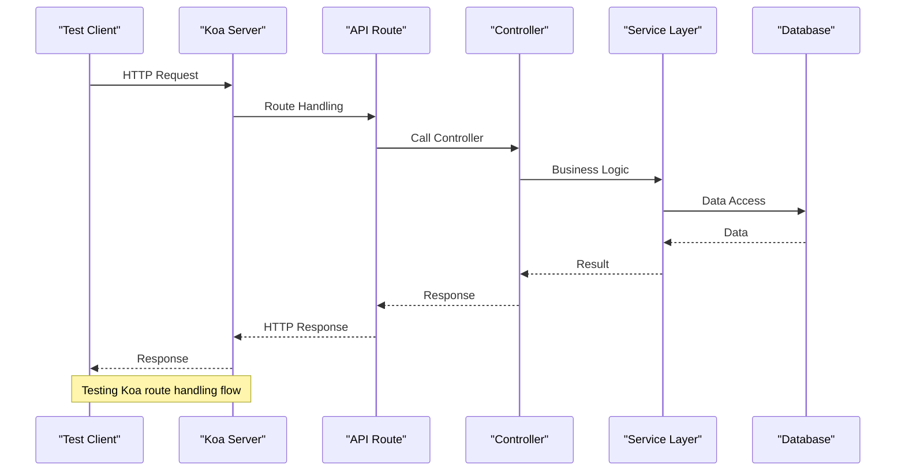

# Unit Testing

<cite>
**Referenced Files in This Document**   
- [setup.ts](file://app/test/setup.ts)
- [support.ts](file://app/test/support.ts)
- [setup.ts](file://server/test/setup.ts)
- [support.ts](file://server/test/support.ts)
- [factories.ts](file://server/test/factories.ts)
- [TestServer.ts](file://server/test/TestServer.ts)
- [Collection.test.ts](file://app/models/Collection.test.ts)
- [Document.test.ts](file://server/models/Document.test.ts)
- [User.test.ts](file://server/models/User.test.ts)
- [apiKeys.test.ts](file://server/routes/api/apiKeys/apiKeys.test.ts)
- [auth.test.ts](file://server/routes/api/auth/auth.test.ts)
</cite>

## Table of Contents
1. [Introduction](#introduction)
2. [Test Configuration and Setup](#test-configuration-and-setup)
3. [Test Factories and Data Generation](#test-factories-and-data-generation)
4. [Testing MobX Stores](#testing-mobx-stores)
5. [Testing React Components](#testing-react-components)
6. [Testing Koa Routes](#testing-koa-routes)
7. [Testing Sequelize Models](#testing-sequelize-models)
8. [Mocking Strategies](#mocking-strategies)
9. [Best Practices for Unit Testing](#best-practices-for-unit-testing)
10. [Common Issues and Solutions](#common-issues-and-solutions)

## Introduction
This document provides comprehensive guidance on unit testing within the baozi application using Jest. It covers both frontend React components located in `app/test/` and backend services in `server/test/`. The documentation details the structure of unit tests, configuration setup, factory patterns for consistent test data creation, and mocking strategies for component isolation. Specific examples demonstrate testing MobX stores, React components, Koa routes, and Sequelize models. The content emphasizes best practices for writing maintainable unit tests, including proper assertions, test coverage requirements, and performance considerations, while addressing common issues such as async test handling, timer management, and proper cleanup.

## Test Configuration and Setup
The baozi application utilizes Jest as its primary testing framework for both frontend and backend codebases. Test configuration is managed through setup files that initialize the testing environment, configure mocks, and establish global variables. The frontend testing setup in `app/test/setup.ts` initializes internationalization, mocks localStorage, and enables fetch mocking to isolate components from external dependencies. Similarly, the backend setup in `server/test/setup.ts` configures database connections, mocks external services like AWS S3, and initializes Redis for testing. These setup files ensure a consistent testing environment across all test suites, enabling reliable and repeatable test execution.

**Section sources**
- [setup.ts](file://app/test/setup.ts#L1-L13)
- [setup.ts](file://server/test/setup.ts#L1-L49)

## Test Factories and Data Generation
The baozi application employs a robust factory pattern implemented in `server/test/factories.ts` to generate consistent and realistic test data. These factories provide methods for creating instances of various models such as users, teams, collections, and documents with predefined attributes and relationships. The factory functions handle complex dependencies automatically, ensuring that created entities have all necessary associations properly established. This approach simplifies test setup, reduces code duplication, and ensures data consistency across tests. Factories can be customized with overrides to test specific scenarios while maintaining the integrity of the data model.

**Section sources**
- [factories.ts](file://server/test/factories.ts#L1-L800)

## Testing MobX Stores
MobX stores in the baozi application are tested to ensure proper state management, computed properties, and action behaviors. Tests verify that store actions correctly modify state, computed properties update as expected when dependencies change, and observables trigger appropriate reactions. The testing approach involves creating store instances, dispatching actions, and asserting the resulting state changes. Special attention is given to asynchronous operations and error handling within store methods. The `AuthStore` serves as a representative example, with tests validating authentication flows, user session management, and policy enforcement.

```mermaid
classDiagram
class AuthStore {
+currentUserId : string
+currentTeamId : string
+collaborationToken : string
+logoutRedirectUri : string
+availableTeams : Array
+lastSignedIn : string
+isSuspended : boolean
+suspendedContactEmail : string
+config : Config
+user : User
+team : Team
+policies : Array
+authenticated : boolean
+asJson : PersistedData
+rehydrate(data : PersistedData) : void
+fetchConfig() : Promise~void~
+fetchAuth() : Promise~void~
+requestDeleteUser() : Promise~void~
+requestDeleteTeam() : Promise~void~
+deleteUser(data : {code : string}) : Promise~void~
+deleteTeam(data : {code : string}) : Promise~void~
+createTeam(params : {name : string}) : Promise~void~
+logout(options : {savePath? : boolean, revokeToken? : boolean, userInitiated? : boolean}) : Promise~void~
}
class RootStore {
+users : UsersStore
+collections : CollectionsStore
+documents : DocumentsStore
+policies : PoliciesStore
+groups : GroupsStore
+groupUsers : GroupUsersStore
+memberships : MembershipsStore
+groupMemberships : GroupMembershipsStore
+shares : SharesStore
+stars : StarsStore
+subscriptions : SubscriptionsStore
+pins : PinsStore
+notifications : NotificationsStore
+views : ViewsStore
+ui : UiStore
+apiKeys : ApiKeysStore
+authentications : AuthenticationsStore
+authenticationProviders : AuthenticationProvidersStore
+integrations : IntegrationsStore
+integrationAuthentications : IntegrationAuthenticationsStore
+webhookSubscriptions : WebhookSubscriptionStore
+fileOperations : FileOperationsStore
+imports : ImportsStore
+revisions : RevisionsStore
+events : EventsStore
+comments : CommentsStore
+documentPresence : DocumentPresenceStore
+audioRecorder : AudioRecorderStore
+aiAsk : AIAskStore
+dialogs : DialogsStore
}
AuthStore --> RootStore : "has reference to"
RootStore --> AuthStore : "contains"
```

**Diagram sources**
- [AuthStore.ts](file://app/stores/AuthStore.ts#L37-L362)
- [RootStore.ts](file://app/stores/RootStore.ts#L39-L179)

**Section sources**
- [AuthStore.ts](file://app/stores/AuthStore.ts#L37-L362)

## Testing React Components
React components in the baozi application are tested using Jest and React Testing Library to ensure proper rendering, user interactions, and state management. Tests focus on component behavior rather than implementation details, verifying that components render correctly with given props, respond appropriately to user events, and update their state as expected. The testing strategy emphasizes accessibility, ensuring that components are usable with keyboard navigation and screen readers. Component tests often involve rendering the component, simulating user interactions, and asserting the resulting DOM changes or side effects.

**Section sources**
- [Collection.test.ts](file://app/models/Collection.test.ts)

## Testing Koa Routes
Backend API routes implemented with Koa are thoroughly tested to validate request handling, response formatting, and error conditions. The testing infrastructure uses `TestServer.ts` to create a testable Koa application instance that can handle HTTP requests without requiring a running server. Tests simulate various HTTP methods and request payloads, asserting the correct status codes, response bodies, and database interactions. Route tests verify authentication requirements, input validation, and proper error handling for both expected and edge cases. The testing approach ensures that API endpoints behave consistently and securely.



**Diagram sources**
- [TestServer.ts](file://server/test/TestServer.ts#L1-L83)
- [auth.test.ts](file://server/routes/api/auth/auth.test.ts)

**Section sources**
- [TestServer.ts](file://server/test/TestServer.ts#L1-L83)
- [auth.test.ts](file://server/routes/api/auth/auth.test.ts)

## Testing Sequelize Models
Sequelize models are tested to ensure proper database schema definitions, validation rules, associations, and lifecycle hooks. Model tests verify that database constraints are correctly enforced, relationships between models are properly established, and model methods behave as expected. Tests include validation of field types, required fields, unique constraints, and custom validation logic. Association tests confirm that foreign key relationships work correctly and that cascade operations are properly configured. Lifecycle hook tests verify that before/after hooks execute at the appropriate times and modify data as intended.

**Section sources**
- [User.test.ts](file://server/models/User.test.ts)
- [Document.test.ts](file://server/models/Document.test.ts)

## Mocking Strategies
The baozi application employs comprehensive mocking strategies to isolate components and ensure reliable test results. External dependencies such as database connections, API clients, and third-party services are mocked to prevent tests from being affected by network conditions or external system states. The testing setup includes mocks for Redis, AWS S3, and fetch operations, allowing tests to run independently of these services. Module mocking is used extensively to replace dependencies with controlled implementations that can simulate various scenarios, including success, failure, and edge cases. This approach enables focused testing of individual components without the complexity of their dependencies.

**Section sources**
- [setup.ts](file://server/test/setup.ts#L1-L49)
- [__mocks__](file://server/__mocks__)

## Best Practices for Unit Testing
The baozi application follows several best practices for writing maintainable and effective unit tests. Tests are organized by feature and follow a consistent structure, making them easy to understand and maintain. Each test focuses on a single behavior or scenario, with clear and descriptive names that document the expected outcome. Assertions are specific and verify only the necessary conditions, avoiding over-specification that could make tests brittle. Test data is generated using factories to ensure consistency and reduce setup code. The test suite maintains high coverage of critical paths while avoiding excessive testing of implementation details that could hinder refactoring.

**Section sources**
- [apiKeys.test.ts](file://server/routes/api/apiKeys/apiKeys.test.ts)

## Common Issues and Solutions
Common issues in unit testing the baozi application include handling asynchronous operations, managing timers, and ensuring proper cleanup. Asynchronous tests are addressed using Jest's async/await support and proper promise handling to prevent race conditions. Timer-related issues are resolved by using Jest's fake timers, allowing tests to control the passage of time and verify timeout behaviors without actual delays. Proper cleanup is ensured through beforeEach and afterEach hooks that reset mocks, clear databases, and restore global state between tests. Memory leaks are prevented by ensuring all subscriptions and event listeners are properly cleaned up after each test.

**Section sources**
- [support.ts](file://app/test/support.ts#L1-L2)
- [support.ts](file://server/test/support.ts#L1-L57)