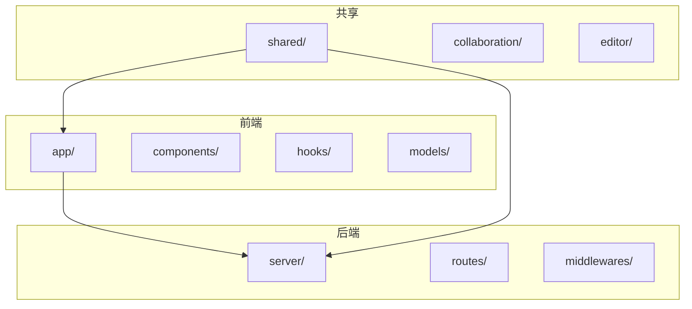
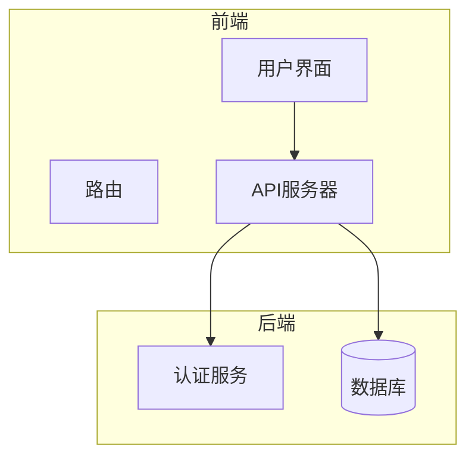
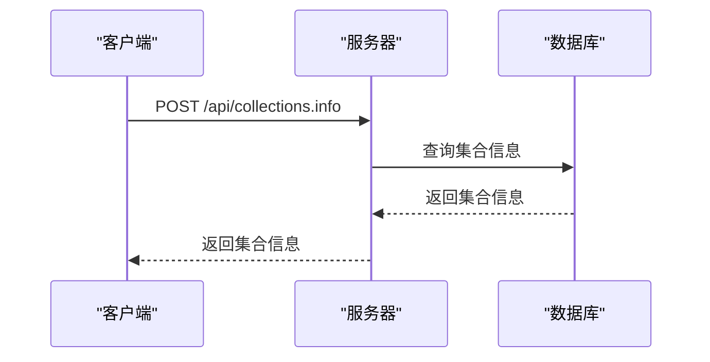
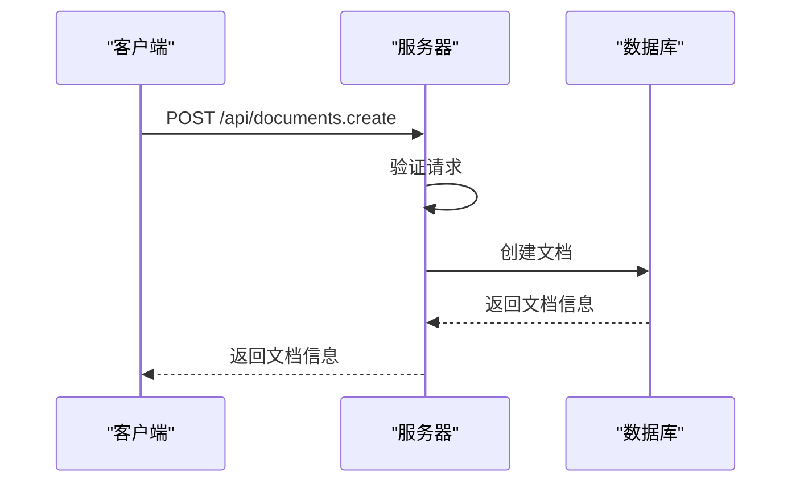
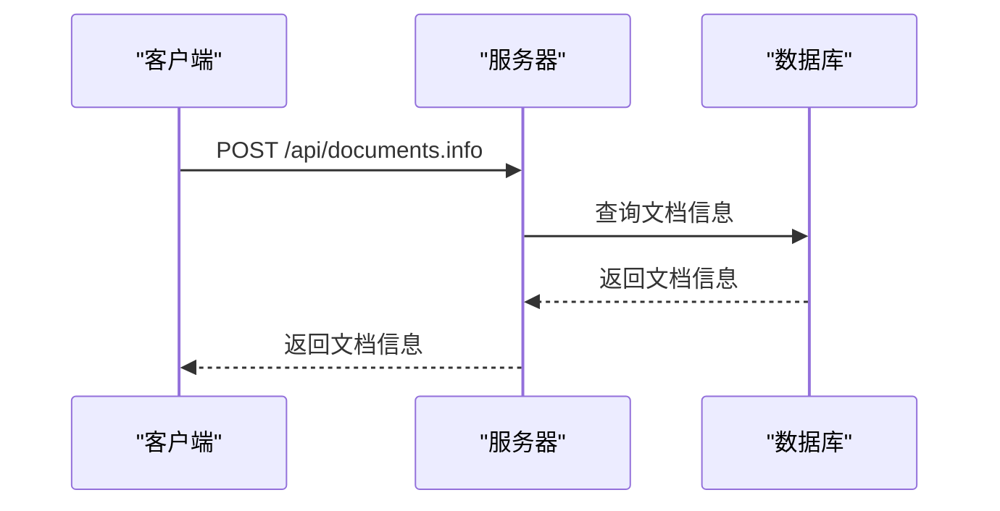
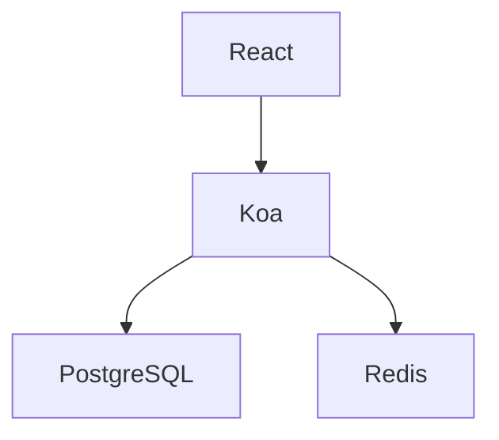

# API文档

<cite>
**本文档中引用的文件**  
- [collections.ts](file://server/routes/api/collections/collections.ts)
- [documents.ts](file://server/routes/api/documents/documents.ts)
- [Collection.ts](file://server/models/Collection.ts)
- [Document.ts](file://server/models/Document.ts)
- [collection.ts](file://server/presenters/collection.ts)
- [document.ts](file://server/presenters/document.ts)
</cite>

## 目录
1. [简介](#简介)
2. [项目结构](#项目结构)
3. [核心组件](#核心组件)
4. [架构概述](#架构概述)
5. [详细组件分析](#详细组件分析)
6. [依赖分析](#依赖分析)
7. [性能考虑](#性能考虑)
8. [故障排除指南](#故障排除指南)
9. [结论](#结论)
10. [附录](#附录)（如有必要）

## 简介
本文档全面介绍了baozi项目的RESTful API接口和通信协议。文档详细记录了所有公共API端点的HTTP方法、URL模式、请求/响应模式、认证方法和错误处理。通过项目中的实际路由文件（如collections.ts、documents.ts等）作为示例，说明每个端点的功能、参数和返回值。为初学者提供概念性概述，同时为经验丰富的开发者提供技术细节，包括权限控制策略、速率限制和版本管理。提供实际的请求/响应示例和客户端实现指南，帮助开发者快速集成和使用API。

## 项目结构
baozi项目采用模块化设计，主要分为以下几个部分：
- **app/**: 前端应用代码，包括组件、钩子、模型等。
- **server/**: 后端服务代码，包括路由、模型、中间件等。
- **shared/**: 共享代码，包括协作、组件、编辑器等。
- **plugins/**: 插件代码，包括各种第三方服务的集成。

**Diagram sources**
- [collections.ts](file://server/routes/api/collections/collections.ts)
- [documents.ts](file://server/routes/api/documents/documents.ts)

**Section sources**
- [collections.ts](file://server/routes/api/collections/collections.ts)
- [documents.ts](file://server/routes/api/documents/documents.ts)

## 核心组件
### 集合（Collections）
集合是baozi项目中的基本组织单元，用于组织和管理文档。集合可以设置权限、共享状态、排序方式等。

**Section sources**
- [collections.ts](file://server/routes/api/collections/collections.ts)
- [Collection.ts](file://server/models/Collection.ts)

### 文档（Documents）
文档是baozi项目中的内容单元，可以包含文本、图片、附件等。文档可以属于一个集合，并且可以设置权限、共享状态等。

**Section sources**
- [documents.ts](file://server/routes/api/documents/documents.ts)
- [Document.ts](file://server/models/Document.ts)

## 架构概述
baozi项目的架构采用前后端分离的设计，前端通过API与后端进行通信。后端使用Koa框架构建RESTful API，前端使用React构建用户界面。

**Diagram sources**
- [collections.ts](file://server/routes/api/collections/collections.ts)
- [documents.ts](file://server/routes/api/documents/documents.ts)

## 详细组件分析
### 集合分析
#### 创建集合
创建集合的API端点为`POST /api/collections.create`，需要提供集合的名称、颜色、描述、权限等信息。

**Diagram sources**
- [collections.ts](file://server/routes/api/collections/collections.ts)

#### 获取集合信息
获取集合信息的API端点为`POST /api/collections.info`，需要提供集合的ID。

**Diagram sources**
- [collections.ts](file://server/routes/api/collections/collections.ts)

### 文档分析
#### 创建文档
创建文档的API端点为`POST /api/documents.create`，需要提供文档的标题、内容、所属集合等信息。

**Diagram sources**
- [documents.ts](file://server/routes/api/documents/documents.ts)

#### 获取文档信息
获取文档信息的API端点为`POST /api/documents.info`，需要提供文档的ID。

**Diagram sources**
- [documents.ts](file://server/routes/api/documents/documents.ts)

## 依赖分析
baozi项目依赖于多个外部库和服务，包括：
- **Koa**: 用于构建后端API。
- **React**: 用于构建前端用户界面。
- **PostgreSQL**: 用于存储数据。
- **Redis**: 用于缓存和会话管理。

**Diagram sources**
- [collections.ts](file://server/routes/api/collections/collections.ts)
- [documents.ts](file://server/routes/api/documents/documents.ts)

## 性能考虑
为了提高性能，baozi项目采用了多种优化措施：
- **缓存**: 使用Redis缓存频繁访问的数据，减少数据库查询。
- **分页**: 对大量数据的查询结果进行分页，减少单次请求的数据量。
- **异步处理**: 对耗时的操作（如文件上传、导出等）采用异步处理，避免阻塞主线程。

## 故障排除指南
### 认证失败
如果遇到认证失败的问题，检查以下几点：
- 确保API密钥或OAuth令牌正确无误。
- 确保请求头中包含正确的认证信息。
- 检查API密钥或OAuth令牌是否已过期。

**Section sources**
- [collections.ts](file://server/routes/api/collections/collections.ts)
- [documents.ts](file://server/routes/api/documents/documents.ts)

### 请求超时
如果遇到请求超时的问题，检查以下几点：
- 确保网络连接正常。
- 检查服务器是否过载。
- 调整客户端的超时设置。

**Section sources**
- [collections.ts](file://server/routes/api/collections/collections.ts)
- [documents.ts](file://server/routes/api/documents/documents.ts)

## 结论
本文档详细介绍了baozi项目的RESTful API接口和通信协议，涵盖了所有公共API端点的HTTP方法、URL模式、请求/响应模式、认证方法和错误处理。通过实际的路由文件作为示例，说明了每个端点的功能、参数和返回值。为初学者提供了概念性概述，同时为经验丰富的开发者提供了技术细节，包括权限控制策略、速率限制和版本管理。希望本文档能帮助开发者快速集成和使用baozi项目的API。

## 附录
### API端点列表
| 端点 | 方法 | 描述 |
| --- | --- | --- |
| `/api/collections.create` | POST | 创建集合 |
| `/api/collections.info` | POST | 获取集合信息 |
| `/api/documents.create` | POST | 创建文档 |
| `/api/documents.info` | POST | 获取文档信息 |

### 错误码列表
| 错误码 | 描述 |
| --- | --- |
| 400 | 请求错误 |
| 401 | 认证失败 |
| 403 | 权限不足 |
| 404 | 资源未找到 |
| 429 | 请求过多 |
| 500 | 服务器内部错误 |