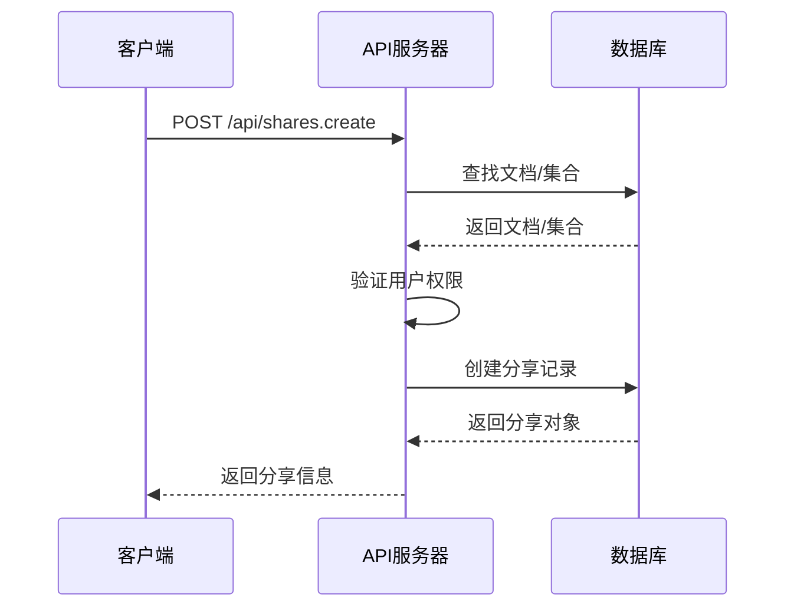
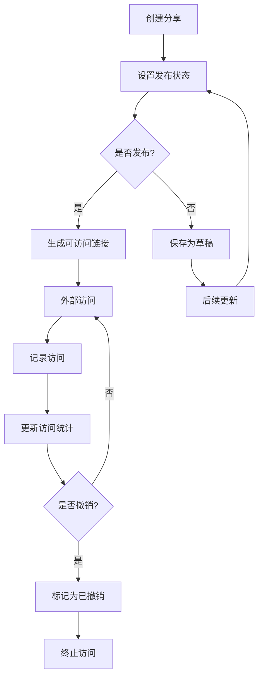

# 分享系统API

<cite>
**本文档中引用的文件**  
- [shares.ts](file://server/routes/api/shares/shares.ts)
- [schema.ts](file://server/routes/api/shares/schema.ts)
- [Share.ts](file://server/models/Share.ts)
- [Share.ts](file://app/models/Share.ts)
- [SharesStore.ts](file://app/stores/SharesStore.ts)
- [share.ts](file://server/policies/share.ts)
</cite>

## 目录
1. [简介](#简介)
2. [核心端点](#核心端点)
3. [数据验证规则](#数据验证规则)
4. [权限策略](#权限策略)
5. [分享模式](#分享模式)
6. [链接生命周期管理](#链接生命周期管理)
7. [审计日志与撤销机制](#审计日志与撤销机制)
8. [集成示例](#集成示例)

## 简介
分享系统API提供了一套完整的资源分享、权限控制和访问管理功能。该系统支持文档和集合的公开分享，允许用户生成可自定义的分享链接，并通过精细的权限设置确保跨团队和跨用户的安全访问。API设计遵循RESTful原则，通过清晰的端点划分和数据验证规则，实现了分享功能的灵活性和安全性。

**Section sources**
- [shares.ts](file://server/routes/api/shares/shares.ts#L1-L408)

## 核心端点
分享系统API提供了多个核心端点来管理资源分享。`shares.create`端点用于创建新的分享链接，支持文档和集合级别的分享。`shares.update`端点允许修改现有分享链接的配置，如权限设置和显示选项。`shares.revoke`端点用于撤销分享链接，立即终止外部访问。`shares.info`端点提供分享链接的详细信息，包括关联的文档或集合元数据。`shares.list`端点用于列出用户创建的所有分享链接，支持分页和查询过滤。



**Diagram sources**
- [shares.ts](file://server/routes/api/shares/shares.ts#L1-L408)

**Section sources**
- [shares.ts](file://server/routes/api/shares/shares.ts#L1-L408)

## 数据验证规则
分享系统的数据验证规则在`schema.ts`文件中定义，使用Zod库进行严格的输入验证。分享链接的`urlId`必须符合正则表达式`UrlHelper.SHARE_URL_SLUG_REGEX`，仅允许字母数字字符和连字符。`domain`字段必须是有效的完全限定域名(FQDN)，且长度不超过255个字符。创建分享时，必须提供`collectionId`或`documentId`之一。更新操作中，`published`字段控制分享的发布状态，当设置为`true`时，系统会自动将`includeChildDocuments`设置为`true`。所有布尔型配置选项如`allowIndexing`、`showLastUpdated`和`showTOC`都有明确的默认值，确保系统行为的一致性。

**Section sources**
- [schema.ts](file://server/routes/api/shares/schema.ts#L1-L107)

## 权限策略
分享系统的权限策略在`share.ts`策略文件中定义，基于角色的访问控制(RBAC)模型。`createShare`权限要求用户是团队成员且不是访客。`update`权限要求用户不是访客或查看者，并且对关联的文档或集合具有分享权限。`revoke`权限更为严格，要求用户是管理员或是分享的创建者。系统通过`isTeamModel`和`isTeamMutable`等辅助函数确保操作在正确的团队上下文中执行。权限检查在API调用的中间件层进行，使用`authorize`函数验证用户权限，确保只有授权用户才能执行敏感操作。

```mermaid
classDiagram
class User {
+isAdmin : boolean
+isGuest : boolean
+isViewer : boolean
}
class Share {
+published : boolean
+includeChildDocuments : boolean
+allowIndexing : boolean
+showLastUpdated : boolean
+showTOC : boolean
}
class Team {
+sharing : boolean
}
User --> Share : 创建
User --> Share : 更新
User --> Share : 撤销
Share --> Team : 关联
User --> Team : 成员
note right of User
用户必须是团队成员
且不是访客才能创建分享
end note
note left of Share
分享对象包含多种
显示和索引选项
end note
```

**Diagram sources**
- [share.ts](file://server/policies/share.ts#L1-L50)
- [Share.ts](file://server/models/Share.ts#L1-L244)

**Section sources**
- [share.ts](file://server/policies/share.ts#L1-L50)

## 分享模式
系统支持三种主要的分享模式：公开分享、团队内分享和指定用户分享。公开分享通过`published`字段控制，当设置为`true`时，生成的链接可被任何人访问。团队内分享允许团队成员通过权限继承访问共享资源，即使没有直接的分享链接。指定用户分享通过`shares.info`端点的`collectionId`和`documentId`参数实现，允许用户获取特定资源的分享信息。对于文档分享，系统支持包含子文档的递归分享，通过`includeChildDocuments`字段控制。集合分享则提供整个知识库的共享能力，支持自定义域名绑定，通过`domain`字段实现品牌化分享。

**Section sources**
- [shares.ts](file://server/routes/api/shares/shares.ts#L1-L408)
- [Share.ts](file://server/models/Share.ts#L1-L244)

## 链接生命周期管理
分享链接的生命周期由创建、更新、访问和撤销四个阶段组成。创建阶段通过`shares.create`端点初始化，系统会检查是否存在已撤销的同资源分享记录，如果存在则创建新的分享实例。更新阶段允许修改分享配置，包括发布状态、自定义URL和显示选项。访问阶段由`shares.info`端点处理，当用户提供分享ID时，系统加载对应的分享信息和关联资源。系统通过`lastAccessedAt`字段记录最后一次访问时间，并通过`views`计数器跟踪总访问次数。链接的唯一性由`collectionId`、`documentId`和`teamId`的组合约束保证，防止重复创建。



**Diagram sources**
- [Share.ts](file://server/models/Share.ts#L1-L244)
- [shares.ts](file://server/routes/api/shares/shares.ts#L1-L408)

**Section sources**
- [Share.ts](file://server/models/Share.ts#L1-L244)

## 审计日志与撤销机制
系统的撤销机制通过`revokedAt`和`revokedById`字段实现，提供完整的审计跟踪。当调用`shares.revoke`端点时，系统记录撤销时间和操作者ID，确保操作的可追溯性。已撤销的分享链接在`shares.list`查询中被自动过滤，不会出现在用户的分享列表中。`isRevoked`计算属性提供便捷的撤销状态检查。审计日志不仅记录撤销操作，还包括分享的创建和更新历史，通过`lastAccessedAt`和`views`字段提供访问模式分析。这种设计确保了分享系统的安全性和合规性，管理员可以随时审查和终止不适当的分享。

**Section sources**
- [Share.ts](file://server/models/Share.ts#L1-L244)
- [shares.ts](file://server/routes/api/shares/shares.ts#L1-L408)

## 集成示例
以下是一个典型的分享系统集成示例：首先，客户端调用`shares.create`端点创建文档分享，提供`documentId`和`published: true`参数。API返回分享对象，包含`id`、`canonicalUrl`和`urlId`等信息。前端使用这些信息生成可共享的链接，并提供UI控件让用户修改分享设置。当用户更新`allowIndexing`选项时，调用`shares.update`端点。如果需要终止分享，调用`shares.revoke`端点。在整个过程中，系统通过`shares.info`端点提供实时的分享状态，确保用户界面与后端状态同步。这种设计模式支持渐进式增强，从基本的链接生成到复杂的权限管理。

**Section sources**
- [shares.ts](file://server/routes/api/shares/shares.ts#L1-L408)
- [SharesStore.ts](file://app/stores/SharesStore.ts#L1-L175)