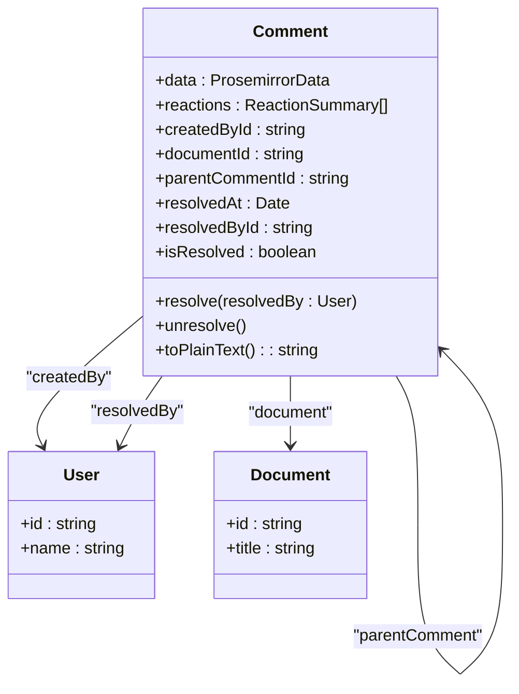
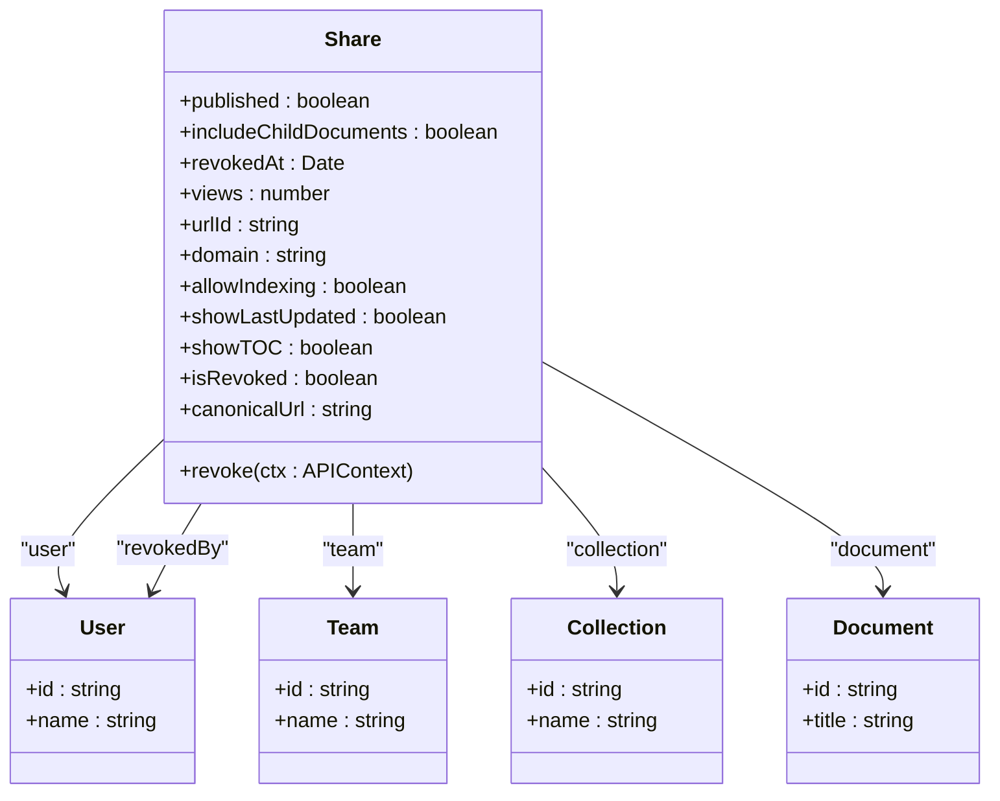
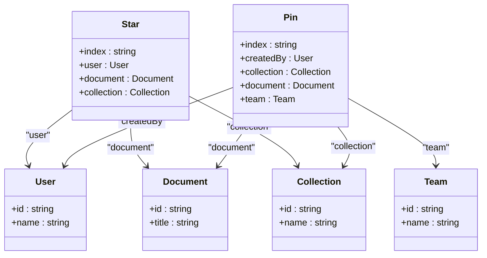
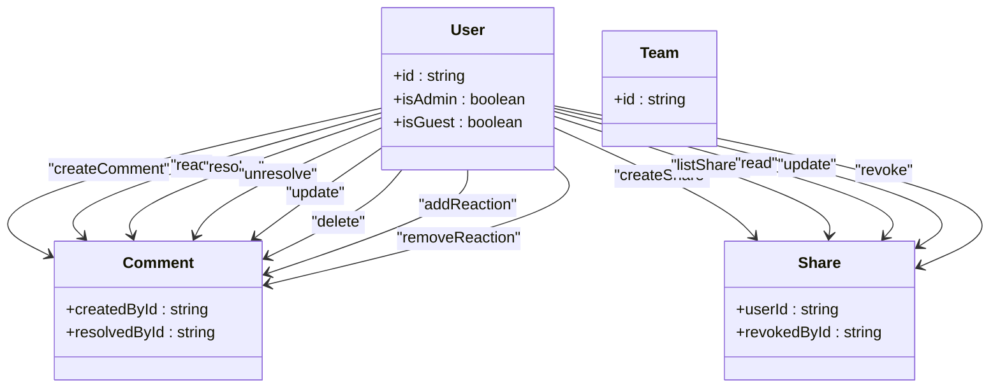
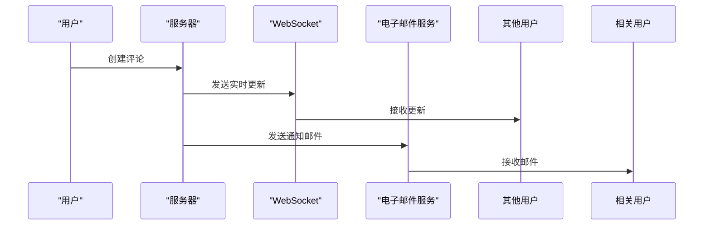
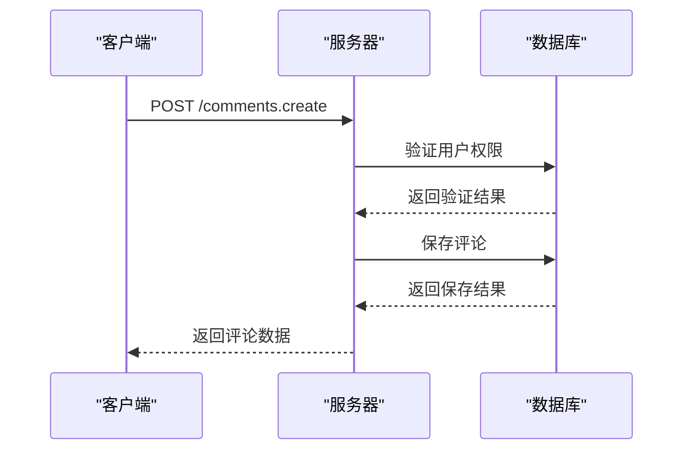
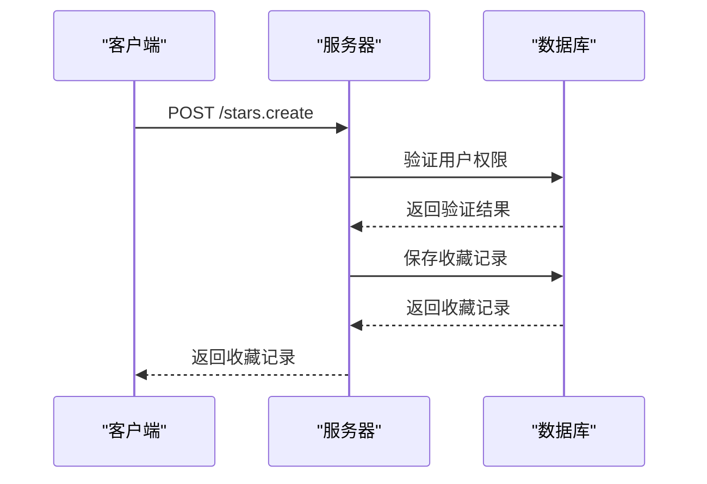

# 协作功能API

<cite>
**本文档引用的文件**   
- [comments.ts](file://server/routes/api/comments/comments.ts)
- [shares.ts](file://server/routes/api/shares/shares.ts)
- [stars.ts](file://server/routes/api/stars/stars.ts)
- [pins.ts](file://server/routes/api/pins/pins.ts)
- [comment.ts](file://server/policies/comment.ts)
- [share.ts](file://server/policies/share.ts)
- [Comment.ts](file://server/models/Comment.ts)
- [Share.ts](file://server/models/Share.ts)
- [Star.ts](file://server/models/Star.ts)
- [Pin.ts](file://server/models/Pin.ts)
</cite>

## 目录
1. [简介](#简介)
2. [评论功能](#评论功能)
3. [分享功能](#分享功能)
4. [收藏与固定功能](#收藏与固定功能)
5. [权限策略](#权限策略)
6. [实时协作与通知](#实时协作与通知)
7. [使用场景示例](#使用场景示例)

## 简介
本文档详细介绍了协作功能API，涵盖评论、分享、收藏和固定等核心功能。这些功能允许用户在文档和集合上进行交互，促进团队协作。API设计遵循REST原则，通过清晰的端点提供对这些功能的访问，同时确保数据安全和用户权限的正确管理。

## 评论功能

评论功能允许用户在文档中创建、回复、删除和管理评论。评论可以是顶级评论或对其他评论的回复，形成评论线程。用户还可以对评论添加反应，如表情符号，以表达情感或反馈。

**Diagram sources**
- [Comment.ts](file://server/models/Comment.ts#L24-L164)

**Section sources**
- [comments.ts](file://server/routes/api/comments/comments.ts#L1-L467)
- [Comment.ts](file://server/models/Comment.ts#L24-L164)

## 分享功能

分享功能允许用户生成公开链接，以便与团队内外的用户共享文档或集合。分享链接可以设置为包含子文档、允许索引、显示最后更新时间等。此外，还可以通过自定义域名进行分享，增强品牌识别度。

**Diagram sources**
- [Share.ts](file://server/models/Share.ts#L32-L240)

**Section sources**
- [shares.ts](file://server/routes/api/shares/shares.ts#L1-L408)
- [Share.ts](file://server/models/Share.ts#L32-L240)

## 收藏与固定功能

收藏和固定功能允许用户将重要的文档或集合标记为收藏或固定，以便快速访问。收藏功能适用于文档和集合，而固定功能则可以将文档固定到首页或特定集合中。

**Diagram sources**
- [Star.ts](file://server/models/Star.ts#L15-L50)
- [Pin.ts](file://server/models/Pin.ts#L16-L58)

**Section sources**
- [stars.ts](file://server/routes/api/stars/stars.ts#L1-L170)
- [pins.ts](file://server/routes/api/pins/pins.ts#L1-L213)
- [Star.ts](file://server/models/Star.ts#L15-L50)
- [Pin.ts](file://server/models/Pin.ts#L16-L58)

## 权限策略

权限策略确保只有授权用户才能执行特定操作。例如，只有文档的创建者或管理员才能删除评论，只有团队成员才能创建分享链接。这些策略通过`authorize`函数在API端点中实现，确保数据安全。

**Diagram sources**
- [comment.ts](file://server/policies/comment.ts#L1-L40)
- [share.ts](file://server/policies/share.ts#L1-L50)

**Section sources**
- [comment.ts](file://server/policies/comment.ts#L1-L40)
- [share.ts](file://server/policies/share.ts#L1-L50)

## 实时协作与通知

实时协作功能通过WebSocket实现实时更新，确保所有用户看到最新的内容。当用户创建或更新评论时，系统会触发通知，通知相关用户。通知可以通过电子邮件或应用内通知发送，确保用户不会错过重要信息。

**Diagram sources**
- [WebsocketProvider.tsx](file://app/components/WebsocketProvider.tsx#L393-L395)
- [CommentCreatedEmail.tsx](file://server/emails/templates/CommentCreatedEmail.tsx#L27-L35)

**Section sources**
- [WebsocketProvider.tsx](file://app/components/WebsocketProvider.tsx#L393-L395)
- [CommentCreatedEmail.tsx](file://server/emails/templates/CommentCreatedEmail.tsx#L27-L35)

## 使用场景示例

### 创建评论
用户可以在文档中创建评论，系统会验证用户是否有权限进行评论，并保存评论数据。

**Diagram sources**
- [comments.ts](file://server/routes/api/comments/comments.ts#L53-L59)

**Section sources**
- [comments.ts](file://server/routes/api/comments/comments.ts#L53-L59)

### 分享文档
用户可以生成公开链接，分享文档给外部用户。系统会检查用户是否有权限分享文档，并生成唯一的分享链接。

**Diagram sources**
- [shares.ts](file://server/routes/api/shares/shares.ts#L160-L167)

**Section sources**
- [shares.ts](file://server/routes/api/shares/shares.ts#L160-L167)

### 收藏文档
用户可以将文档标记为收藏，系统会检查用户是否有权限收藏文档，并保存收藏记录。

**Diagram sources**
- [stars.ts](file://server/routes/api/stars/stars.ts#L66-L117)

**Section sources**
- [stars.ts](file://server/routes/api/stars/stars.ts#L66-L117)