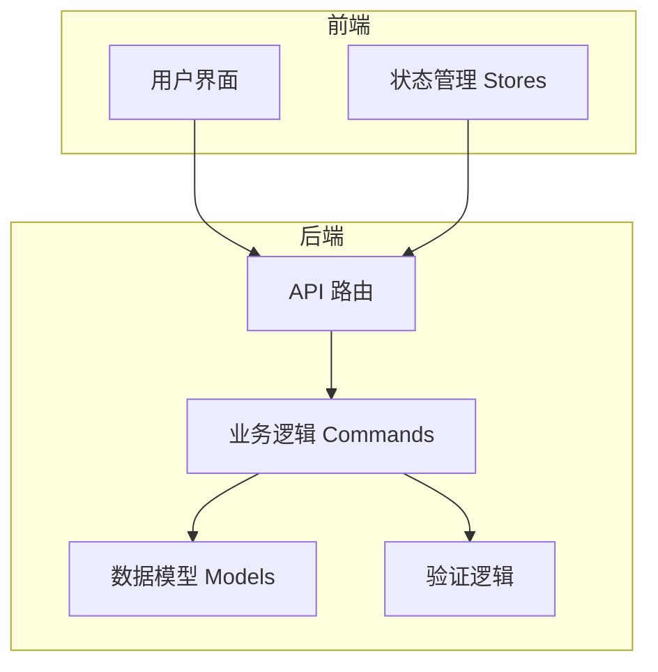
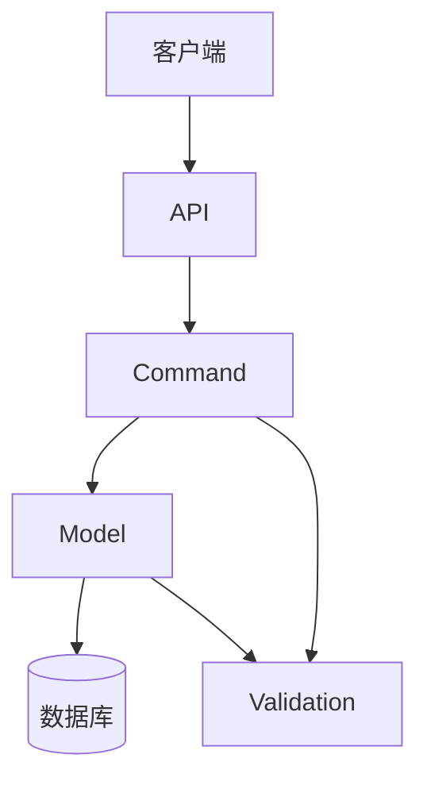
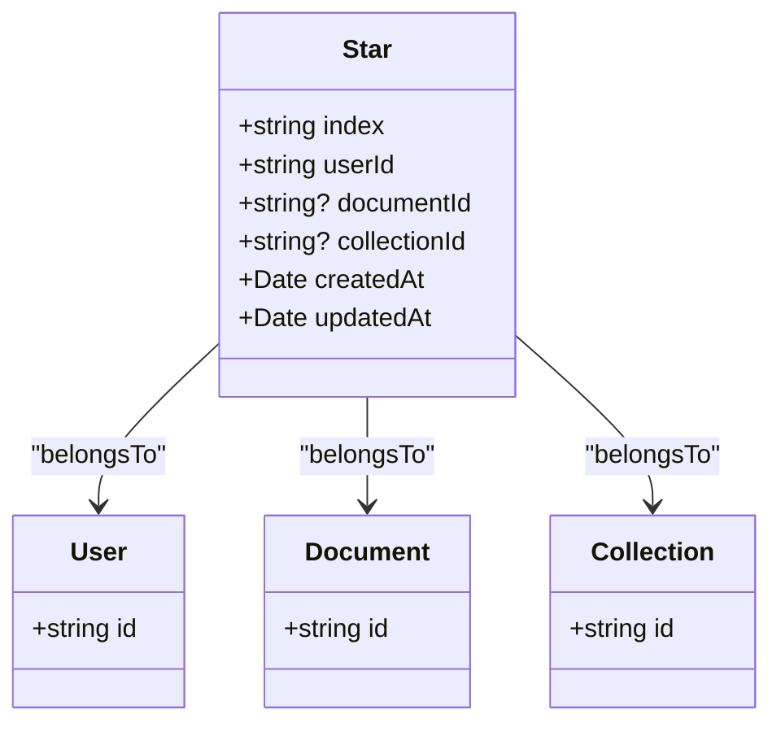
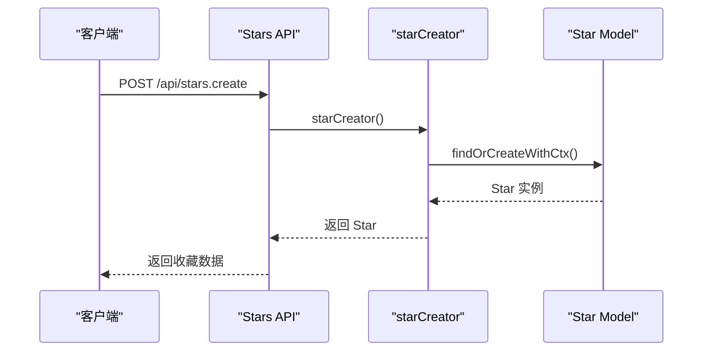
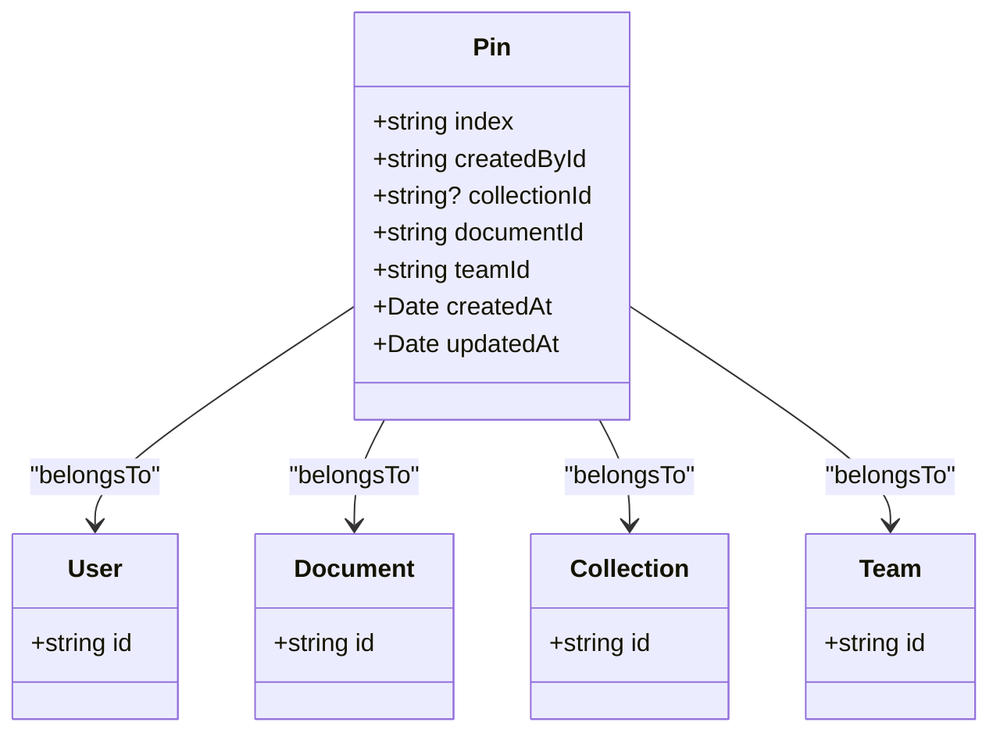
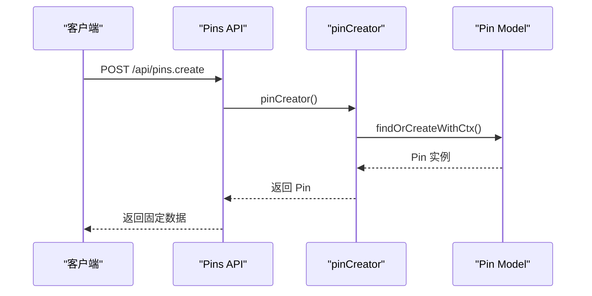
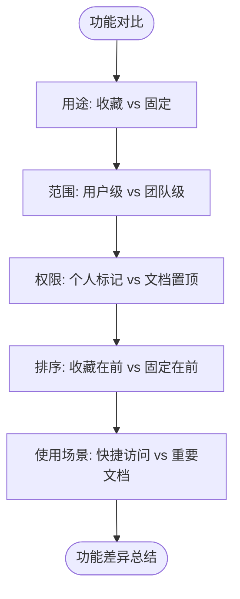
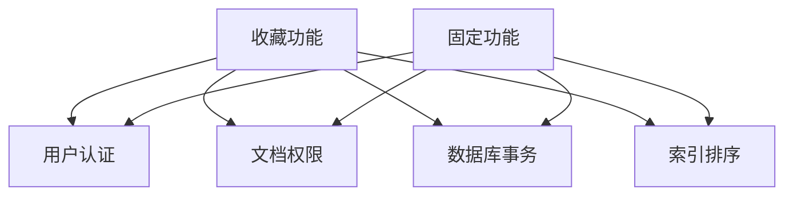

# 收藏与固定功能API

<cite>
**本文档中引用的文件**  
- [stars.ts](file://server/routes/api/stars/stars.ts)
- [pins.ts](file://server/routes/api/pins/pins.ts)
- [Star.ts](file://server/models/Star.ts)
- [Pin.ts](file://server/models/Pin.ts)
- [starCreator.ts](file://server/commands/starCreator.ts)
- [pinCreator.ts](file://server/commands/pinCreator.ts)
- [schema.ts](file://server/routes/api/stars/schema.ts)
- [schema.ts](file://server/routes/api/pins/schema.ts)
</cite>

## 目录
1. [简介](#简介)
2. [项目结构](#项目结构)
3. [核心组件](#核心组件)
4. [架构概述](#架构概述)
5. [详细组件分析](#详细组件分析)
6. [依赖分析](#依赖分析)
7. [性能考虑](#性能考虑)
8. [故障排除指南](#故障排除指南)
9. [结论](#结论)

## 简介
本文档详细说明了收藏（Stars）和固定（Pins）功能的API实现。收藏功能允许用户将重要内容标记为个人收藏，便于快速访问；固定功能则用于将文档置顶显示，提升重要文档的可见性。两种功能均支持添加、移除和查询状态的端点，并通过索引机制支持排序。本文档还对比了两种功能的异同，解释了其数据结构和验证规则，并描述了这些操作如何触发UI更新和状态同步。

## 项目结构
收藏和固定功能的实现分布在服务器端的多个模块中，主要包括路由、模型、命令和验证逻辑。前端通过API调用与后端交互，状态管理通过MobX实现。

**Diagram sources**
- [stars.ts](file://server/routes/api/stars/stars.ts#L1-L170)
- [pins.ts](file://server/routes/api/pins/pins.ts#L1-L213)
- [Star.ts](file://server/models/Star.ts#L1-L53)
- [Pin.ts](file://server/models/Pin.ts#L1-L61)

**Section sources**
- [stars.ts](file://server/routes/api/stars/stars.ts#L1-L170)
- [pins.ts](file://server/routes/api/pins/pins.ts#L1-L213)

## 核心组件
收藏和固定功能的核心组件包括API路由、数据模型、业务逻辑命令和验证规则。API路由定义了端点，数据模型定义了数据库结构，业务逻辑命令处理核心操作，验证规则确保输入数据的正确性。

**Section sources**
- [Star.ts](file://server/models/Star.ts#L1-L53)
- [Pin.ts](file://server/models/Pin.ts#L1-L61)
- [starCreator.ts](file://server/commands/starCreator.ts#L25-L71)
- [pinCreator.ts](file://server/commands/pinCreator.ts#L27-L74)

## 架构概述
收藏和固定功能的架构分为前端和后端两部分。后端通过Koa路由暴露API，业务逻辑由独立的命令模块处理，数据持久化通过Sequelize模型实现。前端通过API调用触发操作，并通过状态管理更新UI。

**Diagram sources**
- [stars.ts](file://server/routes/api/stars/stars.ts#L1-L170)
- [pins.ts](file://server/routes/api/pins/pins.ts#L1-L213)
- [starCreator.ts](file://server/commands/starCreator.ts#L25-L71)
- [pinCreator.ts](file://server/commands/pinCreator.ts#L27-L74)

## 详细组件分析
### 收藏功能分析
收藏功能允许用户将文档或集合标记为收藏，支持通过索引进行排序。收藏状态存储在`stars`表中，每个收藏记录关联一个用户、文档或集合。

#### 收藏功能类图

**Diagram sources**
- [Star.ts](file://server/models/Star.ts#L1-L53)

#### 收藏创建序列图

**Diagram sources**
- [stars.ts](file://server/routes/api/stars/stars.ts#L1-L170)
- [starCreator.ts](file://server/commands/starCreator.ts#L25-L71)

### 固定功能分析
固定功能用于将文档置顶显示，支持在首页或特定集合中固定。固定状态存储在`pins`表中，每个固定记录关联一个团队、用户、文档和可选的集合。

#### 固定功能类图

**Diagram sources**
- [Pin.ts](file://server/models/Pin.ts#L1-L61)

#### 固定创建序列图

**Diagram sources**
- [pins.ts](file://server/routes/api/pins/pins.ts#L1-L213)
- [pinCreator.ts](file://server/commands/pinCreator.ts#L27-L74)

### 功能对比分析
收藏和固定功能在用途和实现上存在显著差异。收藏用于个人标记重要内容，而固定用于将文档置顶显示。两者在数据模型、权限控制和排序逻辑上有所不同。

**Diagram sources**
- [Star.ts](file://server/models/Star.ts#L1-L53)
- [Pin.ts](file://server/models/Pin.ts#L1-L61)

**Section sources**
- [Star.ts](file://server/models/Star.ts#L1-L53)
- [Pin.ts](file://server/models/Pin.ts#L1-L61)
- [stars.ts](file://server/routes/api/stars/stars.ts#L1-L170)
- [pins.ts](file://server/routes/api/pins/pins.ts#L1-L213)

## 依赖分析
收藏和固定功能依赖于用户认证、文档权限、数据库事务和索引排序等核心模块。这些依赖确保了功能的安全性、一致性和性能。

**Diagram sources**
- [stars.ts](file://server/routes/api/stars/stars.ts#L1-L170)
- [pins.ts](file://server/routes/api/pins/pins.ts#L1-L213)

**Section sources**
- [stars.ts](file://server/routes/api/stars/stars.ts#L1-L170)
- [pins.ts](file://server/routes/api/pins/pins.ts#L1-L213)

## 性能考虑
收藏和固定功能在性能方面主要考虑数据库查询优化、索引使用和缓存机制。通过合理的索引设计和批量操作，可以有效提升查询性能。

## 故障排除指南
常见问题包括权限不足、索引冲突和数据一致性问题。建议检查用户权限、验证输入数据和查看数据库日志。

**Section sources**
- [stars.ts](file://server/routes/api/stars/stars.ts#L1-L170)
- [pins.ts](file://server/routes/api/pins/pins.ts#L1-L213)

## 结论
收藏和固定功能为用户提供了一种高效管理重要内容的方式。通过清晰的API设计、合理的数据模型和完善的权限控制，这两个功能能够满足用户在不同场景下的需求。建议在使用时遵循最佳实践，确保数据一致性和用户体验。