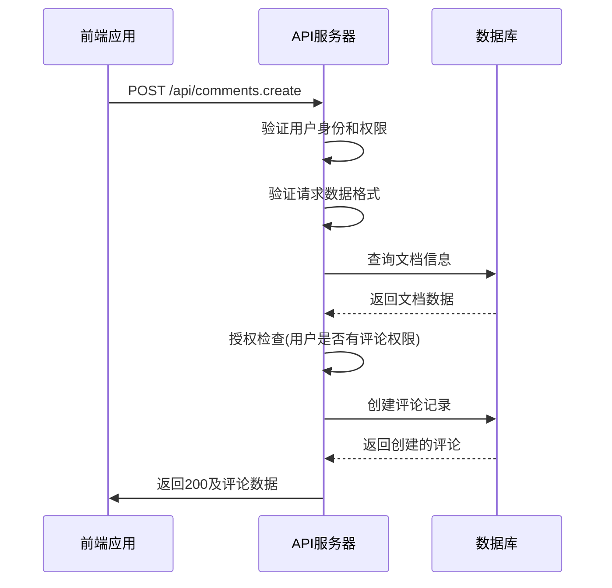
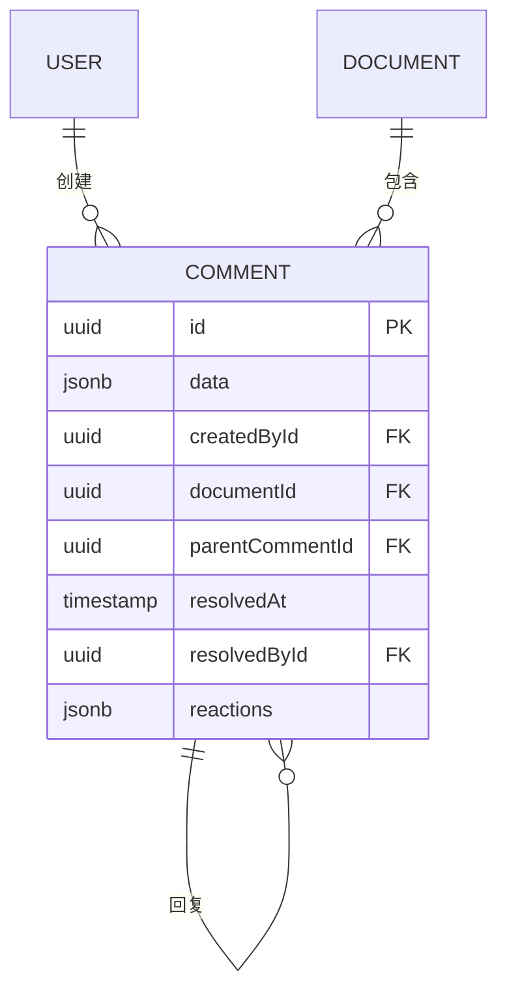

# 评论系统API

<cite>
**本文档引用的文件**   
- [comments.ts](file://server/routes/api/comments/comments.ts)
- [schema.ts](file://server/routes/api/comments/schema.ts)
- [comment.ts](file://server/policies/comment.ts)
- [Comment.ts](file://app/models/Comment.ts)
- [User.ts](file://app/models/User.ts)
</cite>

## 目录
1. [简介](#简介)
2. [核心端点](#核心端点)
3. [请求验证与数据结构](#请求验证与数据结构)
4. [权限策略](#权限策略)
5. [嵌套评论与高级功能](#嵌套评论与高级功能)
6. [前端调用示例](#前端调用示例)
7. [数据一致性与性能](#数据一致性与性能)

## 简介
本文档详细介绍了评论系统API的设计与实现。该系统为文档协作平台提供完整的评论功能，支持创建、回复、编辑、删除评论，以及解决/未解决状态管理、表情反应等功能。API基于RESTful设计，通过清晰的端点、请求/响应格式和状态码来保证接口的稳定性和可预测性。

**Section sources**
- [comments.ts](file://server/routes/api/comments/comments.ts#L1-L50)

## 核心端点
评论系统API提供了多个RESTful端点来管理评论的全生命周期。

### 创建评论
`comments.create`端点用于在文档中创建新的评论或回复。

- **HTTP方法**: POST
- **端点**: `/api/comments.create`
- **状态码**:
  - `200 OK`: 评论创建成功
  - `400 Bad Request`: 请求数据无效
  - `403 Forbidden`: 用户无权在该文档中评论
  - `429 Too Many Requests`: 请求频率超过限制



**Diagram sources**
- [comments.ts](file://server/routes/api/comments/comments.ts#L28-L68)

### 获取评论信息
`comments.info`端点用于获取单个评论的详细信息。

- **HTTP方法**: POST
- **端点**: `/api/comments.info`
- **状态码**:
  - `200 OK`: 成功获取评论信息
  - `404 Not Found`: 评论不存在
  - `403 Forbidden`: 用户无权查看该评论

### 列出评论
`comments.list`端点用于根据各种条件列出评论。

- **HTTP方法**: POST
- **端点**: `/api/comments.list`
- **状态码**:
  - `200 OK`: 成功获取评论列表
  - `400 Bad Request`: 查询参数无效

### 更新评论
`comments.update`端点用于编辑已存在的评论内容。

- **HTTP方法**: POST
- **端点**: `/api/comments.update`
- **状态码**:
  - `200 OK`: 评论更新成功
  - `403 Forbidden`: 用户无权编辑该评论
  - `404 Not Found`: 评论不存在

### 删除评论
`comments.delete`端点用于删除评论。

- **HTTP方法**: POST
- **端点**: `/api/comments.delete`
- **状态码**:
  - `200 OK`: 评论删除成功
  - `403 Forbidden`: 用户无权删除该评论

### 解决/未解决评论
系统提供了`comments.resolve`和`comments.unresolve`两个端点来管理评论的状态。

- **HTTP方法**: POST
- **端点**: `/api/comments.resolve` 和 `/api/comments.unresolve`
- **状态码**:
  - `200 OK`: 状态更新成功
  - `400 Bad Request`: 无法解决回复评论
  - `403 Forbidden`: 用户无权操作

### 表情反应
`comments.add_reaction`和`comments.remove_reaction`端点用于管理评论的表情反应。

- **HTTP方法**: POST
- **端点**: `/api/comments.add_reaction` 和 `/api/comments.remove_reaction`
- **状态码**:
  - `200 OK`: 反应操作成功
  - `403 Forbidden`: 用户无权对评论进行操作

**Section sources**
- [comments.ts](file://server/routes/api/comments/comments.ts#L28-L467)

## 请求验证与数据结构
评论系统的请求验证和数据结构在`schema.ts`文件中定义，使用Zod库进行类型安全的验证。

### 创建评论请求结构
```typescript
export const CommentsCreateSchema = BaseSchema.extend({
  body: z.object({
    id: z.string().uuid().optional(),
    documentId: z.string().uuid(),
    parentCommentId: z.string().uuid().optional(),
    data: ProsemirrorSchema().optional(),
    text: z.string().optional(),
  }).refine((obj) => !(isEmpty(obj.data) && isEmpty(obj.text)), {
    message: "data或text至少需要一个"
  }),
});
```

该结构定义了创建评论所需的参数：
- `documentId`: 必需，评论所属文档的ID
- `parentCommentId`: 可选，用于创建回复的父评论ID
- `data`: 可选，Prosemirror格式的评论内容
- `text`: 可选，纯文本格式的评论内容

### 更新评论请求结构
```typescript
export const CommentsUpdateSchema = BaseSchema.extend({
  body: BaseIdSchema.extend({
    data: ProsemirrorSchema(),
  }),
});
```

更新操作需要提供评论ID和新的内容数据。

### 评论状态过滤
系统支持通过`CommentStatusFilter`枚举来过滤评论状态：

```typescript
export enum CommentStatusFilter {
  Resolved = "resolved",
  Unresolved = "unresolved",
}
```

**Section sources**
- [schema.ts](file://server/routes/api/comments/schema.ts#L1-L112)

## 权限策略
评论系统的权限控制在`comment.ts`策略文件中实现，基于用户角色和评论状态进行精细化控制。

### 权限规则
```typescript
allow(User, "createComment", Team, isTeamModel);

allow(User, "read", Comment, (actor, comment) =>
  isTeamModel(actor, comment?.createdBy)
);

allow(User, "resolve", Comment, (actor, comment) =>
  and(
    isTeamModel(actor, comment?.createdBy),
    comment?.parentCommentId === null,
    comment?.resolvedById === null
  )
);

allow(User, ["update", "delete"], Comment, (actor, comment) =>
  and(
    isTeamModel(actor, comment?.createdBy),
    or(actor.isAdmin, actor?.id === comment?.createdById)
  )
);
```

这些规则定义了：
- 任何团队成员都可以创建评论
- 评论的创建者和团队成员可以读取评论
- 只有顶级评论且未解决的评论才能被解决
- 评论的创建者或管理员可以更新或删除评论

### 模型关系
评论模型与用户和文档模型建立了关联关系：

```typescript
@BelongsTo(() => User, "createdById")
createdBy: User;

@BelongsTo(() => Document, "documentId")
document: Document;

@BelongsTo(() => Comment, "parentCommentId")
parentComment: Comment;
```

这种设计确保了数据的一致性和完整性。



**Diagram sources**
- [comment.ts](file://server/policies/comment.ts#L1-L40)
- [Comment.ts](file://server/models/Comment.ts#L24-L164)

## 嵌套评论与高级功能
评论系统支持复杂的嵌套评论线程和实时通知功能。

### 嵌套评论实现
系统通过`parentCommentId`字段实现评论的嵌套结构，形成树状的评论线程。

```typescript
class Comment extends Model {
  @Field
  @observable
  parentCommentId: string | null;

  @Relation(() => Comment, { onDelete: "cascade" })
  parentComment?: Comment;

  @computed
  public get isReply() {
    return !!this.parentCommentId;
  }
}
```

当删除一个评论时，其所有子评论也会被级联删除：

```typescript
@AfterDestroy
public static async deleteChildComments(model: Comment, ctx: HookContext) {
  const childComments = await this.findAll({
    where: { parentCommentId: model.id },
    transaction,
    lock,
  });

  await Promise.all(
    childComments.map((childComment) => childComment.destroy({ transaction }))
  );
}
```

### 实时通知触发
当创建或更新评论时，系统会触发相应的通知：

```typescript
public createWithCtx = async (
  values: Partial<this>,
  options?: FindOptions<this>
) => {
  const comment = await this.create(values, options);
  this.store.add(comment);
  
  // 触发创建评论的通知
  this.events.emit("comments.create", { comment });
  
  return comment;
};
```

### @提及功能
系统支持在评论中@提及用户，通过解析Prosemirror数据中的提及标记来实现：

```typescript
if (data !== undefined) {
  const existingMentionIds = ProsemirrorHelper.parseMentions(
    ProsemirrorHelper.toProsemirror(comment.data),
    { type: MentionType.User }
  ).map((mention) => mention.id);
  
  const updatedMentionIds = ProsemirrorHelper.parseMentions(
    ProsemirrorHelper.toProsemirror(data),
    { type: MentionType.User }
  ).map((mention) => mention.id);

  const newMentionIds = difference(updatedMentionIds, existingMentionIds);
  
  // 如果有新的@提及，触发通知
  if (newMentionIds.length > 0) {
    this.events.emit("comments.mentioned", { 
      comment, 
      mentionedUserIds: newMentionIds 
    });
  }
}
```

**Section sources**
- [Comment.ts](file://app/models/Comment.ts#L12-L275)
- [comments.ts](file://server/routes/api/comments/comments.ts#L150-L185)

## 前端调用示例
以下是如何在前端应用中调用评论API的示例。

### 创建评论
```typescript
// 创建顶级评论
const createTopLevelComment = async (documentId: string, content: string) => {
  try {
    const response = await client.post("/comments.create", {
      documentId,
      text: content
    });
    
    return response.data;
  } catch (error) {
    console.error("创建评论失败:", error);
    throw error;
  }
};

// 创建回复
const createReply = async (parentCommentId: string, content: string) => {
  try {
    const response = await client.post("/comments.create", {
      parentCommentId,
      text: content
    });
    
    return response.data;
  } catch (error) {
    console.error("创建回复失败:", error);
    throw error;
  }
};
```

### 处理表情反应
```typescript
class Comment {
  @action
  public addReaction = async ({ emoji, user }: { emoji: string; user: User }) => {
    this.updateReaction({ type: "add", emoji, user });
    try {
      await client.post("/comments.add_reaction", {
        id: this.id,
        emoji,
      });
    } catch {
      // 如果API调用失败，回滚本地状态
      this.updateReaction({ type: "remove", emoji, user });
    }
  };

  @action
  public removeReaction = async ({ emoji, user }: { emoji: string; user: User }) => {
    this.updateReaction({ type: "remove", emoji, user });
    try {
      await client.post("/comments.remove_reaction", {
        id: this.id,
        emoji,
      });
    } catch {
      // 如果API调用失败，回滚本地状态
      this.updateReaction({ type: "add", emoji, user });
    }
  };
}
```

此实现采用了乐观更新模式，先更新本地UI状态，再调用API。如果API调用失败，则回滚到之前的状态，提供流畅的用户体验。

**Section sources**
- [Comment.ts](file://app/models/Comment.ts#L12-L275)

## 数据一致性与性能
评论系统通过多种机制确保数据一致性和高性能。

### 事务处理
所有修改操作都在数据库事务中执行，确保数据的一致性：

```typescript
router.post(
  "comments.update",
  auth(),
  feature(TeamPreference.Commenting),
  validate(T.CommentsUpdateSchema),
  transaction(), // 启用事务
  async (ctx: APIContext<T.CommentsUpdateReq>) => {
    // 操作在事务中执行
    const comment = await Comment.findByPk(id, {
      transaction,
      lock: {
        level: transaction.LOCK.UPDATE,
        of: Comment,
      },
    });
    
    // 更新操作
    await comment.saveWithCtx(ctx, undefined, { data: { newMentionIds } });
  }
);
```

### 性能优化策略
1. **分页支持**: 评论列表端点支持分页，避免一次性加载过多数据
2. **批量加载**: 支持一次性加载多个评论及其关联数据
3. **缓存机制**: 前端使用MobX状态管理，缓存评论数据
4. **选择性加载**: 支持按需加载锚点文本等附加信息

### 数据完整性
系统通过数据库约束和应用层验证确保数据完整性：

```typescript
@TextLength({
  max: CommentValidation.maxLength,
  msg: `评论必须少于 ${CommentValidation.maxLength} 个字符`
})
@Column(DataType.JSONB)
data: ProsemirrorData;
```

这些验证确保了评论内容不会超出预设的长度限制。

**Section sources**
- [comments.ts](file://server/routes/api/comments/comments.ts#L150-L185)
- [Comment.ts](file://server/models/Comment.ts#L24-L164)