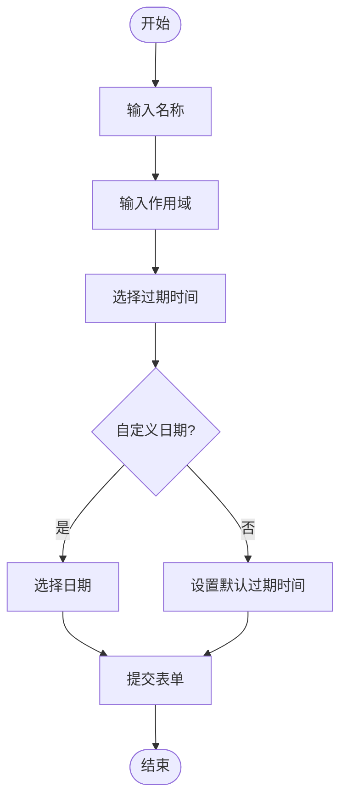
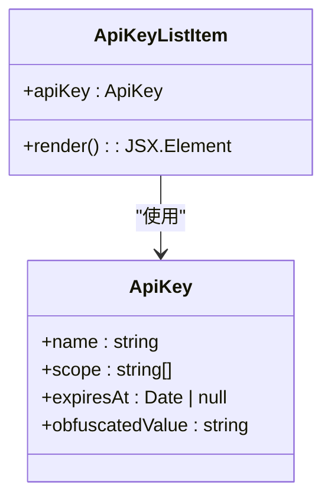

# 密钥创建与配置

<cite>
**本文档引用的文件**  
- [ApiKey.ts](file://server/models/ApiKey.ts)
- [schema.ts](file://shared/schema.ts)
- [index.tsx](file://app/scenes/ApiKeyNew/index.tsx)
- [ExpiryDatePicker.tsx](file://app/scenes/ApiKeyNew/components/ExpiryDatePicker.tsx)
- [ApiKeyListItem.tsx](file://app/scenes/Settings/components/ApiKeyListItem.tsx)
</cite>

## 目录
1. [API密钥模型配置](#api密钥模型配置)
2. [密钥创建流程](#密钥创建流程)
3. [前端表单实现](#前端表单实现)
4. [代码示例](#代码示例)
5. [密钥信息展示](#密钥信息展示)
6. [最佳实践](#最佳实践)

## API密钥模型配置

API密钥模型定义了密钥的核心属性和验证规则。`name`字段用于标识密钥，其长度必须在`ApiKeyValidation.minNameLength`和`ApiKeyValidation.maxNameLength`之间。`scope`字段定义了密钥的访问权限范围，通过正则表达式`/[\/\.\w\s]*/`进行验证，确保只包含合法字符。`expiresAt`字段指定了密钥的过期时间，如果未设置，则密钥永不过期。

**Section sources**
- [ApiKey.ts](file://server/models/ApiKey.ts#L26-L179)

## 密钥创建流程

创建API密钥的流程通过POST请求实现。请求参数包括`name`、`expiresAt`和`scope`。`zod`验证模式确保了参数的合法性，例如`name`不能为空，`expiresAt`必须是有效的日期格式。如果`scope`为空，则密钥具有完全访问权限。默认情况下，密钥的有效期为一周。

**Section sources**
- [schema.ts](file://shared/schema.ts#L3-L72)

## 前端表单实现

前端通过`ApiKeyNew`组件收集用户输入。表单包含`name`、`scope`和`expiresAt`三个字段。用户可以通过选择预设的过期时间或自定义日期来设置`expiresAt`。`ExpiryDatePicker`组件提供了日期选择功能，确保用户只能选择未来的日期。



**Diagram sources**
- [index.tsx](file://app/scenes/ApiKeyNew/index.tsx#L22-L152)
- [ExpiryDatePicker.tsx](file://app/scenes/ApiKeyNew/components/ExpiryDatePicker.tsx#L20-L76)

## 代码示例

以下代码展示了如何创建一个具有特定作用域和过期时间的API密钥：

```typescript
await apiKeys.create({
  name: "Development",
  expiresAt: new Date("2023-12-31").toISOString(),
  scope: ["documents.info", "collections.read"]
});
```

**Section sources**
- [index.tsx](file://app/scenes/ApiKeyNew/index.tsx#L22-L152)

## 密钥信息展示

`ApiKeyListItem`组件用于展示新创建的密钥信息。`obfuscatedValue`属性显示密钥的最后四位字符，前缀根据密钥的创建时间决定。如果密钥在2022年12月3日之前创建，则前缀为`...`；否则，前缀为`ol...`。



**Diagram sources**
- [ApiKeyListItem.tsx](file://app/scenes/Settings/components/ApiKeyListItem.tsx#L23-L105)

## 最佳实践

- **命名规范**：使用有意义的名称来标识密钥，例如“Development”或“Production”。
- **初始配置建议**：为不同的环境创建不同的密钥，并设置适当的过期时间。
- **作用域管理**：尽量使用最小权限原则，为密钥分配必要的作用域，避免过度授权。

**Section sources**
- [ApiKey.ts](file://server/models/ApiKey.ts#L26-L179)
- [index.tsx](file://app/scenes/ApiKeyNew/index.tsx#L22-L152)