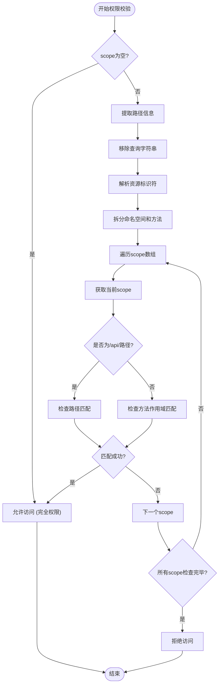

# 权限范围管理

<cite>
**本文档中引用的文件**  
- [ApiKey.ts](file://app/models/ApiKey.ts)
- [server/models/ApiKey.ts](file://server/models/ApiKey.ts)
- [AuthenticationHelper.ts](file://shared/helpers/AuthenticationHelper.ts)
- [ApiKeyListItem.tsx](file://app/scenes/Settings/components/ApiKeyListItem.tsx)
- [server/routes/api/apiKeys/schema.ts](file://server/routes/api/apiKeys/schema.ts)
</cite>

## 目录
1. [简介](#简介)
2. [权限范围字段设计](#权限范围字段设计)
3. [权限校验机制](#权限校验机制)
4. [API响应中的权限呈现](#api响应中的权限呈现)
5. [前端展示与交互](#前端展示与交互)
6. [密钥创建时的权限定义](#密钥创建时的权限定义)
7. [权限设计最佳实践](#权限设计最佳实践)
8. [权限校验流程图](#权限校验流程图)

## 简介
本文档详细阐述了API密钥权限范围管理机制。基于ApiKey模型中的scope字段，解释其作为字符串数组的权限控制机制。分析canAccess实例方法如何利用AuthenticationHelper.canAccess函数进行路径权限校验，描述scope字段在API响应中的呈现方式以及前端如何通过Tooltip展示受限作用域的详细信息。

**Section sources**
- [ApiKey.ts](file://app/models/ApiKey.ts#L7-L55)
- [server/models/ApiKey.ts](file://server/models/ApiKey.ts#L26-L179)

## 权限范围字段设计
权限范围（scope）字段是ApiKey模型中的核心安全属性，用于定义API密钥的访问权限边界。该字段设计为可选的字符串数组类型，具有以下特性：

- **数据类型**：`string[] | null`，存储在数据库的ARRAY类型字段中
- **验证规则**：每个字符串必须匹配正则表达式`/[\/\.\w\s]*/`，确保只包含合法字符
- **默认行为**：当scope字段为空或未定义时，API密钥拥有完全访问权限
- **数据库迁移**：通过20250125031823-add-api-key-scopes.js迁移脚本添加到apiKeys表

该设计支持细粒度的权限控制，允许为API密钥分配特定的访问权限，如`documents:create`、`collections:read`等。

**Section sources**
- [server/models/ApiKey.ts](file://server/models/ApiKey.ts#L54-L55)
- [server/migrations/20250125031823-add-api-key-scopes.js](file://server/migrations/20250125031823-add-api-key-scopes.js)

## 权限校验机制
权限校验通过ApiKey模型的canAccess实例方法实现，该方法委托给AuthenticationHelper.canAccess函数进行实际的权限检查。

### canAccess方法实现
```typescript
canAccess = (path: string) => {
  if (!this.scope) {
    return true;
  }
  return AuthenticationHelper.canAccess(path, this.scope);
};
```

### 核心校验逻辑
AuthenticationHelper.canAccess函数执行以下步骤：
1. 移除路径中的查询字符串参数
2. 解析路径末尾的资源标识符（如`documents.info`）
3. 将资源标识符拆分为命名空间和方法（如`documents`和`info`）
4. 遍历API密钥的scope数组，检查是否存在匹配的权限

支持的匹配模式包括：
- 精确匹配：`/api/documents.info`
- 通配符方法：`/api/documents.*`（匹配所有documents方法）
- 通配符命名空间：`/api/*.info`（匹配所有info方法）
- 多重作用域：API密钥可以拥有多个scope，任一匹配即通过校验

**Section sources**
- [server/models/ApiKey.ts](file://server/models/ApiKey.ts#L173-L181)
- [shared/helpers/AuthenticationHelper.ts](file://shared/helpers/AuthenticationHelper.ts#L15-L62)

## API响应中的权限呈现
在API响应中，权限范围通过presentApiKey呈现器进行格式化输出。scope字段作为字符串数组直接包含在响应体中，保持其原始结构。

### 响应结构
```json
{
  "id": "ak_123",
  "name": "Development Key",
  "scope": ["documents:create", "collections:read"],
  "createdAt": "2024-01-01T00:00:00Z",
  "lastActiveAt": "2024-01-02T00:00:00Z"
}
```

### 创建API密钥的请求验证
使用Zod模式对创建请求进行验证：
```typescript
const createApiKeySchema = z.object({
  name: z.string(),
  expiresAt: z.coerce.date().optional(),
  scope: z.array(z.string()).optional(),
})
```

**Section sources**
- [server/routes/api/apiKeys/schema.ts](file://server/routes/api/apiKeys/schema.ts#L3-L12)
- [server/routes/api/apiKeys/apiKeys.ts](file://server/routes/api/apiKeys/apiKeys.ts#L23-L45)

## 前端展示与交互
前端通过ApiKeyListItem组件展示API密钥信息，特别处理权限范围的可视化呈现。

### Tooltip展示机制
当API密钥具有受限作用域时，组件使用Tooltip组件显示详细信息：
```typescript
{apiKey.scope && (
  <Tooltip
    content={apiKey.scope.map((s) => (
      <>
        {s}
        <br />
      </>
    ))}
  >
    <Text type="tertiary">{t("Restricted scope")}</Text>
  </Tooltip>
)}
```

### 展示特点
- **简洁显示**：主界面仅显示"受限作用域"文本
- **详细提示**：鼠标悬停时通过Tooltip显示所有具体的权限项
- **格式化**：每个权限项单独成行，提高可读性
- **国际化**：使用i18n翻译文本，支持多语言

**Section sources**
- [app/scenes/Settings/components/ApiKeyListItem.tsx](file://app/scenes/Settings/components/ApiKeyListItem.tsx#L58-L76)
- [app/components/Tooltip.tsx](file://app/components/Tooltip.tsx)

## 密钥创建时的权限定义
在创建API密钥时，用户可以通过表单界面定义细粒度的作用域。

### 支持的作用域格式
- **文档操作**：`documents:create`、`documents:read`、`documents:update`、`documents:delete`
- **集合操作**：`collections:create`、`collections:read`、`collections:update`
- **API操作**：`/api/documents.info`、`/api/collections.list`
- **通配符**：`documents:*`（所有文档操作）、`*:read`（所有读取操作）

### 创建流程
1. 用户在"API密钥"设置页面点击"新建API密钥"
2. 在创建表单中选择或输入具体的权限范围
3. 系统验证权限格式的合法性
4. 创建成功后返回包含权限范围的API密钥对象

**Section sources**
- [app/scenes/ApiKeyNew/index.tsx](file://app/scenes/ApiKeyNew/index.tsx)
- [server/routes/api/apiKeys/schema.ts](file://server/routes/api/apiKeys/schema.ts#L25-L30)

## 权限设计最佳实践
### 最小权限原则
遵循最小权限原则，为API密钥分配完成特定任务所需的最小权限集：
- **只读应用**：仅授予`*:read`或`collections:read`、`documents:read`
- **写入应用**：根据需要授予`documents:create`或`documents:update`
- **专用密钥**：为不同应用创建专用密钥，避免权限过度集中

### 作用域命名规范
采用一致的命名规范提高可维护性：
- **格式**：`资源:操作` 或 `/api/命名空间.方法`
- **资源**：使用小写复数形式（如`documents`、`collections`）
- **操作**：使用标准HTTP方法或业务操作（如`create`、`read`、`update`、`delete`）
- **分隔符**：使用冒号(:)或点(.)分隔资源和操作

### 安全建议
- **定期审查**：定期审查API密钥的权限和使用情况
- **设置过期**：为API密钥设置合理的过期时间
- **监控使用**：监控API密钥的使用频率和访问模式
- **及时撤销**：不再需要时及时撤销API密钥

**Section sources**
- [shared/helpers/AuthenticationHelper.ts](file://shared/helpers/AuthenticationHelper.ts)
- [server/models/ApiKey.ts](file://server/models/ApiKey.ts)

## 权限校验流程图


**Diagram sources**
- [server/models/ApiKey.ts](file://server/models/ApiKey.ts#L173-L181)
- [shared/helpers/AuthenticationHelper.ts](file://shared/helpers/AuthenticationHelper.ts#L15-L62)