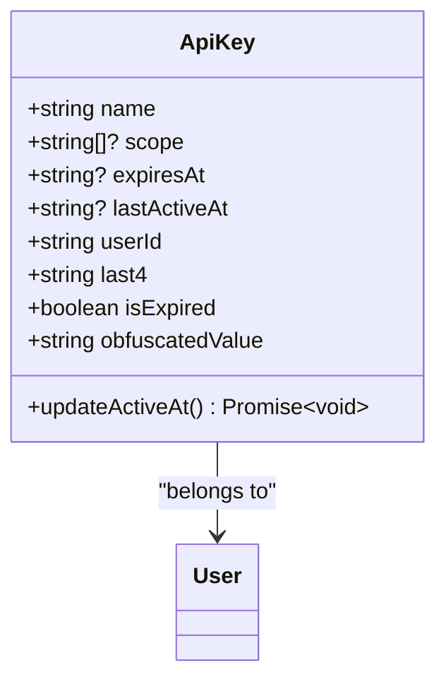
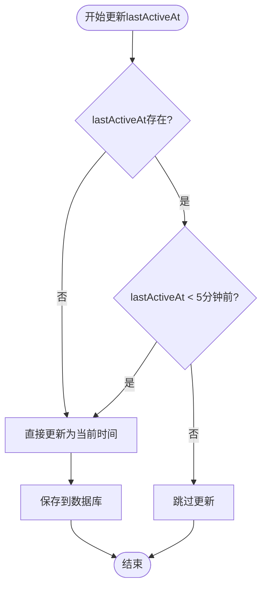
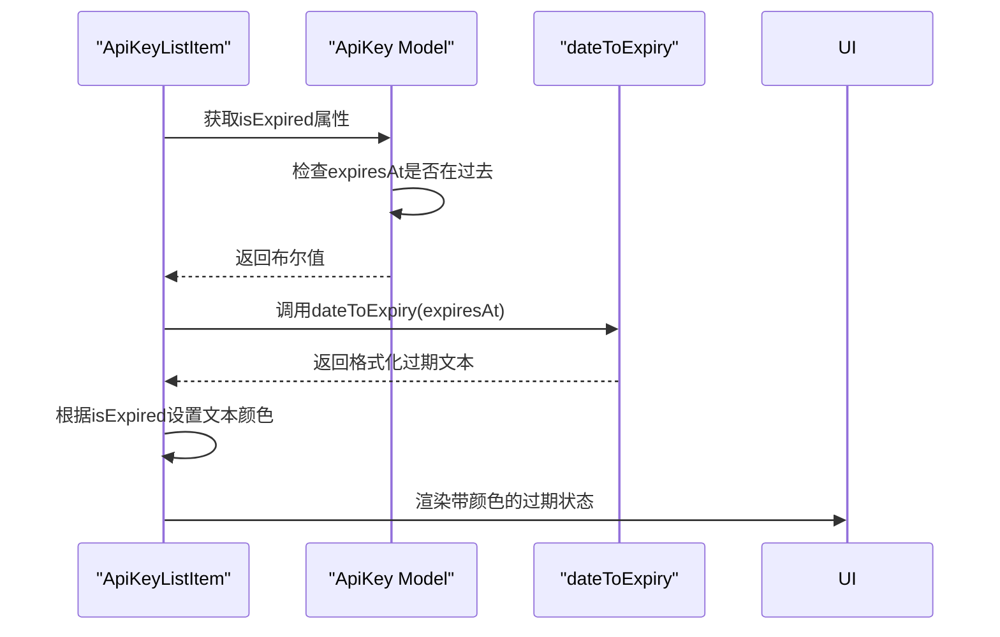
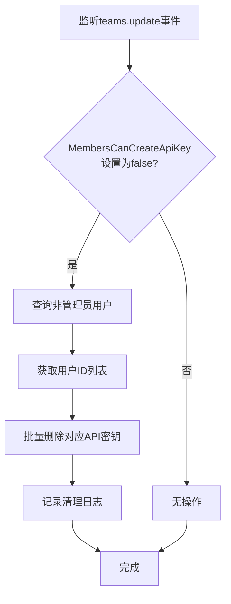

# 生命周期与监控

<cite>
**Referenced Files in This Document**   
- [app/models/ApiKey.ts](file://app/models/ApiKey.ts)
- [server/models/ApiKey.ts](file://server/models/ApiKey.ts)
- [app/scenes/Settings/components/ApiKeyListItem.tsx](file://app/scenes/Settings/components/ApiKeyListItem.tsx)
- [server/queues/processors/ApiKeyCleanupProcessor.ts](file://server/queues/processors/ApiKeyCleanupProcessor.ts)
- [app/utils/date.ts](file://app/utils/date.ts)
</cite>

## 目录
1. [API密钥生命周期概述](#api密钥生命周期概述)
2. [核心字段设计](#核心字段设计)
3. [更新策略分析](#更新策略分析)
4. [前端状态显示](#前端状态显示)
5. [自动清理机制](#自动清理机制)
6. [最佳实践指南](#最佳实践指南)

## API密钥生命周期概述

API密钥作为系统安全访问的重要凭证，其生命周期管理涉及创建、使用、过期和清理等多个阶段。本系统通过精心设计的数据模型和处理机制，实现了对API密钥全生命周期的精细化管理。密钥的生命周期由`expiresAt`和`lastActiveAt`两个核心字段共同定义，前者控制密钥的有效期限，后者记录密钥的最后使用时间。这种设计既保证了安全性，又提供了灵活的使用监控能力。

**Section sources**
- [app/models/ApiKey.ts](file://app/models/ApiKey.ts#L1-L59)
- [server/models/ApiKey.ts](file://server/models/ApiKey.ts#L1-L183)

## 核心字段设计

### expiresAt字段

`expiresAt`字段用于定义API密钥的过期时间，是一个可选的日期时间字段。当该字段被设置时，系统会根据当前时间判断密钥是否已过期。此设计允许为不同用途的密钥设置不同的有效期，例如临时访问密钥可以设置较短的有效期，而长期集成密钥可以设置较长或无限期的有效期。对于未设置过期时间的密钥，系统默认其永不过期。

### lastActiveAt字段

`lastActiveAt`字段记录API密钥最后一次被使用的时间戳。该字段在密钥每次被成功验证和使用时更新，为系统管理员提供了重要的使用监控信息。通过分析`lastActiveAt`数据，可以识别长期未使用的密钥，从而进行安全审计或自动清理，减少潜在的安全风险。

**Diagram sources**
- [app/models/ApiKey.ts](file://app/models/ApiKey.ts#L1-L59)
- [server/models/ApiKey.ts](file://server/models/ApiKey.ts#L1-L183)

**Section sources**
- [app/models/ApiKey.ts](file://app/models/ApiKey.ts#L1-L59)
- [server/models/ApiKey.ts](file://server/models/ApiKey.ts#L1-L183)

## 更新策略分析

### 5分钟静默更新策略

`updateActiveAt`实例方法实现了关键的5分钟静默更新策略，旨在减少数据库写入压力。该策略的核心逻辑是：只有当密钥的`lastActiveAt`时间早于5分钟前，才会更新数据库中的时间戳。这种设计避免了在高频率API调用场景下对数据库的频繁写入操作。

**Diagram sources**
- [server/models/ApiKey.ts](file://server/models/ApiKey.ts#L159-L169)

**Section sources**
- [server/models/ApiKey.ts](file://server/models/ApiKey.ts#L159-L169)

## 前端状态显示

### isExpired计算属性

在前端`app/models/ApiKey.ts`文件中，`isExpired`是一个计算属性，用于判断API密钥是否已过期。其实现逻辑简洁高效：如果`expiresAt`字段存在，则使用`date-fns`库的`isPast`函数判断该时间是否在过去；如果`expiresAt`为空，则认为密钥未过期。这种设计确保了过期判断的准确性和性能。

### ApiKeyListItem组件显示

`ApiKeyListItem`组件通过颜色编码直观地显示API密钥的过期状态。当`isExpired`计算属性返回`true`时，过期信息以危险色（红色）显示；否则以常规的三级文本颜色显示。这种视觉区分帮助用户快速识别需要处理的过期密钥。

**Diagram sources**
- [app/models/ApiKey.ts](file://app/models/ApiKey.ts#L45-L50)
- [app/scenes/Settings/components/ApiKeyListItem.tsx](file://app/scenes/Settings/components/ApiKeyListItem.tsx#L28-L76)
- [app/utils/date.ts](file://app/utils/date.ts#L85-L114)

**Section sources**
- [app/models/ApiKey.ts](file://app/models/ApiKey.ts#L45-L50)
- [app/scenes/Settings/components/ApiKeyListItem.tsx](file://app/scenes/Settings/components/ApiKeyListItem.tsx#L1-L109)

## 自动清理机制

### ApiKeyCleanupProcessor处理器

`ApiKeyCleanupProcessor`处理器监听团队设置更新事件，当检测到团队偏好设置中"成员可创建API密钥"选项被禁用时，自动触发清理流程。该处理器首先查询团队中所有非管理员用户，然后批量删除这些用户创建的所有API密钥。这种设计确保了团队安全策略变更能够立即生效，消除了潜在的安全隐患。

**Diagram sources**
- [server/queues/processors/ApiKeyCleanupProcessor.ts](file://server/queues/processors/ApiKeyCleanupProcessor.ts#L1-L43)

**Section sources**
- [server/queues/processors/ApiKeyCleanupProcessor.ts](file://server/queues/processors/ApiKeyCleanupProcessor.ts#L1-L43)

## 最佳实践指南

### 密钥轮换策略

建议定期轮换API密钥，特别是对于高权限密钥。可以设置较短的过期时间（如30天），并在密钥即将过期时生成新密钥并平稳过渡。系统提供的`lastActiveAt`字段可以帮助识别哪些密钥仍在使用，避免误删活跃密钥。

### 过期告警机制

建议建立过期告警机制，在密钥过期前7天、3天和1天发送提醒。可以利用`expiresAt`字段结合定时任务实现这一功能，确保用户有足够时间更新密钥，避免服务中断。

### 使用监控建议

通过分析`lastActiveAt`数据，可以实施以下监控策略：
- 识别90天内未使用的密钥，标记为可清理状态
- 监控高频率使用的密钥，评估是否需要拆分权限
- 分析密钥使用模式，发现异常访问行为

### last4字段的作用

`last4`字段在前端显示中起到重要作用，它显示密钥的最后四位字符，格式化为`ol...1234`。这种显示方式既提供了密钥的识别信息，又保护了密钥的完整安全性，使用户能够确认操作的是正确的密钥，同时防止密钥完全暴露。

**Section sources**
- [app/models/ApiKey.ts](file://app/models/ApiKey.ts#L1-L59)
- [server/models/ApiKey.ts](file://server/models/ApiKey.ts#L1-L183)
- [app/scenes/Settings/components/ApiKeyListItem.tsx](file://app/scenes/Settings/components/ApiKeyListItem.tsx#L1-L109)