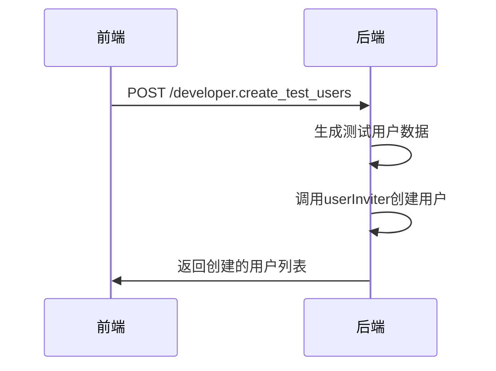
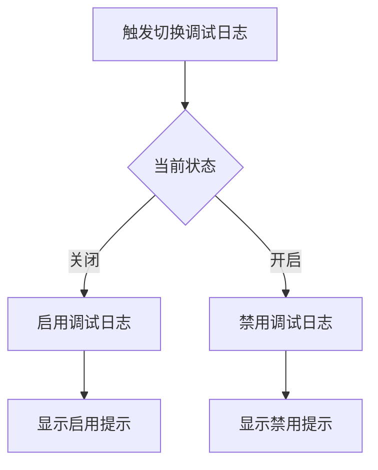
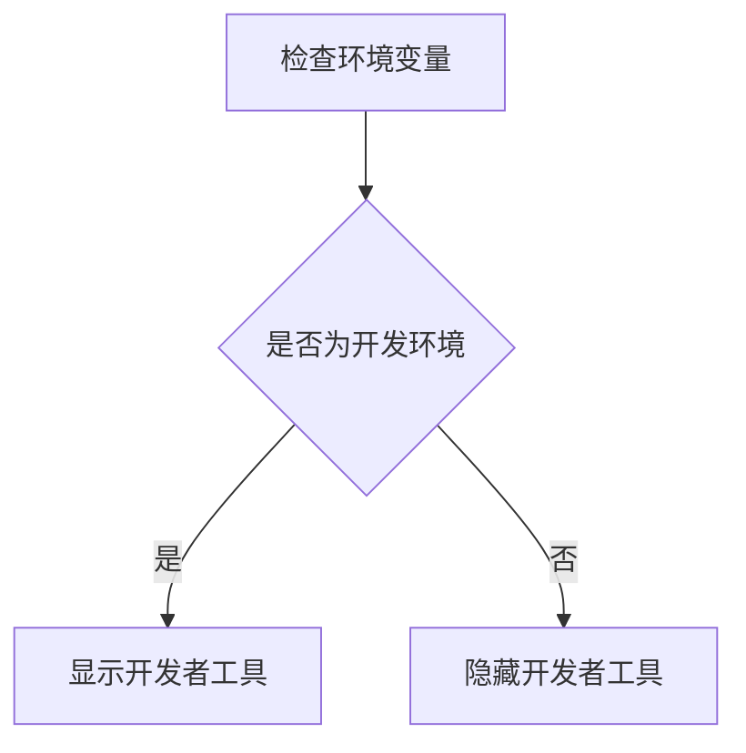
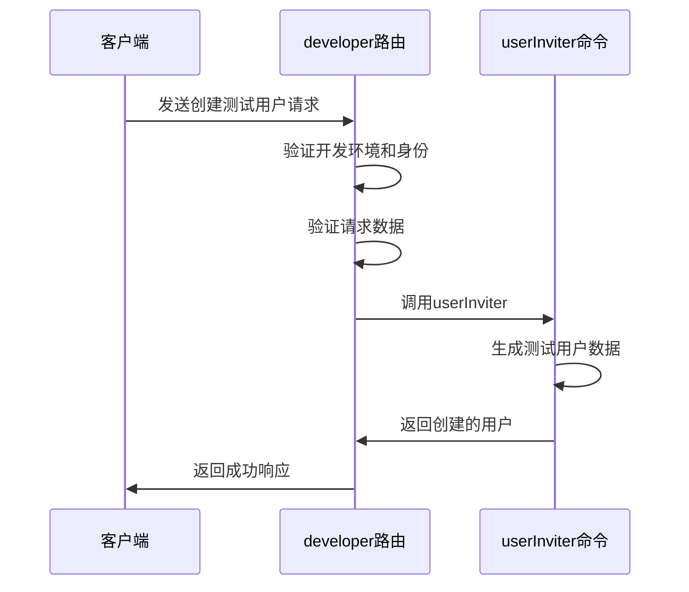
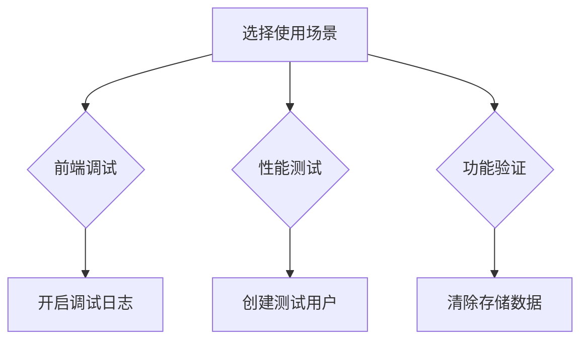
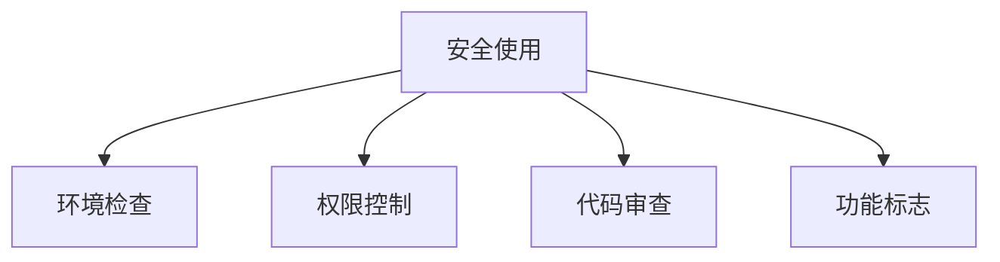

# 开发者实用工具

<cite>
**本文档引用的文件**  
- [developer.tsx](file://app/actions/definitions/developer.tsx)
- [developer.ts](file://app/utils/developer.ts)
- [ApiClient.ts](file://app/utils/ApiClient.ts)
- [FeatureFlags.ts](file://app/utils/FeatureFlags.ts)
- [Logger.ts](file://app/utils/Logger.ts)
- [developer.ts](file://server/routes/api/developer/developer.ts)
- [schema.ts](file://server/routes/api/developer/schema.ts)
- [userInviter.ts](file://server/commands/userInviter.ts)
- [user.ts](file://server/presenters/user.ts)
</cite>

## 目录
1. [简介](#简介)
2. [核心功能详解](#核心功能详解)
3. [开发环境可见性设计](#开发环境可见性设计)
4. [后端路由处理机制](#后端路由处理机制)
5. [使用场景示例](#使用场景示例)
6. [安全使用指南](#安全使用指南)
7. [结论](#结论)

## 简介
开发者实用工具是一组专为开发和调试环境设计的辅助功能，通过`developer.tsx`中的`createAction`函数实现。这些工具包括清除本地存储、创建测试用户、创建通知消息和切换调试日志等功能，仅在开发环境可见，确保生产环境的安全性。本文档详细说明这些功能的实现机制、后端处理流程以及使用场景。

**Section sources**
- [developer.tsx](file://app/actions/definitions/developer.tsx#L1-L50)

## 核心功能详解

### 清除本地存储
该功能通过调用`Storage.clear()`方法清除浏览器的本地存储数据，帮助开发者重置应用状态。

```mermaid
flowchart TD
A[触发清除本地存储] --> B[调用Storage.clear()]
B --> C[显示清除成功提示]
```

**Diagram sources**
- [developer.tsx](file://app/actions/definitions/developer.tsx#L130-L136)
- [Storage.ts](file://shared/utils/Storage.ts#L55-L107)

### 创建测试用户
通过向`/developer.create_test_users` API端点发送POST请求，批量创建测试用户，用于功能验证和性能测试。



**Diagram sources**
- [developer.tsx](file://app/actions/definitions/developer.tsx#L140-L148)
- [developer.ts](file://server/routes/api/developer/developer.ts#L0-L62)

### 创建通知消息
使用`toast.message()`函数创建持续30秒的通知消息，用于测试前端通知系统的显示效果。

```mermaid
flowchart TD
A[触发创建通知] --> B[调用toast.message()]
B --> C[显示Hello world通知]
```

**Diagram sources**
- [developer.tsx](file://app/actions/definitions/developer.tsx#L150-L158)

### 切换调试日志
通过修改`Logger.debugLoggingEnabled`属性的值，动态开启或关闭调试日志输出，便于开发者监控应用运行状态。



**Diagram sources**
- [developer.tsx](file://app/actions/definitions/developer.tsx#L160-L176)
- [Logger.ts](file://app/utils/Logger.ts#L17-L92)

**Section sources**
- [developer.tsx](file://app/actions/definitions/developer.tsx#L130-L176)

## 开发环境可见性设计
所有开发者工具功能都通过`env.ENVIRONMENT === "development"`条件判断来控制可见性，确保这些强大的调试功能仅在开发环境中可用。这种设计决策有效防止了生产环境中潜在的安全风险和误操作。



**Diagram sources**
- [developer.tsx](file://app/actions/definitions/developer.tsx#L145-L147)
- [developer.tsx](file://app/actions/definitions/developer.tsx#L154-L156)

**Section sources**
- [developer.tsx](file://app/actions/definitions/developer.tsx#L140-L158)

## 后端路由处理机制
后端`developer`路由通过Koa框架处理调试请求，包含身份验证中间件和输入验证。创建测试用户的API端点首先验证环境为开发模式，然后调用`userInviter`命令批量创建用户。



**Diagram sources**
- [developer.ts](file://server/routes/api/developer/developer.ts#L0-L62)
- [schema.ts](file://server/routes/api/developer/schema.ts#L0-L9)
- [userInviter.ts](file://server/commands/userInviter.ts#L22-L120)

**Section sources**
- [developer.ts](file://server/routes/api/developer/developer.ts#L0-L62)

## 使用场景示例

### 前端调试
开发者可以使用"切换调试日志"功能来监控应用的运行状态，通过控制台输出的详细日志信息定位问题。

### 性能测试
通过"创建10个测试用户"功能，可以快速生成大量测试数据，用于评估系统在高负载情况下的性能表现。

### 功能验证
使用"清除本地存储"和"清除IndexedDB缓存"功能，可以重置应用到初始状态，验证各种功能在全新环境下的行为。



**Diagram sources**
- [developer.tsx](file://app/actions/definitions/developer.tsx#L130-L176)

**Section sources**
- [developer.tsx](file://app/actions/definitions/developer.tsx#L130-L176)

## 安全使用指南
在开发环境中使用这些强大的调试功能时，需要注意以下安全事项：
1. 确保所有调试功能都受`development`环境变量保护
2. 避免在共享的开发环境中暴露敏感的调试功能
3. 定期审查调试代码，确保没有意外泄露到生产环境
4. 使用功能标志（Feature Flags）来精细控制调试功能的可用性



**Diagram sources**
- [developer.tsx](file://app/actions/definitions/developer.tsx#L178-L236)

**Section sources**
- [developer.tsx](file://app/actions/definitions/developer.tsx#L178-L236)

## 结论
开发者实用工具为开发和调试环境提供了强大的辅助功能，通过精心设计的前后端架构和严格的安全控制，确保了这些功能既能有效提升开发效率，又不会对生产环境造成安全威胁。合理使用这些工具可以显著提高开发质量和效率。