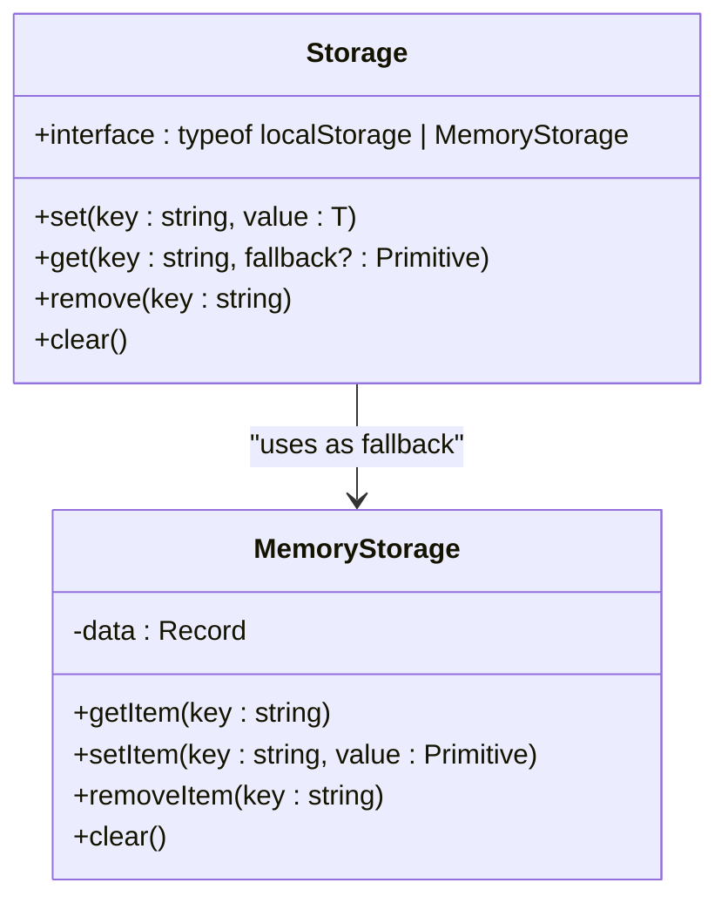
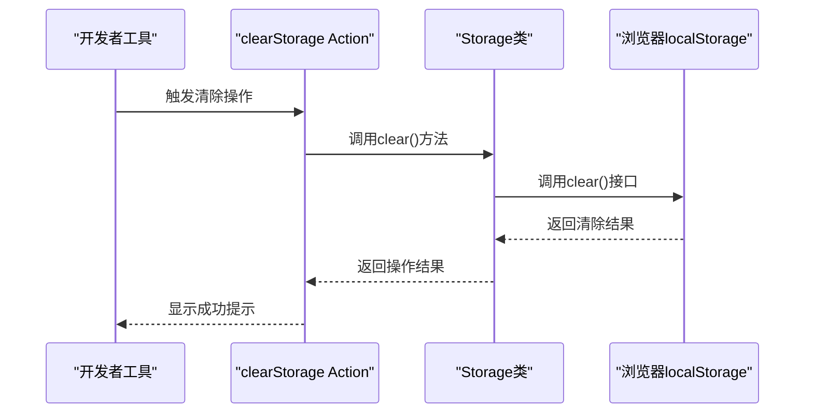
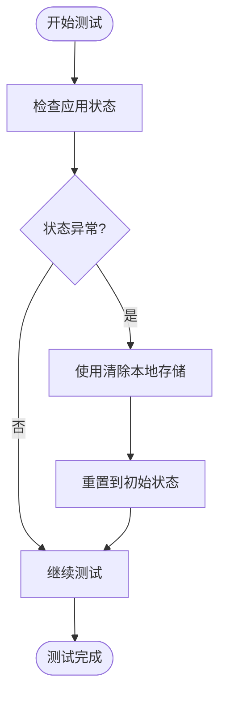

# 本地存储管理

<cite>
**Referenced Files in This Document**   
- [developer.tsx](file://app/actions/definitions/developer.tsx)
- [Storage.ts](file://shared/utils/Storage.ts)
- [developer.ts](file://app/utils/developer.ts)
- [FeatureFlags.ts](file://app/utils/FeatureFlags.ts)
</cite>

## 目录
1. [简介](#简介)
2. [核心功能实现](#核心功能实现)
3. [清除本地存储的开发者工具](#清除本地存储的开发者工具)
4. [后端配合需求分析](#后端配合需求分析)
5. [实际应用场景](#实际应用场景)
6. [使用示例与注意事项](#使用示例与注意事项)
7. [结论](#结论)

## 简介
本文档详细说明了前端应用中"清除本地存储"这一开发者工具的实现机制。该功能主要用于开发和调试阶段，通过重置前端状态来帮助开发者快速恢复应用到初始状态。文档将深入分析该功能的技术实现，包括其在`app/actions/definitions/developer.tsx`中的action定义，以及如何通过封装的Storage类调用浏览器的本地存储API。同时，文档还将探讨该功能在不同场景下的应用价值和使用限制。

**Section sources**
- [developer.tsx](file://app/actions/definitions/developer.tsx)

## 核心功能实现
"清除本地存储"功能的核心实现依赖于一个名为`Storage`的封装类，该类提供了对浏览器`localStorage`的安全访问。`Storage`类的设计考虑了`localStorage`可能不可用的情况，通过`MemoryStorage`作为备用方案，确保应用在各种环境下都能正常运行。

`Storage`类的`clear()`方法是实现清除功能的关键。该方法直接调用底层存储接口的`clear()`方法，无论是`localStorage`还是内存存储，都能有效地清除所有存储的数据。这种封装设计不仅提高了代码的可维护性，还增强了应用的健壮性。

**Diagram sources**
- [Storage.ts](file://shared/utils/Storage.ts#L6-L81)
- [Storage.ts](file://shared/utils/Storage.ts#L87-L105)

**Section sources**
- [Storage.ts](file://shared/utils/Storage.ts#L6-L108)

## 清除本地存储的开发者工具
在`app/actions/definitions/developer.tsx`文件中，定义了一个名为`clearStorage`的action，这是"清除本地存储"功能的具体实现。该action通过调用`Storage.clear()`方法来重置前端状态，为开发者提供了一种快速清理应用数据的手段。

该开发者工具具有以下特点：
- 仅在开发环境可见和可用，确保生产环境的安全性
- 执行后会显示成功提示，提供良好的用户体验
- 与其他开发者工具（如清除IndexedDB缓存、切换调试日志等）集成在同一菜单中

**Diagram sources**
- [developer.tsx](file://app/actions/definitions/developer.tsx#L180-L188)
- [Storage.ts](file://shared/utils/Storage.ts#L73-L79)

**Section sources**
- [developer.tsx](file://app/actions/definitions/developer.tsx#L180-L188)

## 后端配合需求分析
"清除本地存储"功能是一个纯粹的前端操作，不需要后端的直接配合处理相关请求。这是因为`localStorage`是浏览器提供的客户端存储机制，其数据完全保存在用户的本地设备上，与服务器端没有直接的数据同步。

然而，清除本地存储可能会间接影响与后端的交互：
- 用户认证状态：如果认证令牌存储在`localStorage`中，清除后用户需要重新登录
- 用户偏好设置：存储在本地的用户界面设置将被重置
- 缓存数据：前端缓存的API响应数据将被清除，可能导致后续请求需要重新从服务器获取

这种设计体现了前后端职责的清晰分离：前端负责管理本地状态，后端负责管理持久化数据和业务逻辑。

**Section sources**
- [developer.tsx](file://app/actions/definitions/developer.tsx)
- [Storage.ts](file://shared/utils/Storage.ts)

## 实际应用场景
"清除本地存储"功能在多种开发和测试场景中具有重要价值：

### 调试状态管理
当应用状态出现异常或难以复现的bug时，开发者可以使用此功能快速重置应用到初始状态，排除本地存储数据污染的可能性。

### 用户会话重置
在测试用户登录、权限控制等功能时，开发者可以快速清除认证信息，模拟新用户会话，而无需手动删除特定的存储项。

### 性能测试
通过清除本地缓存，开发者可以进行真实的性能基准测试，确保测量结果不受缓存数据的影响。

### 功能演示
在向团队成员或客户演示新功能时，开发者可以确保应用处于干净的状态，避免因个人配置或数据导致的演示问题。

**Diagram sources**
- [developer.tsx](file://app/actions/definitions/developer.tsx)
- [Storage.ts](file://shared/utils/Storage.ts)

## 使用示例与注意事项
### 使用示例
1. 在开发环境中打开应用
2. 通过快捷键或菜单访问开发者工具
3. 选择"清除本地存储"选项
4. 确认操作并查看成功提示

### 注意事项
- **仅限开发环境**：此功能在生产环境中不可见，以防止用户误操作导致数据丢失
- **数据不可恢复**：清除操作是不可逆的，所有本地存储的数据将永久丢失
- **影响范围**：不仅清除应用特定的数据，还可能影响其他使用相同域名的应用的`localStorage`
- **替代方案**：对于需要保留部分数据的场景，建议使用更精细的清除策略，如仅清除特定键值

特别强调，此功能仅限开发环境使用的重要性在于保护用户数据安全，避免因误操作导致生产环境用户数据丢失。

**Section sources**
- [developer.tsx](file://app/actions/definitions/developer.tsx)
- [Storage.ts](file://shared/utils/Storage.ts)

## 结论
"清除本地存储"作为一个开发者工具，通过简洁而有效的实现，为前端开发和调试提供了重要的支持。其核心价值在于能够快速重置应用状态，帮助开发者高效地进行问题排查和功能测试。该功能的设计体现了良好的工程实践：通过封装提高代码质量，通过环境限制确保生产安全，通过用户反馈提升使用体验。在未来的开发中，建议保持这种注重开发者体验和系统安全性的设计原则。