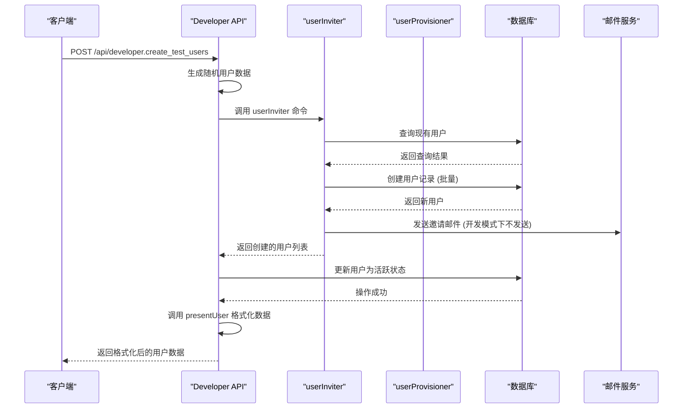

# 测试数据生成

<cite>
**Referenced Files in This Document**   
- [developer.ts](file://server/routes/api/developer/developer.ts)
- [schema.ts](file://shared/schema.ts)
- [userProvisioner.ts](file://server/commands/userProvisioner.ts)
- [schema.ts](file://server/routes/api/developer/schema.ts)
- [userInviter.ts](file://server/commands/userInviter.ts)
- [user.ts](file://server/presenters/user.ts)
</cite>

## 目录
1. [简介](#简介)
2. [核心功能与API端点](#核心功能与api端点)
3. [请求参数与数据结构](#请求参数与数据结构)
4. [后端处理流程](#后端处理流程)
5. [功能应用与使用示例](#功能应用与使用示例)
6. [总结](#总结)

## 简介
本文档详细介绍了系统中“测试数据生成功能”的实现机制，重点围绕`server/routes/api/developer/developer.ts`中的API端点。该功能旨在为开发和测试环境快速生成预设的测试账户，以支持前端UI测试、权限验证和性能压力测试等多种场景。文档将深入解析创建测试用户的核心流程，包括请求参数的结构定义、后端服务的调用链路（如`userInviter`和`userProvisioner`），以及最终返回数据的处理方式。

## 核心功能与API端点

`developer.ts`文件实现了一个专门用于开发环境的API路由，其核心功能是批量创建测试用户。该功能通过一个名为`developer.create_test_users`的POST端点暴露。

该端点受到严格的环境限制，仅在开发环境（`env.ENVIRONMENT === "development"`）下可用，以防止在生产环境中被误用。当接收到请求时，系统会根据请求中指定的数量（`count`）生成相应数量的测试用户。每个用户的邮箱地址和姓名均通过随机字符串生成，确保数据的唯一性和可预测性。

**Section sources**
- [developer.ts](file://server/routes/api/developer/developer.ts#L1-L62)

## 请求参数与数据结构

创建测试用户的请求参数结构在`server/routes/api/developer/schema.ts`文件中通过Zod库进行严格定义。

`CreateTestUsersSchema`定义了请求体（`body`）的结构，其中包含一个可选的`count`字段，该字段被强制转换为数字类型（`z.coerce.number()`），并默认值为10。这确保了即使前端传入字符串格式的数字，也能被正确解析，并且在未指定数量时提供一个合理的默认值。

`CreateTestUsersReq`类型则是该Schema的推断结果，为TypeScript提供了类型安全。值得注意的是，尽管`schema.ts`文件位于`shared`目录下，但在此功能中实际引用的是`developer`目录下的`schema.ts`，这体现了项目中API Schema的分层设计。

**Section sources**
- [schema.ts](file://server/routes/api/developer/schema.ts#L3-L9)

## 后端处理流程

创建测试用户的后端处理是一个多步骤的流程，涉及多个核心服务的协同工作。



**Diagram sources**
- [developer.ts](file://server/routes/api/developer/developer.ts#L1-L62)
- [userInviter.ts](file://server/commands/userInviter.ts#L22-L120)
- [userProvisioner.ts](file://server/commands/userProvisioner.ts#L52-L239)
- [user.ts](file://server/presenters/user.ts#L27-L57)

### 1. 用户创建 (`userInviter`)
`developer.ts`端点在生成随机用户数据后，会调用`userInviter`命令。`userInviter`负责处理用户邀请的核心逻辑。它首先会对输入的用户列表进行去重和格式化，然后检查这些邮箱地址是否已存在于系统中。对于不存在的用户，它会通过`User.createWithCtx`方法在数据库中创建新的用户记录，并标记为已发送邀请（`InviteSent` flag）。在开发环境中，邀请邮件的发送逻辑会被跳过。

### 2. 用户激活与数据格式化
`userInviter`返回创建的用户列表后，`developer.ts`会通过`Promise.all`并行调用每个用户的`updateActiveAt`方法，将这些新创建的“邀请”状态用户激活为“活跃”用户。

最后，为了将用户数据安全地返回给前端，系统会调用`presentUser`函数。该函数位于`server/presenters/user.ts`，其作用是将数据库中的`User`模型对象转换为一个精简的、适合API传输的`UserPresentation`对象。它会过滤掉敏感信息（如密码哈希），并根据选项决定是否包含电子邮件等详细信息。

**Section sources**
- [userInviter.ts](file://server/commands/userInviter.ts#L22-L120)
- [userProvisioner.ts](file://server/commands/userProvisioner.ts#L52-L239)
- [user.ts](file://server/presenters/user.ts#L27-L57)

## 功能应用与使用示例

此测试数据生成功能在多种开发和测试场景中具有重要价值。

### 应用场景
- **前端UI测试**: 可以快速生成大量用户，用于测试用户列表、头像墙、权限标签等UI组件在不同数据量下的表现。
- **权限验证**: 通过创建不同角色（如管理员、成员、访客）的测试用户，可以方便地验证系统中复杂的权限控制逻辑。
- **性能压力测试**: 在进行API性能测试或数据库压力测试时，可以利用此功能一键生成成百上千的测试账户，模拟真实用户负载。

### 使用示例
以下是一个使用curl命令调用此API的示例，用于创建20个测试用户：

```bash
curl -X POST https://your-dev-instance.com/api/developer.create_test_users \
  -H "Authorization: Bearer YOUR_DEV_TOKEN" \
  -H "Content-Type: application/json" \
  -d '{"count": 20}'
```

**Section sources**
- [developer.ts](file://server/routes/api/developer/developer.ts#L1-L62)

## 总结
本文档详细阐述了测试数据生成功能的技术实现。该功能通过一个受保护的API端点，结合`userInviter`、`userProvisioner`和`presentUser`等多个后端服务，实现了在开发环境中安全、高效地批量创建和激活测试用户的能力。其清晰的请求参数定义和模块化的处理流程，使得该功能易于使用和维护，为整个开发和测试流程提供了强有力的支持。