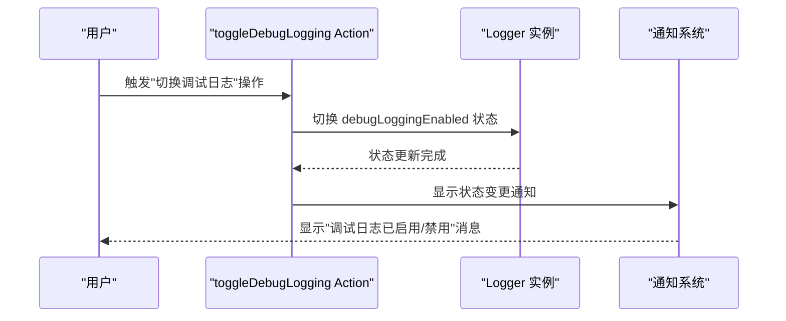
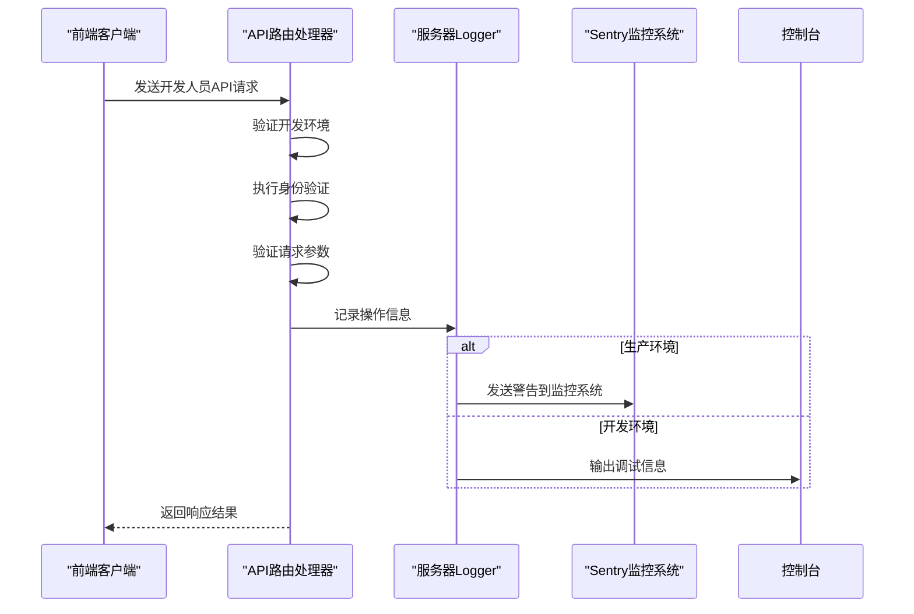
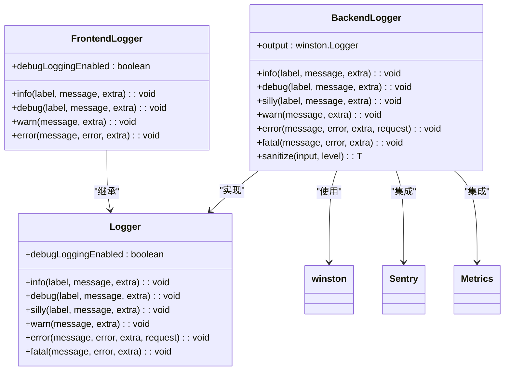
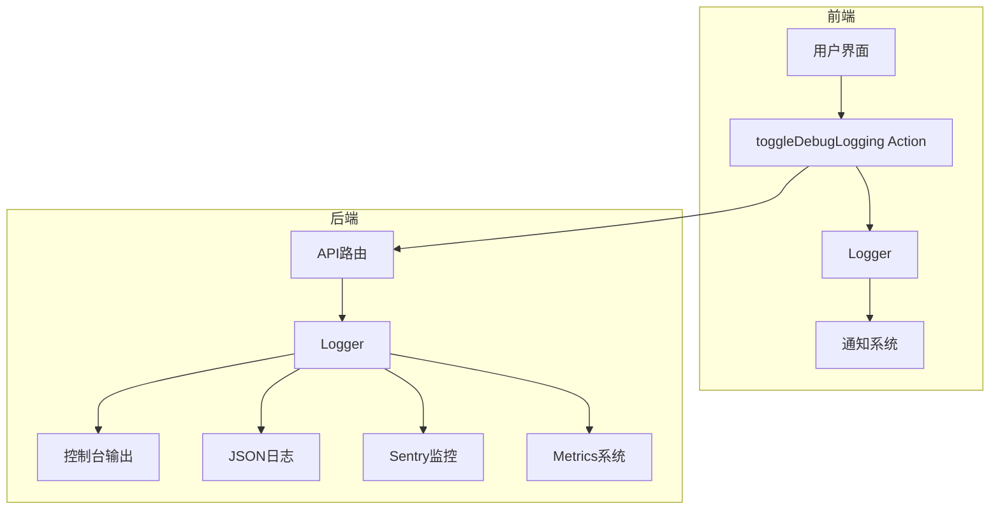

# 调试日志控制

<cite>
**Referenced Files in This Document**  
- [app/actions/definitions/developer.tsx](file://app/actions/definitions/developer.tsx)
- [server/routes/api/developer/developer.ts](file://server/routes/api/developer/developer.ts)
- [app/utils/Logger.ts](file://app/utils/Logger.ts)
- [server/logging/Logger.ts](file://server/logging/Logger.ts)
</cite>

## 目录
1. [简介](#简介)
2. [核心功能分析](#核心功能分析)
3. [前端日志控制机制](#前端日志控制机制)
4. [后端日志处理逻辑](#后端日志处理逻辑)
5. [日志级别与输出目标](#日志级别与输出目标)
6. [实际应用场景](#实际应用场景)
7. [架构概览](#架构概览)

## 简介
本文档详细说明了"切换调试日志"工具的工作原理，该功能允许开发人员动态启用或禁用前端和后端的日志输出。文档将深入分析在`app/actions/definitions/developer.tsx`中触发的action以及`server/routes/api/developer/developer.ts`中对应的API处理逻辑，全面阐述日志级别配置、输出目标以及在诊断复杂问题、追踪状态变化和性能分析中的实际应用方法。

## 核心功能分析

**Section sources**
- [app/actions/definitions/developer.tsx](file://app/actions/definitions/developer.tsx#L164-L176)
- [app/utils/Logger.ts](file://app/utils/Logger.ts#L91-L91)

## 前端日志控制机制

**Diagram sources**
- [app/actions/definitions/developer.tsx](file://app/actions/definitions/developer.tsx#L164-L176)
- [app/utils/Logger.ts](file://app/utils/Logger.ts#L91-L91)

**Section sources**
- [app/actions/definitions/developer.tsx](file://app/actions/definitions/developer.tsx#L164-L176)
- [app/utils/Logger.ts](file://app/utils/Logger.ts#L17-L92)

## 后端日志处理逻辑

**Diagram sources**
- [server/routes/api/developer/developer.ts](file://server/routes/api/developer/developer.ts#L1-L62)
- [server/logging/Logger.ts](file://server/logging/Logger.ts#L32-L257)

**Section sources**
- [server/routes/api/developer/developer.ts](file://server/routes/api/developer/developer.ts#L1-L62)
- [server/logging/Logger.ts](file://server/logging/Logger.ts#L32-L257)

## 日志级别与输出目标

**Diagram sources**
- [app/utils/Logger.ts](file://app/utils/Logger.ts#L17-L92)
- [server/logging/Logger.ts](file://server/logging/Logger.ts#L32-L257)

**Section sources**
- [app/utils/Logger.ts](file://app/utils/Logger.ts#L17-L92)
- [server/logging/Logger.ts](file://server/logging/Logger.ts#L32-L257)

## 实际应用场景

**Section sources**
- [app/actions/definitions/developer.tsx](file://app/actions/definitions/developer.tsx#L164-L176)
- [server/routes/api/developer/developer.ts](file://server/routes/api/developer/developer.ts#L1-L62)

## 架构概览

**Diagram sources**
- [app/actions/definitions/developer.tsx](file://app/actions/definitions/developer.tsx#L164-L176)
- [app/utils/Logger.ts](file://app/utils/Logger.ts#L17-L92)
- [server/routes/api/developer/developer.ts](file://server/routes/api/developer/developer.ts#L1-L62)
- [server/logging/Logger.ts](file://server/logging/Logger.ts#L32-L257)