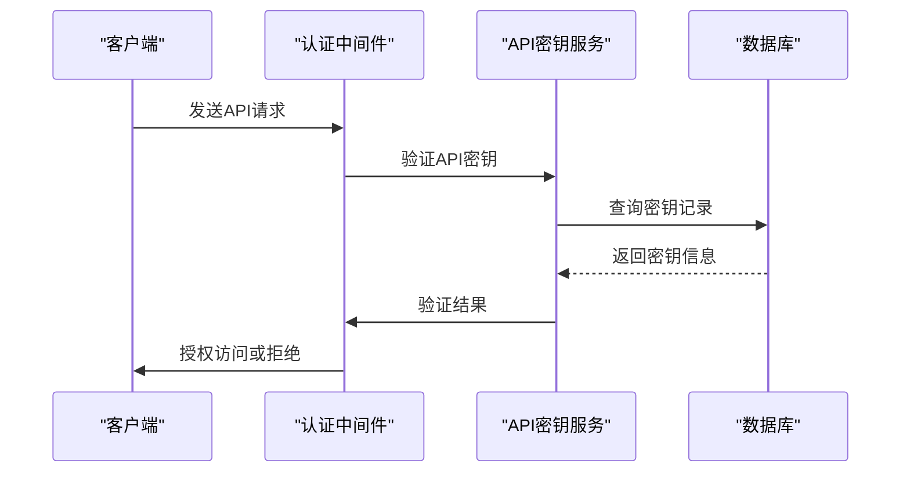
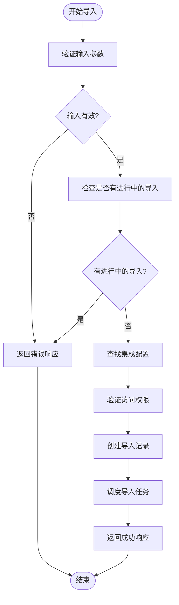
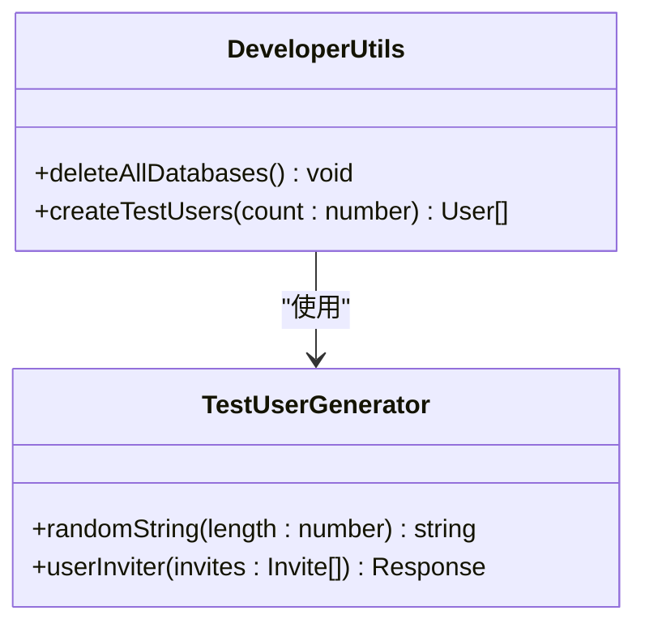
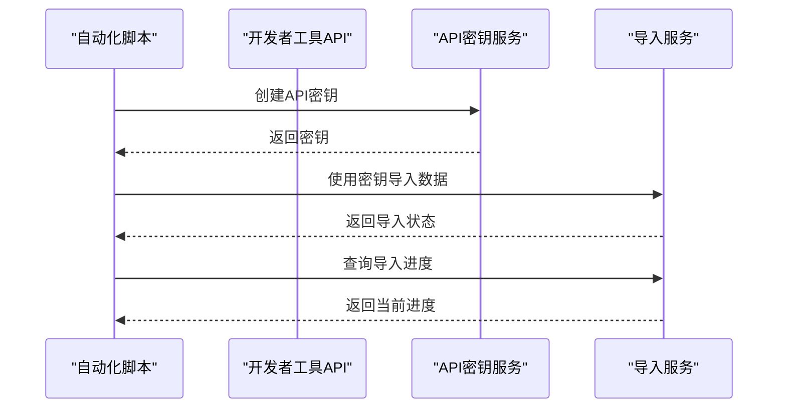

# 开发者工具API

<cite>
**本文档引用的文件**   
- [apiKeys.ts](file://server/routes/api/apiKeys/apiKeys.ts)
- [imports.ts](file://server/routes/api/imports/imports.ts)
- [developer.ts](file://server/routes/api/developer/developer.ts)
- [ApiKey.ts](file://server/models/ApiKey.ts)
- [imports.ts](file://app/models/Import.ts)
</cite>

## 目录
1. [简介](#简介)
2. [API密钥管理](#api密钥管理)
3. [数据导入导出](#数据导入导出)
4. [开发者实用工具](#开发者实用工具)
5. [安全性最佳实践](#安全性最佳实践)
6. [错误处理](#错误处理)
7. [自动化脚本示例](#自动化脚本示例)

## 简介
开发者工具API提供了一套完整的工具集，用于管理API密钥、执行数据导入导出操作以及提供开发者实用功能。本API允许开发者通过程序化方式控制工作区数据，支持批量操作和自动化集成。API密钥系统提供了细粒度的访问控制，数据导入导出功能支持多种外部服务集成，而开发者工具则提供了测试和调试的便利功能。

## API密钥管理

API密钥管理功能允许用户创建、列出和删除API密钥，实现对工作区数据的程序化访问。每个API密钥都与特定用户关联，并可配置访问范围和有效期。

**Diagram sources**
- [apiKeys.ts](file://server/routes/api/apiKeys/apiKeys.ts#L23-L45)
- [ApiKey.ts](file://server/models/ApiKey.ts#L140-L146)

### API密钥创建
创建API密钥的端点允许授权用户生成新的API密钥。创建时可以指定名称、有效期和访问范围。系统会自动生成密钥值并进行哈希存储，确保安全性。

**Section sources**
- [apiKeys.ts](file://server/routes/api/apiKeys/apiKeys.ts#L23-L45)
- [ApiKey.ts](file://server/models/ApiKey.ts#L94-L102)

### API密钥撤销
撤销API密钥的端点允许用户删除不再需要的密钥。删除操作会永久移除密钥记录，阻止其后续访问。系统实施了适当的权限检查，确保用户只能删除自己的密钥或具有相应权限的密钥。

**Section sources**
- [apiKeys.ts](file://server/routes/api/apiKeys/apiKeys.ts#L107-L126)
- [ApiKey.ts](file://server/models/ApiKey.ts#L113-L119)

## 数据导入导出

数据导入导出功能支持从外部服务批量导入数据到工作区，以及将工作区数据导出到外部系统。该功能通过集成系统实现，支持多种数据格式和服务。

**Diagram sources**
- [imports.ts](file://server/routes/api/imports/imports.ts#L77-L109)
- [Import.ts](file://server/models/Import.ts#L23-L87)

### 数据导入机制
数据导入通过`imports.create`端点启动。系统首先验证请求者的管理员权限，然后检查是否有其他导入正在进行，以避免资源冲突。成功验证后，系统创建导入记录并关联相应的集成配置。

**Section sources**
- [imports.ts](file://server/routes/api/imports/imports.ts#L30-L39)
- [Import.ts](file://server/models/Import.ts#L23-L87)

### 数据导出机制
数据导出功能允许将工作区内容批量导出到外部系统。导出操作遵循与导入类似的权限验证流程，确保只有授权用户才能执行导出。系统支持多种导出格式和目标服务。

**Section sources**
- [imports.ts](file://server/routes/api/imports/imports.ts#L54-L62)
- [Import.ts](file://server/models/Import.ts#L23-L87)

## 开发者实用工具

开发者实用工具提供了一系列辅助功能，主要用于开发、测试和调试环境。这些工具可以帮助开发者快速创建测试数据，清理开发环境，以及执行其他开发相关的操作。

**Diagram sources**
- [developer.ts](file://server/routes/api/developer/developer.ts#L23-L47)
- [developer.ts](file://app/utils/developer.ts#L5-L30)

### 开发辅助功能
开发者工具提供了创建测试用户和清理数据库的功能。创建测试用户的端点可以批量生成指定数量的测试账户，用于功能测试和性能评估。数据库清理功能则帮助开发者重置开发环境。

**Section sources**
- [developer.ts](file://server/routes/api/developer/developer.ts#L23-L47)
- [developer.ts](file://app/utils/developer.ts#L5-L30)

## 安全性最佳实践

API实施了多层次的安全措施，包括身份验证、权限控制和速率限制。所有API端点都需要有效的身份验证，通常通过API密钥或会话令牌实现。系统还实现了细粒度的权限检查，确保用户只能访问其被授权的资源。

**Section sources**
- [apiKeys.ts](file://server/routes/api/apiKeys/apiKeys.ts#L23-L45)
- [imports.ts](file://server/routes/api/imports/imports.ts#L30-L39)

## 错误处理

API采用一致的错误处理模式，返回结构化的错误响应。常见的错误状态包括400（无效请求）、401（未授权）、403（禁止访问）、404（未找到）和500（服务器错误）。每个错误响应都包含详细的错误信息，帮助开发者快速诊断问题。

**Section sources**
- [apiKeys.ts](file://server/routes/api/apiKeys/apiKeys.ts#L23-L45)
- [imports.ts](file://server/routes/api/imports/imports.ts#L30-L39)

## 自动化脚本示例

以下是一个使用开发者工具API的自动化脚本示例，演示如何创建API密钥并执行数据导入：

**Diagram sources**
- [apiKeys.ts](file://server/routes/api/apiKeys/apiKeys.ts#L23-L45)
- [imports.ts](file://server/routes/api/imports/imports.ts#L77-L109)