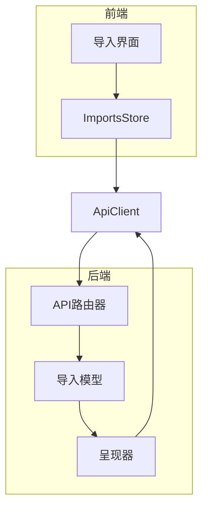
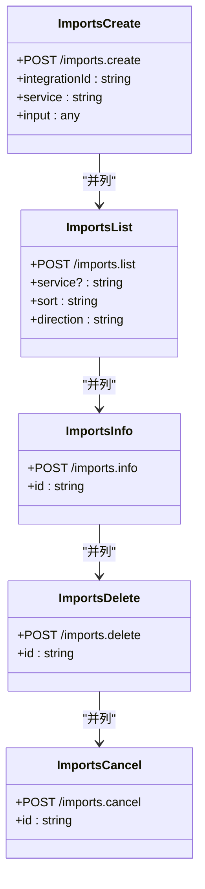
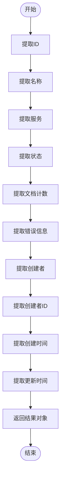
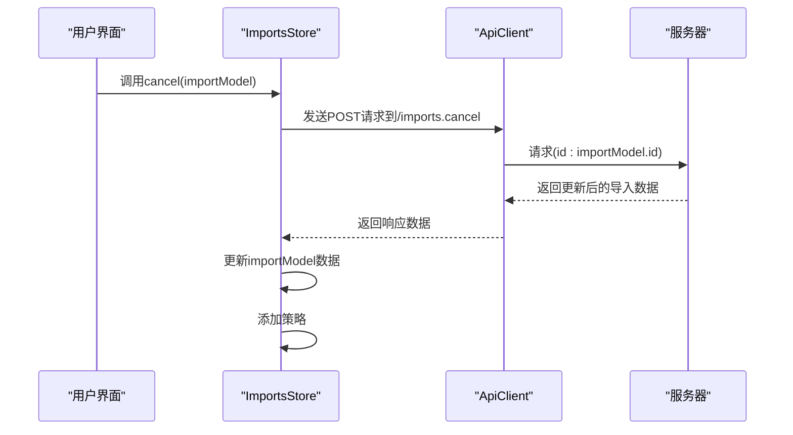
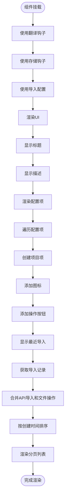
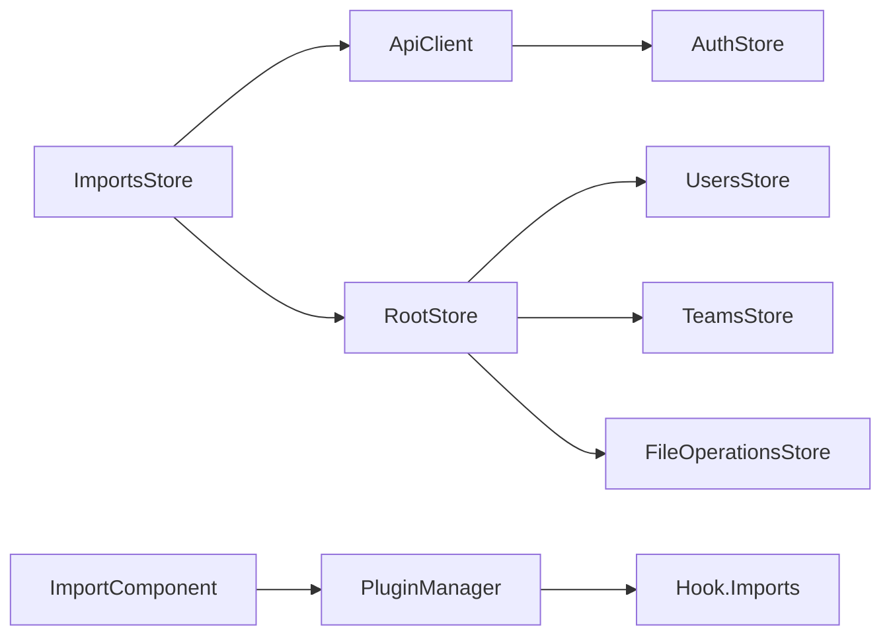

# 数据导入导出

<cite>
**本文档中引用的文件**  
- [imports.ts](file://server/routes/api/imports/imports.ts)
- [Import.tsx](file://app/scenes/Settings/Import.tsx)
- [ImportsStore.ts](file://app/stores/ImportsStore.ts)
- [import.ts](file://server/presenters/import.ts)
</cite>

## 目录
1. [简介](#简介)
2. [项目结构](#项目结构)
3. [核心组件](#核心组件)
4. [架构概述](#架构概述)
5. [详细组件分析](#详细组件分析)
6. [依赖分析](#依赖分析)
7. [性能考虑](#性能考虑)
8. [故障排除指南](#故障排除指南)
9. [结论](#结论)

## 简介
本文档详细说明了数据导入导出功能的实现，涵盖从多种格式（如Markdown和JSON）导入数据的完整流程。重点分析了导入API的端点设计、导入模型数据到API响应格式的转换、前端组件与后端通信机制以及用户界面集成。

## 项目结构
项目结构清晰地划分了前端和后端逻辑，其中导入功能涉及多个关键文件：
- `server/routes/api/imports/imports.ts`：定义了导入相关的API路由
- `app/scenes/Settings/Import.tsx`：实现了前端导入界面
- `app/stores/ImportsStore.ts`：管理导入状态并与后端通信
- `server/presenters/import.ts`：负责将导入模型数据转换为API响应格式

**Section sources**
- [imports.ts](file://server/routes/api/imports/imports.ts)
- [Import.tsx](file://app/scenes/Settings/Import.tsx)

## 核心组件
核心组件包括导入API端点、导入状态管理器和前端用户界面。这些组件协同工作以实现完整的导入功能。

**Section sources**
- [imports.ts](file://server/routes/api/imports/imports.ts)
- [ImportsStore.ts](file://app/stores/ImportsStore.ts)
- [Import.tsx](file://app/scenes/Settings/Import.tsx)

## 架构概述
系统采用前后端分离架构，前端通过ApiClient与后端进行通信。导入功能的核心是ImportsStore，它作为前端与后端之间的桥梁，管理导入状态并处理用户交互。

**Diagram sources**
- [Import.tsx](file://app/scenes/Settings/Import.tsx)
- [ImportsStore.ts](file://app/stores/ImportsStore.ts)
- [imports.ts](file://server/routes/api/imports/imports.ts)

## 详细组件分析

### 导入API端点分析
导入API提供了创建、查询、删除和取消导入任务的功能。所有端点都需要管理员权限，并通过事务处理确保数据一致性。

#### API端点设计

**Diagram sources**
- [imports.ts](file://server/routes/api/imports/imports.ts#L20-L185)

**Section sources**
- [imports.ts](file://server/routes/api/imports/imports.ts#L20-L185)

### presentImport函数分析
`presentImport`函数负责将导入模型数据转换为API响应格式，包含导入的基本信息、状态、文档计数和创建者信息。

**Diagram sources**
- [import.ts](file://server/presenters/import.ts#L3-L19)

**Section sources**
- [import.ts](file://server/presenters/import.ts#L3-L19)

### ImportsStore分析
ImportsStore通过ApiClient与后端通信，管理导入状态。它提供了取消导入的功能，并在成功响应后更新本地数据。

**Diagram sources**
- [ImportsStore.ts](file://app/stores/ImportsStore.ts#L7-L24)

**Section sources**
- [ImportsStore.ts](file://app/stores/ImportsStore.ts#L7-L24)

### Import.tsx组件分析
Import组件为用户提供Markdown和JSON格式的导入界面，并集成插件系统的扩展点。它使用配置项动态生成导入选项，并显示最近的导入记录。

**Diagram sources**
- [Import.tsx](file://app/scenes/Settings/Import.tsx#L110-L203)

**Section sources**
- [Import.tsx](file://app/scenes/Settings/Import.tsx#L110-L203)

## 依赖分析
导入功能依赖于多个系统组件，包括用户认证、团队管理、文件操作和插件系统。这些依赖关系确保了导入功能的安全性和可扩展性。

**Diagram sources**
- [ImportsStore.ts](file://app/stores/ImportsStore.ts)
- [Import.tsx](file://app/scenes/Settings/Import.tsx)

**Section sources**
- [ImportsStore.ts](file://app/stores/ImportsStore.ts)
- [Import.tsx](file://app/scenes/Settings/Import.tsx)

## 性能考虑
导入功能在设计时考虑了性能因素：
- 使用分页查询避免一次性加载大量数据
- 通过事务处理确保数据一致性
- 在后端使用队列任务处理耗时的导入操作
- 前端使用懒加载和缓存机制优化用户体验

## 故障排除指南
常见问题及解决方案：
- **导入任务已存在**：系统会检查是否有正在进行的导入任务，如果有则返回422错误
- **权限不足**：只有管理员可以执行导入相关操作
- **网络超时**：大文件导入可能需要较长时间，建议使用异步处理
- **格式错误**：确保导入文件符合预期格式要求

**Section sources**
- [imports.ts](file://server/routes/api/imports/imports.ts)
- [Import.tsx](file://app/scenes/Settings/Import.tsx)

## 结论
数据导入导出功能通过清晰的API设计、可靠的状态管理和友好的用户界面，实现了从多种格式导入数据的完整流程。该功能具有良好的可扩展性，可以通过插件系统轻松添加新的导入源。