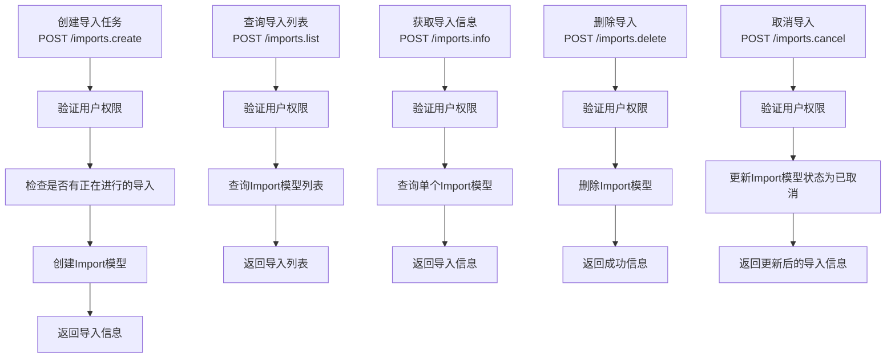
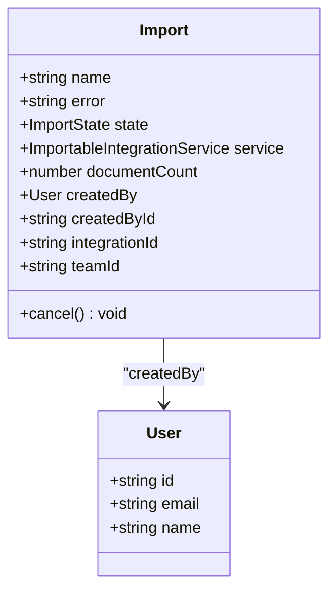
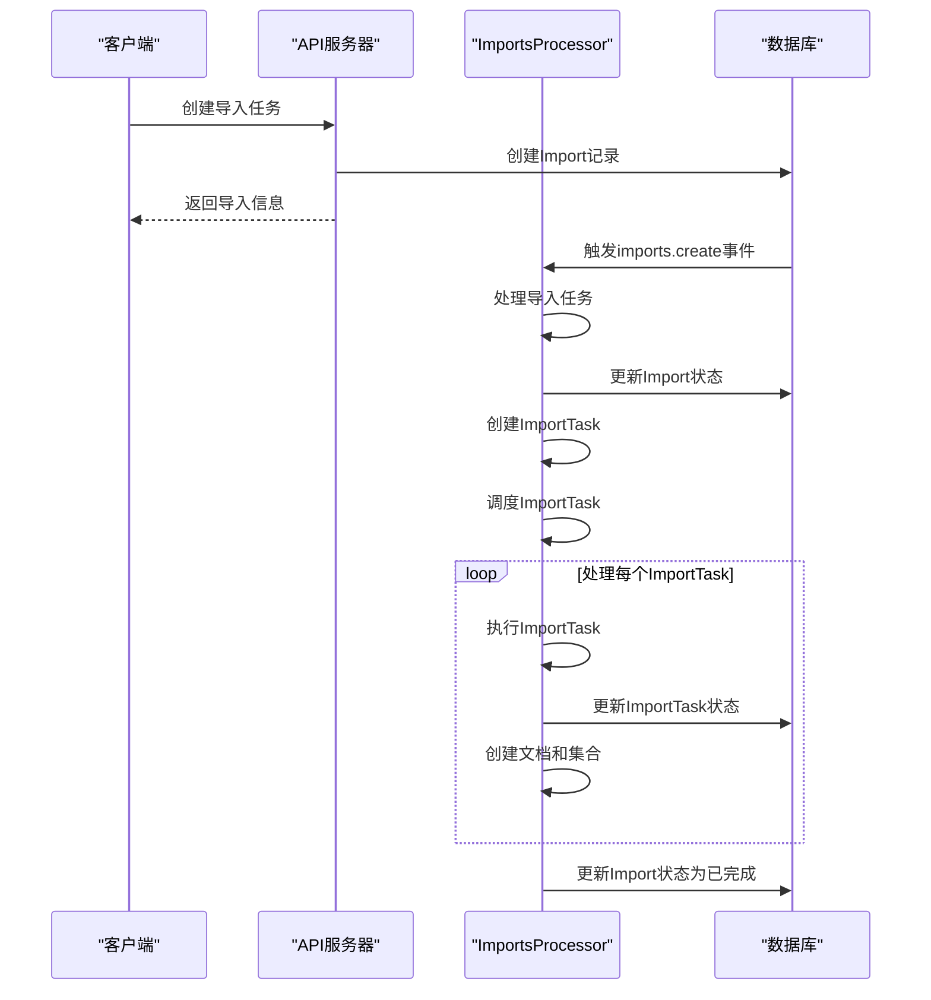
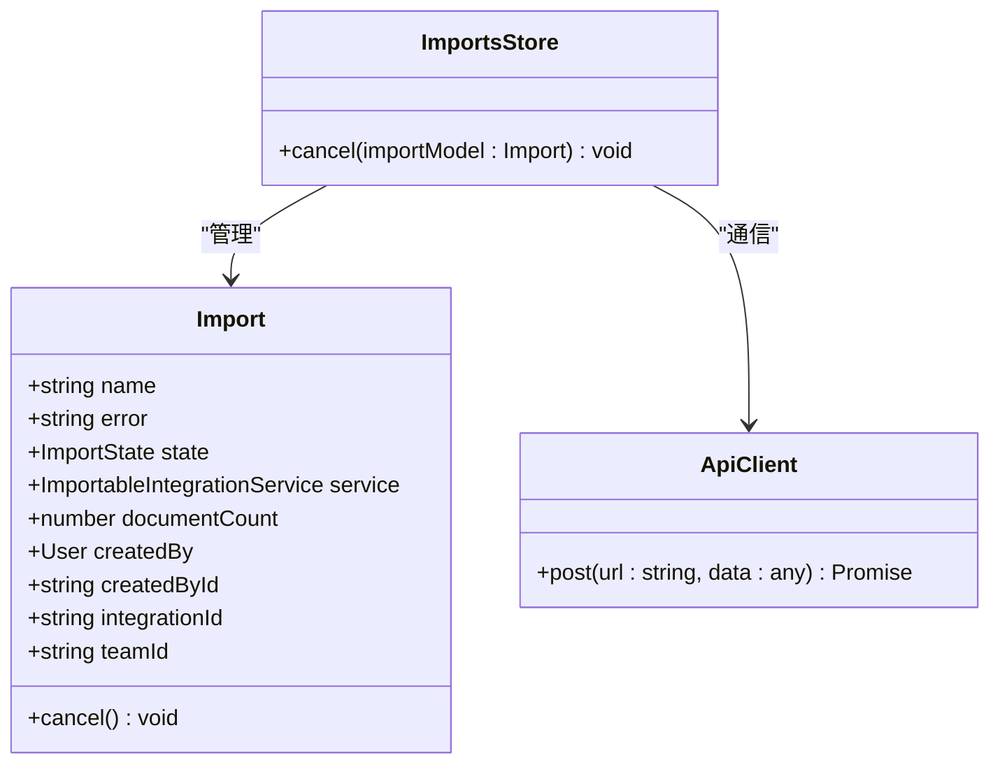
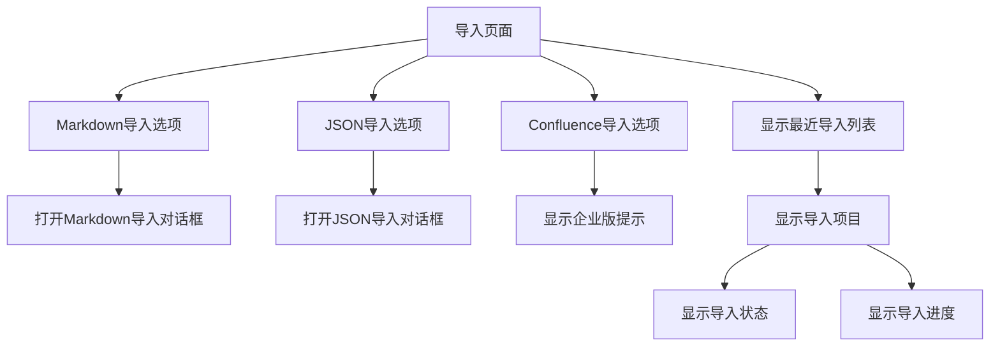

# 数据导入机制

<cite>
**本文档引用的文件**   
- [imports.ts](file://server/routes/api/imports/imports.ts)
- [Import.ts](file://app/models/Import.ts)
- [Import.ts](file://server/models/Import.ts)
- [ImportsStore.ts](file://app/stores/ImportsStore.ts)
- [Import.tsx](file://app/scenes/Settings/Import.tsx)
- [ImportsProcessor.ts](file://server/queues/processors/ImportsProcessor.ts)
- [NotionImportsProcessor.ts](file://plugins/notion/server/processors/NotionImportsProcessor.ts)
- [ImportTask.ts](file://server/models/ImportTask.ts)
</cite>

## 目录
1. [简介](#简介)
2. [API端点设计](#api端点设计)
3. [Import模型](#import模型)
4. [异步导入处理](#异步导入处理)
5. [状态管理](#状态管理)
6. [用户界面](#用户界面)
7. [使用示例](#使用示例)

## 简介
数据导入机制允许用户从Markdown和JSON格式导入数据。该系统通过API端点创建导入任务，查询导入列表，获取导入信息和删除导入操作。Import模型存储导入任务的元数据，包括状态、格式、选项和错误信息。ImportsProcessor处理异步导入任务，包括文件解析、文档创建和错误处理。ImportsStore通过ApiClient与后端通信并管理导入状态。Import.tsx组件为用户提供导入界面，支持拖拽上传和文件选择，并展示导入进度和结果。

**Section sources**
- [imports.ts](file://server/routes/api/imports/imports.ts#L1-L185)
- [Import.ts](file://app/models/Import.ts#L1-L57)
- [Import.ts](file://server/models/Import.ts#L1-L90)
- [ImportsStore.ts](file://app/stores/ImportsStore.ts#L1-L25)
- [Import.tsx](file://app/scenes/Settings/Import.tsx#L1-L206)

## API端点设计
导入API的端点设计基于`imports.ts`路由文件，提供了创建导入任务、查询导入列表、获取导入信息和删除导入操作的功能。



**Diagram sources**
- [imports.ts](file://server/routes/api/imports/imports.ts#L1-L185)

**Section sources**
- [imports.ts](file://server/routes/api/imports/imports.ts#L1-L185)

## Import模型
Import模型用于存储导入任务的元数据，包括状态、格式、选项和错误信息。



**Diagram sources**
- [Import.ts](file://app/models/Import.ts#L1-L57)
- [Import.ts](file://server/models/Import.ts#L1-L90)

**Section sources**
- [Import.ts](file://app/models/Import.ts#L1-L57)
- [Import.ts](file://server/models/Import.ts#L1-L90)

## 异步导入处理
ImportsProcessor负责处理异步导入任务，包括文件解析、文档创建和错误处理。



**Diagram sources**
- [ImportsProcessor.ts](file://server/queues/processors/ImportsProcessor.ts#L1-L630)
- [NotionImportsProcessor.ts](file://plugins/notion/server/processors/NotionImportsProcessor.ts#L1-L70)

**Section sources**
- [ImportsProcessor.ts](file://server/queues/processors/ImportsProcessor.ts#L1-L630)
- [NotionImportsProcessor.ts](file://plugins/notion/server/processors/NotionImportsProcessor.ts#L1-L70)

## 状态管理
ImportsStore通过ApiClient与后端通信并管理导入状态。



**Diagram sources**
- [ImportsStore.ts](file://app/stores/ImportsStore.ts#L1-L25)

**Section sources**
- [ImportsStore.ts](file://app/stores/ImportsStore.ts#L1-L25)

## 用户界面
Import.tsx组件为用户提供导入界面，支持拖拽上传和文件选择，并展示导入进度和结果。



**Diagram sources**
- [Import.tsx](file://app/scenes/Settings/Import.tsx#L1-L206)

**Section sources**
- [Import.tsx](file://app/scenes/Settings/Import.tsx#L1-L206)

## 使用示例
以下是如何通过API发起Markdown导入任务、查询导入状态和处理错误情况的示例。

### 发起Markdown导入任务
```javascript
// 发起Markdown导入任务
const response = await fetch('/api/imports.create', {
  method: 'POST',
  headers: {
    'Content-Type': 'application/json',
  },
  body: JSON.stringify({
    integrationId: 'integration-123',
    service: 'markdown',
    input: [
      {
        externalId: 'page-1',
        permission: 'read_write',
      },
    ],
  }),
});

const result = await response.json();
console.log(result);
```

### 查询导入状态
```javascript
// 查询导入状态
const response = await fetch('/api/imports.info', {
  method: 'POST',
  headers: {
    'Content-Type': 'application/json',
  },
  body: JSON.stringify({
    id: 'import-123',
  }),
});

const result = await response.json();
console.log(result);
```

### 处理错误情况
```javascript
// 处理错误情况
try {
  const response = await fetch('/api/imports.create', {
    method: 'POST',
    headers: {
      'Content-Type': 'application/json',
    },
    body: JSON.stringify({
      integrationId: 'integration-123',
      service: 'markdown',
      input: [
        {
          externalId: 'page-1',
          permission: 'read_write',
        },
      ],
    }),
  });

  if (!response.ok) {
    throw new Error('导入失败');
  }

  const result = await response.json();
  console.log(result);
} catch (error) {
  console.error('导入过程中发生错误:', error.message);
}
```

**Section sources**
- [imports.ts](file://server/routes/api/imports/imports.ts#L1-L185)
- [Import.ts](file://app/models/Import.ts#L1-L57)
- [Import.ts](file://server/models/Import.ts#L1-L90)
- [ImportsStore.ts](file://app/stores/ImportsStore.ts#L1-L25)
- [Import.tsx](file://app/scenes/Settings/Import.tsx#L1-L206)
- [ImportsProcessor.ts](file://server/queues/processors/ImportsProcessor.ts#L1-L630)
- [NotionImportsProcessor.ts](file://plugins/notion/server/processors/NotionImportsProcessor.ts#L1-L70)