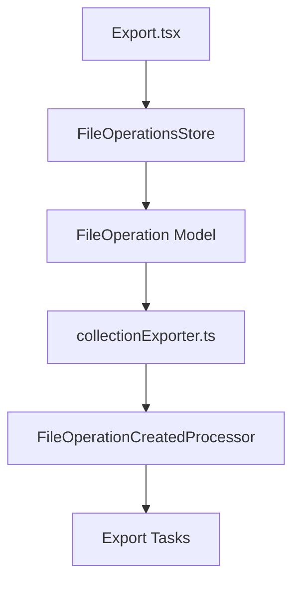
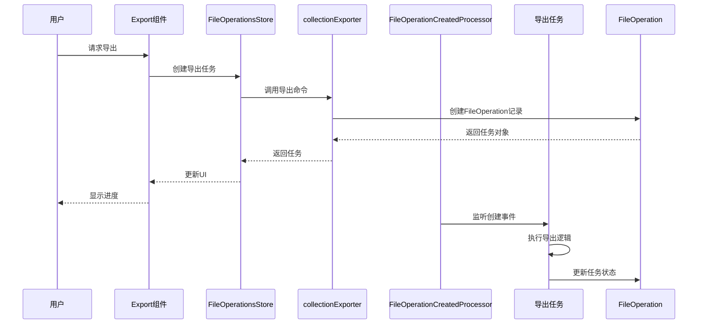
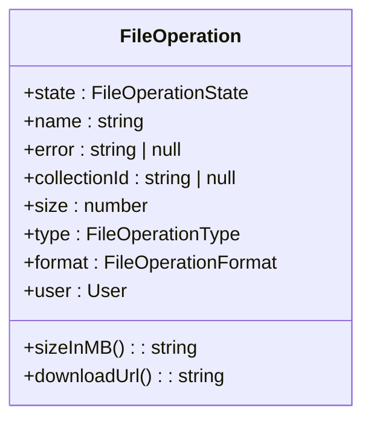
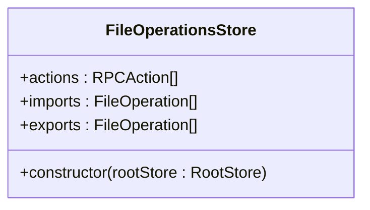
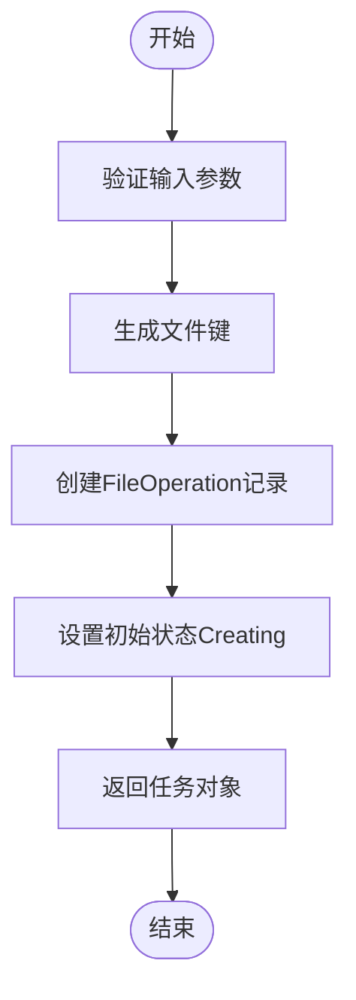
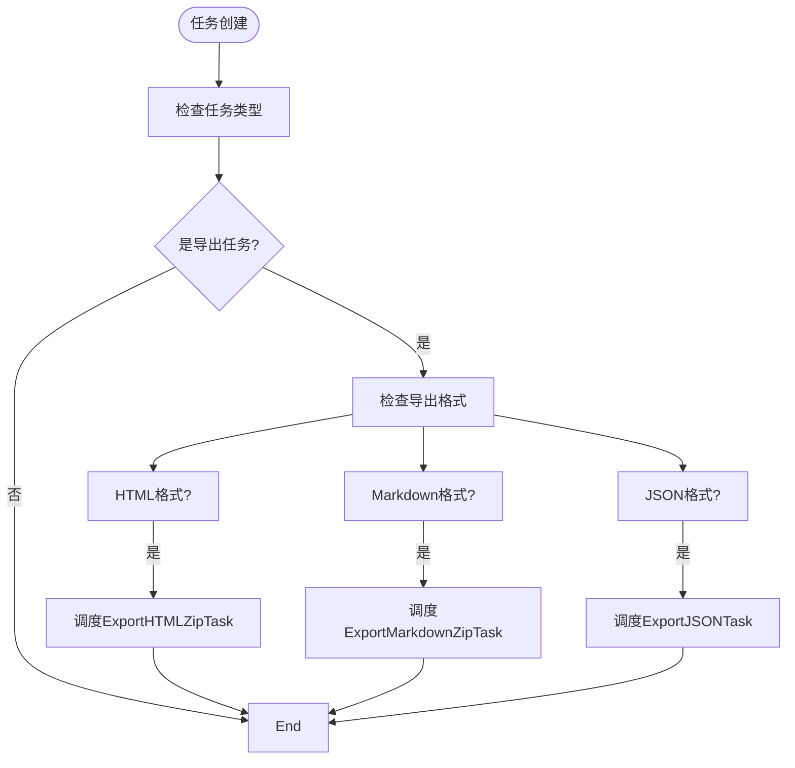
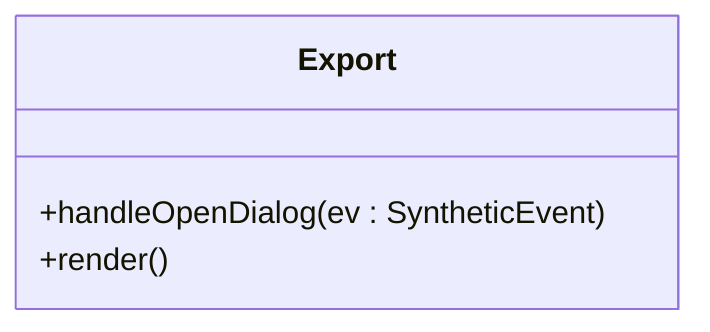
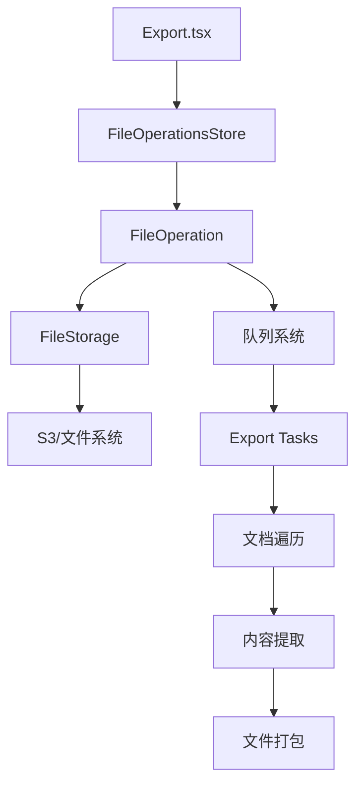

# 数据导出机制

<cite>
**本文档中引用的文件**  
- [collectionExporter.ts](file://server/commands/collectionExporter.ts)
- [FileOperation.ts](file://app/models/FileOperation.ts)
- [FileOperation.ts](file://server/models/FileOperation.ts)
- [FileOperationsStore.ts](file://app/stores/FileOperationsStore.ts)
- [FileOperationCreatedProcessor.ts](file://server/queues/processors/FileOperationCreatedProcessor.ts)
- [Export.tsx](file://app/scenes/Settings/Export.tsx)
- [FileOperationListItem.tsx](file://app/scenes/Settings/components/FileOperationListItem.tsx)
- [FileOperationMenu.tsx](file://app/menus/FileOperationMenu.tsx)
</cite>

## 目录
1. [简介](#简介)
2. [项目结构](#项目结构)
3. [核心组件](#核心组件)
4. [架构概述](#架构概述)
5. [详细组件分析](#详细组件分析)
6. [依赖分析](#依赖分析)
7. [性能考虑](#性能考虑)
8. [故障排除指南](#故障排除指南)
9. [结论](#结论)

## 简介
本文档详细描述了系统中数据导出机制的实现，重点涵盖文档集合导出为HTML、Markdown、JSON等格式的完整流程。文档基于`collectionExporter.ts`命令说明导出任务的创建与执行过程，包括文档遍历、内容提取和文件打包。同时解释了`FileOperation`模型如何表示导出任务的状态和结果，以及`FileOperationsStore`如何管理导出任务的生命周期。此外，分析了`FileOperationCreatedProcessor`如何触发后台导出任务并处理成功或失败情况，并描述了`Export.tsx`组件如何为用户提供导出界面，支持选择导出格式和范围，并展示导出进度和下载链接。最后提供使用示例，包括如何通过API发起集合导出任务、查询导出状态和下载结果文件。

## 项目结构
数据导出功能分布在多个模块中，主要包括：
- `server/commands/collectionExporter.ts`：负责创建导出任务
- `app/models/FileOperation.ts` 和 `server/models/FileOperation.ts`：定义导出任务的数据模型
- `app/stores/FileOperationsStore.ts`：管理导出任务的客户端状态
- `server/queues/processors/FileOperationCreatedProcessor.ts`：处理导出任务创建事件
- `app/scenes/Settings/Export.tsx`：提供导出用户界面

**Diagram sources**
- [Export.tsx](file://app/scenes/Settings/Export.tsx)
- [FileOperationsStore.ts](file://app/stores/FileOperationsStore.ts)
- [FileOperation.ts](file://app/models/FileOperation.ts)
- [collectionExporter.ts](file://server/commands/collectionExporter.ts)
- [FileOperationCreatedProcessor.ts](file://server/queues/processors/FileOperationCreatedProcessor.ts)

**Section sources**
- [Export.tsx](file://app/scenes/Settings/Export.tsx)
- [FileOperationsStore.ts](file://app/stores/FileOperationsStore.ts)
- [FileOperation.ts](file://app/models/FileOperation.ts)
- [collectionExporter.ts](file://server/commands/collectionExporter.ts)

## 核心组件
核心组件包括`FileOperation`模型、`FileOperationsStore`、`collectionExporter`命令和`FileOperationCreatedProcessor`处理器。这些组件协同工作，实现从用户请求到后台处理再到结果交付的完整导出流程。

**Section sources**
- [FileOperation.ts](file://app/models/FileOperation.ts)
- [FileOperationsStore.ts](file://app/stores/FileOperationsStore.ts)
- [collectionExporter.ts](file://server/commands/collectionExporter.ts)
- [FileOperationCreatedProcessor.ts](file://server/queues/processors/FileOperationCreatedProcessor.ts)

## 架构概述
系统采用事件驱动架构，当用户请求导出时，首先创建`FileOperation`记录，然后通过事件系统触发相应的导出任务。这种设计实现了请求处理与实际导出工作的解耦，提高了系统的可扩展性和可靠性。

**Diagram sources**
- [Export.tsx](file://app/scenes/Settings/Export.tsx)
- [FileOperationsStore.ts](file://app/stores/FileOperationsStore.ts)
- [collectionExporter.ts](file://server/commands/collectionExporter.ts)
- [FileOperationCreatedProcessor.ts](file://server/queues/processors/FileOperationCreatedProcessor.ts)

## 详细组件分析

### FileOperation模型分析
`FileOperation`模型是导出机制的核心数据结构，用于表示导出任务的状态和元数据。

**Diagram sources**
- [FileOperation.ts](file://app/models/FileOperation.ts)
- [FileOperation.ts](file://server/models/FileOperation.ts)

**Section sources**
- [FileOperation.ts](file://app/models/FileOperation.ts)
- [FileOperation.ts](file://server/models/FileOperation.ts)

### FileOperationsStore分析
`FileOperationsStore`负责管理客户端的导出任务状态，提供导入和导出任务的分类访问。

**Diagram sources**
- [FileOperationsStore.ts](file://app/stores/FileOperationsStore.ts)

**Section sources**
- [FileOperationsStore.ts](file://app/stores/FileOperationsStore.ts)

### collectionExporter命令分析
`collectionExporter`命令负责创建导出任务，初始化`FileOperation`记录。

**Diagram sources**
- [collectionExporter.ts](file://server/commands/collectionExporter.ts)

**Section sources**
- [collectionExporter.ts](file://server/commands/collectionExporter.ts)

### FileOperationCreatedProcessor分析
`FileOperationCreatedProcessor`处理器监听导出任务创建事件，并调度相应的后台任务。

**Diagram sources**
- [FileOperationCreatedProcessor.ts](file://server/queues/processors/FileOperationCreatedProcessor.ts)

**Section sources**
- [FileOperationCreatedProcessor.ts](file://server/queues/processors/FileOperationCreatedProcessor.ts)

### Export.tsx组件分析
`Export.tsx`组件为用户提供导出界面，支持启动导出任务和查看历史记录。

**Diagram sources**
- [Export.tsx](file://app/scenes/Settings/Export.tsx)

**Section sources**
- [Export.tsx](file://app/scenes/Settings/Export.tsx)

## 依赖分析
导出机制依赖于多个系统组件，包括文件存储、队列系统和用户界面组件。

**Diagram sources**
- [Export.tsx](file://app/scenes/Settings/Export.tsx)
- [FileOperationsStore.ts](file://app/stores/FileOperationsStore.ts)
- [FileOperation.ts](file://server/models/FileOperation.ts)
- [FileOperationCreatedProcessor.ts](file://server/queues/processors/FileOperationCreatedProcessor.ts)

**Section sources**
- [Export.tsx](file://app/scenes/Settings/Export.tsx)
- [FileOperationsStore.ts](file://app/stores/FileOperationsStore.ts)
- [FileOperation.ts](file://server/models/FileOperation.ts)
- [FileOperationCreatedProcessor.ts](file://server/queues/processors/FileOperationCreatedProcessor.ts)

## 性能考虑
导出操作可能涉及大量数据处理，系统通过以下方式优化性能：
- 异步处理：导出任务在后台执行，不阻塞用户界面
- 分批处理：大集合导出可能需要分批处理文档
- 文件流式传输：使用流式API处理大文件，减少内存占用
- 缓存机制：可能缓存频繁访问的导出结果

## 故障排除指南
常见问题及解决方案：

**导出任务卡在"Creating"状态**
- 检查后台任务队列是否正常运行
- 查看服务器日志中的错误信息
- 确认文件存储服务可访问

**导出文件无法下载**
- 检查文件存储中的文件是否存在
- 验证下载URL生成逻辑
- 确认文件权限设置正确

**导出内容不完整**
- 检查文档遍历逻辑是否遗漏某些文档
- 验证内容提取过程是否正确处理所有内容类型
- 确认附件包含设置是否正确

**Section sources**
- [FileOperationListItem.tsx](file://app/scenes/Settings/components/FileOperationListItem.tsx)
- [FileOperationMenu.tsx](file://app/menus/FileOperationMenu.tsx)

## 结论
本文档详细描述了系统的数据导出机制，涵盖了从用户界面到后台处理的完整流程。通过`FileOperation`模型统一表示导出任务，结合事件驱动架构实现任务的异步处理，系统提供了可靠且可扩展的导出功能。未来可考虑增加导出进度实时更新、多格式预览和导出模板等功能来进一步提升用户体验。