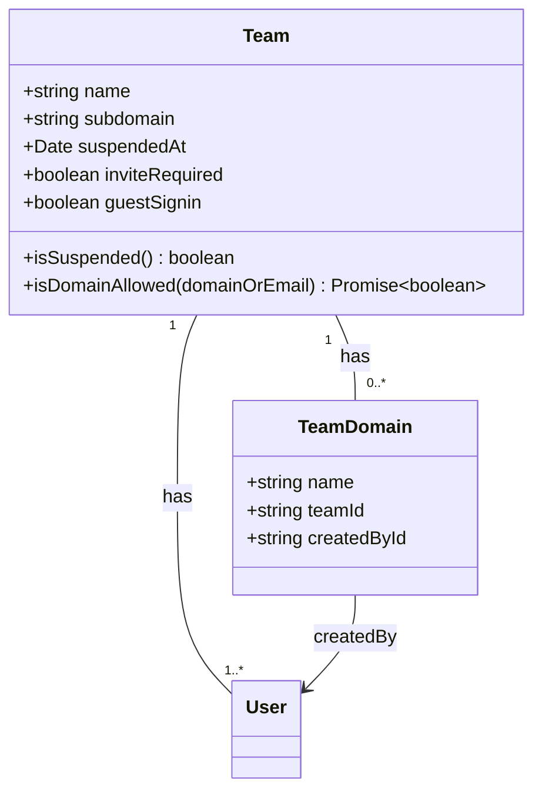
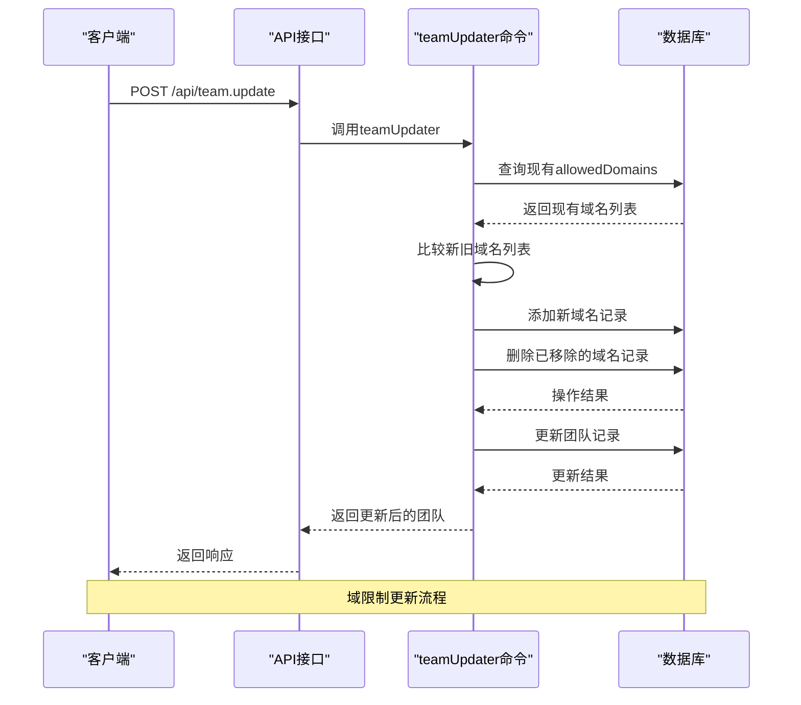

# 团队安全

<cite>
**本文档中引用的文件**  
- [Team.ts](file://app/models/Team.ts)
- [Team.ts](file://server/models/Team.ts)
- [teamUpdater.ts](file://server/commands/teamUpdater.ts)
- [teams.ts](file://server/routes/api/teams/teams.ts)
- [TeamDomain.ts](file://server/models/TeamDomain.ts)
</cite>

## 目录
1. [介绍](#介绍)
2. [团队挂起机制](#团队挂起机制)
3. [登录安全策略](#登录安全策略)
4. [域限制功能](#域限制功能)
5. [团队安全设置的API管理](#团队安全设置的api管理)

## 介绍
本文档详细阐述了团队安全管理的核心机制，包括团队挂起、登录安全策略和域限制功能。重点解析了团队模型中的挂起状态字段、计算属性及其业务影响，说明了域限制的实现方式和验证流程，并解释了邀请策略和访客登录控制。同时，结合策略文件说明权限控制逻辑，并提供通过API管理团队安全设置的具体示例。

## 团队挂起机制

团队挂起机制通过`suspendedAt`字段和`isSuspended`计算属性实现。当团队被挂起时，`suspendedAt`字段会被设置为当前时间戳，表示团队挂起的具体时间。该字段为日期类型，允许为空，当其值不为空时即表示团队处于挂起状态。

`isSuspended`是一个计算属性，通过检查`suspendedAt`字段是否存在来判断团队是否被挂起。如果`suspendedAt`字段有值，则返回`true`，表示团队已被挂起且不再可访问；否则返回`false`。这种设计使得团队挂起状态的判断变得简单高效。

团队挂起后，将影响团队成员的访问权限和业务功能。被挂起的团队将无法进行任何操作，包括文档创建、编辑和分享等核心功能。这种机制为管理员提供了一种有效的安全管理手段，可以在发现异常活动或违反政策时立即限制团队的访问。

**Section sources**
- [Team.ts](file://server/models/Team.ts#L184-L186)

## 登录安全策略

登录安全策略主要通过`inviteRequired`和`guestSignin`字段来控制。`inviteRequired`字段决定了团队成员的邀请策略，当该字段设置为`true`时，新用户必须通过邀请才能加入团队，这增强了团队的安全性，防止未经授权的用户加入。

`guestSignin`字段控制访客登录功能。当该字段启用时，允许访客通过电子邮件地址登录团队，这为外部协作提供了便利。在前端界面中，根据`guestSignin`的值动态显示不同的邀请说明文本，指导管理员和成员如何邀请新成员。

登录配置接口会根据`guestSignin`的设置返回不同的认证提供商列表。当`guestSignin`启用时，系统会返回包含电子邮件提供商在内的完整认证列表；当禁用时，则只返回配置的SSO提供商。这种灵活的配置方式使得团队可以根据安全需求调整登录策略。

**Section sources**
- [Team.ts](file://app/models/Team.ts#L50-L52)
- [Team.ts](file://server/models/Team.ts#L153-L155)
- [teams.ts](file://server/routes/api/teams/teams.ts#L31-L97)

## 域限制功能

域限制功能通过`allowedDomains`关联关系实现，该关系连接了团队和团队域（TeamDomain）模型。每个团队可以配置多个允许的域名，只有使用这些域名的电子邮件地址才能注册和登录团队。

域限制的实现涉及多个组件：`TeamDomain`模型存储具体的域名信息，包括域名名称、所属团队ID和创建者ID。系统在创建新域名时会进行验证，确保域名格式正确且不在受限列表中。对于云托管实例，还限制了每个团队可配置的域名数量。

在用户登录时，系统通过`isDomainAllowed`方法验证用户邮箱域名是否在允许列表中。该方法首先解析用户提供的邮箱或域名，然后检查其是否存在于团队的`allowedDomains`关联中。如果没有配置任何允许的域名，则默认允许所有域名访问。

**Diagram sources**
- [Team.ts](file://server/models/Team.ts#L356-L357)
- [TeamDomain.ts](file://server/models/TeamDomain.ts#L54-L78)

**Section sources**
- [Team.ts](file://server/models/Team.ts#L356-L357)
- [TeamDomain.ts](file://server/models/TeamDomain.ts#L54-L78)

## 团队安全设置的API管理

通过API可以管理团队的安全设置，包括启用域限制和挂起团队等操作。`teamUpdater`命令处理团队更新请求，接收包含安全设置的参数对象，并相应地更新团队配置。

要启用域限制，可以通过API向`/api/team.update`端点发送请求，包含`allowedDomains`数组参数。系统会比较新旧域名列表，添加新增的域名，删除已移除的域名，并保持现有的域名不变。在添加新域名时，会自动创建相应的`TeamDomain`记录，并验证域名的合法性。

挂起团队的操作通过设置`suspendedAt`字段实现。当需要挂起团队时，将`suspendedAt`字段设置为当前时间戳；当需要恢复团队时，将其设置为`null`。这些操作都通过`teamUpdater`命令统一处理，确保数据的一致性和完整性。

API还提供了团队删除请求功能，管理员可以请求删除团队，系统会发送确认邮件并要求输入删除确认码，这是一种安全的团队管理机制。

**Diagram sources**
- [teamUpdater.ts](file://server/commands/teamUpdater.ts#L12-L65)
- [teams.ts](file://server/routes/api/teams/teams.ts#L31-L97)

**Section sources**
- [teamUpdater.ts](file://server/commands/teamUpdater.ts#L12-L65)
- [teams.ts](file://server/routes/api/teams/teams.ts#L31-L97)