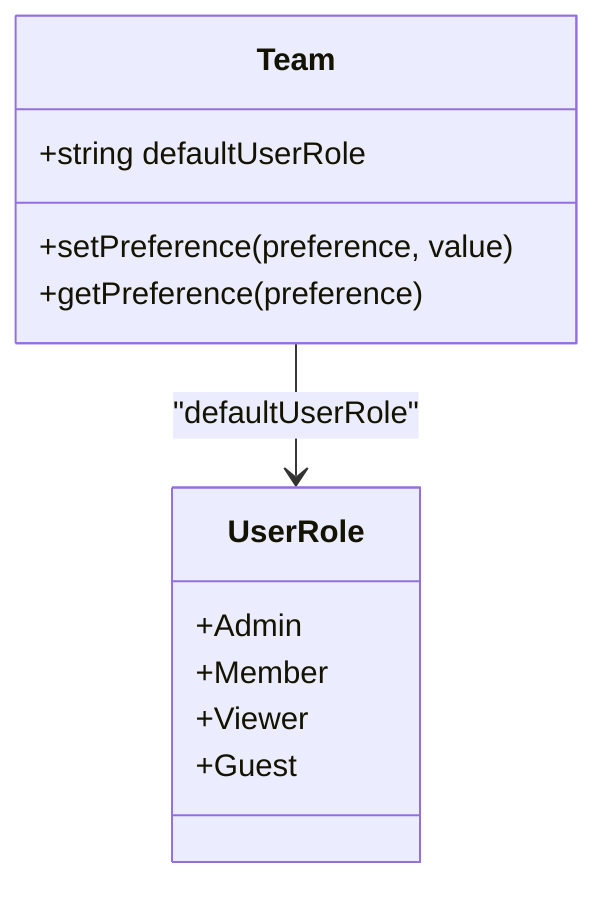
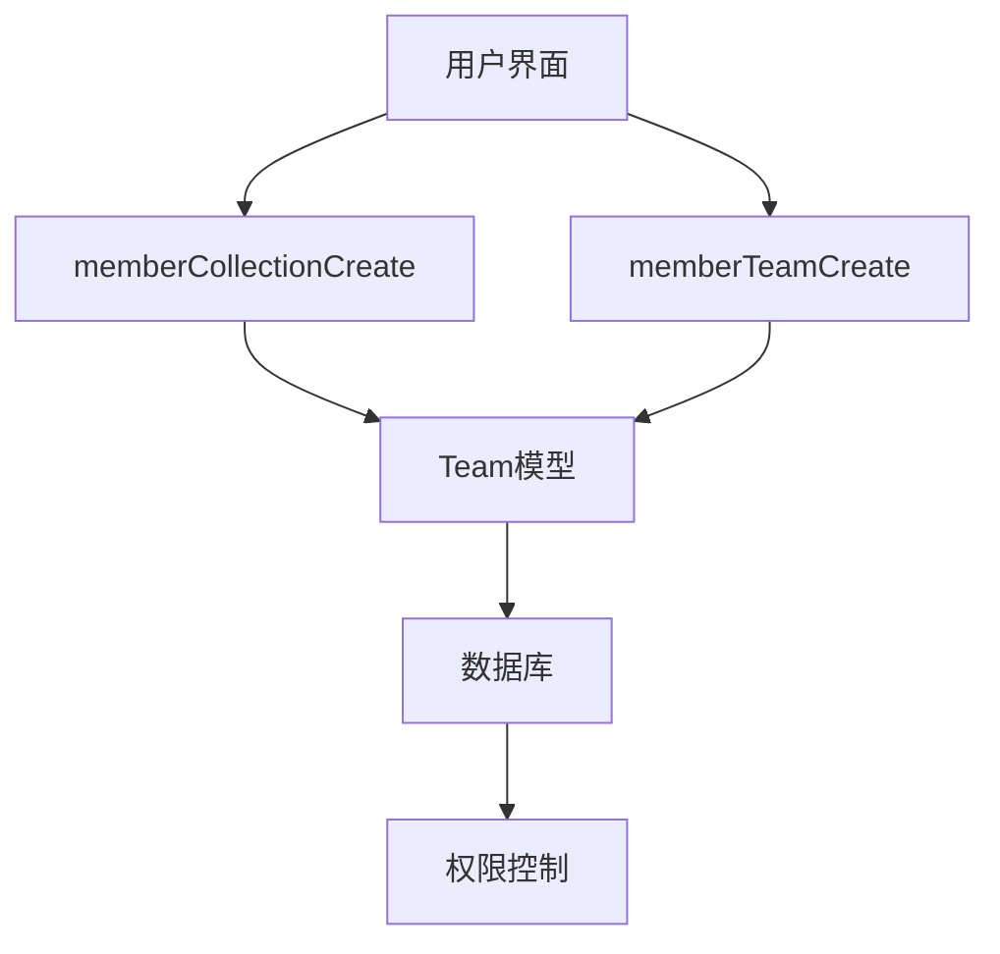
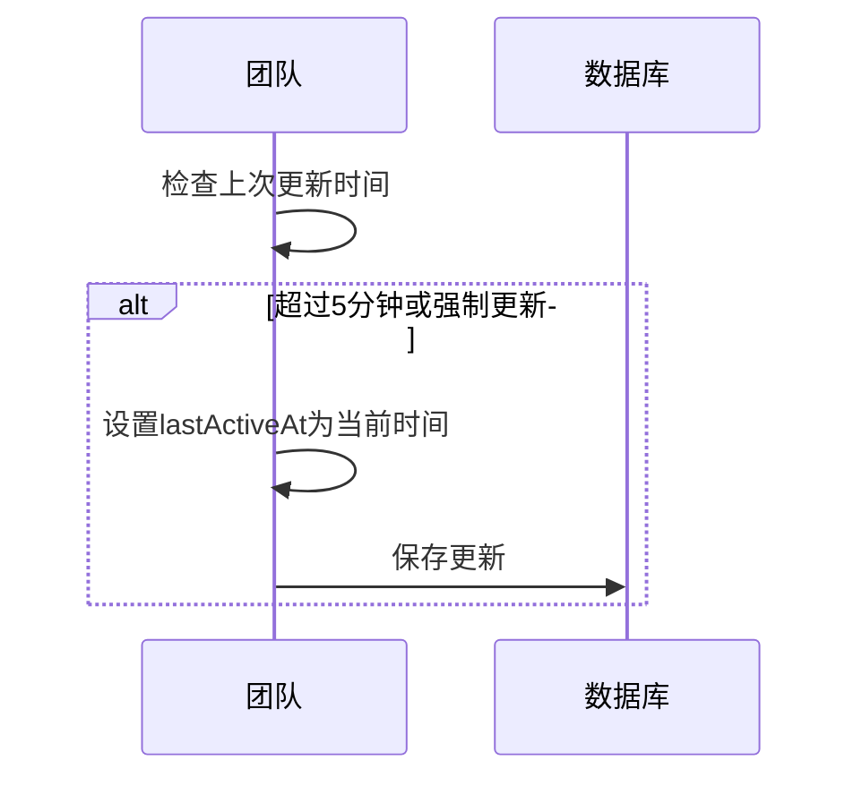
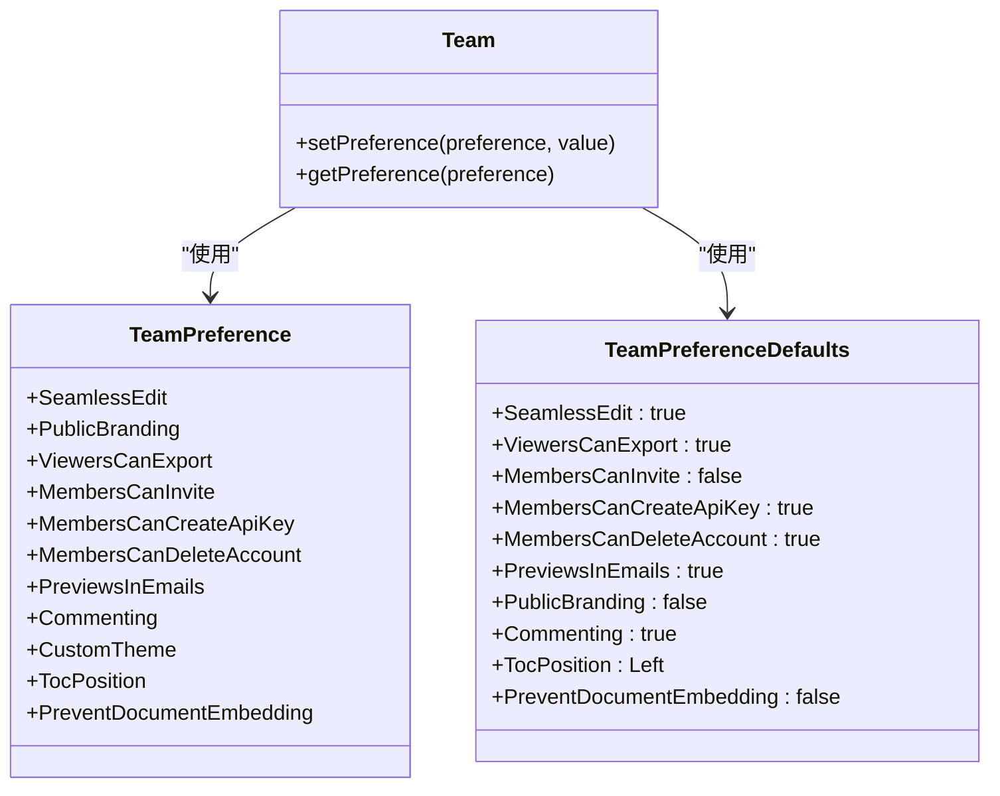
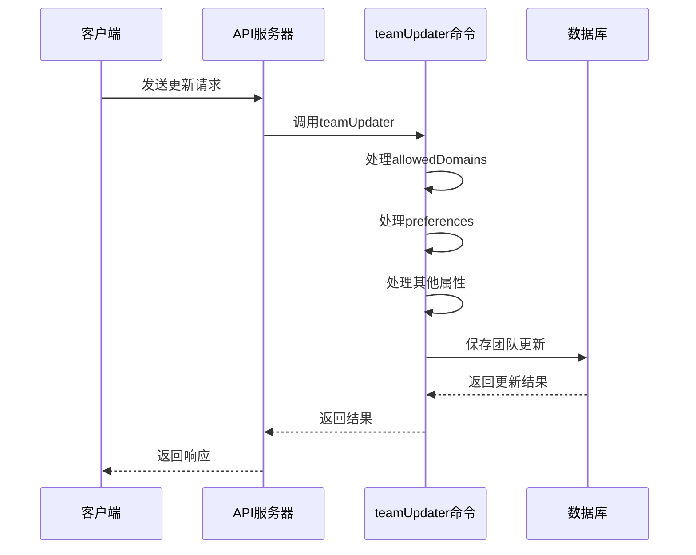

# 团队成员策略

<cite>
**本文档引用的文件**
- [Team.ts](file://app/models/Team.ts)
- [Team.ts](file://server/models/Team.ts)
- [teamUpdater.ts](file://server/commands/teamUpdater.ts)
- [shared/types.ts](file://shared/types.ts)
- [shared/constants.ts](file://shared/constants.ts)
</cite>

## 目录
1. [简介](#简介)
2. [默认用户角色分配](#默认用户角色分配)
3. [成员创建权限控制](#成员创建权限控制)
4. [团队活跃度监控](#团队活跃度监控)
5. [团队策略存储与读取](#团队策略存储与读取)
6. [API查询与更新示例](#api查询与更新示例)

## 简介
本文档详细说明了团队成员策略的实现机制，包括默认用户角色分配、成员权限控制、团队活动跟踪以及策略的存储和读取方式。重点分析了`defaultUserRole`字段的实现，`memberCollectionCreate`和`memberTeamCreate`字段的权限控制，`lastActiveAt`字段的更新策略，以及`preferences`中`MembersCanInvite`等策略的存储和读取方式。同时提供了通过API查询和更新团队成员策略的完整示例。

**Section sources**
- [Team.ts](file://app/models/Team.ts#L7-L121)
- [Team.ts](file://server/models/Team.ts#L54-L473)

## 默认用户角色分配
`defaultUserRole`字段用于定义新成员加入团队时的默认角色。该字段在数据库迁移中被添加到`teams`表中，其默认值设置为`"member"`。在服务器端的`Team`模型中，该字段被定义为字符串类型，并通过`@Default(UserRole.Member)`装饰器设置默认值为`UserRole.Member`。同时，通过`@IsIn([[UserRole.Viewer, UserRole.Member]])`装饰器限制了该字段的取值范围，仅允许`Viewer`和`Member`两种角色。

当新成员加入团队时，系统会根据`defaultUserRole`字段的值来分配角色。如果在创建用户时没有指定角色，则使用`defaultUserRole`的值。这一逻辑在`userProvisioner`命令中实现，该命令负责处理用户创建和身份验证流程。



**Diagram sources**
- [Team.ts](file://server/models/Team.ts#L54-L473)
- [shared/types.ts](file://shared/types.ts#L1-L6)

**Section sources**
- [Team.ts](file://server/models/Team.ts#L54-L473)
- [shared/types.ts](file://shared/types.ts#L1-L6)
- [20211015170955-add-defaultUserRole.js](file://server/migrations/20211015170955-add-defaultUserRole.js#L0-L13)

## 成员创建权限控制
`memberCollectionCreate`和`memberTeamCreate`字段用于控制成员的创建权限。这两个字段在`Team`模型中被定义为布尔类型，并通过`@Default(true)`装饰器设置默认值为`true`，表示默认情况下成员可以创建集合和团队。

- `memberCollectionCreate`: 控制成员是否可以创建新的集合。当该字段为`true`时，成员可以在工作区中创建新的集合。
- `memberTeamCreate`: 控制成员是否可以创建新的团队。该功能仅在云托管环境中可用，因此在前端界面中通过`isCloudHosted`条件进行控制。

这些权限在用户界面中通过开关控件进行管理，用户可以在团队设置的安全选项卡中启用或禁用这些权限。后端通过`teamUpdater`命令处理这些设置的更新，确保权限变更能够正确地保存到数据库中。



**Diagram sources**
- [Team.ts](file://server/models/Team.ts#L54-L473)
- [teamUpdater.ts](file://server/commands/teamUpdater.ts#L12-L65)

**Section sources**
- [Team.ts](file://server/models/Team.ts#L54-L473)
- [teamUpdater.ts](file://server/commands/teamUpdater.ts#L12-L65)
- [Security.tsx](file://app/scenes/Settings/Security.tsx#L25-L391)

## 团队活跃度监控
`lastActiveAt`字段用于跟踪团队的最后活跃时间，这对于监控团队活跃度和执行基于活跃度的业务逻辑至关重要。该字段在`Team`模型中被定义为日期类型，并通过`@SkipChangeset`装饰器标记，表示在计算变更集时应忽略该字段。

`Team`模型中提供了一个`updateActiveAt`方法，用于更新`lastActiveAt`字段。该方法首先检查当前时间与上次更新时间的间隔是否超过5分钟，以避免频繁的数据库写操作。如果满足条件或强制更新，则将`lastActiveAt`字段设置为当前时间，并保存到数据库中。此方法在团队创建时通过`@BeforeCreate`钩子自动调用，确保新团队的活跃时间被正确初始化。



**Diagram sources**
- [Team.ts](file://server/models/Team.ts#L54-L473)

**Section sources**
- [Team.ts](file://server/models/Team.ts#L54-L473)

## 团队策略存储与读取
团队策略通过`preferences`字段进行存储，该字段是一个JSONB类型的对象，用于存储各种团队级别的偏好设置。`Team`模型提供了`setPreference`和`getPreference`两个方法来管理这些策略。

- `setPreference`: 用于设置特定的偏好值。如果`preferences`对象不存在，则先创建一个空对象，然后将新的偏好值添加到对象中。
- `getPreference`: 用于获取特定的偏好值。该方法首先检查`preferences`对象中是否存在该偏好，如果存在则返回其值；否则检查`TeamPreferenceDefaults`中是否有默认值，如果有则返回默认值；最后如果都没有，则返回`false`。

`TeamPreference`枚举定义了所有可用的团队偏好，包括`MembersCanInvite`、`ViewersCanExport`等。`TeamPreferenceDefaults`常量定义了这些偏好的默认值，例如`MembersCanInvite`的默认值为`false`。



**Diagram sources**
- [Team.ts](file://server/models/Team.ts#L54-L473)
- [shared/types.ts](file://shared/types.ts#L282-L305)
- [shared/constants.ts](file://shared/constants.ts#L23-L35)

**Section sources**
- [Team.ts](file://server/models/Team.ts#L54-L473)
- [shared/types.ts](file://shared/types.ts#L282-L305)
- [shared/constants.ts](file://shared/constants.ts#L23-L35)

## API查询与更新示例
通过API可以查询和更新团队成员策略。以下是一个完整的示例，展示了如何通过API查询和更新团队策略，包括批量更新多个策略的请求格式。

### 查询团队策略
```http
GET /api/teams.info
Authorization: Bearer <access_token>
```

响应示例：
```json
{
  "data": {
    "team": {
      "id": "team-123",
      "name": "Example Team",
      "defaultUserRole": "member",
      "memberCollectionCreate": true,
      "memberTeamCreate": true,
      "preferences": {
        "MembersCanInvite": true,
        "ViewersCanExport": false
      },
      "lastActiveAt": "2023-06-15T10:30:00Z"
    }
  }
}
```

### 更新团队策略
```http
POST /api/teams.update
Authorization: Bearer <access_token>
Content-Type: application/json
```

请求体示例（单个策略更新）：
```json
{
  "params": {
    "defaultUserRole": "viewer"
  }
}
```

请求体示例（批量更新多个策略）：
```json
{
  "params": {
    "preferences": {
      "MembersCanInvite": false,
      "ViewersCanExport": true,
      "MembersCanDeleteAccount": false
    },
    "memberCollectionCreate": false
  }
}
```

后端通过`teamUpdater`命令处理这些更新请求。该命令首先提取`params`中的`allowedDomains`、`preferences`和`subdomain`等字段，然后分别处理这些字段的更新。对于`preferences`字段，命令会遍历所有`TeamPreference`值，如果请求中包含该偏好，则调用`setPreference`方法进行更新。



**Diagram sources**
- [teamUpdater.ts](file://server/commands/teamUpdater.ts#L12-L65)

**Section sources**
- [teamUpdater.ts](file://server/commands/teamUpdater.ts#L12-L65)
- [teams.ts](file://server/routes/api/teams/teams.ts#L151-L151)