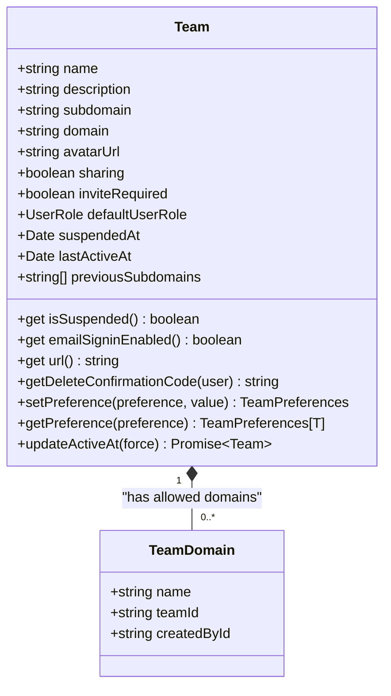
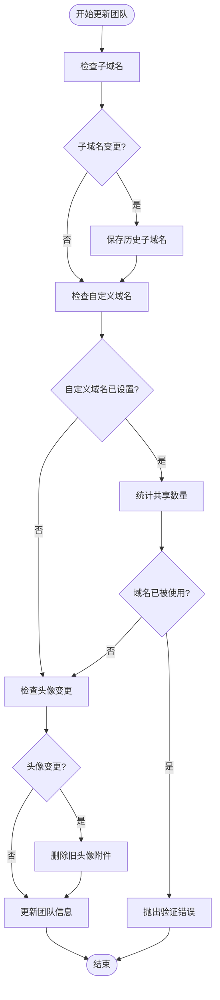
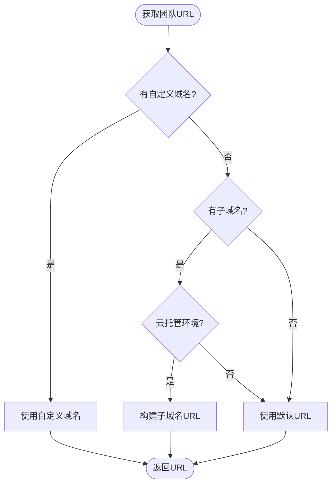
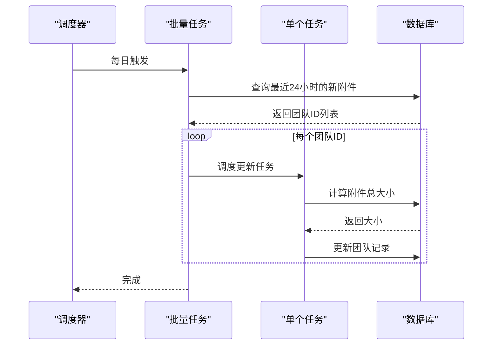

# 团队管理

<cite>
**本文档引用文件**  
- [teams.ts](file://server/routes/api/teams/teams.ts)
- [Team.ts](file://app/models/Team.ts)
- [Team.ts](file://server/models/Team.ts)
- [schema.ts](file://server/routes/api/teams/schema.ts)
- [constants.ts](file://shared/constants.ts)
</cite>

## 目录
1. [简介](#简介)
2. [团队管理API端点](#团队管理api端点)
3. [团队数据模型](#团队数据模型)
4. [团队配置与偏好设置](#团队配置与偏好设置)
5. [团队URL生成逻辑](#团队url生成逻辑)
6. [附件存储配额管理](#附件存储配额管理)
7. [跨团队用户切换](#跨团队用户切换)
8. [实际使用示例](#实际使用示例)

## 简介
本文档详细说明了团队管理系统的API接口、数据模型和核心功能。系统支持团队的创建、配置、更新和删除操作，涵盖团队基本信息设置、子域名配置、默认权限分配、团队头像上传等功能。文档重点描述了团队级偏好设置、默认用户角色、邀请策略以及团队挂起机制等核心概念。

## 团队管理API端点

### 团队更新
`team.update` 和 `teams.update` 端点用于更新团队信息，支持以下参数：

- **name**: 团队名称
- **description**: 团队描述
- **avatarUrl**: 团队头像URL
- **subdomain**: 团队子域名
- **sharing**: 是否启用公共分享
- **guestSignin**: 是否启用邮件登录
- **documentEmbeds**: 是否启用第三方文档嵌入
- **memberCollectionCreate**: 成员是否可创建集合
- **memberTeamCreate**: 成员是否可创建团队
- **defaultCollectionId**: 默认集合ID
- **defaultUserRole**: 默认用户角色
- **inviteRequired**: 是否需要邀请才能加入
- **allowedDomains**: 允许登录的域名列表
- **preferences**: 团队偏好设置

响应格式包含更新后的团队信息和权限策略。

**Section sources**
- [teams.ts](file://server/routes/api/teams/teams.ts#L31-L97)
- [schema.ts](file://server/routes/api/teams/schema.ts#L0-L76)

### 团队删除
系统提供两个相关端点用于团队删除：

- `teams.requestDelete`: 请求删除团队，发送确认邮件
- `teams.delete`: 执行团队删除，需要提供确认码

删除操作需要管理员权限，并且在云托管实例中需要启用邮件支持。

**Section sources**
- [teams.ts](file://server/routes/api/teams/teams.ts#L97-L132)

### 团队创建
`teams.create` 端点用于创建新团队，需要提供团队名称。系统会自动为新团队生成可用的子域名，并复制现有团队的身份验证提供商配置。

**Section sources**
- [teams.ts](file://server/routes/api/teams/teams.ts#L132-L167)

## 团队数据模型

### 核心字段
团队模型包含以下核心字段：

- **name**: 团队名称，长度限制1-100字符
- **description**: 团队描述，可为空
- **subdomain**: 子域名，必须为小写字母、数字和连字符
- **domain**: 自定义域名，支持完全限定域名
- **avatarUrl**: 团队头像URL
- **sharing**: 公共分享开关
- **inviteRequired**: 邀请策略
- **defaultUserRole**: 默认用户角色（Viewer或Member）
- **suspendedAt**: 团队挂起时间戳
- **lastActiveAt**: 最后活跃时间
- **previousSubdomains**: 历史子域名列表

### 验证规则
- 子域名必须在3-63字符之间
- 子域名不能包含保留关键词
- 自定义域名长度限制255字符
- 头像URL长度限制4096字符



**Diagram sources**
- [Team.ts](file://server/models/Team.ts#L54-L473)
- [TeamDomain.ts](file://server/models/TeamDomain.ts#L0-L78)

**Section sources**
- [Team.ts](file://app/models/Team.ts#L7-L121)
- [Team.ts](file://server/models/Team.ts#L54-L473)

## 团队配置与偏好设置

### 团队偏好设置
团队偏好设置（preferences）是一个JSONB字段，包含以下可配置项：

- **seamlessEdit**: 文档是否无缝编辑
- **publicBranding**: 是否使用团队logo进行品牌展示
- **viewersCanExport**: 查看者是否可导出
- **membersCanInvite**: 成员是否可邀请
- **membersCanCreateApiKey**: 成员是否可创建API密钥
- **membersCanDeleteAccount**: 成员是否可删除账户
- **previewsInEmails**: 邮件通知是否包含内容预览
- **commenting**: 是否启用评论
- **customTheme**: 自定义主题
- **tocPosition**: 目录位置
- **preventDocumentEmbedding**: 防止文档嵌入

默认值在`TeamPreferenceDefaults`常量中定义。

### 默认用户角色
`defaultUserRole`字段定义新成员的默认角色，支持Viewer和Member两种角色。该字段在数据库层面有验证约束，确保值的有效性。

### 邀请策略
`inviteRequired`字段控制团队加入策略：
- `true`: 新用户必须被邀请才能加入
- `false`: 用户可以通过域名匹配直接加入

### 团队挂起机制
`suspendedAt`字段用于实现团队挂起功能：
- 当字段为`null`时，团队正常运行
- 当字段有值时，团队被挂起，无法访问
- `isSuspended`计算属性返回团队挂起状态



**Diagram sources**
- [Team.ts](file://server/models/Team.ts#L300-L400)

**Section sources**
- [Team.ts](file://server/models/Team.ts#L150-L250)

## 团队URL生成逻辑
团队URL生成遵循以下优先级：

1. **自定义域名**: 如果设置了`domain`字段，使用自定义域名
2. **子域名**: 如果在云托管环境且设置了`subdomain`，使用`subdomain.baseDomain`格式
3. **默认URL**: 其他情况使用系统默认URL

URL生成考虑了端口配置，并自动移除末尾斜杠。



**Diagram sources**
- [Team.ts](file://server/models/Team.ts#L186-L198)

**Section sources**
- [Team.ts](file://server/models/Team.ts#L186-L198)

## 附件存储配额管理
系统通过以下机制管理团队附件存储配额：

### 存储统计
- `approximateTotalAttachmentsSize`字段存储团队附件总大小（字节）
- 该字段由后台任务定期更新
- 使用BIGINT类型支持大文件存储统计

### 后台更新任务
系统提供两个相关任务：

- `UpdateTeamAttachmentsSizeTask`: 更新单个团队的附件大小
- `UpdateTeamsAttachmentsSizeTask`: 批量更新多个团队的附件大小

批量任务每天执行，优先更新过去24小时内有新附件上传的团队。



**Diagram sources**
- [UpdateTeamsAttachmentsSizeTask.ts](file://server/queues/tasks/UpdateTeamsAttachmentsSizeTask.ts#L0-L52)
- [UpdateTeamAttachmentsSizeTask.ts](file://server/queues/tasks/UpdateTeamAttachmentsSizeTask.ts#L0-L30)

**Section sources**
- [Attachment.ts](file://server/models/Attachment.ts#L181-L238)
- [UpdateTeamsAttachmentsSizeTask.ts](file://server/queues/tasks/UpdateTeamsAttachmentsSizeTask.ts#L0-L52)

## 跨团队用户切换
系统支持用户在多个团队间切换，实现机制如下：

### 用户状态管理
- `AuthStore`存储当前用户和团队信息
- 使用localStorage持久化用户状态
- 监听storage事件实现多标签页同步

### 切换逻辑
当用户访问的URL与当前团队不匹配时：
1. 检查团队是否有自定义域名
2. 检查是否为团队子域名
3. 自动重定向到正确的团队URL

### 安全考虑
- 切换时验证用户在目标团队的成员资格
- 处理团队挂起状态
- 更新用户的时区设置

**Section sources**
- [AuthStore.ts](file://app/stores/AuthStore.ts#L37-L271)

## 实际使用示例

### 更新团队信息
```http
POST /api/team.update
Content-Type: application/json

{
  "token": "user-jwt-token",
  "name": "新团队名称",
  "subdomain": "new-subdomain",
  "avatarUrl": "https://example.com/avatar.png",
  "preferences": {
    "membersCanInvite": true,
    "commenting": false
  }
}
```

### 创建新团队
```http
POST /api/teams.create
Content-Type: application/json

{
  "token": "admin-jwt-token",
  "name": "我的新团队"
}
```

### 删除团队
```http
POST /api/teams.requestDelete
Content-Type: application/json

{
  "token": "admin-jwt-token"
}
```

```http
POST /api/teams.delete
Content-Type: application/json

{
  "token": "admin-jwt-token",
  "code": "DELETE-CODE-FROM-EMAIL"
}
```

**Section sources**
- [teams.ts](file://server/routes/api/teams/teams.ts#L0-L167)
- [schema.ts](file://server/routes/api/teams/schema.ts#L0-L76)