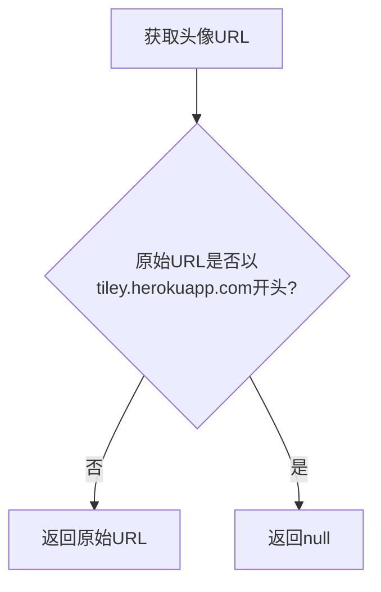
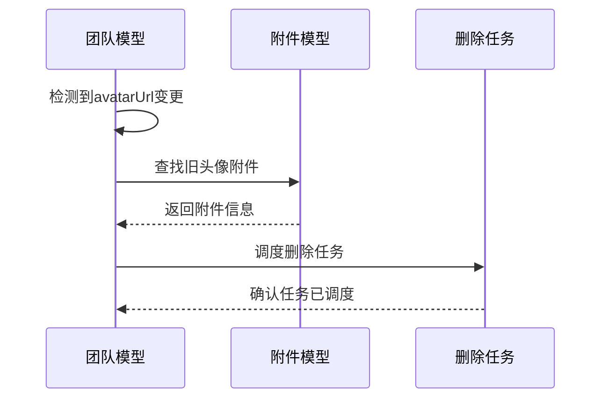
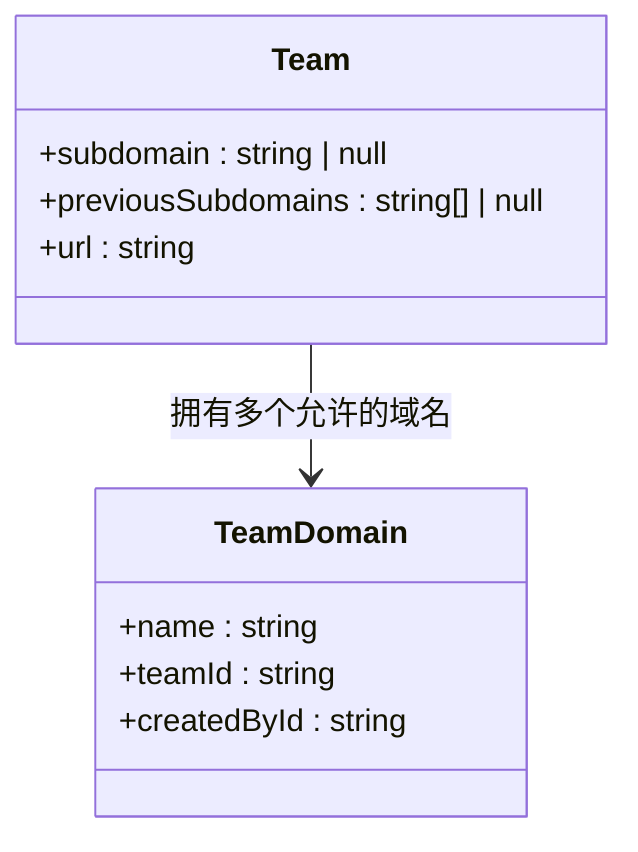
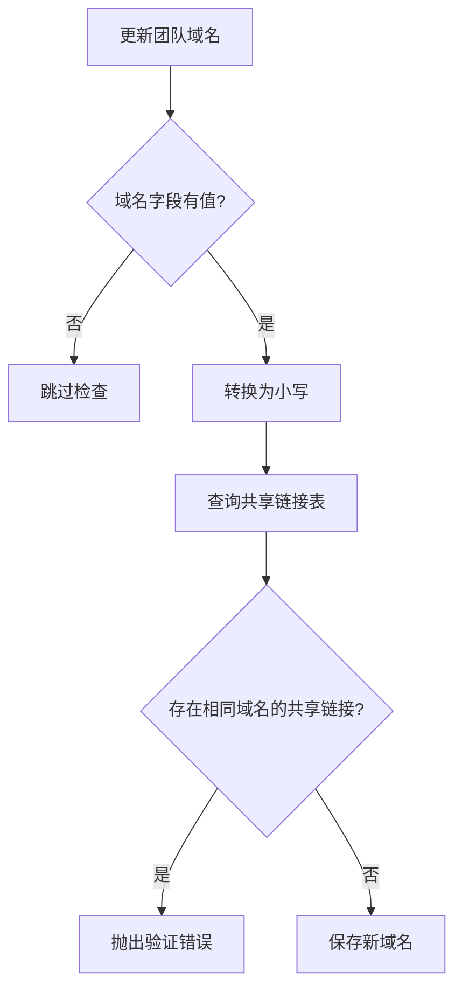
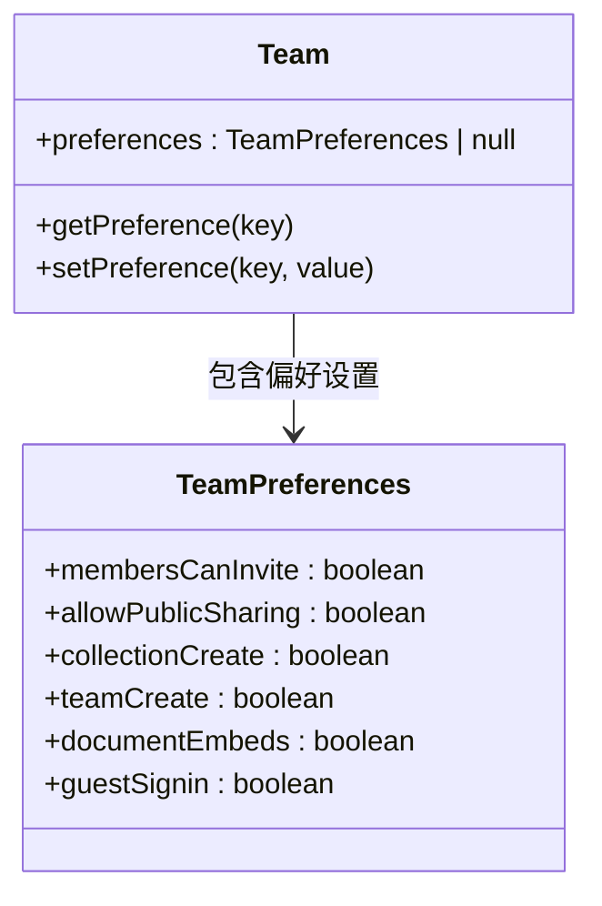
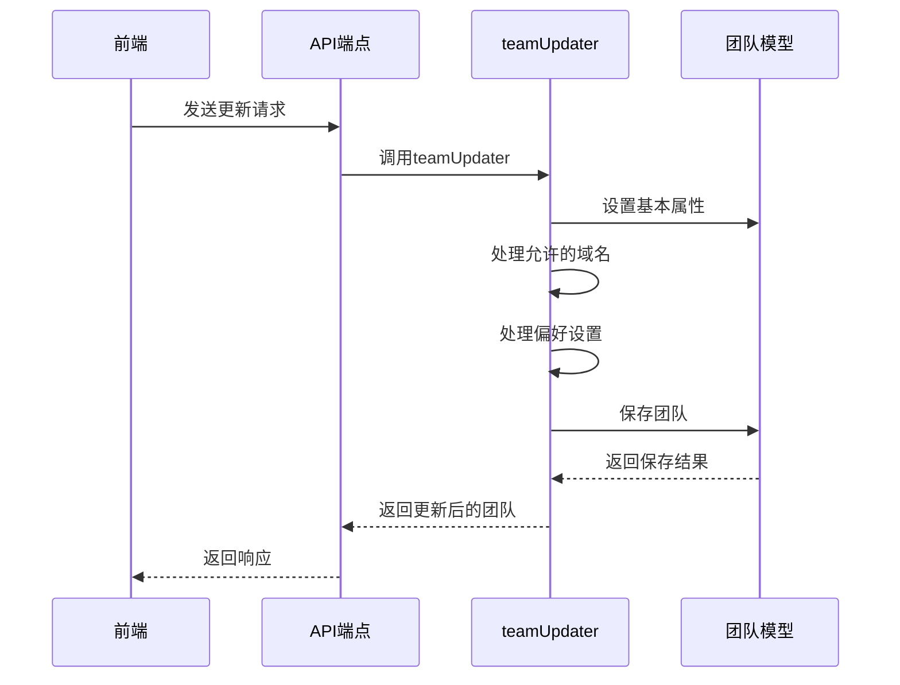
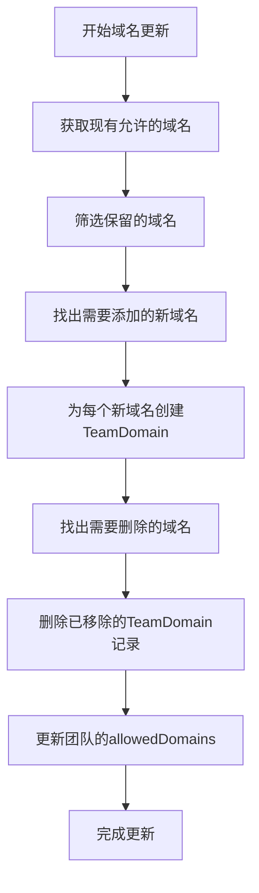
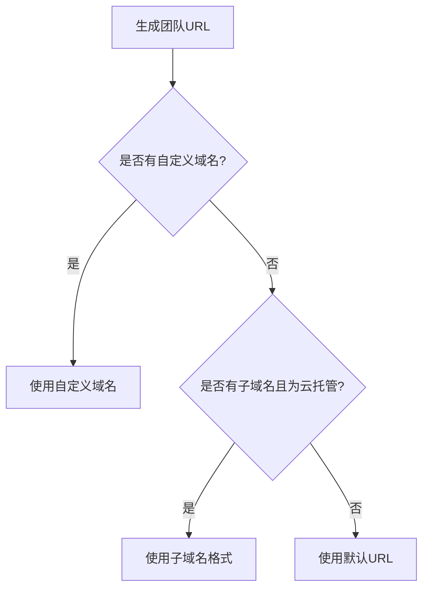
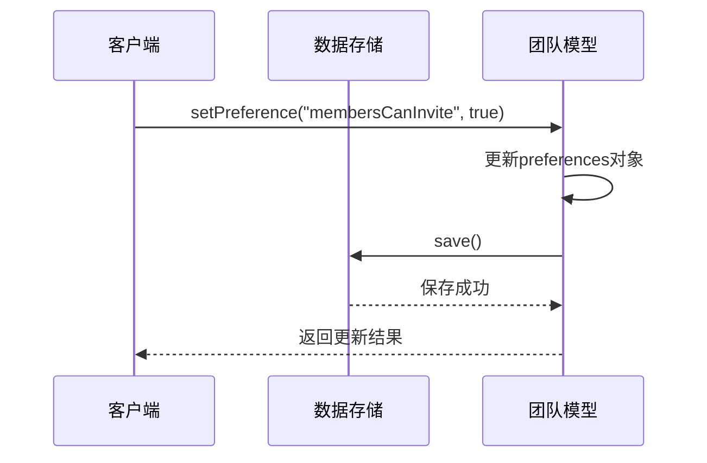
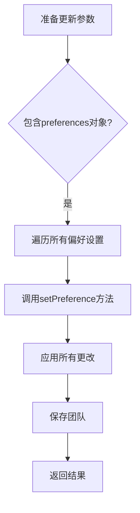

# 团队配置

<cite>
**本文档引用的文件**  
- [Team.ts](file://app/models/Team.ts)
- [Team.ts](file://server/models/Team.ts)
- [teamUpdater.ts](file://server/commands/teamUpdater.ts)
- [TeamDomain.ts](file://server/models/TeamDomain.ts)
- [urls.ts](file://app/utils/urls.ts)
</cite>

## 目录
1. [简介](#简介)
2. [团队基本信息管理](#团队基本信息管理)
3. [子域名与自定义域名设置](#子域名与自定义域名设置)
4. [默认集合配置](#默认集合配置)
5. [团队级偏好设置](#团队级偏好设置)
6. [团队信息更新API](#团队信息更新api)
7. [团队URL生成逻辑](#团队url生成逻辑)
8. [配置团队首选项示例](#配置团队首选项示例)

## 简介
本文档详细说明了团队配置功能，重点介绍团队基本信息管理、子域名与自定义域名设置、默认集合配置以及团队级偏好设置。文档深入分析了Team模型中的字段定义、验证规则和业务逻辑，并描述了前端如何通过API端点进行团队信息更新。

## 团队基本信息管理

团队基本信息包括名称、描述和头像等属性。这些信息在Team模型中通过相应的字段进行定义和管理。

### 名称和描述
团队名称和描述字段在服务器端模型中定义了详细的验证规则：

- **名称**：长度必须在1到100个字符之间，不能为空
- **描述**：最大长度为255个字符，可为空

这些字段的验证通过`@Length`装饰器实现，确保了数据的完整性和一致性。

### 头像管理
头像URL的处理包含特殊的业务逻辑：

**Diagram sources**
- [server/models/Team.ts](file://server/models/Team.ts#L85-L95)

当头像更新时，系统会自动清理旧的头像附件：

**Diagram sources**
- [server/models/Team.ts](file://server/models/Team.ts#L282-L306)

**Section sources**
- [app/models/Team.ts](file://app/models/Team.ts#L15-L20)
- [server/models/Team.ts](file://server/models/Team.ts#L85-L95)

## 子域名与自定义域名设置

团队可以配置子域名和自定义域名，以实现个性化的访问地址。

### 子域名配置
子域名字段具有严格的验证规则：

- 长度限制：云托管环境为3-63个字符，自托管环境更长
- 字符限制：只能包含字母、数字和连字符
- 小写要求：自动转换为小写
- 唯一性：确保全局唯一
- 保留词：不能使用预定义的保留子域名

**Diagram sources**
- [server/models/Team.ts](file://server/models/Team.ts#L68-L72)
- [server/models/TeamDomain.ts](file://server/models/TeamDomain.ts#L28-L36)

### 自定义域名
自定义域名允许团队使用自己的域名访问服务：

- 域名必须是有效的FQDN（完全限定域名）
- 长度限制为255个字符
- 必须全局唯一
- 不能与现有的共享链接域名冲突

当更新自定义域名时，系统会检查是否已被其他共享链接使用：

**Diagram sources**
- [server/models/Team.ts](file://server/models/Team.ts#L258-L270)

**Section sources**
- [server/models/Team.ts](file://server/models/Team.ts#L68-L72)
- [server/models/TeamDomain.ts](file://server/models/TeamDomain.ts#L28-L36)

## 默认集合配置

默认集合配置允许团队指定新文档的默认存储位置。

### 默认集合ID
`defaultCollectionId`字段用于存储默认集合的ID：

- 类型：UUID字符串或null
- 验证：通过`@IsUUID(4)`确保格式正确
- 用途：当用户创建新文档时，如果没有指定集合，则使用此集合

该字段在数据库中定义为外键，关联到Collection模型。

### 集合创建权限
团队还可以配置成员创建集合的权限：

- `memberCollectionCreate`：布尔值，控制普通成员是否可以创建集合
- `memberTeamCreate`：布尔值，控制成员是否可以创建新团队

这些权限设置有助于团队管理员控制资源的创建和组织结构。

**Section sources**
- [app/models/Team.ts](file://app/models/Team.ts#L38-L42)
- [server/models/Team.ts](file://server/models/Team.ts#L132-L136)

## 团队级偏好设置

团队级偏好设置允许管理员配置团队的行为和功能。

### 偏好设置模型
偏好设置存储在`preferences`字段中，类型为JSONB：

- 存储格式：JSON对象
- 可为空：允许null值
- 动态结构：可以存储各种类型的偏好设置

**Diagram sources**
- [server/models/Team.ts](file://server/models/Team.ts#L160-L164)

### 偏好设置管理
团队提供了专门的方法来管理偏好设置：

- `setPreference(key, value)`：设置特定偏好值
- `getPreference(key)`：获取偏好值，支持默认值回退

当获取偏好设置时，系统会按以下顺序查找值：
1. 团队特定设置
2. 系统默认设置
3. 提供的默认值参数
4. 布尔值false作为最终默认值

**Section sources**
- [app/models/Team.ts](file://app/models/Team.ts#L100-L121)
- [server/models/Team.ts](file://server/models/Team.ts#L210-L234)

## 团队信息更新API

前端通过API端点更新团队信息，后端通过命令模式处理更新逻辑。

### 更新流程
团队更新由`teamUpdater`命令处理：

**Diagram sources**
- [server/commands/teamUpdater.ts](file://server/commands/teamUpdater.ts#L12-L65)

### 域名更新处理
当更新允许的域名列表时，系统会执行以下操作：

1. 保留仍然在新列表中的现有域名
2. 添加新域名
3. 删除已移除的域名
4. 更新团队的allowedDomains关联

**Diagram sources**
- [server/commands/teamUpdater.ts](file://server/commands/teamUpdater.ts#L25-L52)

**Section sources**
- [server/commands/teamUpdater.ts](file://server/commands/teamUpdater.ts#L12-L65)

## 团队URL生成逻辑

团队URL的生成逻辑根据配置的域名类型动态确定。

### URL生成规则
团队URL的生成遵循以下优先级：

1. 如果配置了自定义域名，则使用自定义域名
2. 如果配置了子域名且为云托管环境，则使用子域名
3. 否则使用默认的基础URL

具体的URL格式：
- 自定义域名：`https://自定义域名`
- 子域名：`https://子域名.基础域名`
- 默认：`环境变量URL`

### 子域名冲突检测
系统通过多种机制防止子域名冲突：

- **保留子域名列表**：某些关键词被禁止使用
- **唯一性约束**：数据库层面确保子域名唯一
- **历史子域名跟踪**：记录之前的子域名，防止立即重用

当子域名变更时，系统会将旧的子域名添加到`previousSubdomains`数组中，最多保留3个历史记录。

**Section sources**
- [server/models/Team.ts](file://server/models/Team.ts#L236-L256)

## 配置团队首选项示例

以下是如何配置团队首选项的实际代码示例。

### 成员邀请权限配置
启用成员邀请权限的代码示例：

**Diagram sources**
- [app/models/Team.ts](file://app/models/Team.ts#L115-L121)

### 批量偏好设置更新
通过API批量更新多个偏好设置：

在`teamUpdater`命令中，系统会遍历所有可能的偏好设置键，并应用提供的值。

**Section sources**
- [server/commands/teamUpdater.ts](file://server/commands/teamUpdater.ts#L54-L62)