# 成员关系管理

<cite>
**本文档引用的文件**   
- [userMemberships.ts](file://server/routes/api/userMemberships/userMemberships.ts)
- [UserMembership.ts](file://app/models/UserMembership.ts)
- [UserMembership.ts](file://server/models/UserMembership.ts)
- [User.ts](file://app/models/User.ts)
- [User.ts](file://server/models/User.ts)
- [Team.ts](file://app/models/Team.ts)
- [Team.ts](file://server/models/Team.ts)
</cite>

## 目录
1. [简介](#简介)
2. [核心数据结构](#核心数据结构)
3. [成员状态机与权限模型](#成员状态机与权限模型)
4. [API端点详解](#api端点详解)
5. [权限继承与通知机制](#权限继承与通知机制)
6. [批量操作与异步任务](#批量操作与异步任务)
7. [成员计数与权限校验](#成员计数与权限校验)
8. [邀请链接生成](#邀请链接生成)
9. [实际使用示例](#实际使用示例)

## 简介
本文档详细阐述了用户与团队成员关系管理的API设计与实现。系统通过`UserMembership`模型管理用户对文档和集合的访问权限，支持成员的添加、移除、角色变更和批量操作等核心功能。文档将深入解析`userMemberships.ts`中定义的端点，包括邀请成员、接受邀请、更改角色和批量导入等操作的请求参数、响应格式及错误码，并结合`UserMembership`、`User`和`Team`模型解释其数据结构与关联关系。

**Section sources**
- [userMemberships.ts](file://server/routes/api/userMemberships/userMemberships.ts#L1-L104)

## 核心数据结构

### UserMembership 模型
`UserMembership`模型是成员关系管理的核心，它代表了用户对特定文档或集合的访问权限。该模型定义了权限级别、排序索引以及与用户和文档的关联。

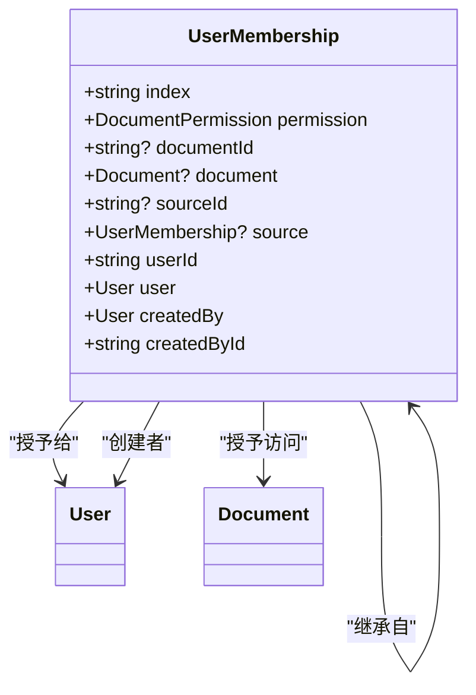

**Diagram sources **
- [UserMembership.ts](file://app/models/UserMembership.ts#L10-L97)
- [UserMembership.ts](file://server/models/UserMembership.ts#L38-L410)

### 关联模型
`UserMembership`模型与`User`和`Team`模型紧密关联，共同构成了完整的成员关系体系。

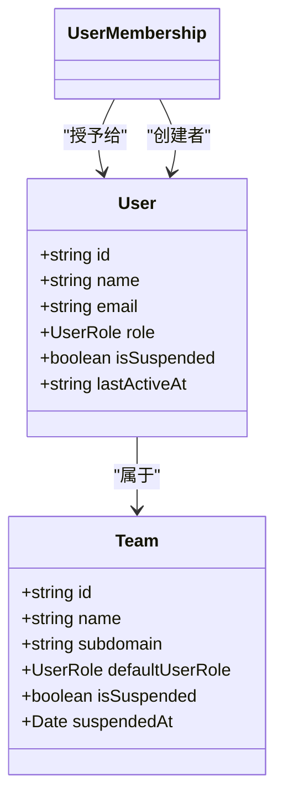

**Diagram sources **
- [User.ts](file://app/models/User.ts#L22-L245)
- [User.ts](file://server/models/User.ts#L81-L856)
- [Team.ts](file://app/models/Team.ts#L7-L121)
- [Team.ts](file://server/models/Team.ts#L54-L473)

**Section sources**
- [UserMembership.ts](file://app/models/UserMembership.ts#L10-L97)
- [UserMembership.ts](file://server/models/UserMembership.ts#L38-L410)
- [User.ts](file://app/models/User.ts#L22-L245)
- [User.ts](file://server/models/User.ts#L81-L856)
- [Team.ts](file://app/models/Team.ts#L7-L121)
- [Team.ts](file://server/models/Team.ts#L54-L473)

## 成员状态机与权限模型

### 成员状态机
系统中的成员状态由多个因素共同决定，形成了一个复杂的状态机。核心状态包括：

- **active (活跃)**: 用户已登录并活跃使用系统。
- **pending (待定)**: 用户已收到邀请但尚未接受。
- **suspended (已暂停)**: 用户账户已被管理员暂停。

成员的最终状态是`User`模型和`Team`模型状态的综合体现。例如，当`User`的`suspendedAt`字段不为空，或其所属`Team`的`suspendedAt`字段不为空时，该成员即处于`suspended`状态。

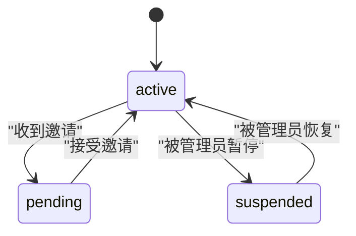

**Diagram sources **
- [User.ts](file://server/models/User.ts#L81-L856)
- [Team.ts](file://server/models/Team.ts#L54-L473)

### 权限继承机制
权限继承是系统的核心特性之一。当一个文档被共享时，其子文档会自动继承父文档的访问权限。这一机制通过`UserMembership`模型的`sourceId`字段实现。

- **根成员关系 (Root Membership)**: 直接在文档上创建的成员关系。
- **派生成员关系 (Sourced Membership)**: 通过`sourceId`指向根成员关系的成员关系。

当根成员关系的权限发生变化时，所有派生成员关系会自动更新，确保权限的一致性。

**Section sources**
- [UserMembership.ts](file://server/models/UserMembership.ts#L38-L410)

## API端点详解

### 列出用户成员关系
此端点用于获取当前用户的所有成员关系。

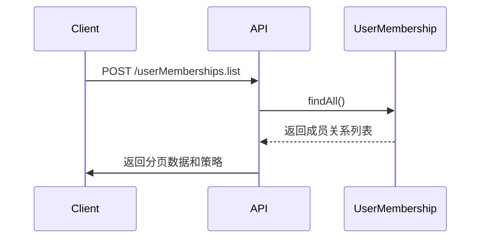

**请求参数**
- `id` (string): 成员关系ID。
- `index` (string): 排序索引。

**响应格式**
```json
{
  "pagination": { ... },
  "data": {
    "memberships": [...],
    "documents": [...]
  },
  "policies": [...]
}
```

**错误码**
- `401 Unauthorized`: 用户未认证。
- `403 Forbidden`: 用户无权访问。

### 更新成员关系
此端点用于更新成员关系的排序索引。

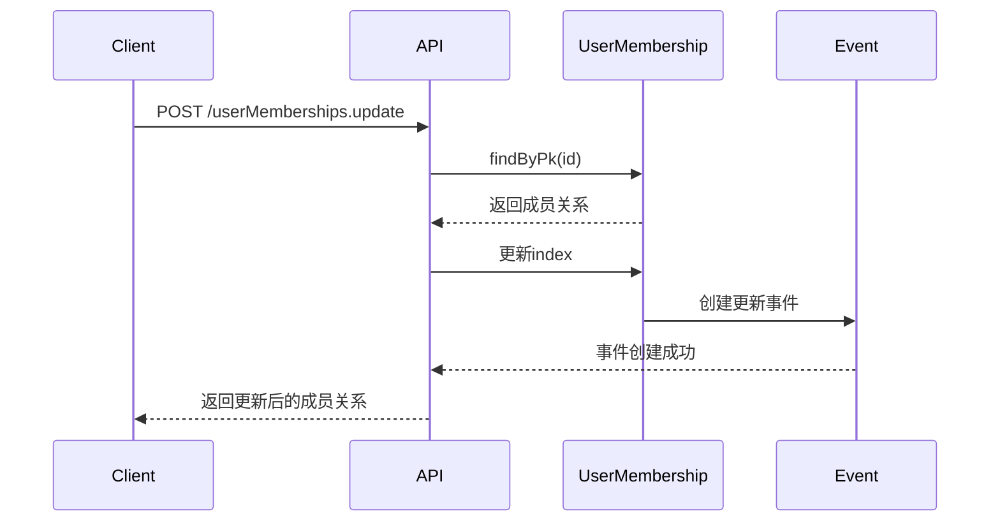

**请求参数**
- `id` (string, required): 成员关系ID。
- `index` (string, required): 新的排序索引。

**响应格式**
```json
{
  "data": { ... },
  "policies": [...]
}
```

**错误码**
- `400 Bad Request`: 请求参数无效。
- `404 Not Found`: 成员关系不存在。

**Section sources**
- [userMemberships.ts](file://server/routes/api/userMemberships/userMemberships.ts#L23-L63)
- [userMemberships.ts](file://server/routes/api/userMemberships/userMemberships.ts#L71-L100)

## 权限继承与通知机制

### 权限继承流程
当在文档上创建或更新成员关系时，系统会自动为所有子文档创建或更新相应的派生成员关系。

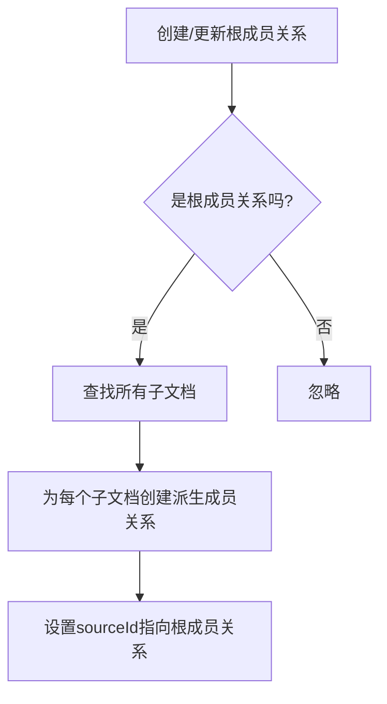

**Section sources**
- [UserMembership.ts](file://server/models/UserMembership.ts#L38-L410)

### 通知订阅逻辑
系统通过事件驱动的方式处理通知。当成员关系发生变化时，会触发相应的事件，通知服务会监听这些事件并发送通知。

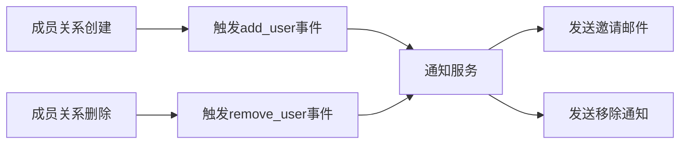

**Section sources**
- [UserMembership.ts](file://server/models/UserMembership.ts#L38-L410)

## 批量操作与异步任务

### 批量导入成员
批量操作通过异步任务处理，以避免长时间阻塞API请求。系统会将批量导入任务放入队列，由后台工作进程处理。

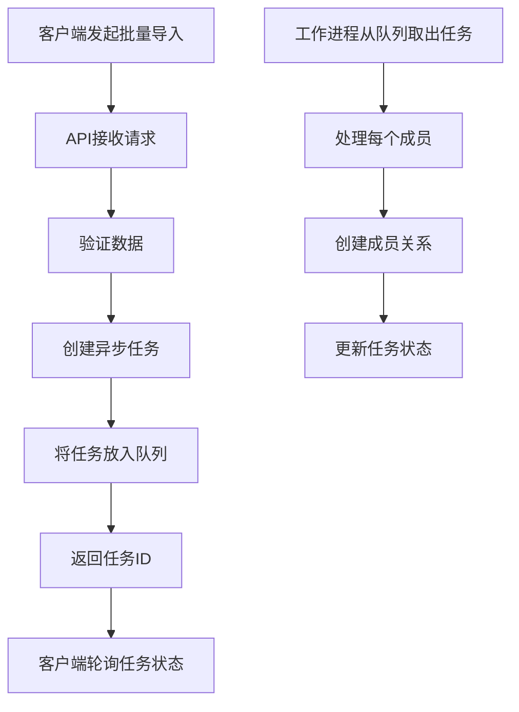

**Section sources**
- [UserMembership.ts](file://server/models/UserMembership.ts#L38-L410)

## 成员计数与权限校验

### 成员计数统计
系统提供了高效的成员计数功能，通过原生SQL查询一次性获取所有统计信息。

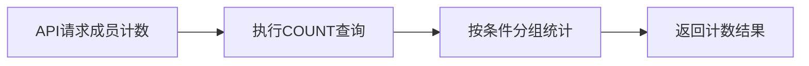

**Section sources**
- [User.ts](file://server/models/User.ts#L81-L856)

### 权限校验流程
权限校验遵循严格的策略，确保只有授权用户才能执行操作。

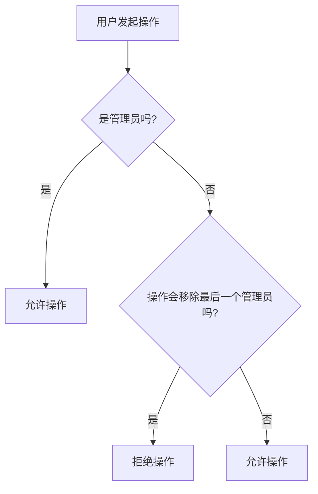

**Section sources**
- [UserMembership.ts](file://server/models/UserMembership.ts#L38-L410)

## 邀请链接生成
邀请链接的生成基于JWT令牌，包含用户ID和创建时间，确保链接的安全性和时效性。

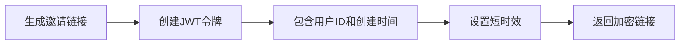

**Section sources**
- [User.ts](file://server/models/User.ts#L81-L856)

## 实际使用示例
以下是一个使用API添加成员的示例：

```javascript
// 添加用户到文档
const response = await client.post("/documents.add_user", {
  id: "document-123",
  userId: "user-456",
  permission: "read_write"
});

// 响应
{
  "data": {
    "memberships": [
      {
        "id": "membership-789",
        "userId": "user-456",
        "documentId": "document-123",
        "permission": "read_write",
        "createdById": "user-111"
      }
    ],
    "users": [
      {
        "id": "user-456",
        "name": "John Doe",
        "email": "john@example.com"
      }
    ]
  },
  "policies": [...]
}
```

**Section sources**
- [userMemberships.ts](file://server/routes/api/userMemberships/userMemberships.ts#L23-L63)