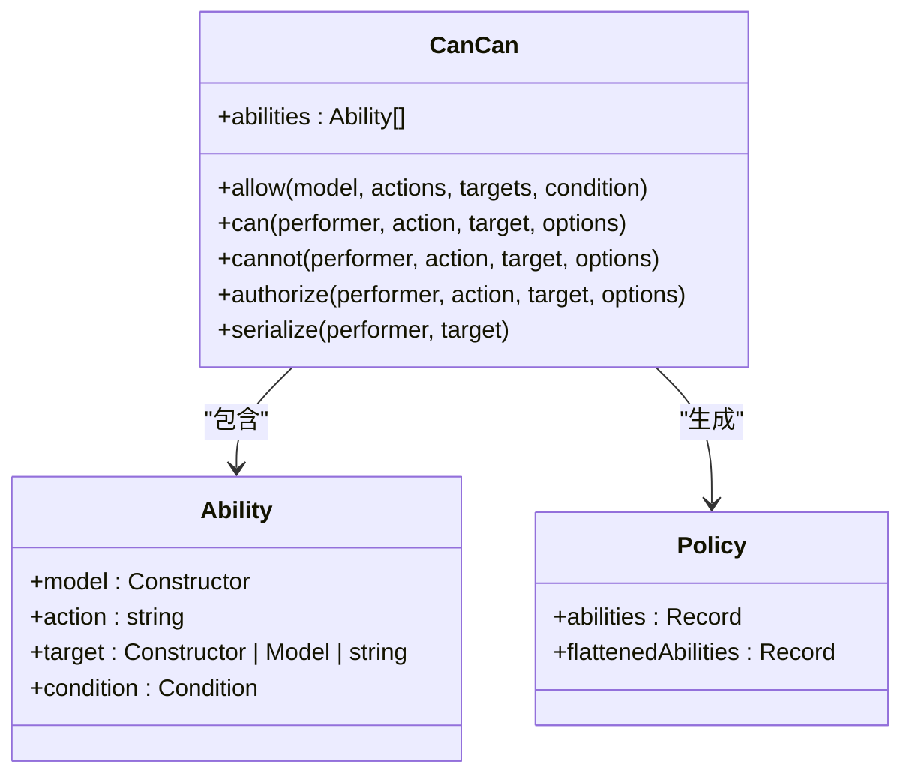
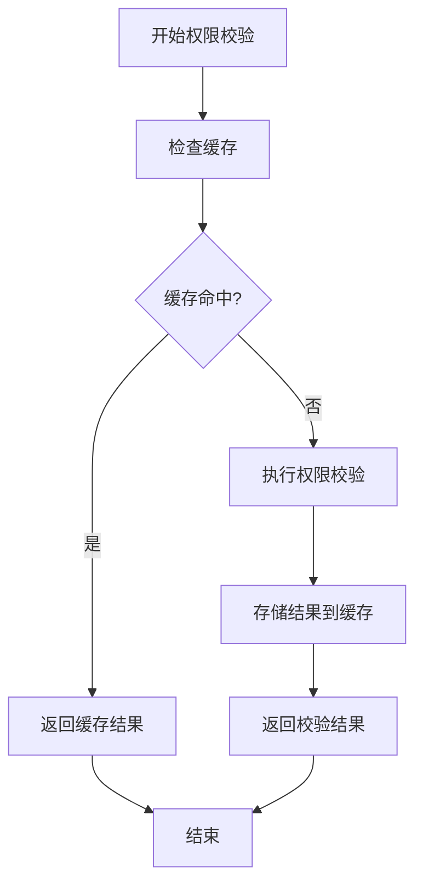
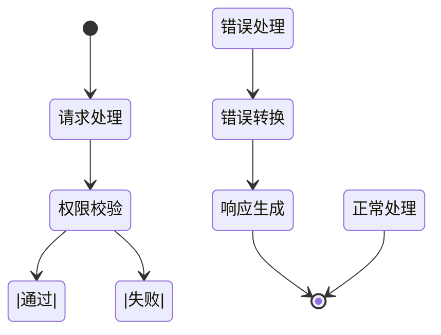

# 权限校验

<cite>
**本文档中引用的文件**  
- [cancan.ts](file://server/policies/cancan.ts)
- [Policy.ts](file://app/models/Policy.ts)
- [PoliciesStore.ts](file://app/stores/PoliciesStore.ts)
- [usePolicy.ts](file://app/hooks/usePolicy.ts)
- [apiErrorHandler.ts](file://server/routes/api/middlewares/apiErrorHandler.ts)
- [errors.ts](file://server/errors.ts)
- [CacheHelper.ts](file://server/utils/CacheHelper.ts)
</cite>

## 目录
1. [介绍](#介绍)
2. [权限校验流程](#权限校验流程)
3. [cancan权限框架](#cancan权限框架)
4. [性能优化措施](#性能优化措施)
5. [权限校验失败处理](#权限校验失败处理)
6. [权限调试与审计日志](#权限调试与审计日志)

## 介绍
本文档全面阐述了成员权限校验的完整流程，从API请求拦截到最终权限判定的链路。详细说明了cancan权限框架的使用方式、自定义校验规则的实现、性能优化措施（包括缓存策略和批量校验机制）、权限校验失败的处理流程和错误码规范，以及权限调试和审计日志的实现方法。

## 权限校验流程
权限校验流程始于API请求的拦截，通过中间件对请求进行身份验证和权限检查。系统首先验证用户的身份信息，然后根据用户角色和目标资源的权限策略进行校验。整个流程包括请求拦截、身份验证、权限判定和响应处理四个主要阶段。

**Section sources**
- [apiErrorHandler.ts](file://server/routes/api/middlewares/apiErrorHandler.ts#L0-L47)
- [errors.ts](file://server/errors.ts#L0-L222)

## cancan权限框架
cancan权限框架是系统权限管理的核心组件，提供了定义和检查授权能力的简单方法。该框架通过定义能力（Ability）来描述用户对特定模型的操作权限，包括模型类型、操作类型、目标资源和条件函数。

**Diagram sources**
- [cancan.ts](file://server/policies/cancan.ts#L0-L248)

**Section sources**
- [cancan.ts](file://server/policies/cancan.ts#L0-L248)
- [Policy.ts](file://app/models/Policy.ts#L0-L64)

## 性能优化措施
系统通过缓存策略和批量校验机制来优化权限校验的性能。缓存策略利用Redis存储频繁访问的权限数据，减少数据库查询次数。批量校验机制允许在单次请求中对多个资源进行权限检查，提高处理效率。

**Diagram sources**
- [CacheHelper.ts](file://server/utils/CacheHelper.ts#L0-L33)

**Section sources**
- [CacheHelper.ts](file://server/utils/CacheHelper.ts#L0-L33)

## 权限校验失败处理
当权限校验失败时，系统会抛出相应的错误并返回标准化的错误响应。错误处理机制包括错误类型识别、错误信息转换和错误响应生成。系统定义了多种错误类型，如AuthorizationError、NotFoundError和ValidationError，每种错误类型都有对应的错误码和消息。

**Diagram sources**
- [apiErrorHandler.ts](file://server/routes/api/middlewares/apiErrorHandler.ts#L0-L47)
- [errors.ts](file://server/errors.ts#L0-L222)

**Section sources**
- [apiErrorHandler.ts](file://server/routes/api/middlewares/apiErrorHandler.ts#L0-L47)
- [errors.ts](file://server/errors.ts#L0-L222)

## 权限调试与审计日志
系统提供了完善的权限调试和审计日志功能。权限调试功能允许开发人员查看和分析权限校验的详细过程，包括能力定义、条件评估和最终判定结果。审计日志记录了所有权限相关的操作，包括权限变更、校验失败和异常情况，便于问题排查和安全审计。

**Section sources**
- [PoliciesStore.ts](file://app/stores/PoliciesStore.ts#L0-L62)
- [usePolicy.ts](file://app/hooks/usePolicy.ts#L0-L39)