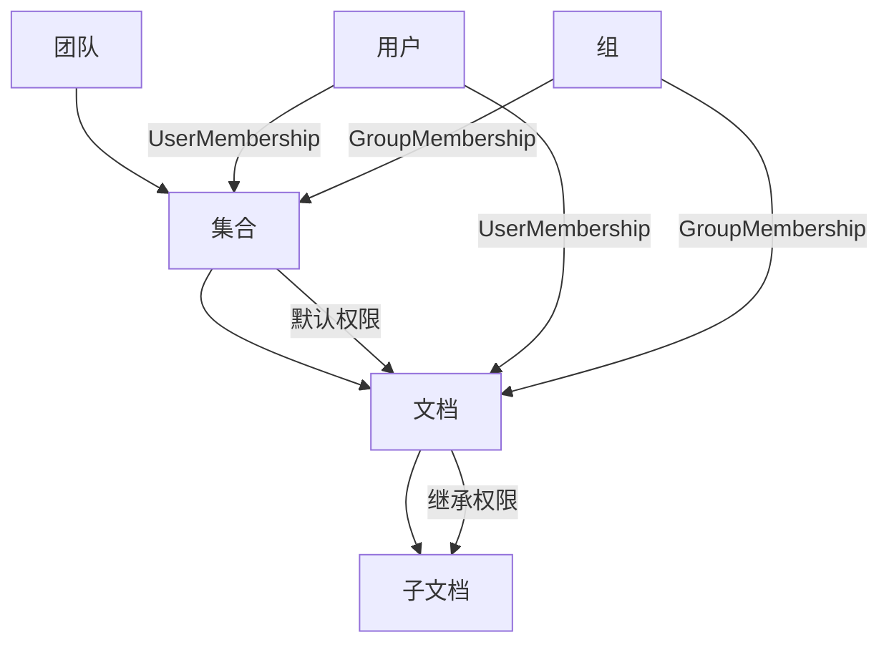
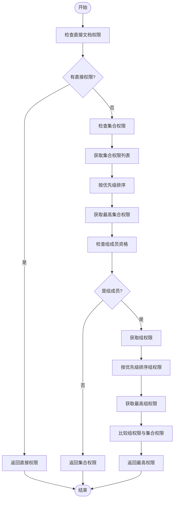
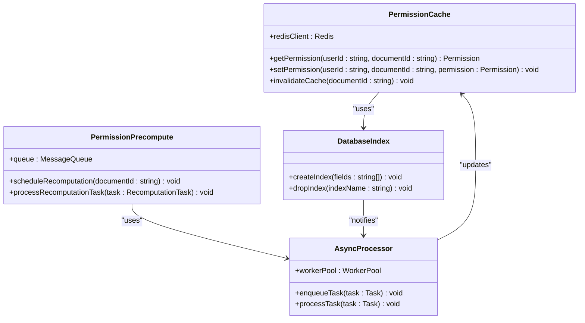

# 权限继承

<cite>
**Referenced Files in This Document**   
- [UserMembership.ts](file://server/models/UserMembership.ts)
- [Collection.ts](file://server/models/Collection.ts)
- [permissions.ts](file://server/utils/permissions.ts)
- [Document.ts](file://server/models/Document.ts)
- [documentCreator.ts](file://server/commands/documentCreator.ts)
- [GroupMembership.ts](file://server/models/GroupMembership.ts)
</cite>

## 目录
1. [权限继承机制概述](#权限继承机制概述)
2. [UserMembership与CollectionPermission关联关系](#usermembership与collectionpermission关联关系)
3. [权限优先级判定逻辑](#权限优先级判定逻辑)
4. [权限继承链查询方法](#权限继承链查询方法)
5. [性能优化策略](#性能优化策略)
6. [总结](#总结)

## 权限继承机制概述

在系统中，权限继承机制是通过用户成员关系（UserMembership）实现的，这种机制允许团队级别的权限向下继承到集合和文档。当用户被添加到某个集合或文档时，会创建一个UserMembership记录，该记录包含了用户的权限级别以及访问控制信息。

权限继承的核心在于`UserMembership`模型，它不仅定义了用户对特定集合或文档的直接权限，还支持通过`sourceId`字段建立继承关系。这意味着如果一个用户在一个文档上拥有某种权限，那么这个权限可以被继承到该文档的所有子文档上。这种设计使得权限管理更加灵活和高效，同时也确保了权限的一致性和安全性。

此外，系统还利用了`Collection`模型来管理集合级别的权限设置。每个集合都可以设置默认的权限级别，这些权限会自动应用于集合内的所有文档，除非有更具体的权限覆盖。这样的设计简化了权限配置过程，同时保持了足够的灵活性以满足不同场景的需求。



**Diagram sources**
- [Collection.ts](file://server/models/Collection.ts#L87-L1007)
- [UserMembership.ts](file://server/models/UserMembership.ts#L38-L410)

## UserMembership与CollectionPermission关联关系

`UserMembership`模型与`CollectionPermission`之间存在紧密的关联关系，这种关系是通过数据库表中的外键约束和Sequelize ORM框架实现的。具体来说，`UserMembership`表中包含了一个名为`collectionId`的字段，该字段作为外键引用了`Collection`表的主键，从而建立了两者之间的联系。

在`UserMembership`类的定义中，可以看到以下关键代码片段：
```typescript
@BelongsTo(() => Collection, "collectionId")
collection?: Collection | null;

@ForeignKey(() => Collection)
@Column(DataType.UUID)
collectionId?: string | null;
```
这段代码表明了`UserMembership`实体与`Collection`实体之间的多对一关系，即多个用户成员关系可以属于同一个集合。同时，`permission`字段用于存储用户在该集合上的权限级别，其值来自`CollectionPermission`枚举类型，包括读取、读写和管理等不同级别的权限。

除了直接的集合权限外，`UserMembership`还可以通过`documentId`字段关联到具体的文档，从而实现文档级别的权限控制。这种设计允许系统在集合和文档两个层次上进行精细化的权限管理，既保证了整体结构的安全性，又提供了足够的灵活性来适应不同的业务需求。

**Section sources**
- [UserMembership.ts](file://server/models/UserMembership.ts#L38-L410)
- [Collection.ts](file://server/models/Collection.ts#L87-L1007)

## 权限优先级判定逻辑

当用户在不同层级拥有不同权限时，系统采用了一套明确的优先级判定逻辑来确定最终的有效权限。这一逻辑主要由`getDocumentPermission`函数实现，该函数位于`server/utils/permissions.ts`文件中。

首先，函数会检查用户是否直接拥有文档级别的权限。如果有，则直接返回该权限作为最高优先级的结果。如果没有直接权限，函数将继续查找用户所属集合的权限。这里需要注意的是，集合权限本身也有优先级顺序，通常按照管理 > 读写 > 读取的顺序排列。

接下来，函数还会考虑用户所属组的权限情况。如果用户是某个组的成员，而该组对目标文档或集合具有更高的权限，则用户的实际权限将提升至组的权限水平。这种机制确保了即使个人权限较低，只要所在团队或部门拥有较高权限，用户也能获得相应的访问权利。

最后，所有可能影响用户权限的因素都会被综合评估，并根据预设的优先级规则得出最终结果。整个过程通过一系列异步操作完成，确保了即使在复杂环境下也能快速准确地计算出正确的权限状态。



**Diagram sources**
- [permissions.ts](file://server/utils/permissions.ts#L92-L174)

## 权限继承链查询方法

为了有效地管理和审计权限继承链，系统提供了一套完整的查询方法。这些方法主要集中在`UserMembership`和`Document`模型中，能够帮助管理员追踪从团队到集合再到文档的完整权限路径。

首先，可以通过`UserMembership.findRootMembershipsForDocument`静态方法来查找给定文档的根成员关系。这个方法接收文档ID作为参数，并返回所有相关的根成员关系对象。通过遍历这些对象，可以构建出完整的权限继承链。

其次，在`Document`模型中，`getDocumentTree`方法可用于获取指定文档在整个集合结构中的位置信息。此方法返回一个包含文档及其子文档的树形结构，其中每个节点都包含了相应的权限信息。这对于理解文档间的权限传递关系非常有用。

另外，`Collection`模型中的`getDocumentParents`方法可以帮助确定某文档在其所属集合内的父文档链路。结合上述方法，可以全面掌握一个文档从顶层集合到底层子文档的所有权限来源。

最后，对于需要实时查询的情况，系统还提供了基于Redis缓存的快速查询接口。通过预先计算并存储常见的权限继承链，可以在不影响性能的前提下提供即时响应。

**Section sources**
- [UserMembership.ts](file://server/models/UserMembership.ts#L38-L410)
- [Document.ts](file://server/models/Document.ts#L94-L1314)
- [Collection.ts](file://server/models/Collection.ts#L87-L1007)

## 性能优化策略

为了提高权限继承机制的性能，系统采用了多种优化策略，主要包括缓存机制和权限预计算方案。

### 缓存机制

系统利用Redis作为缓存层，存储频繁访问的权限数据。每当用户请求访问某个文档或集合时，首先尝试从Redis中读取相关权限信息。如果命中缓存，则直接返回结果；否则，执行完整的权限查询流程并将结果写入缓存供后续使用。这种方法显著减少了数据库查询次数，提高了响应速度。

### 权限预计算

针对复杂的权限继承场景，系统实现了权限预计算功能。在用户加入团队、更改角色或调整文档结构时，后台任务会自动重新计算受影响用户的权限状态，并更新至数据库和缓存中。这样，在实际访问时只需进行简单的查找操作即可获得准确的权限信息，避免了实时计算带来的延迟。

### 数据库索引优化

通过对关键字段如`userId`、`documentId`和`collectionId`建立适当的数据库索引，进一步提升了查询效率。特别是复合索引的应用，使得多条件联合查询变得更加高效。

### 异步处理

对于耗时较长的操作，例如批量更新大量用户的权限，系统采用异步处理方式。通过消息队列分发任务，确保主线程不会被阻塞，从而维持良好的用户体验。

综上所述，通过上述一系列优化措施，系统能够在保证安全性的前提下，实现高性能的权限管理服务。



**Diagram sources**
- [permissions.ts](file://server/utils/permissions.ts#L92-L174)
- [documentCreator.ts](file://server/commands/documentCreator.ts#L0-L196)

## 总结

本文深入解析了成员权限继承机制，详细说明了团队级别权限如何向下继承到集合和文档。我们探讨了`UserMembership`与`CollectionPermission`之间的关联关系及继承规则，解释了当用户在不同层级拥有不同权限时的优先级判定逻辑。此外，还介绍了权限继承链的查询方法以及相关的性能优化策略，包括缓存机制和权限预计算方案。

通过以上分析可以看出，系统通过精心设计的数据模型和高效的算法实现了灵活且安全的权限管理体系。这不仅满足了日常运营的需求，也为未来的扩展留下了充足的空间。希望本文能为开发者理解和维护这一重要功能提供有价值的参考。

**Section sources**
- [UserMembership.ts](file://server/models/UserMembership.ts#L38-L410)
- [Collection.ts](file://server/models/Collection.ts#L87-L1007)
- [permissions.ts](file://server/utils/permissions.ts#L92-L174)