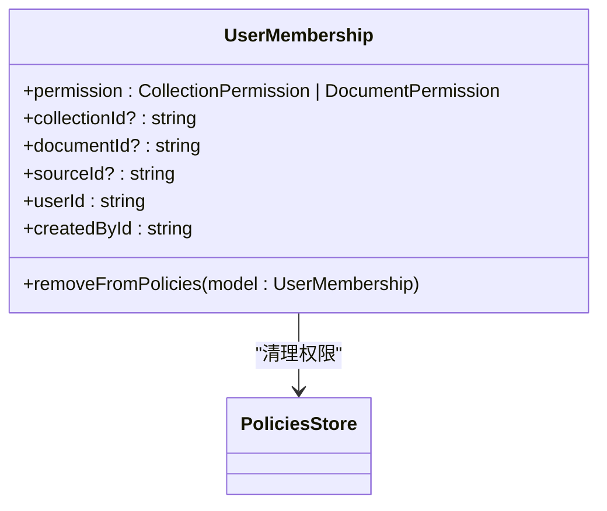
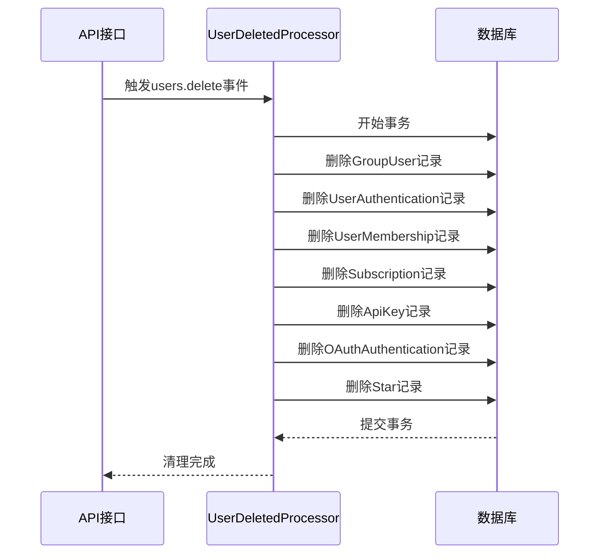
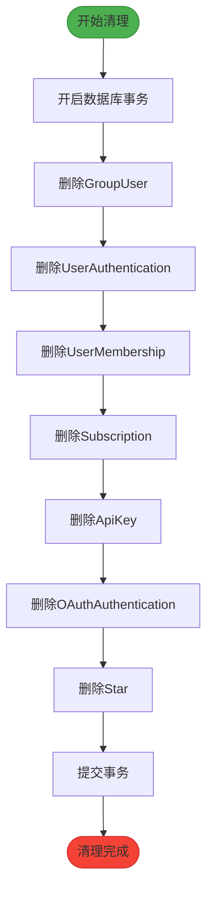
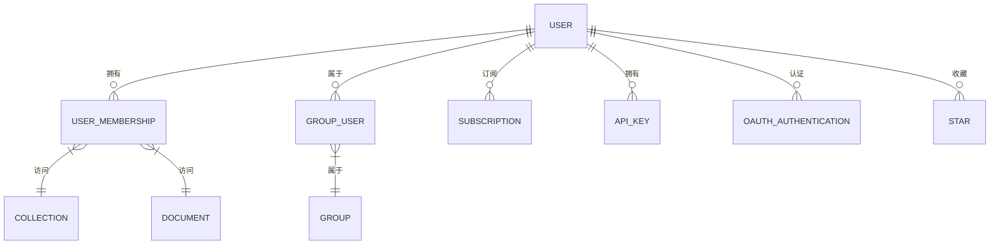

# 成员数据清理

<cite>
**本文档引用的文件**
- [User.ts](file://server/models/User.ts)
- [UserMembership.ts](file://server/models/UserMembership.ts)
- [GroupUser.ts](file://server/models/GroupUser.ts)
- [UserDeletedProcessor.ts](file://server/queues/processors/UserDeletedProcessor.ts)
- [Notification.ts](file://server/models/Notification.ts)
</cite>

## 目录
1. [简介](#简介)
2. [生命周期钩子实现](#生命周期钩子实现)
3. [异步清理任务](#异步清理任务)
4. [事务管理与错误处理](#事务管理与错误处理)
5. [审计跟踪与数据恢复](#审计跟踪与数据恢复)
6. [结论](#结论)

## 简介
成员数据清理功能是系统中确保数据一致性和安全性的关键组件。当成员被删除或移除时，系统需要执行一系列清理操作，包括级联删除或更新关联数据（如权限、订阅、通知等）。本文档详细描述了成员删除时的数据清理机制，重点分析@AfterRemove等生命周期钩子的实现逻辑，以及异步清理任务的执行流程。

**Section sources**
- [User.ts](file://server/models/User.ts#L81-L856)

## 生命周期钩子实现
在成员删除过程中，系统通过生命周期钩子来确保关联数据的正确清理。`@AfterRemove`钩子在用户成员资格被删除后触发，负责清理相关的权限策略。

**Diagram sources**
- [UserMembership.ts](file://app/models/UserMembership.ts#L10-L97)

**Section sources**
- [UserMembership.ts](file://app/models/UserMembership.ts#L10-L97)
- [UserMembership.ts](file://server/models/UserMembership.ts#L38-L410)

## 异步清理任务
成员数据的清理由`UserDeletedProcessor`处理器在后台异步执行。该处理器通过队列系统处理用户删除事件，确保清理操作不会影响主流程的性能。

**Diagram sources**
- [UserDeletedProcessor.ts](file://server/queues/processors/UserDeletedProcessor.ts#L13-L63)

**Section sources**
- [UserDeletedProcessor.ts](file://server/queues/processors/UserDeletedProcessor.ts#L13-L63)

## 事务管理与错误处理
数据清理过程采用数据库事务来确保操作的原子性。所有清理操作都在一个事务中执行，如果任何步骤失败，整个事务将回滚，保持系统状态的一致性。

**Diagram sources**
- [UserDeletedProcessor.ts](file://server/queues/processors/UserDeletedProcessor.ts#L13-L63)

**Section sources**
- [UserDeletedProcessor.ts](file://server/queues/processors/UserDeletedProcessor.ts#L13-L63)

## 审计跟踪与数据恢复
系统提供完整的审计跟踪功能，记录所有数据清理操作。清理过程会生成操作日志和影响范围报告，便于追踪和审计。

**Diagram sources**
- [User.ts](file://server/models/User.ts#L81-L856)
- [UserMembership.ts](file://server/models/UserMembership.ts#L38-L410)
- [GroupUser.ts](file://server/models/GroupUser.ts#L16-L74)

**Section sources**
- [User.ts](file://server/models/User.ts#L81-L856)
- [UserMembership.ts](file://server/models/UserMembership.ts#L38-L410)
- [GroupUser.ts](file://server/models/GroupUser.ts#L16-L74)

## 结论
成员数据清理功能通过生命周期钩子、异步处理器和事务管理机制，确保了系统在成员删除时的数据一致性和完整性。该功能设计考虑了性能、可靠性和可审计性，为系统的稳定运行提供了重要保障。