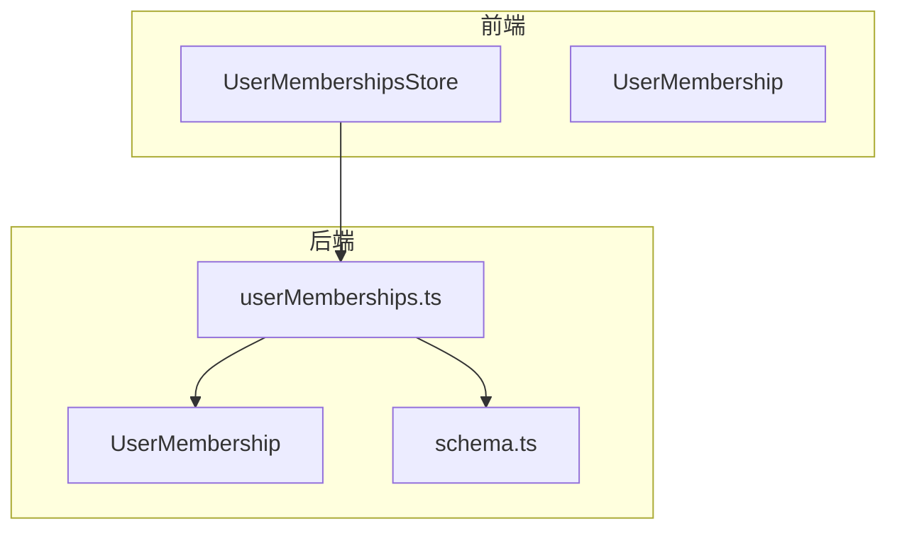
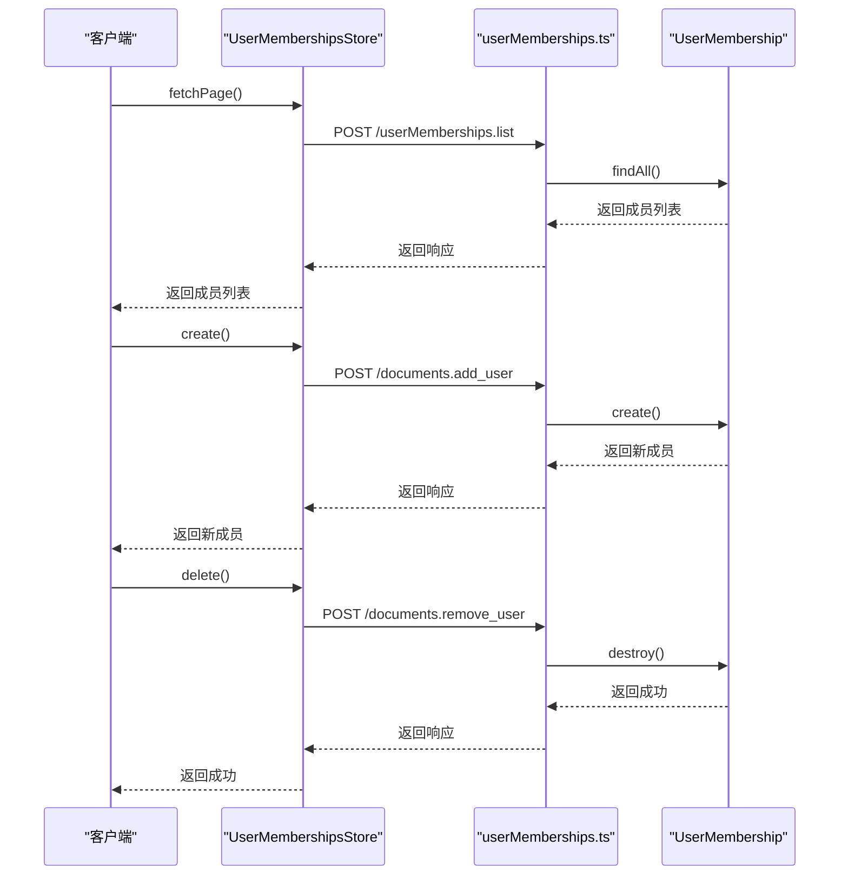
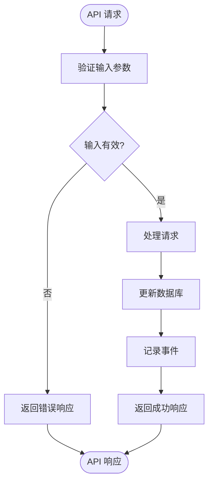
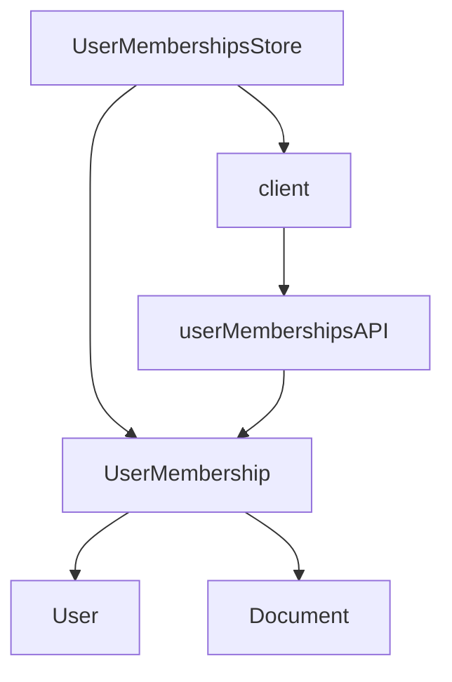

# 成员状态管理

<cite>
**本文档中引用的文件**  
- [userMemberships.ts](file://server/routes/api/userMemberships/userMemberships.ts)
- [UserMembership.ts](file://app/models/UserMembership.ts)
- [UserMembership.ts](file://server/models/UserMembership.ts)
- [UserMembershipsStore.ts](file://app/stores/UserMembershipsStore.ts)
- [schema.ts](file://server/routes/api/userMemberships/schema.ts)
</cite>

## 目录
1. [简介](#简介)
2. [项目结构](#项目结构)
3. [核心组件](#核心组件)
4. [架构概述](#架构概述)
5. [详细组件分析](#详细组件分析)
6. [依赖分析](#依赖分析)
7. [性能考虑](#性能考虑)
8. [故障排除指南](#故障排除指南)
9. [结论](#结论)
10. [附录](#附录)（如有必要）

## 简介
本文档详细描述了通过 `userMemberships.ts` 实现的成员状态机（active/pending/suspended/deleted）的定义和转换逻辑。重点说明了状态变更API端点（如激活、挂起、删除）的请求参数、响应格式和错误处理机制。结合 `UserMembership` 模型解释了状态字段的定义、验证规则和数据库约束。描述了状态变更时的权限验证策略、审计日志记录和事件通知机制。提供了状态查询接口的使用示例，包括分页、过滤和排序功能，并展示了实际的请求响应示例。

## 项目结构
项目结构中，成员状态管理功能主要涉及以下几个关键文件和目录：
- `server/routes/api/userMemberships/userMemberships.ts`：定义了成员状态管理的API路由。
- `app/models/UserMembership.ts`：前端模型，定义了用户成员关系的数据结构。
- `server/models/UserMembership.ts`：后端模型，定义了用户成员关系的数据库表结构和业务逻辑。
- `app/stores/UserMembershipsStore.ts`：前端状态管理，负责管理用户成员关系的状态。
- `server/routes/api/userMemberships/schema.ts`：定义了API请求的验证模式。

**Section sources**
- [userMemberships.ts](file://server/routes/api/userMemberships/userMemberships.ts)
- [UserMembership.ts](file://app/models/UserMembership.ts)
- [UserMembership.ts](file://server/models/UserMembership.ts)
- [UserMembershipsStore.ts](file://app/stores/UserMembershipsStore.ts)
- [schema.ts](file://server/routes/api/userMemberships/schema.ts)

## 核心组件
核心组件包括 `UserMembership` 模型和 `UserMembershipsStore` 状态管理。`UserMembership` 模型定义了用户成员关系的数据结构，包括权限、文档ID、用户ID等字段。`UserMembershipsStore` 负责管理这些成员关系的状态，提供了创建、删除、更新等操作。

**Section sources**
- [UserMembership.ts](file://app/models/UserMembership.ts)
- [UserMembership.ts](file://server/models/UserMembership.ts)
- [UserMembershipsStore.ts](file://app/stores/UserMembershipsStore.ts)

## 架构概述
系统架构中，成员状态管理功能通过前后端分离的方式实现。前端通过 `UserMembershipsStore` 管理状态，后端通过 `UserMembership` 模型处理业务逻辑。API路由定义了成员状态的增删改查操作，通过 `schema.ts` 进行请求验证。



**Diagram sources**
- [userMemberships.ts](file://server/routes/api/userMemberships/userMemberships.ts)
- [UserMembership.ts](file://app/models/UserMembership.ts)
- [UserMembership.ts](file://server/models/UserMembership.ts)
- [UserMembershipsStore.ts](file://app/stores/UserMembershipsStore.ts)
- [schema.ts](file://server/routes/api/userMemberships/schema.ts)

## 详细组件分析

### UserMembership 模型分析
`UserMembership` 模型定义了用户成员关系的数据结构，包括权限、文档ID、用户ID等字段。权限字段使用 `CollectionPermission` 和 `DocumentPermission` 枚举类型，确保权限值的合法性。文档ID和用户ID字段通过外键关联到 `Document` 和 `User` 模型，确保数据的一致性。

```mermaid
classDiagram
class UserMembership {
+string index
+DocumentPermission permission
+string documentId
+Document document
+string sourceId
+UserMembership source
+string userId
+User user
+User createdBy
+string createdById
+UserMembershipsStore store
+fetchDocuments(options : { force? : boolean }) : Promise<void>
+next() : UserMembership | undefined
+previous() : UserMembership | undefined
+static removeFromPolicies(model : UserMembership) : void
}
class Document {
+string id
+string title
+string content
+string parentDocumentId
+User createdBy
+string createdById
+User updatedBy
+string updatedById
+datetime createdAt
+datetime updatedAt
+datetime deletedAt
}
class User {
+string id
+string email
+string name
+datetime createdAt
+datetime updatedAt
+datetime deletedAt
}
UserMembership --> Document : "belongs to"
UserMembership --> User : "belongs to"
UserMembership --> UserMembership : "source"
```

**Diagram sources**
- [UserMembership.ts](file://app/models/UserMembership.ts)
- [UserMembership.ts](file://server/models/UserMembership.ts)

**Section sources**
- [UserMembership.ts](file://app/models/UserMembership.ts)
- [UserMembership.ts](file://server/models/UserMembership.ts)

### UserMembershipsStore 分析
`UserMembershipsStore` 负责管理用户成员关系的状态，提供了创建、删除、更新等操作。`fetchPage` 方法用于获取成员列表，`create` 方法用于创建新的成员关系，`delete` 方法用于删除成员关系，`update` 方法用于更新成员关系。



**Diagram sources**
- [UserMembershipsStore.ts](file://app/stores/UserMembershipsStore.ts)
- [userMemberships.ts](file://server/routes/api/userMemberships/userMemberships.ts)
- [UserMembership.ts](file://server/models/UserMembership.ts)

**Section sources**
- [UserMembershipsStore.ts](file://app/stores/UserMembershipsStore.ts)
- [userMemberships.ts](file://server/routes/api/userMemberships/userMemberships.ts)
- [UserMembership.ts](file://server/models/UserMembership.ts)

### API 路由分析
`userMemberships.ts` 文件定义了成员状态管理的API路由。`list` 路由用于获取成员列表，`update` 路由用于更新成员状态。`schema.ts` 文件定义了API请求的验证模式，确保请求参数的合法性。



**Diagram sources**
- [userMemberships.ts](file://server/routes/api/userMemberships/userMemberships.ts)
- [schema.ts](file://server/routes/api/userMemberships/schema.ts)

**Section sources**
- [userMemberships.ts](file://server/routes/api/userMemberships/userMemberships.ts)
- [schema.ts](file://server/routes/api/userMemberships/schema.ts)

## 依赖分析
成员状态管理功能依赖于 `User` 和 `Document` 模型，通过外键关联确保数据的一致性。`UserMembershipsStore` 依赖于 `UserMembership` 模型，通过 `client` 模块与后端API进行通信。



**Diagram sources**
- [UserMembershipsStore.ts](file://app/stores/UserMembershipsStore.ts)
- [UserMembership.ts](file://app/models/UserMembership.ts)
- [UserMembership.ts](file://server/models/UserMembership.ts)
- [userMemberships.ts](file://server/routes/api/userMemberships/userMemberships.ts)

**Section sources**
- [UserMembershipsStore.ts](file://app/stores/UserMembershipsStore.ts)
- [UserMembership.ts](file://app/models/UserMembership.ts)
- [UserMembership.ts](file://server/models/UserMembership.ts)
- [userMemberships.ts](file://server/routes/api/userMemberships/userMemberships.ts)

## 性能考虑
在处理大量成员关系时，应注意数据库查询的性能。使用分页和索引可以提高查询效率。此外，避免在循环中进行数据库操作，尽量使用批量操作。

## 故障排除指南
- **成员状态更新失败**：检查权限验证是否通过，确保用户具有相应的权限。
- **成员列表为空**：检查数据库中是否存在相关记录，确保数据一致性。
- **API 请求失败**：检查请求参数是否符合验证模式，确保请求格式正确。

**Section sources**
- [userMemberships.ts](file://server/routes/api/userMemberships/userMemberships.ts)
- [schema.ts](file://server/routes/api/userMemberships/schema.ts)

## 结论
本文档详细描述了成员状态管理功能的实现，包括模型定义、状态管理、API路由和验证模式。通过前后端分离的方式，实现了高效、可靠的成员状态管理。希望本文档能帮助开发人员更好地理解和使用该功能。