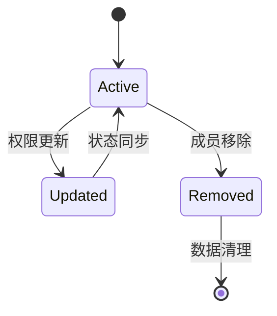
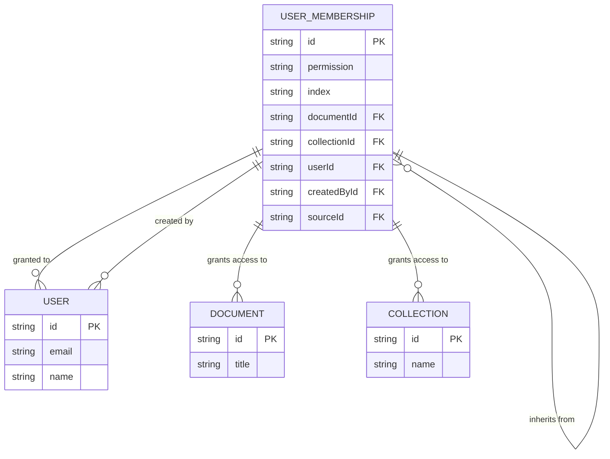
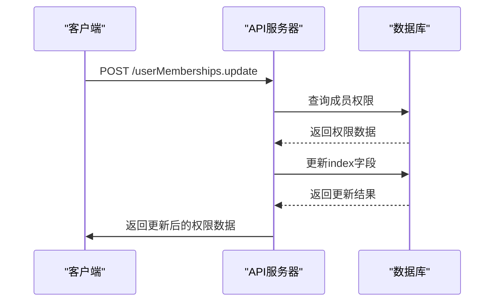
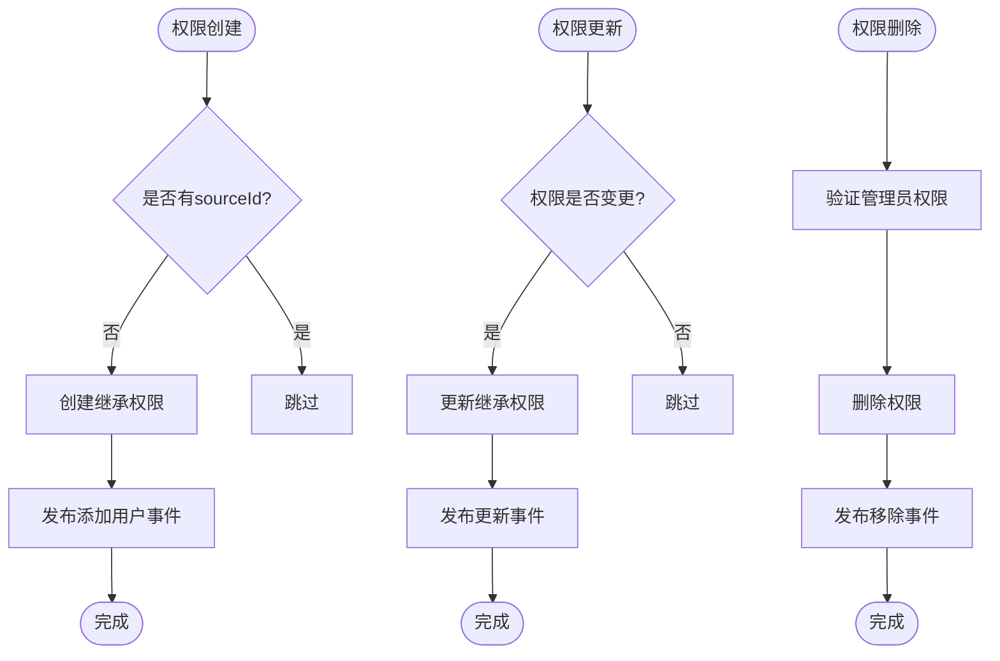
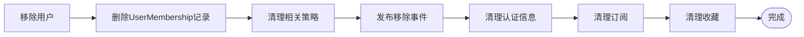
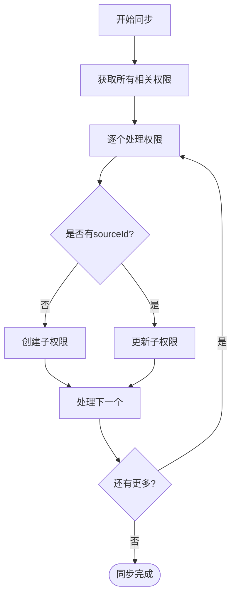
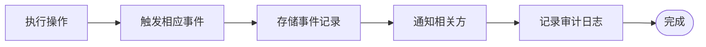

# 成员生命周期

<cite>
**本文档引用的文件**   
- [userMemberships.ts](file://server/routes/api/userMemberships/userMemberships.ts)
- [UserMembership.ts](file://app/models/UserMembership.ts)
- [UserMembership.ts](file://server/models/UserMembership.ts)
- [UserMembershipsStore.ts](file://app/stores/UserMembershipsStore.ts)
</cite>

## 目录
1. [简介](#简介)
2. [成员状态机与生命周期](#成员状态机与生命周期)
3. [UserMembership模型分析](#usermembership模型分析)
4. [状态转换API端点](#状态转换api端点)
5. [生命周期钩子与事件处理](#生命周期钩子与事件处理)
6. [成员移除与数据清理](#成员移除与数据清理)
7. [批量操作与策略同步](#批量操作与策略同步)
8. [状态查询与审计跟踪](#状态查询与审计跟踪)
9. [实际使用示例](#实际使用示例)

## 简介
本文档详细描述了通过`userMemberships.ts`实现的成员生命周期管理功能。系统通过`UserMembership`模型管理用户对文档和集合的访问权限，实现了完整的成员状态管理机制。该机制涵盖了成员状态机、状态转换API、生命周期钩子、数据清理策略等多个方面，确保了成员权限管理的完整性和一致性。

**Section sources**
- [userMemberships.ts](file://server/routes/api/userMemberships/userMemberships.ts#L1-L105)
- [UserMembership.ts](file://app/models/UserMembership.ts#L1-L101)

## 成员状态机与生命周期
系统通过`UserMembership`模型实现成员状态管理，虽然没有显式定义active/pending/suspended/deleted等状态，但通过权限和关系管理实现了类似的状态机功能。

成员生命周期主要体现在以下几个方面：
- **权限状态**：通过`permission`字段管理成员的访问权限级别
- **继承关系**：通过`source`和`sourceId`字段建立权限继承链
- **排序状态**：通过`index`字段维护成员在界面中的显示顺序
- **生命周期事件**：通过各种钩子函数处理成员状态变化

成员状态的转换主要通过API调用触发，系统会自动处理相关的数据一致性和事件通知。



**Diagram sources**
- [UserMembership.ts](file://server/models/UserMembership.ts#L38-L410)
- [userMemberships.ts](file://server/routes/api/userMemberships/userMemberships.ts#L1-L105)

## UserMembership模型分析
`UserMembership`模型是成员生命周期管理的核心，定义了成员权限的各种属性和行为。

### 核心属性
- `permission`: 成员的权限级别（读写、只读等）
- `index`: 成员在界面中的排序索引
- `documentId`: 关联的文档ID
- `collectionId`: 关联的集合ID
- `userId`: 被授权的用户ID
- `createdById`: 创建权限的用户ID
- `sourceId`: 源权限ID，用于权限继承

### 模型关系


**Diagram sources**
- [UserMembership.ts](file://app/models/UserMembership.ts#L10-L97)
- [UserMembership.ts](file://server/models/UserMembership.ts#L38-L410)

**Section sources**
- [UserMembership.ts](file://app/models/UserMembership.ts#L10-L97)
- [UserMembership.ts](file://server/models/UserMembership.ts#L38-L410)

## 状态转换API端点
系统提供了多个API端点来管理成员状态转换，每个端点都有明确的请求格式和响应结构。

### 列出成员权限
```http
POST /userMemberships.list
```
**请求参数**:
- 无特定参数，使用分页参数

**响应格式**:
```json
{
  "pagination": { /* 分页信息 */ },
  "data": {
    "memberships": [/* 成员权限列表 */],
    "documents": [/* 关联文档列表 */]
  },
  "policies": { /* 安全策略 */ }
}
```

### 更新成员排序
```http
POST /userMemberships.update
```
**请求参数**:
```json
{
  "id": "成员权限ID",
  "index": "新的排序索引"
}
```

**响应格式**:
```json
{
  "data": { /* 更新后的成员权限 */ },
  "policies": { /* 更新后的安全策略 */ }
}
```



**Diagram sources**
- [userMemberships.ts](file://server/routes/api/userMemberships/userMemberships.ts#L23-L63)
- [UserMembership.ts](file://server/models/UserMembership.ts#L38-L410)

**Section sources**
- [userMemberships.ts](file://server/routes/api/userMemberships/userMemberships.ts#L23-L63)
- [UserMembership.ts](file://server/models/UserMembership.ts#L38-L410)

## 生命周期钩子与事件处理
`UserMembership`模型实现了多个生命周期钩子，确保在成员状态变化时执行相应的业务逻辑。

### 核心钩子函数
- `@AfterCreate`: 创建新权限后，创建关联的子文档权限
- `@AfterUpdate`: 更新权限后，同步更新所有继承的权限
- `@BeforeUpdate`: 更新前验证管理员权限
- `@BeforeDestroy`: 删除前验证管理员权限
- `@AfterDestroy`: 删除后发布移除用户事件

### 事件处理流程


**Diagram sources**
- [UserMembership.ts](file://server/models/UserMembership.ts#L38-L410)
- [userMemberships.ts](file://server/routes/api/userMemberships/userMemberships.ts#L71-L100)

**Section sources**
- [UserMembership.ts](file://server/models/UserMembership.ts#L38-L410)
- [userMemberships.ts](file://server/routes/api/userMemberships/userMemberships.ts#L71-L100)

## 成员移除与数据清理
系统通过多种机制确保成员移除时的数据一致性和完整性。

### 成员移除流程
当成员被移除时，系统会执行以下清理操作：
1. 删除`user_permissions`表中的相关记录
2. 清理相关的策略和权限
3. 发布移除用户事件
4. 清理用户的其他关联数据

### 数据清理机制


**Section sources**
- [UserDeletedProcessor.ts](file://server/queues/processors/UserDeletedProcessor.ts#L1-L63)
- [UserMembership.ts](file://server/models/UserMembership.ts#L38-L410)

## 批量操作与策略同步
系统支持批量操作和策略同步，确保大规模权限变更时的数据一致性。

### 批量操作实现
- `copy`方法：批量复制用户权限
- `recreateSourcedMemberships`：重新创建所有继承的权限
- 事务支持：所有批量操作都在数据库事务中执行

### 策略同步机制


**Section sources**
- [UserMembership.ts](file://server/models/UserMembership.ts#L38-L410)
- [DocumentMovedProcessor.ts](file://server/queues/processors/DocumentMovedProcessor.ts#L61-L86)

## 状态查询与审计跟踪
系统提供了完善的状态查询和审计跟踪功能，便于监控和管理成员生命周期。

### 状态查询API
- `findRootMembershipsForDocument`: 查找文档的根权限
- `findOrCreate`: 查找或创建权限
- `findAll`: 查询所有相关权限

### 审计跟踪实现
系统通过事件系统记录所有重要的成员状态变更：
- `add_user`事件：添加用户时触发
- `remove_user`事件：移除用户时触发
- `permission_changed`事件：权限变更时触发



**Section sources**
- [UserMembership.ts](file://server/models/UserMembership.ts#L38-L410)
- [userMemberships.ts](file://server/routes/api/userMemberships/userMemberships.ts#L23-L63)

## 实际使用示例
以下是成员生命周期管理的实际使用示例。

### 添加成员示例
```typescript
// 创建新的成员权限
const membership = await UserMembership.create({
  documentId: "doc-123",
  userId: "user-456",
  permission: "read_write",
  createdById: "admin-789"
});
```

### 更新成员权限示例
```typescript
// 更新成员排序
await client.post("/userMemberships.update", {
  id: "membership-123",
  index: "b2"
});
```

### 移除成员示例
```typescript
// 移除成员权限
await UserMembership.destroy({
  where: {
    documentId: "doc-123",
    userId: "user-456"
  }
});
```

**Section sources**
- [UserMembershipsStore.ts](file://app/stores/UserMembershipsStore.ts#L8-L119)
- [userMemberships.ts](file://server/routes/api/userMemberships/userMemberships.ts#L23-L105)